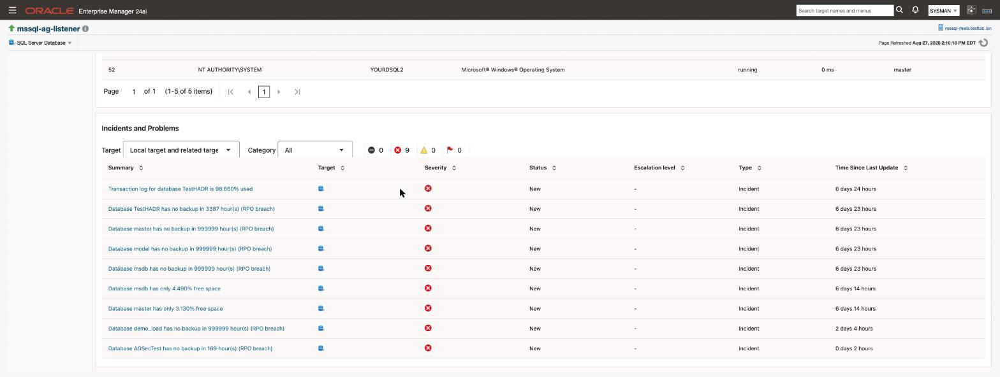

# Alerts and thresholds

The plug-in ships curated WARNING and CRITICAL thresholds. They are enabled the moment a target is created — there is nothing to import and nothing to switch on — and every one of them is editable per target in the Enterprise Manager console.

> **Prerequisites for this page**
> - A target that is collecting. Thresholds are live from the moment the target exists, but they cannot fire on a metric that has never collected.
> - Enterprise Manager access to Metric and Collection Settings, to change any of them.

**In this page:** What ships enabled · The thresholds · Changing a threshold · Applying settings across many targets · Why some thresholds have only a critical value

## What ships enabled {#what-ships}

Fourteen thresholds ship with the plug-in, spread across availability, space, performance, backup, high availability and licensing. They are defaults, not recommendations for your estate: they are set where a value is unambiguously worth waking someone for, and they are deliberately conservative so a new target does not flood you on day one.

The plug-in does **not** ship an Enterprise Manager Monitoring Template. A template is a separate artifact that an administrator applies across many targets at once, usually with different values for production, test and development. If you want that, you build it from these defaults — see [Applying settings across many targets](#across-targets) below.

## The thresholds {#thresholds}

| What it watches | Metric column | Warning | Critical | Fires when |
| :--- | :--- | ---: | ---: | :--- |
| Instance availability | Response `Status` | — | 1 | The instance is down |
| Database free space | DbFreespace `free_pct` | 15 | 5 | Free space falls below the percentage |
| Host CPU | Processor `cpu_utilization_pct` | 80 | 90 | CPU utilisation exceeds the percentage |
| AG replica link | AgFailoverReadiness `link_healthy` | — | 1 | The replica link is broken |
| AG redo queue | AgFailoverReadiness `redo_queue_kb` | 1048576 | 5242880 | The redo queue exceeds the size in KB |
| AG send queue | AgFailoverReadiness `log_send_queue_kb` | 1048576 | 5242880 | The send queue exceeds the size in KB |
| AG recovery point | AgFailoverReadiness `rpo_seconds` | 300 | 900 | The recovery point exceeds the seconds |
| Backup age | LastDatabaseBackup `hours_since_last_backup` | 48 | 168 | No backup within the hours |
| Transaction log | TransactionLog `log_space_used_pct` | 75 | 90 | Log space used exceeds the percentage |
| Licence | License `days_remaining` | 30 | 7 | Fewer days remain on the licence |
| Deadlocks | DeadlockRate `deadlocks_last_hour` | 5 | 20 | Deadlocks in the trailing hour exceed the count |
| Blocking | BlockedSessions `blocked_sessions` | 5 | 20 | Blocked requests exceed the count |
| Connection saturation | ConnectionSaturation `connection_saturation_pct` | 80 | 90 | User connections exceed the percentage of the cap |
| TempDB contention | TempdbContention `pagelatch_ex_waiters` | 5 | 20 | Exclusive page-latch waiters exceed the count |

The `License` row watches `days_remaining`, but the metric also carries a `Status` column — `Active`, `License Required`, `Invalid Signature`, `Wrong Product`, `Expired` or `Exceeded Limit` — and raises its own CRITICAL incident whenever that status is anything but `Active`, independently of the days-remaining threshold above. See the [Open Beta notice](beta-pre-release.md#licensing) for what each status means and what to do about it.

For metrics measured as a snapshot rather than a rate, use Enterprise Manager's per-threshold **number of occurrences** setting to require a condition to persist before it raises an incident. A single sample of high blocking is often noise; the same value across three consecutive collections is not.

## Changing a threshold {#changing}

From the target's menu, choose **Monitoring** then **Metric and Collection Settings**. Every threshold above appears there with its shipped value, and any change applies to that target only.

When a threshold is crossed, the incident appears in Enterprise Manager and on the target's own Overview page:

Collection intervals are set in the same place. They range from one minute for instance availability to 24 hours for server configuration and per-database space, so a metric you have just changed may not reflect it until its next collection.

## Applying settings across many targets {#across-targets}

Because the plug-in ships defaults rather than a template, estate-wide tuning is done with Enterprise Manager's own template mechanism:

1. Tune one target until its thresholds match your standard.
2. From **Enterprise** → **Monitoring** → **Monitoring Templates**, create a template from that target.
3. Apply the template to the targets or target group you want it on.

This keeps the plug-in's defaults as a sane starting point while letting you hold production and development to different standards.

## Why some thresholds have only a critical value {#critical-only}

Two of the fourteen, instance availability and the AG replica link, have a critical value and no warning. That is deliberate: they are binary conditions. An instance is up or down; a replica link is healthy or broken. There is no middle state worth a lower severity, and inventing one would only produce an alert nobody can act on differently.

The AG replica link threshold is also deliberately *not* placed on the readiness column. A healthy asynchronous-commit disaster-recovery secondary sits permanently in a synchronising state, so alerting on readiness would raise a standing critical on a perfectly correct topology. Replication lag is covered instead by the redo queue, send queue and recovery-point thresholds above, which measure how far behind the replica actually is.

## Related

- [Monitoring pages](monitoring-pages.md) - the data the thresholds are evaluated against
- [Monitoring pages](monitoring-pages.md#intervals) - collection intervals, set in the same place as thresholds
- [High availability](high-availability.md#failover-readiness) - why the AG critical sits on the replica link
- [Compliance rules](compliance-rules.md) - configuration findings, which alert differently
- [Troubleshooting](troubleshooting.md#missing-data) - a threshold that never fires
- [Open Beta notice](beta-pre-release.md#licensing) - what each `License` status means
