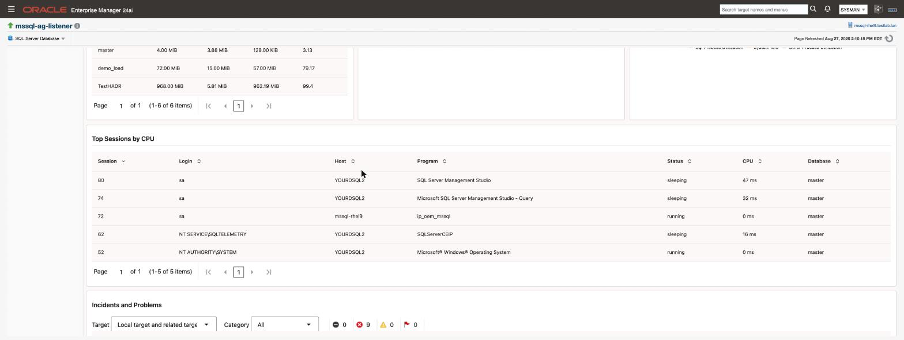

# Getting started

The shortest path from a fresh plug-in to a target you can look at. Each step links to the page with the detail.

> **Prerequisites for this page**
> - OMS access that can import an OPAR and deploy plug-ins, for example `sysman`. See [Prerequisites](prerequisites.html#enterprise-manager).
> - A Management Agent that can reach the SQL Server instance on its TCP port, by default 1433.
> - A SQL Server login for monitoring. See [Credentials](credentials.html#grants) for the grants it needs.

**In this page:** Before you start · Install · Add your first target · Check it worked · What to look at first · If something is wrong

## Before you start {#before}

You need Enterprise Manager 13.5 or 24ai, an agent that can reach the instance on TCP, and the ability to create a login on that instance. Full list in [Prerequisites](prerequisites.html).

Have to hand: the instance address and port, and — if it is a named instance — its instance name.

## Install {#install}

Import the archive, deploy it to the management server, then to the agent that will do the monitoring. Commands are in [Install and upgrade](install-and-upgrade.html).

Use the build that matches your Enterprise Manager release. The two are not interchangeable, and the wrong one is refused at import.

## Add your first target {#add-target}

1. Create the monitoring login on the instance, with the grants in [Credentials](credentials.html).
2. Add the target against the agent, giving the host, port and — if needed — the instance name. See [Targets and properties](targets-and-properties.html).
3. **Apply the credentials to the target afterwards.** They are not passed inline when the target is created; doing so is silently ignored and leaves a target that never collects.
4. While you are there, set the two job credential sets described in [Jobs](jobs.html). They are not needed for monitoring, but setting them now means console actions work the first time somebody tries one.

Point at the listener rather than a replica if the instance is in an availability group and you want the target to follow the primary.

## Check it worked {#check}

The target should reach **Up** within a few minutes. If it does not, see [If something is wrong](#wrong) below.

Then open its **Overview** page. Server configuration, availability, instance status and the database list should all be populated.

The cards below those show the sessions consuming the most CPU, and every open incident on the target.

## What to look at first {#first-look}

| Look at | For |
| :--- | :--- |
| Overview | Whether the instance is healthy right now |
| Compliance results | The settings worth changing on a new instance — start with the end-of-support rule |
| [Alerts and thresholds](alerts-and-thresholds.html) | What will alert you, and at what values, before it does |
| [AG Failover Readiness](monitoring-pages.html#ag-failover) | If the instance is in an availability group |

Reading the thresholds page early is worth the five minutes. Fourteen thresholds are live from the moment the target exists, and it is better to know what they are than to meet them at 3am.

## If something is wrong {#wrong}

**Target is Down straight after being added.** Almost always the credentials — check they were applied *after* the target was created, not inline with it.

**Target is Up but pages look sparse.** Expected in the first 24 hours. Configuration and per-database space collect daily, so anything depending on them is empty until the first collection. The Overview page works around the two slowest with a live read. See [Targets and properties](targets-and-properties.html#new-target).

**Target Down only when certificate verification is on.** Set it to encrypted-without-verification briefly: if it comes Up, the problem is the certificate chain rather than the network or login. [TLS connections](tls.html) has the specifics.

**A job fails on a target that is monitoring fine.** Jobs use a different credential path. See [Jobs](jobs.html#prerequisites).

More in [Troubleshooting](troubleshooting.html).

## Related

- [Prerequisites](prerequisites.html) - what to check before you begin
- [Install and upgrade](install-and-upgrade.html) - importing and deploying the plug-in
- [Targets and properties](targets-and-properties.html) - what each target property means
- [Credentials](credentials.html) - the monitoring login and its grants
- [Monitoring pages](monitoring-pages.html) - what each console page is telling you
- [Alerts and thresholds](alerts-and-thresholds.html) - what will alert you, and at what values
- [Troubleshooting](troubleshooting.html) - when a step above does not go as described
