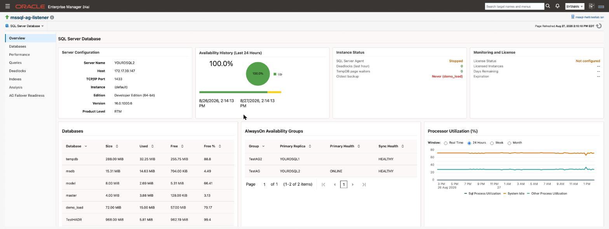
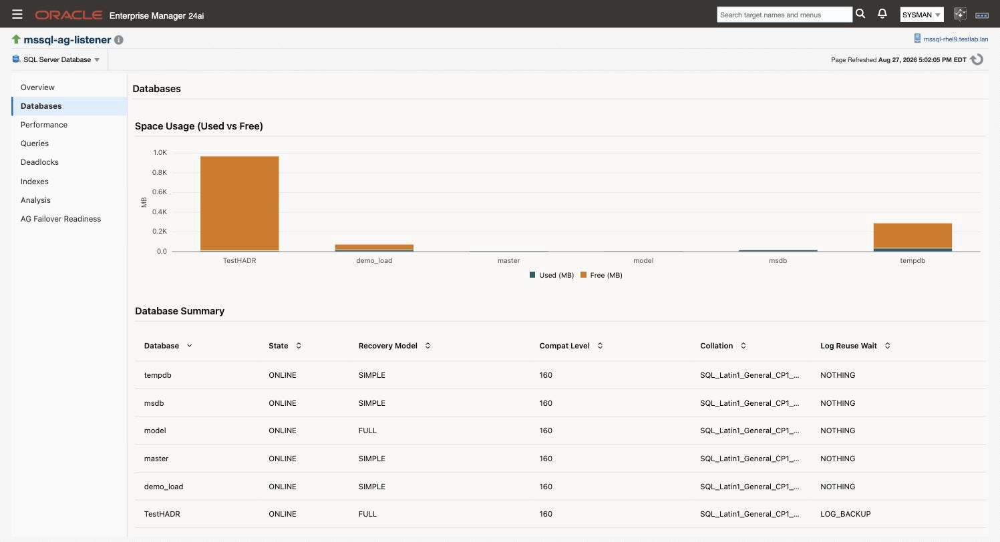
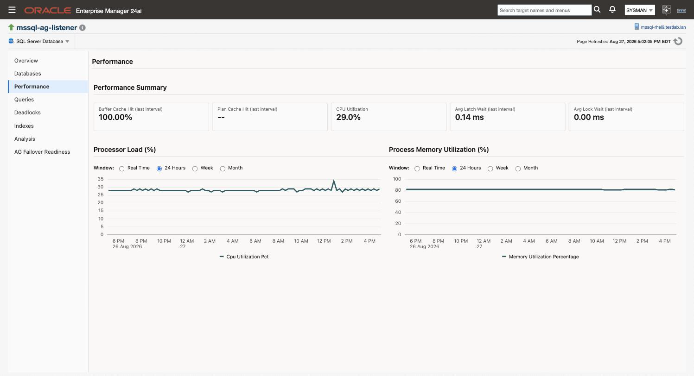
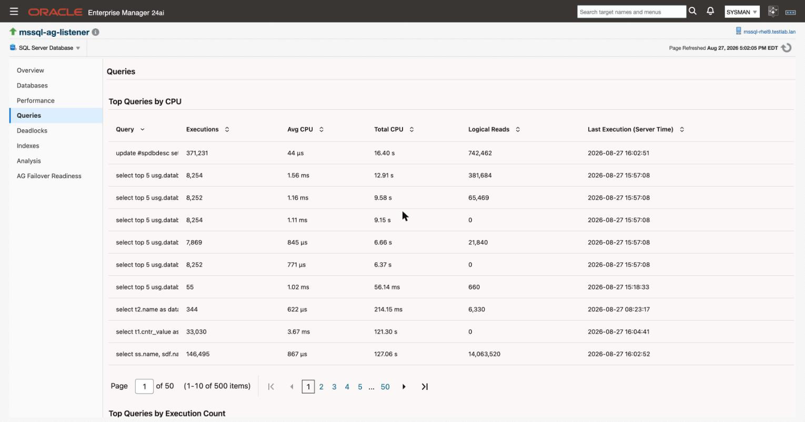
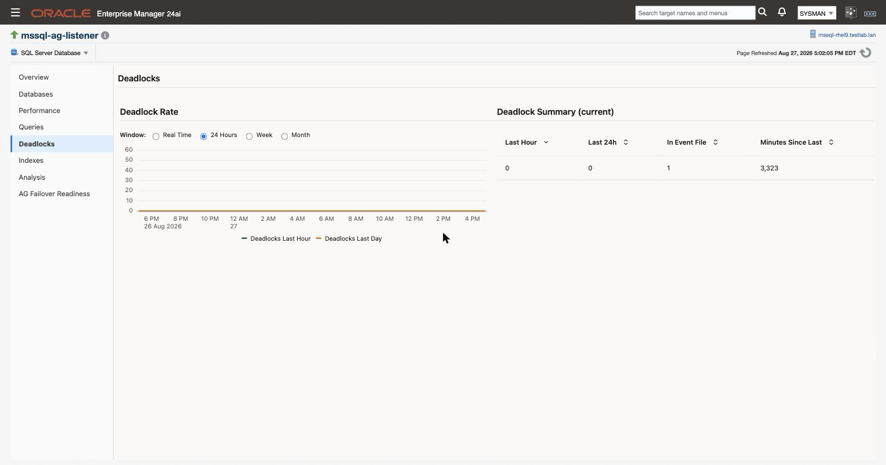
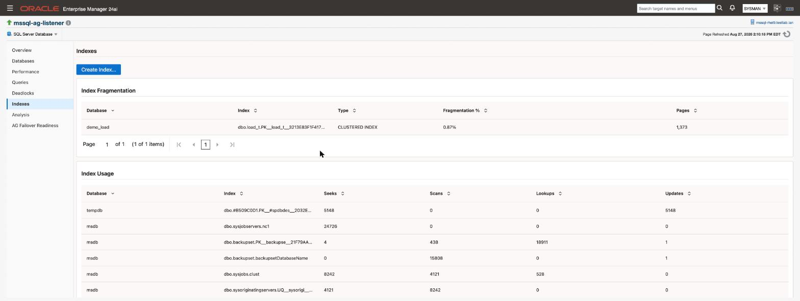
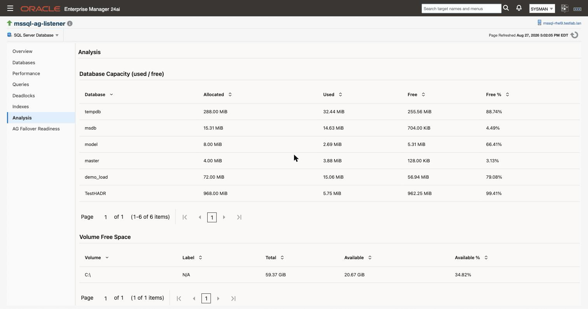
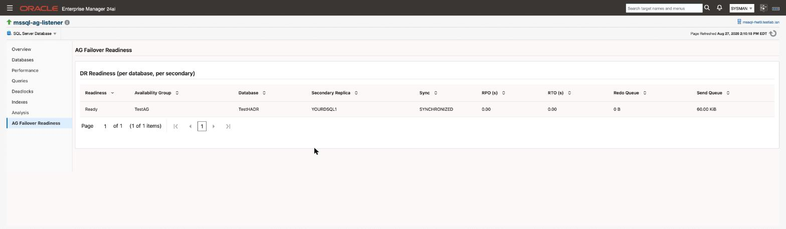

# Monitoring pages

The plug-in adds eight console pages to every SQL Server Database target. They are not a dashboard you glance at; each one answers a specific question, and knowing which page answers which question is most of the value. This page describes all eight: what each one is for, what it shows, and the things about it that are not obvious from looking at it.

> **Prerequisites for this page**
> - A SQL Server Database target that has reached **Up**. See [Targets and properties](targets-and-properties.md#new-target).
> - Monitoring credentials that resolve, or every page here is empty. See [Credentials](credentials.md).
> - Nothing else. There is no extension to install and no per-page setup.

**Where to find it:** open a SQL Server Database target. The eight pages are the left-hand tree on the target's home page, and they are also in the target menu under the target name.

**In this page:** Overview · Databases · Performance · Queries · Deadlocks · Indexes · Analysis · AG Failover Readiness · What a blank region means · Collection intervals

## Overview {#overview}

The page a target opens on, and the one to read first. It answers "is this instance healthy right now", and it is laid out so the answer is in the top row.

Nine regions, reading top to bottom:

| Region | What it tells you |
| :--- | :--- |
| Server Configuration | Server name, host, port, instance, edition, version and product level |
| Availability History | Percentage up over the last 24 hours, with the status timeline |
| Instance Status | SQL Server Agent state, deadlocks in the last hour, tempdb page waiters, and the oldest backup across all databases |
| Monitoring and License | Licence status, licensed instance count, days remaining, expiry |
| Databases | Size, used, free and free percent per database |
| AlwaysOn Availability Groups | One row per group, with primary replica and health |
| Processor Utilization | SQL process, system idle and other process CPU, over real time, 24 hours, a week or a month |
| Top Sessions by CPU | The five sessions consuming the most CPU, with login, host, program and database |
| Incidents and Problems | Every open incident on the target, newest first |

Three things worth knowing:

**Oldest backup shows `Never` in red when a database has no backup at all.** That is a real state, not a collection failure. A database that has genuinely never been backed up is reported as never rather than being folded in with a large day count, because the two need different responses.

**The top-row cards do not all populate at the same rate.** Availability history collects every minute, instance status every five, and licence data hourly, so those three are populated well within the first hour of a new target. Server configuration is on a 24 hour schedule, but the card falls back to a live read of the instance when the repository has nothing yet, so it is not blank either. The Databases card below it is the one that genuinely waits, because per-database space is a 24 hour metric with no fallback. See [What a blank region means](#blank).

**The Monitoring and License card is what an unlicensed target looks like.** If the licence status is anything but `Active`, this card is where you see it — see the [Open Beta notice](beta-pre-release.md#licensing) for what each status means and what to do.

**Processor Utilization defaults to the 24 hour window.** Switching it to Real Time triggers a live collection against the instance rather than reading stored data, so it is the one control on the page that puts load on SQL Server when you use it.

## Databases {#databases}

Everything about the databases on the instance, and where the backup and restore actions live.

Six regions: **Space Usage (Used vs Free)**, **Database Summary**, **Database Files**, **Filegroups**, **Backup Management** and **AlwaysOn Database Replicas**.

 Backup, restore and delete-backup jobs are submitted from here. Those are jobs, and jobs have their own credential requirements that are separate from monitoring, so read [Jobs](jobs.md#prerequisites) before you submit one from this page.

Per-database space is a 24 hour metric. It is the single most common reason a new target shows an empty Databases region on its first day.

## Performance {#performance}

The instance-level performance surface, and by some distance the densest page in the plug-in. Eighteen regions covering three kinds of thing:

- **Charts over time.** Processor Load, Process Memory Utilization, Database I/O in operations and in bytes, Cache Hit Ratios per Interval, Average Wait Times per Interval, Server Network Rates, Server Error Rates, Server Read/Write Rates.
- **Current-state tables.** Performance Summary, Top Processes, Database I/O Detail, Server Statistics.
- **Raw counters.** General Statistics, SQL Statistics, Buffer Manager, Memory Manager and Plan Cache counters, taken from `sys.dm_os_performance_counters`.

The per-interval charts are the ones to trust for rates. Several SQL Server counters are cumulative since the last service restart, and a raw cumulative value answers almost no useful question. The plug-in differences those counters between collections, and for anything collected per database it differences each database separately before summing, so a database being attached or detached between two samples cannot masquerade as a spike or a lull.

## Queries {#queries}

Five regions: **Top Queries by CPU**, **Top Queries by Execution Count**, **Currently Blocked Queries**, **Query Plan Statistics (Plan Cache)** and **Performance History Comparison**.

The first two read the plan cache, which means they show what SQL Server currently remembers, not a complete history. A query that ran expensively an hour ago and has since been evicted will not appear. Anything evicted between collections is gone; the page does not reconstruct it.

Currently Blocked Queries is the region to reach for during a live incident, since it names the blocking session rather than only the victim.

## Deadlocks {#deadlocks}

Three regions: **Deadlock Rate** over time, **Deadlock Summary (current)**, and **Recent Deadlocks** with the participating processes.

Deadlock detail comes from the `system_health` Extended Events session, which SQL Server runs by default. If someone has disabled that session on the instance, the rate will still be collected but the detail regions will be empty, and that is a configuration state on the instance rather than a plug-in fault.

## Indexes {#indexes}

Three regions: **Index Fragmentation**, **Index Usage** and **Missing Indexes**, plus a **Create Index** action.

Fragmentation collection has a floor: indexes smaller than 1000 pages are not reported. That is deliberate. Fragmentation on a small index is not worth acting on, and scanning every small index is the expensive part of the query. If the Fragmentation region is empty on a real instance, the usual reason is that nothing on it is big enough to qualify, not that collection failed.

Missing Indexes reports what SQL Server's own optimiser recorded as a missing index. Treat those as candidates to evaluate, not instructions. The optimiser records them per query without weighing the cost of maintaining the index against every other workload on the table.

## Analysis {#analysis}

Three regions: **Database Capacity (used / free)**, **Volume Free Space** and **File Growth Settings**.

This is the capacity-planning page rather than a performance one. File Growth Settings is the region most worth reading on a new instance, because percentage-based autogrowth on a large data file is a common inherited default and a bad one: each growth event gets larger than the last, and the pauses grow with it.

## AG Failover Readiness {#ag-failover}

One region, **DR Readiness**, with a row per database per secondary replica. It exists to answer a question the built-in dashboards do not: if you failed over right now, what would it cost.

Readiness, availability group, database, secondary replica, synchronisation state, recovery point in seconds, recovery time in seconds, redo queue and send queue. The readiness verdict folds the others together into Ready or Not ready.

The critical threshold sits on the replica link rather than on the readiness verdict, which is a deliberate design decision with a real consequence for what alerts you. [High availability](high-availability.md#failover-readiness) explains why.

## What a blank region means {#blank}

A blank region is one of three things, and they are worth telling apart before raising a support request.

1. **The metric has not collected yet.** Server configuration and per-database space are on a 24 hour schedule, so a target created this morning may not have them until tomorrow. Most other things arrive far sooner: availability every minute, instance status every five, licence and backup age hourly. Check the target's **All Metrics** page: a `Last Upload` of `N/A` means it has not run, and there is nothing wrong.
2. **There is genuinely nothing to report.** An instance with no availability group shows an empty AlwaysOn region. An instance with no index over 1000 pages shows an empty Index Fragmentation region. Both are correct.
3. **Collection is failing.** The target will normally not be Up in this case. See [Troubleshooting](troubleshooting.md).

The first case is the one that catches people out, because a brand new target is exactly when someone is most likely to be looking at the console and least likely to assume the answer is "wait".

## Collection intervals {#intervals}

Intervals range from one minute for instance availability to 24 hours for server configuration and per-database space, with most performance and query families on 15 minutes. They are visible and changeable per target under **Monitoring** then **Metric and Collection Settings**, in the same place as the thresholds. See [Alerts and thresholds](alerts-and-thresholds.md#changing).

Shortening a 24 hour collection to get a page populated sooner is possible and occasionally reasonable on a lab instance. It is a poor idea on a production one: those metrics are on a long schedule because the queries behind them are the expensive ones.

## Related

- [Getting started](getting-started.md#first-look) - which page to read first on a new target
- [Alerts and thresholds](alerts-and-thresholds.md) - what alerts you on the data these pages show
- [High availability](high-availability.md) - availability groups, failover clusters, and the readiness surface
- [Jobs](jobs.md) - the backup and restore actions on the Databases page, and their credential requirements
- [Compliance rules](compliance-rules.md) - the configuration findings that complement the Analysis page
- [Troubleshooting](troubleshooting.md) - when a page is empty and it is not one of the expected reasons
