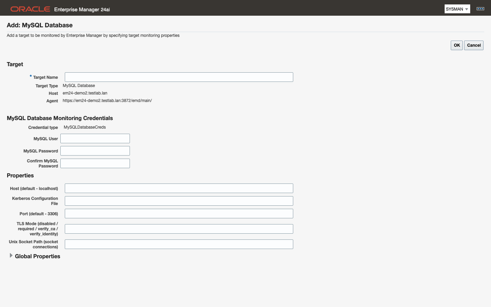

# MySQL Plugin

## Integration Plumbers

### Oracle Enterprise Manager Plugin for MySQL User Guide

*Version 24.1.9.75.0 (beta)*
*August 2026*

<details>
<summary>Legal Notice</summary>

Information in this document is subject to change without notice. Complying with all applicable copyright laws is the responsibility of the user. No part of this document may be reproduced or transmitted in any form without the express written permission of Integration Plumbers.

© 2026 Integration Plumbers. All rights reserved.

MySQL is a trademark of Oracle Corporation and/or its affiliates. Oracle and Enterprise Manager are trademarks of Oracle Corporation.

</details>


Enterprise Manager plug-in for monitoring MySQL Server, InnoDB Cluster and
InnoDB ClusterSet. Plug-in ID `ip.em.xmys` (vendor `ip`, product `em`, tag
`xmys`). Target types `ip_mysql_database`, `ip_mysql_cluster`,
`ip_mysql_clusterset`. Release line 24.1.1.0 — this guide describes build
**24.1.9.75.0 (beta, 2026-08-18)** on Enterprise Manager 24ai.

Contents:
1. Introduction
2. Prerequisites
3. Installing the plug-in
4. Adding and modifying targets
5. Home page and pages tour
6. Metrics reference
7. Alert thresholds
8. Jobs
9. Compliance standards
10. Release notes
Appendix A. Migrating from the Oracle MySQL plug-in

## 1. Introduction
This chapter describes what the plug-in monitors and the platforms it supports.
**Topics:** 1.1 What the plug-in monitors · 1.2 Target types · 1.3 Supported MySQL versions and platforms · 1.4 Beta status
### 1.1 What the plug-in monitors
The plug-in makes MySQL a first-class Enterprise Manager target. MySQL servers, InnoDB Clusters and InnoDB ClusterSets appear in the same console, the same target navigation, the same incident and notification rules, and the same compliance results as the Oracle Database, host and middleware targets you already run. Collections run from a management agent over JDBC using an ordinary read-only MySQL account, so there is nothing to install on the database host and no second monitoring tool to operate.

What you get once a target is up: availability and the reason a server is down; server and workload performance, including InnoDB buffer pool, row lock waits, memory, file I/O, connections and per-table and per-user activity; statement performance from the Performance Schema digest tables, with Query Analyzer and its trends; replication health, from asynchronous replica lag through Group Replication consensus, messaging and certification, to ClusterSet disaster-recovery readiness; backup visibility built from what MySQL Enterprise Backup and Percona XtraBackup record in the server itself; daily configuration snapshots that feed Enterprise Manager's configuration history and comparison; and a security and administration posture scored by the MySQL compliance framework the plug-in ships. Seventeen thresholds arrive already set, so a freshly added target raises real incidents without any tuning.

### 1.2 Target types
The plug-in adds three target types. Which ones you use depends on how your MySQL estate is built — a standalone estate needs only the first.

| Target type | What it represents | How many you add |
|---|---|---|
| **MySQL Database** (`ip_mysql_database`) | One MySQL server instance, standalone or a member of a cluster | One per server instance you want to monitor |
| **MySQL Cluster** (`ip_mysql_cluster`) | One InnoDB Cluster, or the Group Replication group behind it, as a whole — membership, consensus, certification and backup source | One per cluster, pointed at a MySQL Router endpoint or at any member |
| **MySQL ClusterSet** (`ip_mysql_clusterset`) | One InnoDB ClusterSet — a primary cluster, its replica clusters and the replication between them | One per ClusterSet, pointed at a MySQL Router endpoint or at the primary cluster |

The three types are independent of each other. A cluster or ClusterSet target does not create database targets for its members, and it does not need them: add whichever types match the questions you need answered. Most estates run database targets for every instance and one cluster or ClusterSet target above them, so that instance-level detail and group-level health both have somewhere to live.

> **Note:** Each target carries its own monitoring properties and credentials, including its own TLS Mode. Nothing is inherited from another target. See 4.1.

### 1.3 Supported MySQL versions and platforms
**The plug-in does not block MySQL versions it has not seen.** MySQL releases are, in our experience, backward compatible for monitoring purposes, so a server newer than the matrix below is expected to work: add it, and the plug-in attempts full monitoring. We certify versions in this documentation as we validate them, prioritizing LTS releases — the series MySQL publishes dedicated release repositories for. If an uncertified version misbehaves, the metric groups it affects degrade to collection errors on those groups; they do not take monitoring of the target down as a whole.

Certification as of this build:

| Target | Tier | Status |
|---|---|---|
| MySQL 8.4 LTS | Comprehensive | **Certified** — primary reference platform |
| MySQL 9.7 LTS | Comprehensive | **Certified** (2026-07-28) |
| MySQL 8.0 | Basic | Supported and continuously exercised in our lab. Note 8.0 reached end of life in April 2026 — plan your upgrade |
| MySQL 9.5 / 9.6 / 26.x innovation releases | — | Expected to work; not yet certified |
| InnoDB Cluster (Group Replication, 8.4) | — | **Certified** (cluster target with member stats) |
| InnoDB ClusterSet | — | Validated on MySQL 9.5 commercial; 8.4 ClusterSet not yet certified |
| RDS / Aurora / Cloud SQL | — | Supported — added manually, see 4.4; not yet certified |
| EM 24ai (24.1) | — | **Certified**, including the UI |
| EM 13.5 | — | Collection + compliance certified; the 13.5 edition is built (`13.5.9.33.0`) and available on request; console render not yet certified |

**Enterprise Manager platform.** The build described in this guide is certified on Enterprise Manager 24ai (24.1), including its console pages, and that is the platform the beta covers.

> **Note:** An Enterprise Manager 13.5 edition of the same source is now built and available on request as `13.5.9.33.0`, as the matrix row above notes. On 13.5, collection and compliance are certified in our lab; what has not been certified there is the console render, so treat the 13.5 edition as an evaluation build rather than part of this beta.

### 1.4 Beta status
This build is a beta. It is feature-complete for the scope listed in 10.1 — the three target types, their metric groups and pages, the shipped thresholds, the compliance framework, the Run EXPLAIN job and the connection options — and every one of those has been deployed and exercised against live MySQL targets in our lab before shipping. What remains for general availability is additive: broader certification, and features that extend this scope rather than change it. Everything we know to be incomplete or unproven is in the boundaries list at the end of 10.1 rather than left for you to discover.

Beta means the release has not yet earned a production monitoring commitment, and that metric names, thresholds and properties may still change in response to what beta users find. Any change that needs operator action is documented with its remediation before it ships.

**Give us feedback.** Send findings — bugs, confusing metrics, missing thresholds, unclear documentation — through your Integration Plumbers support contact. Include the plug-in version (`emcli list_plugins_on_server`), the MySQL version, and the metric group or console page involved. If you hit something that is not in the boundaries list in 10.1, we especially want to hear about it.

> **Note:** Chapter 6 points to the generated metrics reference, which is produced from the plug-in's own metadata for this exact build. Where this guide and the reference differ on a column, a unit or a threshold, the reference is authoritative.

## 2. Prerequisites
Here are the prerequisites for deploying the plug-in and monitoring MySQL with it.
**Topics:** 2.1 Enterprise Manager and agents · 2.2 MySQL Shell for ClusterSet targets · 2.3 Network and ports · 2.4 The monitoring user · 2.5 TLS · 2.6 Unix-socket connections · 2.7 Backup-tool visibility
### 2.1 Enterprise Manager and agents
The plug-in runs inside Enterprise Manager and reaches MySQL from a management agent, so both have to be in place before you add a target.

You need:

- **An Enterprise Manager 24ai (24.1) OMS** with the plug-in deployed on the OMS. The build described in this guide is for Enterprise Manager 24ai. An EM 13.5 edition of the plug-in exists, but it is not certified in this beta — see chapters 1 and 10.
- **At least one Enterprise Manager 24ai management agent** with the plug-in deployed on it. The agent runs every collection, so it needs a network path to each MySQL endpoint it monitors.
- **Nothing else staged on the agent host** for MySQL Database and MySQL Cluster targets. The MySQL JDBC driver ships inside the plug-in — there is no driver to download or copy. MySQL ClusterSet targets have one extra prerequisite; see 2.2.

Where the agent runs is your choice:

- **Remote monitoring** is the normal case. The agent runs anywhere that can open a TCP connection to the MySQL port, and one agent can monitor many MySQL targets on many hosts.
- **A local agent** — an agent installed on the MySQL server host itself — is required only when you want the plug-in to connect over a Unix socket instead of TCP. See 2.6.

> **Note:** Deploying the plug-in on the OMS does not deploy it to agents. Deploy it to every agent that will monitor a MySQL target, as described in 3.3. Until you do, the MySQL target types are not offered for that agent on the Add Target page.

### 2.2 MySQL Shell for ClusterSet targets
The MySQL ClusterSet target type depends on one external tool being present on the agent host.

The ClusterSet target runs MySQL Shell (mysqlsh) from the agent host to read AdminAPI status. Install MySQL Shell (mysqlsh) on every agent host that will monitor a ClusterSet target and make sure it is on the agent user's PATH. Without it the plug-in cannot run AdminAPI and degrades to a repository rollup that reports `fallback_reason MYSQLSH_NOT_FOUND`; a rollup cannot assess ClusterSet-wide promotion readiness, so `dr_promotion_ready` reads 0 and the DR Promotion Ready alert raises CRITICAL until Shell is installed.

The rollup is a deliberate degradation, not an error: the target stays Up and its other columns keep collecting from the repository. Treat a CRITICAL DR Promotion Ready alert whose `fallback_reason` column reads `MYSQLSH_NOT_FOUND` as a missing prerequisite on the agent host rather than as a disaster-recovery problem on the ClusterSet.

Confirm the tool as the agent's operating-system user, not as `root`, because the agent's own PATH is what matters:

```
mysqlsh --version
```

MySQL Database and MySQL Cluster targets do not use MySQL Shell. They connect over JDBC only, and you do not need to install anything for them.

### 2.3 Network and ports
Open the paths the agent needs before you add a target. A blocked path shows up as a target that stays Down after it is added.

A MySQL Database target needs one outbound TCP path:

| Flow | Port | Used for |
|---|---|---|
| Agent host → MySQL server | The server's listening port, `3306` by default | Every JDBC collection for the target |

A MySQL Cluster target needs the same kind of path to whatever endpoint you configure on it — any member of the cluster, or a MySQL Router instance on the classic-protocol port you configured for it.

A MySQL ClusterSet target needs two things:

- The agent's JDBC path to the host and port configured on the target, normally a MySQL Router endpoint.
- A path from the agent host to **every member of every cluster in the ClusterSet**, on each member's MySQL port, because MySQL Shell opens those connections itself when it reads AdminAPI status.

> **Note:** mysqlsh member discovery uses hostnames, so the agent host must resolve every cluster member's FQDN even when the database targets themselves are configured by IP address.

Check the host firewall on the database side (`firewalld`, `nftables`, cloud security groups) as well as any network firewall in between, and confirm the server's `bind-address` accepts connections from the agent's address.

### 2.4 The monitoring user
The plug-in connects to MySQL as an ordinary read-only account. Create it on each server before you add the target.

Run these two statements as an account that can create users:

```sql
CREATE USER 'em_monitoring'@'%' IDENTIFIED BY '<strong password>';
GRANT SELECT, PROCESS, REPLICATION CLIENT ON *.* TO 'em_monitoring'@'%';
```

No SUPER and no write privilege is required. Because the SELECT grant is global, it already covers performance_schema, the mysql schema, mysql.backup_history and PERCONA_SCHEMA — no further grant is needed for any metric group or for backup monitoring.

What each privilege buys:

| Privilege | Used for |
|---|---|
| `SELECT` on `*.*` | Every collection that reads a table or view — `performance_schema` (including the Group Replication status tables), the `sys` schema, the `mysql` schema and the backup history tables |
| `PROCESS` | Server-wide session and InnoDB engine status, including the process list and per-user activity |
| `REPLICATION CLIENT` | `SHOW REPLICA STATUS` and `SHOW BINARY LOG STATUS` |

> **Note:** Narrow the `'%'` host clause to your agent's subnet if your security policy requires it. The agent connects over TCP, so the account's host clause has to match the agent's address as MySQL sees it — not `localhost`. Socket-connected targets are the exception; see 2.6.

> **Note:** On Group Replication and InnoDB ClusterSet deployments `CREATE USER` and `GRANT` replicate like any other write. Run the two statements once on the (global) primary and the account exists on every member.

### 2.5 TLS
Each target chooses its own transport security through the **TLS Mode** property; nothing is inherited from the server or from the agent.

The property recognizes four values, and leaving it empty is meaningful in its own right:

| Value | Behavior |
|---|---|
| *(empty)* | Same as `disabled` — the agent connects without TLS. |
| `disabled` | The agent connects without TLS. |
| `required` | The agent connects only if the session is encrypted. |
| `verify_ca` | Truststore-backed mode. Not available in this release. |
| `verify_identity` | Truststore-backed mode. Not available in this release. |

Three behaviors matter operationally:

- **An empty TLS Mode means plaintext.** Leaving the property blank is treated exactly as `disabled`, not as `required`. Set it explicitly on every target where the connection has to be encrypted.
- **`required` fails closed.** If the server cannot give the agent an encrypted session, the connection fails with an explicit `SQLException` and the target goes Down. There is no silent fallback to plaintext, so a target that is Up under `required` connected over TLS.
- **Any non-empty value the plug-in does not recognize fails closed to `required`.** A typo in the property is treated as `required` rather than as `disabled`, so it cannot quietly switch encryption off — but an *empty* property is not a typo, and follows the first rule above.

> **Note:** verify_ca and verify_identity are not available in this release — the truststore properties they depend on are deferred — and only required and disabled are validated. Those two modes are absent from the target pages and from EM CLI, so use `required` where you need an encrypted session. A ClusterSet health check configured with `verify_ca` or `verify_identity` reports `TLS_TRUSTSTORE_REQUIRED` instead of connecting, so use `required` (or `disabled`) for ClusterSet targets as well.

### 2.6 Unix-socket connections
A MySQL server that shares a host with its management agent can be monitored over a Unix socket instead of TCP.

Requirements:

- The management agent runs on the MySQL server host — a local agent, as described in 2.1.
- The agent's operating-system user can read and write the socket file. Confirm the path on the server with `SELECT @@socket;`.
- The monitoring account exists as `'<user>'@'localhost'`. A socket connection arrives as `localhost`, and MySQL matches the most specific host value first, so create the account explicitly for that host value:

```sql
CREATE USER 'em_monitoring'@'localhost' IDENTIFIED BY '<strong password>';
GRANT SELECT, PROCESS, REPLICATION CLIENT ON *.* TO 'em_monitoring'@'localhost';
```

On the target, set **Unix Socket Path** to the socket file and leave **Host** empty.

> **Note:** A target configured with both a host and a socket path connects over TCP. Leave Host empty to force the socket connection.

> **Note:** MySQL matches the most specific *host* value first, and among rows that share a host value a named user beats the anonymous one. An anonymous account (`''@'localhost'`) — shipped as a legacy default by some installations, and sometimes left behind by test fixtures — therefore shadows `'em_monitoring'@'%'` on a local connection, but it does not shadow `'em_monitoring'@'localhost'`. That is exactly why this section asks for the explicit `@'localhost'` account. If a socket target still fails to authenticate, list any anonymous rows with `SELECT user, host FROM mysql.user WHERE user = '';` and drop the ones you do not need.

### 2.7 Backup-tool visibility
The plug-in reports backup age and backup failures by reading the history tables that backup tools write into MySQL, so what it can see depends on which tool you run and how you run it.

| Tool | History table | Written when |
|---|---|---|
| MySQL Enterprise Backup (MEB) | `mysql.backup_history` | On every run, by default |
| Percona XtraBackup (PXB) | `PERCONA_SCHEMA.xtrabackup_history` | Only when the backup command includes `--history` |

Both tables are already readable under the monitoring account in 2.4, because its `SELECT` is global.

When a tool's history table is not present on the server, the plug-in reports that tool as not detected and raises no alert; the other tool's metrics carry on collecting. A site that runs only one of the two tools sees the other reported as not detected, and that is the intended behavior rather than a fault — it is what keeps a shop that never installed MEB from seeing a permanent false "no backups" alarm.

> **Note:** MEB writes history by default and `--no-history-logging` turns it off. There is no `--backup-history` flag to add — MEB does not recognize one and errors if you pass it. If MEB backups are not appearing, look for `--no-history-logging` in the backup job rather than for a missing flag.

> **Note:** Logical dumps (`mysqldump`, `mysqlpump`, the MySQL Shell dump utilities) and storage or array snapshots leave no server-side record at all. No SQL-based collector, this plug-in included, can see them. An estate backed up only that way correctly shows no backup history.

**Failure detection is asymmetric between the two tools.** MEB writes a history row when a run fails, so the failed-backup condition works on MEB. XtraBackup writes no row for a failed run, so on XtraBackup-only estates that condition can never fire and backup **age** is the failure signal instead. Size the age thresholds (7.1) to your backup cadence with that in mind.

For the cluster pattern — back up on one member and monitor any member, because history rows replicate like any other write — and for the full tool-by-tool detail, see [backup-monitoring.md](backup-monitoring.md).

## 3. Installing the plug-in
This chapter describes importing and deploying the plug-in, and upgrading it.
**Topics:** 3.1 Import with Self Update · 3.2 Deploy to the OMS · 3.3 Deploy to agents · 3.4 Upgrading
### 3.1 Import with Self Update
Enterprise Manager takes the plug-in in through Self Update, from the `.opar` archive Integration Plumbers supplies. Import it once per Enterprise Manager site; the deploy steps in 3.2 and 3.3 then work from the imported copy.

Copy `24.1.9.75.0_ip.em.xmys_2000_0.opar` to a directory on the OMS host that the Enterprise Manager software owner can read, then import it from the console:

1. Choose **Setup → Extensibility → Self Update**.
2. Select the **Plug-in** folder.
3. Choose **Actions → Import**, supply the full path to the `.opar` file on the OMS host, and confirm.
4. Wait for the import job to complete, then confirm the **MySQL Database** row shows version **24.1.9.75.0**.

Or import it with EM CLI, as the Enterprise Manager software owner on the OMS host:

```
emcli login -username=sysman
emcli import_update -file=/u01/stage/24.1.9.75.0_ip.em.xmys_2000_0.opar -omslocal
```

`-omslocal` tells Enterprise Manager the archive is already on the OMS host, which is the normal case. Only drop it when the file sits on a different host, and then supply that host and a credential set instead.

> **Note:** Importing makes the plug-in available for deployment; it does not deploy it. Nothing about the plug-in appears in the console, and no MySQL target type exists, until you complete 3.2.

### 3.2 Deploy to the OMS
Deploying to the OMS registers the three target types and their metric metadata, the compliance content, the Run EXPLAIN job type and the console pages.

From the console:

1. Choose **Setup → Extensibility → Plug-ins**.
2. Select **MySQL Database** in the plug-in list.
3. Choose **Deploy On → Management Servers**.
4. Supply the repository `SYS` password when the wizard asks for it, and submit.
5. Follow the deployment from **Deployment Activities**, or with the status verb below, until it reports Success.

With EM CLI:

```
emcli deploy_plugin_on_server -plugin=ip.em.xmys -sys_password=<repository SYS password>
emcli get_plugin_deployment_status -plugin=ip.em.xmys
```

Repeat `get_plugin_deployment_status` until it reports Success.

> **Note:** **The OMS restarts during this step.** The console is unavailable for several minutes and other administrators' sessions end. Deploy in a change window on a production Enterprise Manager, and do not start 3.3 until the deployment status reads Success.

Confirm the result:

```
emcli list_plugins_on_server
```

### 3.3 Deploy to agents
Every management agent that will monitor a MySQL target needs its own copy of the plug-in. Deploying to the OMS does not do this for you.

From the console:

1. Choose **Setup → Extensibility → Plug-ins**.
2. Select **MySQL Database**.
3. Choose **Deploy On → Management Agent**.
4. Add the agents that will run MySQL collections — the agent hosts, not the MySQL servers — and submit.

With EM CLI, naming each agent as `<host>:<port>`:

```
emcli deploy_plugin_on_agent -agent_names="agent-host.example.com:3872" -plugin=ip.em.xmys
```

Several agents go in one command, separated by `;`. Confirm afterwards:

```
emcli list_plugins_on_agent -agent_names="agent-host.example.com:3872"
```

> **Note:** Until the plug-in is deployed to an agent, the MySQL target types are not offered for that agent on the Add Target page (2.1, 4.2), and agent-side autodiscovery of MySQL instances (4.4) finds nothing on its hosts.

### 3.4 Upgrading
Deploy a new version exactly as you deployed the first one — import it with Self Update (3.1), deploy it to the OMS (3.2), then deploy it to the agents (3.3). Do not undeploy the running version first: Enterprise Manager upgrades the deployment in place, and existing targets, their monitoring properties, their thresholds and their collected history carry forward.

**Upgrade order matters: deploy the new version to the OMS first, let the OMS restart complete, then deploy to agents. Target-type metadata (META_VER) is activated on the OMS side; an agent running newer metadata than the OMS has activated reports collection errors until the OMS catches up.**

This build moves the target metadata version of all three target types (10.1), so the full cycle above is required rather than optional. Skipping the OMS restart does not fail the deploy — every step can report Success while Enterprise Manager keeps the previous metadata active — so verify after the agents are done rather than assuming. Confirm that the target types are live at their new metadata versions, and that the shipped conditions are present on a target of each type:

```
emcli get_threshold -target_name="mysql84-prod-cluster" -target_type="ip_mysql_cluster"
```

A target type whose new conditions do not appear was stored but not activated; repeat 3.2, let the OMS restart finish, and redeploy to the agents.

> **Note:** This is the first recorded release of the plug-in — no earlier version appears in Enterprise Manager's plug-in release history. The upgrade path from an Early Access build is therefore documented here from the mechanism Enterprise Manager uses, but it has not been exercised in our lab. Follow the procedure above, verify as described, and report anything that does not behave as it says (10.1).

## 4. Adding and modifying targets
This chapter describes adding MySQL database, cluster and ClusterSet targets from the console and with EM CLI, autodiscovery, modifying and removing targets, and associating compliance standards.
**Topics:** 4.1 Target properties · 4.2 Add a target manually · 4.3 Add a target with EM CLI · 4.4 Autodiscovery · 4.5 Modify or remove a target · 4.6 Associate compliance standards
### 4.1 Target properties
Every MySQL target is defined by the same small set of monitoring properties, whichever way you add it. The names in bold are the labels on the console page; the names in parentheses are the property keys EM CLI takes (4.3).

**User** and **Password** are credential properties. In the console they appear in the credentials area of the Add Target page; with EM CLI they go in `-credentials` rather than in `-properties`.

**MySQL Database (`ip_mysql_database`)**

- **User** (`ip_mysql_database_username`): the monitoring account from 2.4, user name only, without the host part.
- **Password** (`ip_mysql_database_password`): that account's password.
- **Host (default - localhost)** (`ip_mysql_database_host`): host name or IP address of the MySQL server as the agent host reaches it. Leave it empty only for a socket connection (2.6).
- **Port (default - 3306)** (`ip_mysql_database_port`): the server's listening port.
- **Unix Socket Path (socket connections)** (`ip_mysql_database_socket`): full path to the server's socket file. Local agent only — leave Host empty when you set it.
- **TLS Mode (disabled / required / verify_ca / verify_identity)** (`ip_mysql_database_use_secure`): transport security for this target. See 2.5.
- **Kerberos Configuration File** (`ip_mysql_database_kerberos_config`): full path to a `krb5.conf` on the agent host, for Kerberos authentication.

**MySQL Cluster (`ip_mysql_cluster`)**

The same properties, with the `ip_mysql_cluster_` prefix in place of `ip_mysql_database_`, and two labels that read differently:

- **(Router) Host** (`ip_mysql_cluster_host`) and **(Router) Port** (`ip_mysql_cluster_port`): point these at a MySQL Router endpoint, or directly at any member of the cluster. The target reads cluster-wide state through whichever member it lands on.
- **User** / **Password** (`ip_mysql_cluster_username`, `ip_mysql_cluster_password`): the monitoring account must carry the grants in 2.4 on the cluster. Created on the primary, it replicates to every member.
- **TLS Mode**, **Unix Socket Path** and **Kerberos Configuration File** behave exactly as they do for a MySQL Database target.

**MySQL ClusterSet (`ip_mysql_clusterset`)**

The same properties again with the `ip_mysql_clusterset_` prefix, plus one that only this type has:

- **(Router) Host** / **(Router) Port** (`ip_mysql_clusterset_host`, `ip_mysql_clusterset_port`): the Router endpoint, or a member, that the JDBC collections use.
- **DR Max Tolerated GTID Lag (transactions)** (`ip_mysql_clusterset_dr_max_lag`): how many transactions the replica cluster may be behind the primary cluster and still count as ready for promotion. The `dr_promotion_ready` condition (7.1) evaluates against it.

> **Note:** A ClusterSet target also needs `mysqlsh` on its agent host (2.2), and in this release its TLS Mode should be `required` or `disabled` (2.5).

### 4.2 Add a target manually

Use this route for a single target, and for any endpoint autodiscovery cannot see (4.4).

1. Make sure the plug-in is deployed to the agent that will monitor the target (3.3). Until it is, the MySQL target types are not offered for that agent.
2. In the console, choose **Setup → Add Target → Add Targets Manually**.
3. Select **Add Targets Declaratively by Specifying Target Monitoring Properties**.
4. In **Target Type**, select **MySQL Database**.
5. In **Monitoring Agent**, select the agent that will run the collections — this is the agent host, not the MySQL server — then click **Add Manually**.
6. Enter a **Target Name**. This is the display name used throughout the console and the name EM CLI verbs take. `<host>:<port>` is the convention autodiscovery uses and it stays readable at scale.
7. Fill in the monitoring properties from 4.1. At minimum supply **User**, **Password**, **Host** and **Port**, plus **TLS Mode** if the server requires an encrypted session.
8. Click **Test Connection**. A failure here is a credential, network or TLS problem; fix it before you continue, because a target added with wrong properties is added Down.
9. Click **OK** to create the target.

Repeat for **MySQL Cluster** and **MySQL ClusterSet**, choosing that target type in step 4 and filling in the properties listed for it in 4.1.

The target appears in the console within a couple of minutes, and its metric groups populate on their own schedules.

> **Note:** Cluster and ClusterSet targets are independent of the MySQL Database targets for the same servers. You can add either without the other, and adding a cluster target does not create database targets for its members.

### 4.3 Add a target with EM CLI
EM CLI creates the same target as the console and is the practical route once you are onboarding more than a handful of servers.

`add_target` takes the display name, the target type, the **agent** host, and the monitoring properties split across two options:

| Console target type | `-type` value | Property prefix |
|---|---|---|
| MySQL Database | `ip_mysql_database` | `ip_mysql_database_` |
| MySQL Cluster | `ip_mysql_cluster` | `ip_mysql_cluster_` |
| MySQL ClusterSet | `ip_mysql_clusterset` | `ip_mysql_clusterset_` |

| Console field | Key (`<prefix>` from the table above) | Option |
|---|---|---|
| User | `<prefix>username` | `-credentials` |
| Password | `<prefix>password` | `-credentials` |
| Host / (Router) Host | `<prefix>host` | `-properties` |
| Port / (Router) Port | `<prefix>port` | `-properties` |
| Unix Socket Path | `<prefix>socket` | `-properties` |
| TLS Mode | `<prefix>use_secure` | `-properties` |
| Kerberos Configuration File | `<prefix>kerberos_config` | `-properties` |
| DR Max Tolerated GTID Lag (ClusterSet only) | `ip_mysql_clusterset_dr_max_lag` | `-properties` |

Both options take `key:value` pairs separated by `;`. Log in first with `emcli login -username=<em user>`.

A MySQL Database target:

```
emcli add_target -name="mysql84-prod-01" -type="ip_mysql_database" \
  -host="agent-host.example.com" \
  -properties="ip_mysql_database_host:10.0.0.21;ip_mysql_database_port:3306;ip_mysql_database_use_secure:required" \
  -credentials="ip_mysql_database_username:em_monitoring;ip_mysql_database_password:<password>"
```

A MySQL Cluster target, pointed at a Router endpoint:

```
emcli add_target -name="mysql84-prod-cluster" -type="ip_mysql_cluster" \
  -host="agent-host.example.com" \
  -properties="ip_mysql_cluster_host:10.0.0.30;ip_mysql_cluster_port:6446;ip_mysql_cluster_use_secure:required" \
  -credentials="ip_mysql_cluster_username:em_monitoring;ip_mysql_cluster_password:<password>"
```

A MySQL ClusterSet target, which adds the DR lag tolerance:

```
emcli add_target -name="mysql84-prod-clusterset" -type="ip_mysql_clusterset" \
  -host="agent-host.example.com" \
  -properties="ip_mysql_clusterset_host:10.0.0.30;ip_mysql_clusterset_port:6446;ip_mysql_clusterset_use_secure:required;ip_mysql_clusterset_dr_max_lag:100" \
  -credentials="ip_mysql_clusterset_username:em_monitoring;ip_mysql_clusterset_password:<password>"
```

Confirm the target was created:

```
emcli get_targets -targets="mysql84-prod-01:ip_mysql_database"
```

> **Note:** `-host` names the **agent** host that will monitor the target. The MySQL endpoint goes in the `<prefix>host` property, and the two are usually different — the same agent host appears in every command when one agent monitors many servers.

> **Note:** If a value has to contain `;` or `:`, override the separators rather than escaping them. Run `emcli help add_target` for the `-separator` and `-subseparator` syntax.

### 4.4 Autodiscovery
Enterprise Manager can propose MySQL Database targets for you on hosts it already monitors.

The plug-in's agent-side discovery detects every listening `mysqld` process on a monitored agent host and proposes one target per instance, named `<host>:<port>`. The name carries no process ID, so it is stable across restarts, and several instances on one host are proposed separately by their listening ports.

Agent-side discovery has to be enabled for the host before anything appears: under **Setup → Add Target → Configure Auto Discovery**, enable the MySQL discovery module on each host you want scanned and set its schedule.

To adopt a proposed target:

1. Choose **Setup → Add Target → Auto Discovery Results**.
2. Select the proposed MySQL Database target and click **Promote**.
3. Supply the monitoring credentials (2.4) and the remaining properties from 4.1. **TLS Mode** in particular cannot be discovered — set it explicitly (2.5).
4. Click **Promote** to finish. The target starts collecting.

> **Note:** Managed-cloud MySQL — Amazon RDS and Aurora, Google Cloud SQL, Azure Database for MySQL and their equivalents — has no host process for an agent to see, so it is never autodiscovered. Add those endpoints manually (4.2 or 4.3), using the service endpoint as Host and its port.

MySQL Cluster and MySQL ClusterSet targets are not autodiscovered either. They are added against an endpoint you choose, so create them manually.

### 4.5 Modify or remove a target
Monitoring properties can be changed at any time; the change applies from the next collection.

To change a target's properties in the console:

1. From the target's home page, choose the target-type menu → **Target Setup → Monitoring Configuration**.
2. Edit the properties (4.1) and click **OK**.

Editing credentials, host, port or TLS Mode is the normal way to move a target to a new endpoint or to turn encryption on. You do not need to remove and re-add the target for any of them.

To remove a target, choose the target-type menu → **Target Setup → Remove Target** and confirm.

The EM CLI equivalents:

```
emcli modify_target -name="mysql84-prod-01" -type="ip_mysql_database" \
  -properties="ip_mysql_database_port:3307" -on_agent
```

```
emcli delete_target -name="mysql84-prod-01" -type="ip_mysql_database"
```

`-on_agent` pushes the change to the agent immediately instead of waiting for the next agent resynchronization.

> **Note:** Removing a target removes its collected metric history and its compliance associations with it. A target re-added under the same name starts both over, so prefer editing a target's properties to deleting and recreating it.

### 4.6 Associate compliance standards
Adding a target does not associate compliance standards with it — neither the console wizard nor emcli add_target carries an association, so a new target has no compliance evaluations until you associate the standards.

The plug-in ships five standards for `ip_mysql_database` targets, collected in one framework:

| Standard | Internal name |
|---|---|
| MySQL Administration Standard | `xmys_administration_standard` |
| MySQL Performance Standard | `xmys_performance_standard` |
| MySQL Replication Standard | `xmys_replication_standard` |
| MySQL Schema Standard | `xmys_schema_standard` |
| MySQL Security Standard | `xmys_security_standard` |

All five are authored by `INTEGRATION_PLUMBERS` at version 1. Chapter 9 describes the framework and every rule in it.

From the console:

1. Choose **Enterprise → Compliance → Library**.
2. On the **Compliance Frameworks** tab, select **MySQL Framework (Integration Plumbers)**. To associate a single standard instead, switch to the **Compliance Standards** tab and select one of the five.
3. Click **Associate Targets**.
4. Add the MySQL Database targets you want evaluated, then click **OK** and confirm.

With EM CLI, associate one standard at a time:

```
emcli associate_cs_targets -name="xmys_security_standard" -version=1 \
      -author=INTEGRATION_PLUMBERS -target_list="mysql84-prod-01"
```

Repeat the command for each of the five internal names you want evaluated on that target.

> **Note:** The two options take different name forms. `-name` takes the standard's *internal* name from the table above; `-target_list` takes the target *display name* alone.

Results appear on the target's compliance pages once a configuration collection has run against the newly associated standards. See 9.2 for reading them.

## 5. Home page and pages tour
This chapter describes each page of the three target types.
**Topics:** 5.1 MySQL Database pages · 5.2 MySQL Cluster pages · 5.3 MySQL ClusterSet pages
### 5.1 MySQL Database pages
A MySQL Database target has sixteen pages. The home page is the default; every other page is one click away in the navigation tree down the left of each page, grouped as Overview, Backup, Connections and Performance, and the same pages are also listed on the **MySQL Database** target menu.

> **Note:** History-backed charts populate as collections accumulate — allow about an hour after the target is added before expecting trend data.

Most chart regions carry their own time-window selector — Real Time, 24 Hours, Week, Month — and a **Last Week** shortcut, so one region can be widened without disturbing the rest of the page. Grid columns can be sorted and the wide ones scroll horizontally; note the numeric-sort boundary in 10.1.

Each page below lists its regions and the metric groups behind them. Chapter 6 and the generated metrics reference describe those groups column by column.

#### Home

The default page for a MySQL Database target, and the one to open first: it puts Enterprise Manager's availability and incident regions next to the server's identity, its live connection and buffer-pool charts, and the statements and wait events consuming the most time. Use it as the daily health check and as the way in to the deep-dive pages in the navigation tree.

| Name | Description |
|---|---|
| Availability | Enterprise Manager's own Up/Down record for the target over the last seven days. |
| Configuration Summary | Host, version, TCP/IP port, Unix socket, and the base, data and temp directories. |
| Connections | Threads connected, threads cached and max used connections over the selected window. |
| InnoDB Buffer Pool Usage (pages) | Buffer pool pages split into data, dirty, free and misc. |
| Top SQL by Response Time | The statement digests with the highest latency, with their schema, execution count, and average and maximum latency. |
| Top Waits | The busiest wait event, its class, the interval's total wait time and the number of active events, over a table of wait events by count, time and average wait. |
| Incidents | Open incidents for the target, from Enterprise Manager's incident manager. |
| Activity | Transaction, statement and row activity, drawn as per-interval deltas of the server's cumulative counters rather than as the counters themselves. |

Source: `InstanceInfo`, `ConnectionActivity`, `InnodbActivity`, `SysStatementByLatency` (`sys.x$statement_analysis`), `WaitProfile` and `WaitProfileSummary` (`performance_schema.events_waits_summary_global_by_event_name`), `TransactionStatementActivity`, `DmlStatementActivity`, `HandlerActivity`.

#### Backup

Answers whether this server's backups can be trusted right now, and shows the runs behind that answer. Use it when a backup alert fires (7.1), and as the evidence page when someone asks how recent the last good backup is.

| Name | Description |
|---|---|
| Backup Status | Whether each backup tool is detected, whether XtraBackup history logging is on, the last backup source, the last successful backup and how long ago it ran, and the outcome of the most recent run. A banner appears above the tiles when the backup age breaches its thresholds. |
| Backup History | Recent runs across both tools — source, type, backup ID, start and end time, run and lock time, exit state, success, end LSN, and the binary log position for point-in-time recovery. |

Source: `BackupStatus` and `BackupHistory`, read from `mysql.backup_history` (MySQL Enterprise Backup) and `PERCONA_SCHEMA.xtrabackup_history` (Percona XtraBackup). A tool with no history table on the server is reported as not detected and raises no alert (2.7).

#### Database Processes
Shows the sessions that are doing something right now, with the statement each one is running. Use it to find the session behind a load spike, a long transaction or a lock holder.

| Name | Description |
|---|---|
| Database Processes | Active, non-idle sessions: thread and connection ID, user, schema, command, state, time, the current statement with its latency and lock latency, transaction state, rows examined, sent and affected, and temporary table counts. |

Source: `SysProcesslist` (`sys.x$processlist`).

#### InnoDB Row Lock Waits
Shows every InnoDB row lock wait in progress, pairing the waiting session with the one blocking it. Use it while a wait is happening — the rows are current, not historical, so a wait that has cleared is gone from the page.

| Name | Description |
|---|---|
| InnoDB Row Lock Waits | One row per wait: the locked schema, table, index and lock type, and the lock mode, process ID and transaction ID of both the waiting and the blocking side. |

Source: `SysInnodbLockWaits` — the content of `sys.x$innodb_lock_waits`, read directly from `performance_schema` so it works under a least-privilege monitoring account.

#### Schema Table Metadata Lock Waits
Shows metadata lock contention: sessions waiting on a table's metadata lock and the sessions holding it. Use it when DDL, or a statement that should be instant, is stalled behind an open transaction.

| Name | Description |
|---|---|
| Schema Table Metadata Lock Waits | Pending versus granted metadata locks, the object each one covers, and the sessions on both sides. |

Source: `SysTableLockWaits` — the content of `sys.x$schema_table_lock_waits`, read directly from `performance_schema`.

#### Query Analyzer

Ranks the server's statement digests three ways and lets you take a plan for any of them without leaving the page. Use it to find the statements worth tuning, then to confirm what the optimizer does with one.

| Name | Description |
|---|---|
| Query Analyzer | The statement digests, with a **Sort by** selector that switches the grid between **Latency**, **Exec Count** and **First Seen**. Each row shows the normalized statement, schema, execution count, total, average, maximum and lock latency, rows examined and sent, whether a full scan was used, and when it was last seen. |
| Explain Plan | A schema field, a query field and the **Use Selected Query** and **Explain** buttons, above the returned plan: ID, select type, table, partitions, access type, possible keys, key, key length, ref, rows, filtered and extra. |

Select a statement row and click **Use Selected Query** to copy its text and schema into the Explain Plan region, substitute real values for the `?` placeholders a digest carries, then click **Explain** — the console submits the Run EXPLAIN job (chapter 8) for you and renders the plan it returns. Explaining a statement does not execute it.

Source: `SysStatementByLatency`, `SysStatementByExecCount` and `SysStatementByFirstSeen` — the top 25 digests by each ranking, from `sys.x$statement_analysis`. The plan comes from the `ip_mysql_run_explain` job (8.1).

#### Query Analytics Trends
Turns the same statement-digest data into a trend: how latency and execution volume move collection by collection, and which statements dominate a chosen window. Use it to tell a genuine regression from a busy afternoon, and to see whether the Performance Schema digest table is overflowing.

| Name | Description |
|---|---|
| Latest Collection Summary | The most recent collection's total statement latency, total executions and `active_digest_count`, plus how full the digest table is, whether it is overflowing, and the collection time. |
| Statement Latency per Collection | Total statement latency per collection over the selected window. |
| Executions & Active Digests per Collection | Execution count and `active_digest_count` per collection over the selected window. |
| Top Statements Over Window | The window's heaviest statements, ranked by **Latency**, **Executions** or **No-Index Executions**, with executions, total, average and lock time, rows examined and sent, the examined-to-sent ratio, and no-index executions. |

The window aggregate is built from the top 25 statements of each 5-minute collection, so a statement outside every collection's top 25 contributes nothing to it. Read `active_digest_count` as the freshness signal: the digest tables retain their last rows when a collection window sees no activity, while the summary row is always current (10.1).

Source: `StatementDigestProfileSummary` and `StatementDigestProfile`, from `performance_schema.events_statements_summary_by_digest`.

#### Memory Usage
Shows where the server's instrumented memory has gone, ranked by current allocation. Use it when resident memory is higher than expected, or to see which subsystem grew after a configuration change.

| Name | Description |
|---|---|
| Memory Usage — Top Consumers | One row per instrumented event: current allocation count, bytes and average size, and the same three at their high-water mark. |

Source: `SysMemoryByEvent` (`sys.x$memory_global_by_current_bytes`).

#### Database File I/O
Breaks file I/O down four ways — by host, by thread, by file and by wait event — on one page, so you can move from "which client" to "which file" without changing pages. Use it to attribute I/O latency to a caller, a session or a specific file.

| Name | Description |
|---|---|
| Database File I/O By Host | I/O count and latency per connecting host. |
| Database File I/O By Thread | I/O count, total, minimum, average and maximum latency per thread, with the thread's user and process-list ID. |
| Database File I/O By File | I/O count and latency per file, split into read, write and misc activity. |
| Database File I/O By Type | I/O count and latency per wait event, with read and write counts, bytes and averages. |

Source: `SysIoByHost` (`sys.x$host_summary_by_file_io`), `SysIoByThread` (`sys.x$io_by_thread_by_latency`), `SysIoByFile` (`sys.x$io_global_by_file_by_latency`) and `SysIoByWait` (`sys.x$io_global_by_wait_by_latency`).

#### Per Table Statistics
Shows the workload table by table: which tables are read, written and scanned, and what that costs in I/O. Use it to find the hot tables behind a load profile, and to see whether a table's access pattern changed.

| Name | Description |
|---|---|
| Per Table Statistics | One row per table: rows fetched, inserted, updated and deleted, and the I/O bytes and latency attributed to it. |

Source: `SysTableStatistics` — the content of `sys.x$schema_table_statistics`, read directly from `performance_schema`.

#### Per User Statistics
Shows the same workload split by account rather than by object. Use it to attribute load to an application account, and to spot an account whose statement or connection profile has changed.

| Name | Description |
|---|---|
| Per User Statistics | One row per user: statements, table scans, file I/O, connections and memory. |

Source: `SysUserSummary` (`sys.x$user_summary`).

#### Connection Statistics
Charts the connection layer — how many sessions there are, how many are being created and rejected, and what the thread cache is doing — with the server's connection and thread settings alongside. Use it to size `max_connections` and the thread cache, and to investigate aborted connects.

| Name | Description |
|---|---|
| Current Connections | Threads connected, cached and running, against the configured connection limit. |
| Total Connections | Connection creation over the selected window. |
| Connection Network Usage | Bytes received and sent. |
| Slowly Launched Threads | Threads that took longer than `slow_launch_time` to create. |
| Connections Aborted | Aborted clients and aborted connects. |
| Max Used Connections | The high-water mark of concurrent connections. |
| Connection Configuration | The server's connection-related variables, read live. |
| Thread Configuration | The server's thread-handling variables, read live. |

Source: `ConnectionActivity` and `ThreadsActivity` for the charts; `ConnectionLive` and `ThreadsLive` for the two configuration panels.

#### InnoDB Buffer Pool
The buffer pool's effectiveness and its contents on one page: hit behavior, page traffic, flushing, and how the pool is currently divided. Use it to judge whether the pool is large enough and whether flushing is keeping up.

| Name | Description |
|---|---|
| Buffer Usage (MB) | Pool size against the data, dirty and free portions of it. |
| Row Requests | Logical row reads served from the pool. |
| Page Activity | Pages read, created and written. |
| Waits for Free Pages | Times a request had to wait for a free page. |
| Pages Flushed | Flushing volume over the window. |
| Young Page Activity | Pages made young and not young, and the young hit rates. |
| Pending Operations | Reads, writes and flushes outstanding. |
| Page Read Ahead | Read-ahead pages and read-ahead evictions. |
| Compression Time (s) | Time spent compressing and uncompressing pages. |
| Current Usage (pages) | The pool's current split into data, dirty, free and misc pages. |
| InnoDB Buffer Configuration | The server's InnoDB variables, read live. |

Source: `InnodbActivity` and `InnodbBufferPool` for the charts; `InnodbConfigurationLive` for the configuration panel.

#### InnoDB Statistics
The storage engine's I/O behavior: data file traffic, redo log traffic, double-write, and what is queued. Use it to see whether the storage under InnoDB is keeping up, and to size the redo log.

| Name | Description |
|---|---|
| Data File I/O Activity (bytes) | Bytes read from and written to InnoDB data files. |
| Data File I/O Activity (ops) | Read, write and fsync operations. |
| Average Bytes Per Read | Mean read size, which distinguishes random from sequential access. |
| Double Write Activity | Double-write buffer writes and pages written. |
| Redo Log I/O Activity (bytes) | Bytes written to the redo log. |
| Redo Log I/O Activity (ops) | Redo log writes and fsyncs. |
| Redo Log Waits | Times a write had to wait on the redo log. |
| Pending I/O | Outstanding reads and writes. |
| Pending Flushes | Outstanding log and buffer pool flushes. |
| Open Files | Files InnoDB currently holds open. |
| InnoDB IO Configuration | The server's InnoDB variables, read live. |

Source: `InnodbActivity` and `InnodbIO` for the charts; `InnodbConfigurationLive` for the configuration panel.

#### Statements
Shows what kind of work the server is doing — the DML and transaction mix, the row operations behind it, and how much of it falls back to temporary tables and sorts — with the statement and optimizer settings alongside. Use it to characterize a workload and to spot a query mix that has shifted.

| Name | Description |
|---|---|
| DML Statements | SELECT, INSERT, UPDATE, DELETE and REPLACE counts per interval. |
| Transaction Statements | BEGIN, COMMIT and ROLLBACK counts per interval. |
| Row Activity | Storage engine handler calls — row reads, writes, updates and deletes. |
| Index Usage Ratio (%) | The share of row reads served through an index rather than by scanning. |
| Temporary Tables | Temporary tables created, and how many of them went to disk. |
| Sort Activity | Sorts performed, rows sorted and sort merge passes. |
| Statement Configuration | The server's statement-processing variables, read live. |
| Optimizer Configuration | The server's optimizer variables, read live. |

Source: `DmlStatementActivity`, `TransactionStatementActivity`, `HandlerActivity` and `TableActivity` for the charts; `StatementProcessingLive` and `OptimizerLive` for the two configuration panels.

#### Global Table/Row Statistics
The server-wide view of table and row handling: table opening and locking, temporary tables, scan ratio and sort volume. Use it to size `table_open_cache` and `tmp_table_size`, and to see how much of the workload scans rather than seeks.

| Name | Description |
|---|---|
| Opened Tables | Tables and table definitions opened per interval. |
| Currently Open Tables | Tables and table definitions currently open. |
| Temporary Tables | Temporary tables created, and how many went to disk. |
| Table Locks | Table locks acquired immediately versus after waiting. |
| Table Scan Ratio (%) | The share of row reads that came from a full scan. |
| Row Reads | Handler read calls by kind — first, key, next, previous, random and random next. |
| Row Writes | Handler write, update and delete calls. |
| Sorts | Sorts by range, by scan and requiring a sort of the result. |
| Rows Sorted | Rows passed through sorting. |
| Sort Merge Passes | Merge passes, which rise when `sort_buffer_size` is too small for the workload. |
| Table Configuration | The server's table-handling variables, read live. |

Source: `TableActivity` and `HandlerActivity` for the charts; `TableConfigurationLive` for the configuration panel.

### 5.2 MySQL Cluster pages
A MySQL Cluster target has four pages, listed in a flat navigation tree: the home page and three Group Replication deep dives. All four describe the group as a whole and identify members as `host:port` rather than as the bare UUIDs Group Replication reports.

The three deep-dive pages share a shape: a per-member table for the current collection window, and one headline chart over the last 24 hours. Their values are deltas over the collection interval, so the first window after deployment is a baseline and its cells read as an em dash — that is correct, not a fault. An em dash anywhere on these pages means the value was not measured; it does not mean zero.

#### Home (cluster)

The default page for a MySQL Cluster target: who is in the group, what role and state each member holds, and how the replication queues are behaving across all of them. Use it as the first stop for any question about group health or membership.

| Name | Description |
|---|---|
| Availability | Enterprise Manager's Up/Down record for the cluster target over the last seven days. |
| Group state banner | A one-line statement of the group's current state, shown above the summary when there is something to say about it. |
| Group Summary | Members online, the primary count, the secondary count, and a note on the group's state. |
| Members | One row per member: the composed `host:port` label, role, state, version and UUID. |
| Replication Activity (Last 24 Hours) | Three per-member charts — applier queue, certification queue and conflicts detected. |

Source: `GroupSummary` and `GroupMembers` (`performance_schema.replication_group_members`) for the summary and members table; `GroupMemberStats` (`performance_schema.replication_group_member_stats`) for the charts.

#### Consensus
Shows what the group's consensus protocol is costing: how many proposals each member makes, how long they take, and how often a round has to be extended. Use it when writes feel slow across the group rather than on one member, and when the consensus latency threshold (7.1) fires.

| Name | Description |
|---|---|
| Per-Member Consensus (Current Window) | One row per member: proposals, total and average consensus time, empty proposals and their share, extended rounds and their share, bytes sent and received, and the last consensus end. |
| Consensus Activity (Last 24 Hours) | Consensus proposals per member over the last 24 hours. |

Source: `GrConsensus` — the server's `Gr_*` status counters, collected as deltas over the interval.

#### Messaging
Shows the group's message traffic and round-trip times per member. Use it to separate a network problem between members from a database problem on one of them.

| Name | Description |
|---|---|
| Per-Member Messaging (Current Window) | One row per member: control and data messages sent, bytes transferred, and control and data round-trip times. |
| Messaging Activity (Last 24 Hours) | Message volume per member over the last 24 hours. |

Source: `GrMessaging` — the server's `Gr_*` status counters, collected as deltas over the interval.

#### Certification
Shows certification and consistency-wait activity: how much work the certifier is doing, and how long consistency guarantees are making transactions wait. Use it when the certification queue threshold (7.1) fires, or when a consistency level has been raised and you need its cost.

| Name | Description |
|---|---|
| Per-Member Certification (Current Window) | One row per member: certification garbage collection runs and timings, and the consistency-wait timings before begin, after sync and after termination. |
| Certification Activity (Last 24 Hours) | Certification activity per member over the last 24 hours. |

Source: `GrCertification` — the server's `Gr_*` status counters, collected as deltas over the interval.

### 5.3 MySQL ClusterSet pages
A MySQL ClusterSet target has one page.

#### ClusterSet DR Health

Answers one question — can this ClusterSet be failed over right now — and shows every signal that went into the answer, including which tool produced it. Use it before a planned switchover, during a disaster-recovery decision, and whenever the DR Promotion Ready alert fires (7.1).

| Name | Description |
|---|---|
| DR Promotion Readiness | A banner stating the verdict in a sentence, over tiles for DR Promotion Ready, Assessed By, Why Not MySQL Shell, Collected At, and MySQL Shell's own ClusterSet status and status detail. |
| ClusterSet | The ClusterSet's identity as MySQL Shell reports it: domain name, primary cluster, global primary instance and replica cluster count. |
| Contributing Signals | The inputs to the verdict — Assessed By repeated, primary healthy, replica clusters healthy, ClusterSet replication channel, worst replica GTID lag and worst replica errant transactions. |
| Clusters in this ClusterSet | One row per cluster: role, global status, ClusterSet replication status, transaction set consistency, missing and errant transaction counts, primary instance, and the missing and errant GTID sets. |

**DR Promotion Ready is the plug-in's own gate, not a MySQL Shell field.** It requires at least one replica cluster, a ClusterSet status of HEALTHY, a positively identified healthy primary, every replica cluster healthy with its replication channel up and its transaction set consistent, no errant transactions, and a known GTID lag at or under the target's **DR Max Tolerated GTID Lag** (4.1). The verdict is never shown without **Assessed By** beside it, and a value that was not measured renders as an em dash or as a phrase saying why — never as `0`, `No` or `OK`.

**Under a network partition the status words alone look fine.** MySQL Shell can report the ClusterSet as HEALTHY, with the affected cluster's global status OK, while the ClusterSet replication channel sits in `CONNECTING` — the Shell suppresses the underlying connection error for as long as a channel is connecting, so nothing in those states says replication has stopped. A deliberately stopped channel is what reports `OK_NOT_REPLICATING`; a partition does not. The plug-in therefore gates DR readiness on replication heartbeat freshness rather than on the channel state, and reports the ClusterSet as not promotion-ready under a partition even while the Shell's own words read healthy. This behavior was measured on MySQL 9.5 commercial; see the boundary in 10.1.

**Without MySQL Shell the page degrades deliberately.** If `mysqlsh` is not on the agent user's PATH, the plug-in falls back to a repository rollup: **Assessed By** names the rollup rather than the MySQL Shell AdminAPI, **Why Not MySQL Shell** reads `MYSQLSH_NOT_FOUND`, the Clusters table is empty because nothing could be read — not because every cluster is fine — and `dr_promotion_ready` reads 0, so the DR Promotion Ready alert raises CRITICAL until MySQL Shell is installed. Treat that combination as a missing prerequisite on the agent host, not as a disaster-recovery problem (2.2).

Source: `ClusterSetHealth` and `ClusterSetClusters`, both produced by running MySQL Shell's `clusterSet.status()` AdminAPI call from the agent host, on a 5-minute collection.

## 6. Metrics reference
This chapter explains how to read the generated metrics reference.
**Topics:** 6.1 Where the reference is · 6.2 How to read a metric group · 6.3 Naming conventions
### 6.1 Where the reference is
The plug-in's metric documentation is generated from the plug-in's own target metadata, for the exact build you deploy, rather than written by hand — so it cannot drift from what the plug-in actually collects.

For this build it is the [metrics reference](metrics-reference.md), shipped alongside this guide. It covers all 115 metric groups: 104 on MySQL Database, 8 on MySQL Cluster and 3 on MySQL ClusterSet, each with its collection schedule, its columns, their display labels and units, and the default thresholds that ship. Where this guide and the reference differ on a column name, a unit or a threshold, the reference is authoritative (1.4).

> **Note:** The reference accompanies this guide: in the repository as `user-guide-metrics-reference.md`, on the documentation site as `metrics-reference.md`. Either way, use the copy that matches the build you are running.

### 6.2 How to read a metric group
Every entry in the reference has the same shape, so once you can read one you can read all of them.

The heading gives the group's display name, its internal name in parentheses — the name EM CLI, thresholds and the metric browser use — and its collection schedule, for example *collected every 5 Min*. One sentence underneath says what the group collects and where the values come from. Then comes the column table:

| Column | What it tells you |
|---|---|
| **Column** | The column's internal name, in the form EM CLI and threshold commands take. A `(key)` marker means the column is part of the group's key, so the group returns one row per distinct key value — per channel, per member, per table, per digest — rather than a single row. A group with no key column returns exactly one row per collection. |
| **Label** | The display name shown in the console. |
| **Unit** | The unit Enterprise Manager labels the value with, for example `MICROSEC`, `BYTE`, `SECOND` or `PERCENTAGE`. `NA` means the value carries no unit — a count, a state or a string. |
| **Warning** / **Critical** | The default threshold that ships for the column, with its operator. **A blank cell means no default threshold**, which is the normal case: 17 curated thresholds ship (7.1), and the reference also shows the three availability `Status` conditions, so 20 columns in the reference tables carry a default. A blank cell is not an omission and it does not stop you setting your own (7.2). |

Groups marked **configuration snapshot** in their heading behave differently from the rest. They collect on a 24-hour schedule into Enterprise Manager's configuration history rather than into the metric tables, which is what makes a MySQL server's settings comparable over time and against other servers under **Enterprise → Configuration**, and what the compliance rules in chapter 9 evaluate. They carry no thresholds and raise no alerts, and a `(key)` column in one of them means the snapshot holds several rows — one per account, for example — rather than one row of settings.

### 6.3 Naming conventions
Column names follow a few conventions consistently, so the name usually tells you what kind of number you are looking at.

| Suffix or pattern | Meaning |
|---|---|
| `_delta` | The difference since the previous collection. The server counter behind the column is cumulative since startup; the `_delta` column reports the activity in the interval instead, which is what a threshold can be set against. |
| `_pct` | A percentage, on a 0–100 scale. |
| `_rate` | A ratio expressed as a percentage — the buffer pool hit rates, for example, which the plug-in normalizes to percent at one decimal place. It is not a per-second figure. |
| `_per_sec` | A per-second rate. |
| `_us` | Microseconds. Statement and wait latencies are reported in microseconds throughout. |
| `d_` prefix | A per-interval delta on the wait and statement digest groups, the keyed equivalent of `_delta`. |
| `*Live` group | A real-time mirror of the configuration snapshot group of the same name — the same server variables, read on demand for the console's configuration side panels (5.1) instead of on the daily configuration schedule. Same values, different freshness. |

> **Note:** The replication metric group reports two different boolean vocabularies. `replica_io_running` returns `Yes` or `No`, while `replica_sql_running` returns `true` or `false`. The shipped thresholds match those forms exactly (7.1); a custom threshold, compliance rule or script that reads both columns must not assume a single format.

## 7. Alert thresholds
This chapter lists the default thresholds the plug-in ships and how to change them.
**Topics:** 7.1 Default thresholds · 7.2 Changing thresholds
### 7.1 Default thresholds
<!-- BEGIN GENERATED: thresholds -->
The plug-in ships 17 default metric thresholds, listed below, plus 3 availability conditions (the `Status` column of each target type's Response metric, which drive the target's Up/Down state and are not shown here).

| Target type | Metric group | Column | Operator | Warning | Critical | Consecutive occurrences |
|---|---|---|---|---|---|---|
| `ip_mysql_database` | ReplicationReplicaActivity | `seconds_behind_source` | > | 30 | 300 | 1 |
| `ip_mysql_database` | ReplicationReplicaActivity | `replica_io_running` | = | — | No | 1 |
| `ip_mysql_database` | ReplicationReplicaActivity | `replica_sql_running` | = | — | false | 1 |
| `ip_mysql_database` | InnodbBufferPool | `innodb_bp_hit_rate` | < | 95 | 90 | 1 |
| `ip_mysql_database` | InnodbTransaction | `innodb_trx_history_list_length` | > | 100000 | 1000000 | 1 |
| `ip_mysql_database` | ConnectionActivity | `aborted_connects_delta` | > | 10 | 50 | 1 |
| `ip_mysql_database` | ThreadsActivity | `connection_saturation_pct` | > | 80 | 95 | 1 |
| `ip_mysql_database` | TableActivity | `disk_tmp_table_pct` | > | 25 | 50 | 1 |
| `ip_mysql_database` | SysSchemaStatus | `sys_supported` | < | — | 1 | 1 |
| `ip_mysql_database` | BackupStatus | `hours_since_last_success` | > | 26 | 50 | 1 |
| `ip_mysql_database` | BackupStatus | `last_backup_failed` | > | — | 0 | 1 |
| `ip_mysql_database` | BackupStatus | `never_succeeded` | > | — | 0 | 1 |
| `ip_mysql_cluster` | GroupMemberStats | `count_transactions_remote_in_applier_queue` | > | 100 | 1000 | 1 |
| `ip_mysql_cluster` | GroupMemberStats | `count_transactions_in_queue` | > | 100 | 1000 | 1 |
| `ip_mysql_cluster` | GrConsensus | `avg_consensus_time_us` | > | 100000 | 1000000 | 1 |
| `ip_mysql_cluster` | BackupSource | `source_offline` | > | 0 | — | 1 |
| `ip_mysql_clusterset` | ClusterSetHealth | `dr_promotion_ready` | < | — | 1 | 2 |
<!-- END GENERATED: thresholds -->

### 7.2 Changing thresholds
The shipped values are starting points sized for lab workloads, not tuning. Review each one against your own service levels and change the ones that do not fit.

Thresholds live on the target, and you edit them from Metric and Collection Settings:

1. From the target's home page, choose the target-type menu → **Monitoring → Metric and Collection Settings**.
2. Set the **View** list to **All metrics** so that columns without a current threshold are listed too.
3. Find the metric group and column — 7.1 gives both names for every shipped threshold, and the metrics reference (6.1) gives them for every other column.
4. Edit **Warning Threshold** and **Critical Threshold** on the row, or click the row's edit icon for the full editor.
5. Set **Number of Occurrences** if the condition should have to hold for more than one collection before it raises an incident. The shipped thresholds use one occurrence, except `dr_promotion_ready`, which uses two.
6. Click **OK** to save. The new value applies from the next collection.

Clearing a threshold field removes the threshold: the column keeps collecting and stops alerting. The same page changes a group's collection schedule, and can stop a group collecting altogether — use that rather than deleting a target when you want to quiet a metric group.

Confirm what a target is actually carrying:

```
emcli get_threshold -target_name="mysql84-prod-01" -target_type="ip_mysql_database"
```

> **Note:** A threshold edited this way is an override on that one target, and applying a monitoring template to the target replaces it with the template's value. Where a value should hold across a fleet, put it in a monitoring template — **Enterprise → Monitoring → Monitoring Templates**, created from a MySQL target and applied to a group — rather than editing targets one at a time and having the next template apply undo the work.

## 8. Jobs
This chapter describes the job types the plug-in adds.
**Topics:** 8.1 Run EXPLAIN
### 8.1 Run EXPLAIN
The plug-in adds one job type, **MySQL - Run Explain Plan** (`ip_mysql_run_explain`). It runs `EXPLAIN` for a statement you supply against one monitored MySQL Database target and returns the execution plan.

**The job is read-only: it asks the server for the statement's plan and does not execute the statement.**

| Item | Value |
|---|---|
| Job type | `ip_mysql_run_explain` — **MySQL - Run Explain Plan** in the job library |
| Target type | `ip_mysql_database` |
| Targets per run | Exactly one |
| **Query** (`query`) | Required. The statement to explain. Substitute real values for any `?` placeholders — a digest taken from Query Analyzer is normalized and will not explain as it stands. |
| **Database Name** (`db_name`) | Optional. The schema to run the statement against. Supply it whenever the statement's object names are not fully qualified. |

**Credentials.** The job needs two, and they do different things:

- **The target's monitoring credential** — the MySQL account from 2.4, held in the target's MySQL Database monitoring credential set. This is what connects to MySQL and asks for the plan.
- **A Host Preferred Credential on the target** — a named host credential whose run-as is the management agent's operating-system user. This is what lets the agent start the plug-in's own program on the agent host.

Set the host credential once per target, under **Setup → Security → Preferred Credentials**: select the **MySQL Database** target type, open **Manage Preferred Credentials**, and set the target's host credential set to a named credential that runs as the agent's operating-system user.

> **Note:** Without a Host Preferred Credential on the target the job fails with `Unable to get credentials for defaultHostCred`. The agent's own operating-system credential is not resolved automatically for this job type, so a named host credential is required rather than optional.

To run the job:

1. Choose **Enterprise → Job → Activity**, then **Create Job**.
2. Select **MySQL - Run Explain Plan**.
3. Name the job and add exactly one MySQL Database target.
4. On the **Parameters** tab, enter the **Query** and, where the statement needs it, the **Database Name**.
5. Check the **Credentials** tab if the target's preferred credentials are not the ones you want used.
6. Submit.

The plan comes back in the job's output: open the completed run from **Enterprise → Job → Activity**, drill into it, and open the step's output log. Both parameters are recorded with the results, so a saved job is also a record of the statement that was explained.

The Query Analyzer page (5.1) submits the same job for you and renders what it returns as a grid in its **Explain Plan** region. That is the quicker route when you are already looking at the statement; the job library route is the one to use when you want the run recorded, scheduled or repeated.

## 9. Compliance standards
This chapter describes the compliance framework the plug-in ships, how to associate it, and every rule.
**Topics:** 9.1 The MySQL Framework · 9.2 Associating standards and reading results · 9.3 Rules by standard
### 9.1 The MySQL Framework
The plug-in ships finished compliance content for `ip_mysql_database` targets: one framework, five standards and 65 rules, all authored by `INTEGRATION_PLUMBERS` at version 1. There is no rule to write and nothing to import — associate the content (9.2) and it evaluates.

The framework is **MySQL Framework (Integration Plumbers)**, and it collects all five standards:

| Standard | Internal name | Rules | Scope |
|---|---|---|---|
| MySQL Administration Standard | `xmys_administration_standard` | 14 | The server's logging, storage engine and diagnostic settings. |
| MySQL Performance Standard | `xmys_performance_standard` | 2 | The InnoDB I/O and durability settings that most directly affect throughput. |
| MySQL Replication Standard | `xmys_replication_standard` | 11 | Binary log integrity, replica read-only enforcement and replication throughput. |
| MySQL Schema Standard | `xmys_schema_standard` | 2 | Server-enforced data integrity settings. |
| MySQL Security Standard | `xmys_security_standard` | 36 | Audit logging, account and privilege posture, password policy, transport and at-rest encryption, and file-system exposure. |

Associate the framework to get all five, or a single standard when you want a narrower scope (4.6).

Every rule carries two attributes that shape how a violation is reported:

- **Severity** — **Minor Warning**, **Warning** or **Critical**. This is what a violation of that rule raises, and it is the rule's own judgment of the finding, independent of your environment. Of the 65 rules, 37 are Minor Warning, 23 are Warning and 5 are Critical.
- **Importance** — **Normal** on every rule in this release. Importance is how heavily a rule weighs in its standard's compliance score.

9.3 lists every rule under its standard, with the description of what the rule checks, its severity, and the advice for fixing a violation.

> **Note:** Rule descriptions and advice contain placeholders written as `%variable%` — `%binlog_checksum%` and `%version%`, for example. In the console, Enterprise Manager substitutes each placeholder with that target's own collected value, so the advice reads with the server's real setting in it. This guide prints the rules as they are authored, so the placeholders appear literally in 9.3.

### 9.2 Associating standards and reading results

Compliance content evaluates only against targets it has been associated with, and adding a target creates no association: a new MySQL Database target has no compliance results until you make one.

Associate the framework, or individual standards, as described in 4.6 — from **Enterprise → Compliance → Library**, or with `emcli associate_cs_targets` one standard at a time.

Where the results appear:

- **Enterprise → Compliance → Results** is the full view. It lists every associated framework and standard with its compliance score and its violation counts by severity. Drill from a standard into a rule to see which targets violate it, and from a violation into that rule's description and advice.
- **The target's home page** carries a **Compliance Summary** region once the target has been evaluated, giving its score and its open violations. This is the quickest route from a server to its own findings.

**When evaluation happens.** These are configuration-based rules: they read the plug-in's configuration snapshots (6.2), which collect on a 24-hour schedule. Results therefore refresh about once a day, and a standard associated this morning produces its first score after the next configuration collection rather than immediately. To see the effect of a change sooner, refresh the target's configuration on demand — from the target-type menu, **Configuration → Last Collected**, then the page's refresh action — and let the evaluation follow that collection.

> **Note:** Do not read a score before there is one. Confirm the Compliance Summary region names an evaluation time for the target; a standard associated minutes ago has not been evaluated yet, and an absence of violations at that point means nothing has run.

### 9.3 Rules by standard
<!-- BEGIN GENERATED: compliance -->
#### MySQL Administration Standard (14 rules)

Groups the administration checks Integration Plumbers recommends for keeping a MySQL server's logging, storage engine, and diagnostic settings on a supportable footing.

##### Binary Log Debug Information Disabled

**Description:** MySQL's binary log records data and schema changes in binary format, underpinning point-in-time recovery and replication. When binlog_format is ROW or MIXED, the binlog_rows_query_log_event variable controls whether the server also writes the original SQL text as a Rows_query log event alongside each row-based change. With this off, tools that read the binary log (including mysqlbinlog) can show only the row deltas, making it harder to reconstruct the statement that produced them for auditing, debugging, or replication troubleshooting.

**Severity:** Minor Warning

**Advice:** Enable binlog_rows_query_log_event when binlog_format is ROW or MIXED so mysqlbinlog output and replication diagnostics include the originating SQL text. Set the value dynamically with SET PERSIST or SET GLOBAL, and add binlog_rows_query_log_event=ON to the [mysqld] section of the server's configuration file so the setting survives a restart. Weigh the modest increase in binary log size against the diagnostic value it provides.

##### Binary Logging Not Enabled

**Description:** The binary log is MySQL's durable record of data and schema changes, and it underpins point-in-time recovery as well as source/replica replication. Since MySQL 8.0, binary logging (log_bin) is enabled by default, so a server reporting it as disabled has had it explicitly turned off — typically via --skip-log-bin or log-bin=OFF in the configuration file. Running without a binary log removes the ability to recover to a specific point in time and prevents the instance from acting as a replication source.

**Severity:** Minor Warning

**Advice:** Confirm binary logging was disabled intentionally. If not, remove skip-log-bin (or set log-bin to a base name) in the [mysqld] section of the configuration file and restart the server. Also review binlog_expire_logs_seconds and disk capacity, since re-enabling binary logging introduces ongoing log growth that must be managed.

##### Binary Logging Not Synchronized To Disk At Each Write

**Description:** The sync_binlog variable controls how often the server flushes the binary log to disk relative to transaction commits. Since MySQL 5.7.7 the default is 1, meaning every commit group is synced to disk immediately for crash-safe recovery; any other value trades some durability for write throughput. A server with binary logging enabled but sync_binlog set away from 1 can lose the most recent commit groups from the binary log after an OS crash or power loss, which is especially costly on a replication source or when point-in-time recovery is required.

**Severity:** Minor Warning

**Advice:** Set sync_binlog=1 in the [mysqld] section of the configuration file to guarantee each commit group is durably written to the binary log, and restart the server or apply the change dynamically with SET PERSIST. Pair this with innodb_flush_log_at_trx_commit=1 for full crash safety; only relax either setting after a deliberate assessment of the acceptable data-loss window.

##### Binary Logs Automatically Removed Too Quickly

**Description:** binlog_expire_logs_seconds controls how long MySQL retains binary log files before automatically purging them; the legacy day-based expire_logs_days variable was removed in MySQL 8.0 and this is now the only automatic-expiration control. Binary logs are the basis for point-in-time recovery and for keeping replicas current, so purging them too aggressively can leave a gap between your last full backup and the oldest retained log, or strand a replica that falls behind.

**Severity:** Minor Warning

**Advice:** Review the current binlog_expire_logs_seconds setting relative to your backup cadence and replica lag tolerance. Increase it — the default is 30 days (2592000 seconds) — so retained binary logs reach at least as far back as your last full backup, and set it in the [mysqld] section of the configuration file so it persists across restarts. Balance retention against available disk space.

##### Database May Not Be Portable Due To Identifier Case Sensitivity

**Description:** lower_case_table_names determines whether MySQL treats database and table names as case-sensitive, and its effective value is tied to the case sensitivity of the underlying filesystem. Left at its case-sensitive default (0) on a case-sensitive filesystem such as most Linux deployments, identifiers created inconsistently in mixed case can behave unpredictably or fail to migrate cleanly to a case-insensitive platform. This setting can only be established at initialization; changing it on an existing MySQL 8.4 data directory requires reinitializing the instance.

**Severity:** Minor Warning

**Advice:** Set lower_case_table_names=1 in the [mysqld] section of the configuration file before the data directory is initialized, standardizing all identifiers to lowercase for cross-platform portability. Because this variable cannot be changed in place on an existing instance, plan any change as part of a rebuild or logical export/import, and lowercase existing object names beforehand to avoid ambiguous duplicates.

##### General Query Log Enabled

**Description:** The general query log records every statement received by the server, including connects and disconnects, in the order statements arrive rather than the order they execute. It is a useful short-term diagnostic for reproducing exactly what a client sent, but it adds per-statement overhead, grows quickly, and is not a substitute for the binary log when reconstructing execution order for recovery or auditing. Leaving it enabled continuously in production is a common source of unplanned disk growth and I/O overhead.

**Severity:** Minor Warning

**Advice:** Disable the general query log for normal production operation by setting general_log=OFF (dynamically with SET GLOBAL general_log=OFF, and persistently by removing or commenting out general_log in the [mysqld] section). Enable it only for short, targeted troubleshooting windows, and prefer the slow query log or Performance Schema statement instrumentation for ongoing visibility into query activity.

##### In-Memory Temporary Table Size Limited By Maximum Heap Table Size

**Description:** MySQL spills an internal temporary table to disk once it exceeds the smaller of tmp_table_size and max_heap_table_size. Since MySQL 8.0 the TempTable engine (governed by temptable_max_ram) is the default for most internal temporary tables, but max_heap_table_size still caps user-created MEMORY tables and any internal temporary table that falls back to the MEMORY engine. When max_heap_table_size is set lower than tmp_table_size, that ceiling is reached first, forcing avoidable disk-based temporary tables and hurting query performance.

**Severity:** Minor Warning

**Advice:** Set max_heap_table_size to be at least as large as tmp_table_size so the MEMORY-engine ceiling does not undercut the space MySQL is otherwise willing to allocate in memory. Review both alongside temptable_max_ram, since the TempTable engine now handles most internal temporary tables by default, and adjust all three in the [mysqld] section of the configuration file so they remain aligned after a restart.

##### InnoDB Strict Mode Is Off

**Description:** innodb_strict_mode governs how InnoDB reacts to invalid or contradictory table options, syntax problems, and row-format violations during DDL. With strict mode on, these conditions raise an immediate error, preventing a mistyped or unsupported option from silently creating a table with unintended defaults. With it off, InnoDB instead logs a warning and continues, which can leave tables or indexes built differently than intended and defer discovery of the problem until it causes a runtime failure.

**Severity:** Minor Warning

**Advice:** Enable innodb_strict_mode by setting innodb_strict_mode=ON in the [mysqld] section of the configuration file and restarting the server, or apply it dynamically per-session while testing DDL changes. Address any DDL statements that begin failing under strict mode — they were previously succeeding only because InnoDB silently downgraded an error to a warning.

##### InnoDB System Tablespace Cannot Automatically Expand

**Description:** innodb_data_file_path defines the files that make up InnoDB's system tablespace and can mark the final file with the autoextend attribute so it grows automatically as space is needed. Without autoextend, the system tablespace is fixed at its configured size; once full, InnoDB raises out-of-space errors and write activity against any object still stored there — including the data dictionary and, depending on configuration, undo logs — stops until space is added manually and the instance is restarted.

**Severity:** Minor Warning

**Advice:** Add the autoextend attribute to the final file in innodb_data_file_path within the [mysqld] section of the configuration file so the system tablespace can grow to meet demand, and restart the server to apply it. Set a generous autoextend increment to limit fragmentation from frequent small extensions, and continue monitoring free space even with autoextend enabled, since host-level disk exhaustion still applies.

##### InnoDB Transaction Logs Not Sized Correctly

**Description:** InnoDB's redo log capacity — historically sized via innodb_log_file_size multiplied by innodb_log_files_in_group, and exposed since MySQL 8.0.30 through the consolidated innodb_redo_log_capacity — should generally be 50-100% of the buffer pool size. An undersized redo log forces more frequent checkpointing and additional physical I/O as dirty pages are flushed sooner than necessary, which can noticeably slow write-heavy workloads. innodb_log_file_size and innodb_log_files_in_group remain readable and functional in MySQL 8.4 even though direct assignment to them is deprecated in favor of innodb_redo_log_capacity.

**Severity:** Minor Warning

**Advice:** Increase the effective redo log capacity — preferably by setting innodb_redo_log_capacity directly on MySQL 8.0.30 and later — so it reaches 50-100% of innodb_buffer_pool_size. Recognize the trade-off: a larger redo log can extend crash recovery time. Apply the change dynamically where supported, or update the [mysqld] section of the configuration file and restart, removing any legacy ib_logfile* files first if resizing the older log-file-based configuration.

##### Warnings Not Being Logged

**Description:** log_error_verbosity controls how much detail the server writes to the error log: 1 restricts output to errors only, while 2 (the default) also captures warnings such as aborted connections and network re-connections, and 3 adds informational notes. The legacy log_warnings variable that predecessor tooling checked was removed from MySQL in 8.0.3; log_error_verbosity is now the sole control. Running with log_error_verbosity=1 suppresses warning-level detail that is often the first sign of connectivity or replication trouble.

**Severity:** Minor Warning

**Advice:** Set log_error_verbosity to 2 or higher (2 is the MySQL default) in the [mysqld] section of the configuration file, or dynamically with SET PERSIST log_error_verbosity, so warning conditions are captured in the error log. Reserve verbosity 3 for active troubleshooting, since it adds informational notes that can be noisy in steady-state production operation.

##### Binary Logging Is Limited

**Description:** The binary log is MySQL's durable record of data and schema changes, underpinning point-in-time recovery and source/replica replication. The --binlog-do-db and --binlog-ignore-db options filter which schemas are written to the binary log on the source. When either filter is set, changes to the excluded schemas are permanently absent from the log: point-in-time recovery cannot restore them, downstream replicas never receive them, and change auditing has a blind spot. These source-side filters are reported only by SHOW BINARY LOG STATUS, so a limited binary log is easy to miss in day-to-day configuration review.

**Severity:** Minor Warning

**Advice:** Review the binlog_do_db and binlog_ignore_db values reported by SHOW BINARY LOG STATUS and confirm every schema that matters for recovery or replication is being logged. Prefer removing the filters entirely — filtering on the replica with replicate-do-db/replicate-ignore-db keeps the source's binary log complete while still limiting what a given replica applies. If a source-side filter is genuinely required, document the excluded schemas and ensure they are covered by an alternative backup strategy.

##### Event Scheduler Disabled

**Description:** The Event Scheduler runs stored routines on a schedule — the database-native equivalent of cron — and is the supported vehicle for recurring housekeeping such as pruning stale rows, refreshing summary tables, and rotating application-side logs. It has been enabled by default since MySQL 8.0, so a server reporting event_scheduler as OFF or DISABLED has had it explicitly switched off (or disabled at startup with --event-scheduler=DISABLED). Scheduled events silently stop executing in that state, which typically surfaces later as unbounded table growth or stale rollups rather than as an immediate error.

**Severity:** Minor Warning

**Advice:** Confirm the Event Scheduler was disabled intentionally. If not, re-enable it with SET PERSIST event_scheduler = ON, or set event_scheduler=ON in the [mysqld] section of the configuration file. Note that a server started with --event-scheduler=DISABLED cannot enable it at runtime and requires a restart after correcting the configuration.

##### MySQL Series Past End Of Life

**Description:** Oracle publishes a support lifetime for every MySQL release series, and the 8.0 series has reached the end of it. Premier support for MySQL 8.0 ended in April 2025 and extended support ended in April 2026, so servers on the 8.0 line no longer receive bug fixes or security patches through standard support channels. Every month a database runs past its end of life widens the gap between the vulnerabilities being discovered against it and the patches available to close them, and newer client libraries, connectors, and tooling progressively stop being tested against the retired series. This check is advisory only. Integration Plumbers monitoring of the server continues unchanged whatever version it runs.

**Severity:** Minor Warning

**Advice:** Plan an upgrade from the 8.0 series to a supported release, preferably the 8.4 LTS line or a later LTS such as 9.7, validating the upgrade path in a staging environment before touching production. This server currently reports version %version%. Until the upgrade lands, review security advisories published against the 8.0 line with extra care, since fixes for them are no longer delivered under standard support. No action is required for monitoring itself. The plugin never blocks on server version and continues to collect from unsupported and newer releases alike.

#### MySQL Performance Standard (2 rules)

Groups the performance checks Integration Plumbers recommends for InnoDB I/O and durability settings that most directly affect MySQL throughput.

##### InnoDB Flush Method May Not Be Optimal

**Description:** MySQL's innodb_flush_method setting controls how InnoDB flushes data and log files to disk, and the right choice varies significantly by operating system. The O_DIRECT method, which bypasses the OS filesystem cache, is a Linux-only option that reduces double buffering and can materially improve I/O throughput on local storage. It has no defined behavior on Windows, where InnoDB instead recognizes unbuffered and normal as valid flush methods. A Windows host configured with innodb_flush_method=O_DIRECT is running an unsupported combination that MySQL will not honor as intended, silently undermining the flushing behavior the DBA believes is in effect.

**Severity:** Minor Warning

**Advice:** Set innodb_flush_method to a value that is valid for the host operating system. On Windows, use unbuffered (the 8.4 default) or normal; do not set O_DIRECT, which applies only to Linux and Unix-like systems. On Linux, O_DIRECT is generally recommended for local storage as it avoids double buffering, but should be avoided on network-attached storage (SAN/NFS) where it can degrade performance. It is currently set to %flush_method% on %version_compile_os%. Apply the corrected value in the server configuration file and restart MySQL, or set it dynamically where the platform and startup method allow.

##### InnoDB Log Buffer Flushed To Disk After Each Transaction

**Description:** The innodb_flush_log_at_trx_commit setting determines how aggressively InnoDB flushes its redo log buffer to disk at transaction commit. The ACID-compliant default of 1 flushes and fsyncs the log at every commit, guaranteeing no committed transaction is lost in a crash. Relaxing this to 0 or 2 trades a small amount of durability for significantly higher commit throughput, since the flush is deferred or handled by the OS rather than performed synchronously per transaction. This trade-off is often acceptable on replicas, where a lost transaction can be re-pulled from the source, but is a durability risk on any system of record.

**Severity:** Minor Warning

**Advice:** Confirm innodb_flush_log_at_trx_commit is set intentionally for this host's role. Keep it at 1 wherever full ACID durability is required, such as a replication source or any standalone system of record. On a replica where a brief loss of the most recent transactions is recoverable from the source, 2 offers a reasonable balance of durability and performance, while 0 maximizes throughput at higher risk. Set the desired value in the server configuration file and restart MySQL, or apply it dynamically via SET PERSIST where supported.

#### MySQL Replication Standard (11 rules)

Groups the replication checks Integration Plumbers recommends for keeping binary log integrity, replica read-only enforcement, and replication throughput within supportable limits.

##### Binary Log Checksums Disabled

**Description:** MySQL 8.4 validates binary log events with CRC32 checksums by default, protecting the log stream — and any replica reading from it — from silent corruption introduced between the moment an event is written and the moment it is later read, whether by mysqlbinlog, a replica's I/O thread, or crash recovery. The binlog_checksum system variable controls this behavior. Setting it to NONE removes this extra integrity check, increasing the risk that a corrupted event goes undetected until it causes replication failure or data divergence on a replica. Because binlog_checksum has defaulted to CRC32 since MySQL 5.6.6, an instance reporting NONE has been explicitly reconfigured away from the safer default and should be reviewed.

**Severity:** Minor Warning

**Advice:** Binary log checksums are currently disabled (binlog_checksum = %binlog_checksum%). Re-enable them with SET GLOBAL binlog_checksum = CRC32, then add binlog_checksum = CRC32 under [mysqld] in your configuration file so the change survives a restart. This restores the MySQL 8.4 platform default and allows replicas and recovery tooling to detect corrupted binary log events before they propagate.

##### Binary Log Row Based Images Excessive

**Description:** Row-based replication supports row-image control: instead of logging every column for every changed row, MySQL can log only the columns needed to uniquely identify and apply the change. The binlog_row_image system variable governs this — minimal logs only the required columns, full logs every column, and noblob logs every column except unneeded BLOB/TEXT columns. Leaving binlog_row_image at full when row-based (or mixed) binary logging is active inflates binary log volume, network bandwidth to replicas, and relay log storage on every replica, with no correctness benefit over minimal for most workloads.

**Severity:** Minor Warning

**Advice:** This instance has binary logging enabled (log_bin) with binlog_row_image = %binlog_row_image%. Reduce logged row images to only the columns required to identify and apply each change with SET GLOBAL binlog_row_image = minimal, then add binlog_row_image = minimal under [mysqld] in your configuration file so the setting is retained across restarts. Validate against any tooling that depends on full row images (e.g., certain CDC consumers) before changing production settings.

##### Source Not Verifying Checksums When Reading From Binary Log

**Description:** Binary log events are validated with a length field and, when binlog_checksum is enabled, a CRC32 checksum. The source_verify_checksum system variable controls whether the source server itself re-validates that checksum when it reads binary log events back off disk (for example, to serve a replica's dump request). With source_verify_checksum disabled, a corrupted on-disk binary log event can be served to a replica without detection, propagating corruption instead of failing fast on the source. This check applies only when binary logging and binlog_checksum are both active, since verification has no effect otherwise.

**Severity:** Minor Warning

**Advice:** source_verify_checksum is set to %source_verify_checksum% while binlog_checksum = %binlog_checksum% is active. Enable source-side verification with SET GLOBAL source_verify_checksum = ON, then add source_verify_checksum = ON under [mysqld] in your configuration file to persist it across restarts. This adds a small amount of CPU overhead on the source, since each binary log event read from disk is re-validated; benchmark on a representative workload before rolling out to production.

##### Replica Detection Of Network Outages Too High

**Description:** A replica notices a network connectivity outage with its source only after receiving no data for replica_net_timeout seconds. The default is 60 seconds, but if this has been raised toward or past 3600 seconds (one hour), a real outage can go undetected — and unretried — for far longer than necessary, letting the replica fall further behind and delaying alerting on a broken replication link.

**Severity:** Minor Warning

**Advice:** replica_net_timeout is currently %net_timeout% seconds. Lower it to a value appropriate for your network — commonly 60 seconds — by setting replica_net_timeout=60 (or your chosen value) under [mysqld] in your configuration file, and apply it with SET GLOBAL replica_net_timeout = 60 to take effect immediately. Faster outage detection means faster connection retries and a smaller replication lag window during network incidents.

##### Replica Not Configured As Read Only

**Description:** Arbitrary or unintended writes to a replica can break replication or leave the replica inconsistent with its source. Setting read_only on a replica ensures it accepts updates only from the replication applier thread and not from ordinary clients, closing off a common source of accidental data divergence. This check evaluates read_only only on instances with live replica status (a populated source_host in the collected ReplicationReplica metric), so it does not fire on a source or standalone instance where read_only=OFF is the expected, correct state.

**Severity:** Minor Warning

**Advice:** read_only is currently disabled on this replica. Set read_only=1 under [mysqld] in your configuration file and restart MySQL so it only accepts writes from its source via replication, or apply it dynamically with SET GLOBAL read_only = ON after quiescing any direct writers.

##### Replica Not Verifying Checksums When Reading From Relay Log

**Description:** When binlog_checksum is active, binary log events carry a CRC32 checksum that a replica can use to detect corruption introduced in transit or while sitting in the relay log. The replica_sql_verify_checksum system variable controls whether the replica's SQL applier thread re-validates that checksum before applying each event. Disabling verification while checksums are otherwise enabled removes a safety net against silently applying a corrupted transaction, trading a small amount of CPU for a meaningfully higher risk of undetected data divergence.

**Severity:** Minor Warning

**Advice:** replica_sql_verify_checksum is set to %sql_verify_checksum% while binlog_checksum = %binlog_checksum% is active on this instance. Re-enable verification with SET GLOBAL replica_sql_verify_checksum = ON, then add replica_sql_verify_checksum = ON under [mysqld] in your configuration file to persist it across restarts.

##### Replica SQL Processing Not Multi-Threaded

**Description:** MySQL replicas can apply transactions in parallel using multiple worker threads, coordinated by the replica SQL thread, as controlled by replica_parallel_workers. Since MySQL 8.0.27 the default applier scheduling is LOGICAL_CLOCK, which lets worker threads apply transactions concurrently based on their commit ordering and dependency information rather than partitioning work by schema; MySQL 8.4 removed replica_parallel_type entirely, so no per-schema partitioning mode exists. Since MySQL 8.0.27 the shipped default for replica_parallel_workers is 4 (multi-threaded by default); a value of 0 disables parallel apply entirely and forces single-threaded, serial replication, which is a common source of replication lag under concurrent write load and represents an explicit downgrade from the current default.

**Severity:** Minor Warning

**Advice:** replica_parallel_workers is currently %parallel_workers%, which disables parallel replica apply. Enable it by restarting the replica SQL thread with the new value — STOP REPLICA SQL_THREAD; SET GLOBAL replica_parallel_workers = n; START REPLICA SQL_THREAD (n is sized to your workload; 4 is the MySQL 8.4 default) — since changes to replica_parallel_workers do not take effect until the replica SQL thread is restarted. Then add replica_parallel_workers = n under [mysqld] in your configuration file to persist it across a full server restart. Confirm replica_preserve_commit_order and checkpoint settings remain appropriate for your consistency requirements before rolling out.

##### Replica Lag Excessive

**Description:** Replication lag, measured as seconds_behind_source on a replica, quantifies how far the replica is behind its source in applying transactions from the binary log. When lag exceeds a few hundred seconds (the default threshold is 300), the replica is applying changes significantly more slowly than they are being committed on the source, which can result in clients reading stale data, delayed failover capability, or cascading lag on replicas of replicas. High lag is typically caused by replication thread saturation under concurrent write load, long-running queries on the source that wait in the relay log, or inadequate parallel replica worker configuration. Regulatory: SOX availability and integrity.

**Severity:** Warning

**Advice:** Replication lag is currently %seconds_behind% seconds behind the source, exceeding the 300-second threshold. Investigate the source's binary log position and the replica's relay log processing rate using SHOW REPLICA STATUS. If the lag is growing, enable parallel replica workers (replica_parallel_workers) to increase throughput, or increase replica_parallel_workers if it is already active. For long-running queries on the source, consider deferring them to a maintenance window or running them on a dedicated replica, not the active replication feed.

##### Relay Log Purge Disabled

**Description:** relay_log_purge controls whether a replica automatically deletes relay log files after they have been fully processed by the replica SQL thread. When relay_log_purge is OFF, relay log files accumulate indefinitely on the replica's disk, consuming storage space and potentially exhausting the filesystem. Unless the replica is specifically configured for delayed-replication scenarios (such as point-in-time recovery sandboxes where old relay logs must be preserved), relay_log_purge should remain enabled to prevent uncontrolled disk growth. This check evaluates relay_log_purge only on instances with live replica status (a populated source_host in the collected ReplicationReplica metric), so it does not fire on a source or standalone instance where relay_log_purge=OFF has no meaning. Regulatory: SOX availability and integrity.

**Severity:** Warning

**Advice:** relay_log_purge is currently disabled on this replica. Set relay_log_purge=1 under [mysqld] in your configuration file and restart MySQL, or apply it dynamically with SET GLOBAL relay_log_purge = ON, to enable automatic deletion of relay logs as they are consumed. This prevents unbounded growth of the relay log directory and frees disk space for other database operations.

##### Relay Log Recovery Disabled

**Description:** relay_log_recovery controls whether a replica automatically recovers its relay log position after an unexpected shutdown or restart. When enabled, MySQL scans the relay log for corrupted entries and positions the replica SQL thread at a safe point, allowing replication to resume automatically after a crash without manual intervention. When relay_log_recovery is OFF, a replica that crashes mid-transaction must be manually resynchronized with its source (via replication reset or re-cloning), imposing operational overhead and increasing downtime. Modern MySQL defaults relay_log_recovery to ON precisely because recovery is safer and less disruptive than the alternative. This check evaluates relay_log_recovery only on instances with live replica status (a populated source_host in the collected ReplicationReplica metric), so it does not fire on a source or standalone instance where relay_log_recovery=OFF has no meaning. Regulatory: SOX availability and integrity.

**Severity:** Warning

**Advice:** relay_log_recovery is currently disabled on this replica. Set relay_log_recovery=1 under [mysqld] in your configuration file and restart MySQL, or apply it dynamically with SET GLOBAL relay_log_recovery = ON, to enable automatic relay log recovery on the next restart. This ensures the replica can resume replication without manual intervention after an unexpected shutdown.

##### GTID Consistency Not Enforced

**Description:** GTID (Global Transaction ID) mode identifies every transaction with a globally unique identifier, enabling reliable source-to-replica replication and seamless failover and re-pointing. However, enabling GTID_MODE alone is insufficient; the enforce_gtid_consistency variable must also be ON to prevent non-transactional engines (MyISAM) and other unsafe operations (CREATE TABLE ... SELECT, CREATE TEMPORARY TABLE, and statements inside procedures containing transactions) from creating GTIDs that would differ between source and replica, silently creating data divergence. If gtid_mode is ON but enforce_gtid_consistency is OFF, the server accepts statements that violate GTID consistency guarantees, undermining the entire purpose of using GTIDs in the first place. Regulatory: SOX availability and integrity.

**Severity:** Minor Warning

**Advice:** GTID_MODE is ON but ENFORCE_GTID_CONSISTENCY is currently %enforce_gtid_consistency%. Enable it with SET GLOBAL enforce_gtid_consistency = ON, then add enforce_gtid_consistency = ON under [mysqld] in your configuration file to persist it across restarts. Verify that no currently-running statements would violate the consistency rules (especially DDL inside stored procedures and CREATE TABLE ... SELECT) before applying this change in production.

#### MySQL Schema Standard (2 rules)

Groups the schema checks Integration Plumbers recommends for keeping server-enforced data integrity settings strict and enabled.

##### Server-Enforced Data Integrity Checking Disabled

**Description:** MySQL's sql_mode setting governs both SQL syntax handling and the level of data validation the server performs on incoming writes. When sql_mode contains none of the strict modes, invalid or out-of-range values are silently coerced or truncated to fit the column instead of being rejected, allowing corrupt or unexpected data into the database without any error. MySQL 8.4 ships with STRICT_TRANS_TABLES enabled by default specifically to close this gap, but the setting is a session-level variable that can be lowered or cleared by any connecting client or an administrator, so the server-enforced default alone does not guarantee protection.

**Severity:** Minor Warning

**Advice:** Ensure the global sql_mode includes at least one of TRADITIONAL, STRICT_TRANS_TABLES, or STRICT_ALL_TABLES so the server rejects invalid data rather than silently converting it. MySQL 8.4's default already includes STRICT_TRANS_TABLES; if this host reports no sql_mode, an administrator or application has explicitly cleared it. Restore the strict setting in the server configuration file and restart MySQL, and audit any client or session-level overrides that may be resetting sql_mode after connection.

##### Server-Enforced Data Integrity Checking Not Strict

**Description:** MySQL's sql_mode setting can combine many options to control SQL syntax and data validation behavior. Several of these options are unrelated to data integrity, so a non-empty sql_mode does not by itself guarantee that invalid data will be rejected. Only TRADITIONAL, STRICT_TRANS_TABLES, or STRICT_ALL_TABLES enforce true server-side data integrity checking; without at least one of them present, out-of-range or malformed values are still silently adjusted to fit their target column rather than causing an error. As with any session variable, sql_mode can be changed by a connecting client at any time, so this should be checked periodically.

**Severity:** Minor Warning

**Advice:** Ensure the sql_mode variable includes at least one of TRADITIONAL, STRICT_TRANS_TABLES, or STRICT_ALL_TABLES to obtain the highest level of data integrity checking. It is currently set to '%sql_mode%'. MySQL 8.4's default sql_mode already includes STRICT_TRANS_TABLES, so a value missing all three typically indicates an intentional override; confirm it is appropriate for this environment, then set the desired value in the server configuration file and restart MySQL.

#### MySQL Security Standard (36 rules)

Groups the security checks Integration Plumbers recommends for MySQL audit logging, network firewall protection, and file-system exposure.

##### Audit Log Accounts Excluded

**Description:** MySQL Enterprise Audit's audit_log plugin can restrict which sessions are logged by user account, using the audit_log_include_accounts or audit_log_exclude_accounts system variables. When either is set, the audit trail excludes activity from unlisted or explicitly excluded accounts, creating a blind spot for forensic and compliance review. This check flags any instance where account-based filtering is active. Because the audit_log plugin is an Enterprise Edition component, this rule reports no violations on instances where it is not installed.

**Severity:** Warning

**Advice:** Review the values configured for audit_log_include_accounts and audit_log_exclude_accounts. Unless a documented business reason requires excluding specific accounts (for example, high-volume monitoring accounts whose activity is captured elsewhere), clear both variables so the audit log captures all account activity. Apply with SET PERSIST audit_log_include_accounts = NULL and SET PERSIST audit_log_exclude_accounts = NULL, or remove the equivalent entries from the configuration file and restart.

##### Audit Log Policy Not ALL

**Description:** The audit_log plugin's logging scope is controlled independently for connection and statement events via audit_log_connection_policy and audit_log_statement_policy. Setting either to a value other than ALL narrows what gets recorded — for example, logging only errors or only DML — leaving gaps in the audit trail. This check flags any instance where either policy is not set to ALL. As with other MySQL Enterprise Audit checks, instances without the plugin installed simply report no violation rows.

**Severity:** Warning

**Advice:** Set both audit_log_connection_policy and audit_log_statement_policy to ALL so the audit log captures every connection and statement event, unless a specific, documented exception applies (for example, a high-throughput system that intentionally logs only DDL and DCL events). Apply with SET PERSIST audit_log_connection_policy = ALL and SET PERSIST audit_log_statement_policy = ALL, or update the option file and restart the audit_log plugin.

##### Firewall Disabled

**Description:** MySQL Enterprise Firewall protects against SQL injection and unauthorized queries by matching incoming statements against a per-account allowlist. Once installed, the firewall is controlled by the mysql_firewall_mode system variable, which is either ON (enforcing) or OFF (installed but inactive). Leaving the firewall disabled means the protection layer exists but provides no defense. This check flags instances where the firewall component is present but mysql_firewall_mode is not ON. Instances without MySQL Enterprise Firewall installed report no violation rows.

**Severity:** Warning

**Advice:** Confirm the firewall component is fully configured — allowlist profiles built and reviewed for the accounts that need protection — before enabling it, then set mysql_firewall_mode = ON at the global level, either with SET PERSIST mysql_firewall_mode = ON or the mysql-firewall-mode startup option, so the firewall enforces its allowlists in production. Verify enforcement afterward by confirming the variable reports ON.

##### LOCAL Option Of LOAD DATA Statement Is Enabled

**Description:** The LOCAL modifier on LOAD DATA lets a client push a file from its own host into the server, with the mysqld process itself directing the transfer. A modified or malicious server could abuse this to request arbitrary files the connecting client can read, and a compromised client can be tricked into loading unintended data. The local_infile system variable controls whether the server permits LOCAL LOAD DATA at all; MySQL ships with it disabled by default, so an ON reading indicates the setting has been actively re-enabled. This check flags instances where local_infile is ON.

**Severity:** Warning

**Advice:** Leave local_infile at its secure default of OFF unless an application has a specific, reviewed need for client-side LOAD DATA LOCAL. If it must be re-enabled, restrict it to trusted networks and clients that also enable the equivalent driver-level flag (for example, allowLoadLocalInfile), rather than leaving it open globally. Apply with SET PERSIST local_infile = OFF, or add local-infile=0 to the configuration file and restart.

##### Symlinks Are Enabled

**Description:** MySQL can relocate table or database files onto symbolic links, which is useful for spreading storage across file systems but can be abused when the server runs with elevated privileges: any account with write access to the data directory could point a symlink at an arbitrary file and have the server modify or delete it. The have_symlink status variable reports YES when this capability is active and DISABLED when the server was started with symbolic links turned off. This check flags instances where have_symlink reports YES.

**Severity:** Warning

**Advice:** Disable symbolic-link support unless a specific storage-layout requirement depends on it. Start mysqld with the --skip-symbolic-links option, or add skip-symbolic-links to the configuration file, then restart the server. After restart, confirm have_symlink reports DISABLED.

##### Anonymous Accounts Exist

**Description:** MySQL ships the concept of an anonymous account: a user row with an empty user name that matches any client failing to supply one, silently authenticating as whoever the anonymous grant allows. An attacker who reaches the server on a permitted host can log in as this anonymous identity without knowing any credentials, inheriting whatever privileges that account was given. Anonymous accounts are a documented artifact of legacy installation scripts and test databases, not something any production server should retain. Regulatory: CIS 4; SOX access control; PCI 7-8.

**Severity:** Critical

**Advice:** Remove every anonymous account so unauthenticated connections are rejected outright: DROP USER ''@'<host>'; for each host value reported by this check. After removal, verify no application depends on anonymous access by testing client connections with explicit credentials. Re-run mysql_secure_installation or an equivalent hardening script on the affected host to catch any anonymous grants left over from an older install.

##### Root Permits Remote Login

**Description:** The root account is intended for local administrative use, but a root row with a non-localhost host value (including the wildcard % or any name that resolves off-box) lets root authenticate from across the network. Any credential leak, weak password, or brute-force attempt against that account is then reachable from anywhere the server accepts connections, not just from the host itself. This is one of the highest-impact accounts to expose remotely, since root privileges bypass nearly every other control this compliance set checks for. Regulatory: CIS 4; SOX access control; PCI 7-8.

**Severity:** Critical

**Advice:** Restrict root to local administration only. If immediate mitigation is needed, lock the exposed account with ALTER USER 'root'@'<host>' ACCOUNT LOCK; then drop it once confirmed unused: DROP USER 'root'@'<host>';. Create a separate, appropriately scoped administrative account bound to specific hosts for any remote administration that is genuinely required, and grant it only the privileges that task needs.

##### Over-Privileged Accounts

**Description:** An account holding ALL PRIVILEGES has unrestricted access to every schema and every administrative capability on the server, whether or not its actual job requires more than a handful of them. The larger an account's privilege footprint, the greater the damage from a compromised credential, a misused connection, or an application bug that executes unintended SQL. Least-privilege access is the baseline expectation for any account that is not a dedicated DBA login, and ALL PRIVILEGES is the opposite of that baseline. The built-in root@localhost administrative account is exempt from this check: it holds this privilege by definition, so flagging it is permanently-red noise with no applicable remediation. Known limitation: this rule evaluates directly granted privileges; privileges obtained through roles, or narrowed by partial revokes, are not yet modeled. Regulatory: CIS 4; SOX access control; PCI 7-8.

**Severity:** Critical

**Advice:** Revoke the blanket grant and replace it with the specific privileges the account's workload actually uses: REVOKE ALL PRIVILEGES, GRANT OPTION FROM '<user>'@'<host>'; followed by targeted GRANT statements scoped to the required schemas and privilege types. Audit the account's query history or application code first to determine the minimum privilege set before re-granting, rather than guessing.

##### Accounts With Wildcard Host

**Description:** An account defined with a wildcard host value (%) authenticates from any client that presents its username and password, with no network-level restriction on where the connection originates. Pairing a wildcard host with weak network segmentation or an internet-facing MySQL port turns password strength into the only line of defense for that account. Scoping the host value to specific hosts or subnets removes an entire class of remote-access risk without touching the account's privileges at all. Regulatory: CIS 4; SOX access control; PCI 7-8.

**Severity:** Warning

**Advice:** Narrow the account's host value to the specific host, subnet, or hostname pattern the client actually connects from, for example recreating it as '<user>'@'10.0.1.0/255.255.255.0' or '<user>'@'app-host.internal' in place of the wildcard. Where a range of application servers all need access, prefer an explicit list of hosts or a tightly scoped subnet mask over a bare %. Use DROP USER followed by CREATE USER (or RENAME USER where the target host is already known) to change the host portion, since it cannot be altered in place.

##### Accounts Without Password

**Description:** An account with an empty authentication string accepts any password, including no password at all, for the username it matches. This is functionally equivalent to leaving the front door unlocked: any client that reaches the server on an allowed host can authenticate as that account without knowing any secret. Passwordless accounts are sometimes left over from quick test setups or default installs and are one of the most straightforward footholds an attacker can use once they can reach the server on the network. Regulatory: CIS 4; SOX access control; PCI 7-8.

**Severity:** Critical

**Advice:** Set a strong password immediately: ALTER USER '<user>'@'<host>' IDENTIFIED BY '<strong-password>';. If the account is not actually in use, drop it instead with DROP USER '<user>'@'<host>';. Rotate any credentials that may have been shared or hardcoded elsewhere in the meantime, since a passwordless account may already have been used by more than the intended caller.

##### Deprecated Authentication Plugin

**Description:** mysql_native_password uses a SHA-1-based challenge-response scheme that MySQL has deprecated in favor of caching_sha2_password, the default authentication plugin since MySQL 8.0. Accounts still pinned to the older plugin miss the stronger hashing and the reduced exposure to offline password-guessing that the current default provides, and mysql_native_password is disabled by default in some 8.4+ configurations, which can break connectivity outright on upgrade. Standardizing on the modern plugin closes a known weaker-cryptography gap and avoids a forced, unplanned migration later. Regulatory: CIS 4; SOX access control; PCI 7-8.

**Severity:** Warning

**Advice:** Re-create the account's authentication under the current default plugin: ALTER USER '<user>'@'<host>' IDENTIFIED WITH caching_sha2_password BY '<password>';. Confirm the connecting client library and driver version support caching_sha2_password (or its SHA-256 predecessor) before rolling this out broadly, since older connectors may need an upgrade to negotiate it successfully.

##### Accounts With Grant Option

**Description:** The GRANT OPTION privilege lets an account pass along any privilege it holds to other accounts, effectively letting that account expand access on the server without going through whatever process governs privilege changes elsewhere. An account with broad privileges and GRANT OPTION can create a shadow chain of grants that is difficult to audit after the fact, undermining the intent of centralized access control. GRANT OPTION should be reserved for the small number of accounts that specifically administer other users' access, not attached to general-purpose application or reporting accounts. The built-in root@localhost administrative account is exempt from this check: it holds this privilege by definition, so flagging it is permanently-red noise with no applicable remediation. Known limitation: this rule evaluates directly granted privileges; privileges obtained through roles, or narrowed by partial revokes, are not yet modeled. Regulatory: CIS 4; SOX access control; PCI 7-8.

**Severity:** Warning

**Advice:** Remove the ability to re-delegate privileges from any account that does not specifically need it: REVOKE GRANT OPTION ON *.* FROM '<user>'@'<host>';. Keep GRANT OPTION limited to a documented set of administrative accounts, and review any grants that account has already issued to other users before revoking it.

##### Accounts With File Privilege

**Description:** The FILE privilege lets an account read from and write to arbitrary files on the server's filesystem using LOAD_FILE(), SELECT ... INTO OUTFILE, and LOAD DATA INFILE, subject only to the operating system's file permissions for the mysqld process. In practice this means a compromised or misused account with FILE can read sensitive files outside the database entirely, or write a file that gets executed by something else on the host. Very few accounts have a legitimate operational need for filesystem access from inside SQL. The built-in root@localhost administrative account is exempt from this check: it holds this privilege by definition, so flagging it is permanently-red noise with no applicable remediation. Known limitation: this rule evaluates directly granted privileges; privileges obtained through roles, or narrowed by partial revokes, are not yet modeled. Regulatory: CIS 4; SOX access control; PCI 7-8.

**Severity:** Warning

**Advice:** Revoke the privilege from any account that does not explicitly require bulk file import/export: REVOKE FILE ON *.* FROM '<user>'@'<host>';. Where LOAD DATA INFILE is genuinely needed, prefer a dedicated, narrowly scoped account used only for that purpose, and disable it when the import job is not actively running.

##### Accounts With Process Privilege

**Description:** The PROCESS privilege lets an account see the full text of statements currently running on the server via SHOW PROCESSLIST and the Performance Schema and Information Schema process views, including queries issued by other users. That visibility can leak sensitive data embedded in other sessions' SQL, such as literal values in WHERE clauses or parameters passed to stored procedures, to an account that has no other reason to see them. PROCESS is a lower-severity exposure than most privileges checked here, but it is still broader visibility than a typical application account should carry. The built-in root@localhost administrative account is exempt from this check: it holds this privilege by definition, so flagging it is permanently-red noise with no applicable remediation. Known limitation: this rule evaluates directly granted privileges; privileges obtained through roles, or narrowed by partial revokes, are not yet modeled. Regulatory: CIS 4; SOX access control; PCI 7-8.

**Severity:** Minor Warning

**Advice:** Revoke PROCESS from accounts that only need to run their own workload: REVOKE PROCESS ON *.* FROM '<user>'@'<host>';. Reserve it for monitoring and DBA accounts that specifically need visibility into server-wide activity, and prefer scoped Performance Schema instrumentation over PROCESS for application-level introspection.

##### Accounts With Shutdown Privilege

**Description:** The SHUTDOWN privilege allows an account to stop the MySQL server outright, an availability-impacting action with no data-access component at all. Any account that can shut down the server is a single credential away from a denial-of-service incident, whether through compromise, a scripting mistake, or a disgruntled user. Very few accounts, typically only dedicated operational or orchestration accounts, have a legitimate reason to hold this privilege. The built-in root@localhost administrative account is exempt from this check: it holds this privilege by definition, so flagging it is permanently-red noise with no applicable remediation. Known limitation: this rule evaluates directly granted privileges; privileges obtained through roles, or narrowed by partial revokes, are not yet modeled. Regulatory: CIS 4; SOX access control; PCI 7-8.

**Severity:** Minor Warning

**Advice:** Revoke SHUTDOWN from any account outside a small, documented set of operational accounts: REVOKE SHUTDOWN ON *.* FROM '<user>'@'<host>';. If an orchestration tool needs to restart the server, route that action through a controlled process (systemd, a container orchestrator, or a scoped automation account) rather than leaving SHUTDOWN attached to a general-purpose login.

##### Accounts With Super Privilege

**Description:** SUPER is a broad administrative privilege that governs system variable changes, replication control, killing other sessions' connections, and multiple other server-wide actions that bypass normal restrictions. An account with SUPER can, among other things, override read_only, change security-relevant configuration at runtime, or terminate another user's session, giving it reach well beyond typical application needs. Because SUPER's scope has grown to cover many individually-grantable dynamic privileges in modern MySQL, most accounts that were given SUPER out of convenience can be moved to a narrower, purpose-specific privilege instead. The built-in root@localhost administrative account is exempt from this check: it holds this privilege by definition, so flagging it is permanently-red noise with no applicable remediation. Known limitation: this rule evaluates directly granted privileges; privileges obtained through roles, or narrowed by partial revokes, are not yet modeled. Regulatory: CIS 4; SOX access control; PCI 7-8.

**Severity:** Warning

**Advice:** Revoke the blanket privilege and replace it with the specific dynamic privilege the account needs (such as SYSTEM_VARIABLES_ADMIN, CONNECTION_ADMIN, or REPLICATION_CLIENT): REVOKE SUPER ON *.* FROM '<user>'@'<host>';. Reserve SUPER itself for a small number of DBA accounts that genuinely need the full administrative surface it grants.

##### Accounts With MySQL Schema Write Access

**Description:** Write access to the mysql system schema (INSERT, UPDATE, or DELETE on its tables) lets an account modify the server's own account, privilege, and configuration metadata directly, rather than through GRANT, REVOKE, and other privilege-management statements that are logged and auditable in a predictable way. An account with this access can create or alter other users' credentials and privileges, or corrupt server metadata, without going through the normal grant pathway that audit tooling expects to see. This is a significant privilege-escalation surface that most accounts, including many DBA-adjacent ones, do not need directly. The built-in root@localhost administrative account is exempt from this check: it holds this privilege by definition, so flagging it is permanently-red noise with no applicable remediation. Known limitation: this rule evaluates directly granted privileges; privileges obtained through roles, or narrowed by partial revokes, are not yet modeled. Regulatory: CIS 4; SOX access control; PCI 7-8.

**Severity:** Warning

**Advice:** Revoke direct write access to the system schema: REVOKE INSERT, UPDATE, DELETE ON mysql.* FROM '<user>'@'<host>';. Manage accounts and privileges exclusively through CREATE USER, ALTER USER, GRANT, and REVOKE statements so that every privilege change goes through MySQL's normal, auditable grant pathway instead of a direct table edit.

##### Password Validation Component Not Installed

**Description:** MySQL ships an optional password-validation component that rejects weak passwords at CREATE USER and ALTER USER time, checking length, character-class mix, and optionally a dictionary of common passwords. When the component is not installed, MySQL accepts any password a client supplies, including a single-character or dictionary-word password, with no server-side floor at all. This check fires when the collected policy value comes back null — the configuration collector always emits a password-validation row, but leaves it empty when the component was never installed or has since been removed. Regulatory: PCI 8.3.

**Severity:** Critical

**Advice:** Install the component with INSTALL COMPONENT 'file://component_validate_password'; then confirm it is active with SHOW VARIABLES LIKE 'validate_password%';. Set validate_password.policy to at least MEDIUM (STRONG if a maintained dictionary file is available) so newly created and changed passwords meet a documented minimum strength before the account becomes usable.

##### Password Validation Policy Weak

**Description:** The password-validation component supports three policies: LOW checks length only, MEDIUM adds a character-class mix requirement, and STRONG adds a dictionary check against common passwords. A server running LOW enforces nothing beyond a minimum length, which a short, all-lowercase, all-numeric password satisfies easily. Regulatory: PCI 8.3.

**Severity:** Warning

**Advice:** Raise the policy to at least MEDIUM: SET PERSIST validate_password.policy = 'MEDIUM';, and to STRONG where a maintained dictionary file is available via validate_password.dictionary_file. Re-test any automation that creates accounts programmatically, since a stricter policy will reject passwords it previously accepted.

##### Password Lifetime Unlimited

**Description:** default_password_lifetime controls how many days a password remains valid before MySQL forces a change; a value of 0 disables expiration entirely, so a credential set once can remain valid indefinitely even after being exposed in a leak, a departed employee's notes, or an unencrypted backup. Regulatory: PCI 8.3.

**Severity:** Warning

**Advice:** Set a bounded rotation interval, for example SET PERSIST default_password_lifetime = 90;, and confirm application connection strings and service accounts have a documented rotation process that will not break unexpectedly when the password expires.

##### Password Reuse Not Restricted

**Description:** password_history and password_reuse_interval together stop an account from cycling back to a recently used password; with both set to 0, a user forced to change a compromised password can simply set it right back to the same value, defeating the purpose of the rotation. Regulatory: PCI 8.3.

**Severity:** Minor Warning

**Advice:** Set both controls, for example SET PERSIST password_history = 5; and SET PERSIST password_reuse_interval = 365;, so a password cannot be reused until it has aged out of both the count-based and time-based history.

##### Secure Transport Not Required

**Description:** require_secure_transport, when OFF, lets clients connect over plaintext TCP with no negotiated encryption at all, exposing credentials and query data to anyone positioned to observe the network path between client and server. Regulatory: PCI 4.

**Severity:** Warning

**Advice:** Enable the control with SET PERSIST require_secure_transport = 'ON';, and verify every client, replication channel, and monitoring agent connecting to this server has a working TLS certificate chain configured before enforcing it, since non-TLS clients are refused immediately once the change takes effect.

##### Weak TLS Versions Permitted

**Description:** The tls_version variable lists which protocol versions the server will negotiate; leaving TLSv1 or TLSv1.1 enabled keeps deprecated protocols available to any client that still offers them, even though both have documented cryptographic weaknesses and were formally deprecated industry-wide. Regulatory: PCI 4.

**Severity:** Warning

**Advice:** Restrict the list to modern protocols only, for example SET PERSIST tls_version = 'TLSv1.2,TLSv1.3';, and confirm every legitimate client and replication peer can still negotiate one of the remaining versions before rolling the change out broadly.

##### Secure File Privilege Unrestricted

**Description:** secure_file_priv restricts the directories LOAD DATA INFILE, SELECT ... INTO OUTFILE, and related file-handling operations can read from or write to. MySQL reports two very different states as the same collected NULL once the value passes through the OMS repository: an empty string ('', unrestricted — any account with the FILE privilege can read or write anywhere the mysqld process has filesystem access) and MySQL's own NULL (disabled entirely — no file import/export path is permitted at all, which is the hardened, compliant state). The snapshot alone cannot distinguish the two, so this check flags every occurrence and asks an operator to confirm which case applies on the server. Regulatory: CIS 4.

**Severity:** Warning

**Advice:** Check the live value with SHOW VARIABLES LIKE 'secure_file_priv'; on the target server. If it comes back empty, set it to a single dedicated directory the server can write to and nothing else needs, for example secure_file_priv=/var/lib/mysql-files in my.cnf, then restart mysqld, since this variable is not settable dynamically at runtime. If it comes back NULL, file import/export is already disabled entirely; this is compliant and the finding can be dismissed.

##### Partial Revokes Disabled

**Description:** partial_revokes lets an administrator grant a privilege at the global level and then REVOKE it on a specific schema, a pattern many multi-tenant and shared-database deployments rely on to carve out exceptions without maintaining a separate grant per schema; with the feature OFF, any such REVOKE is rejected, which typically pushes teams toward broader, less precise grants instead. Regulatory: CIS 4.

**Severity:** Minor Warning

**Advice:** Enable the feature with SET PERSIST partial_revokes = 'ON'; where schema-level exceptions to a global grant are needed, then use REVOKE ... ON <schema>.* FROM ...; to narrow existing over-broad grants down to what each account actually needs.

##### Automatic Stored Procedure Privileges Enabled

**Description:** automatic_sp_privileges, when ON, silently grants EXECUTE and ALTER ROUTINE to the creator of a stored procedure or function, which means privilege escalation can happen as a side effect of writing code rather than through an explicit, auditable GRANT statement. Regulatory: CIS 4.

**Severity:** Minor Warning

**Advice:** Disable the automatic grant with SET PERSIST automatic_sp_privileges = 'OFF';, and grant EXECUTE explicitly to the accounts that need to call each routine so every privilege on a routine traces back to a deliberate grant.

##### Audit Log Plugin Not Installed

**Description:** MySQL Enterprise's audit_log plugin records connection and statement activity to a dedicated audit trail independent of the general and slow query logs, giving investigators a record of who did what even when the standard logs are rotated or disabled. A licensed server whose audit-log configuration snapshot carries no file path has no such trail — the configuration collector always emits an audit-log row, but leaves the file column empty when the plugin has nothing to report. This check is Enterprise-only and stays silent on Community, which does not ship the plugin. Regulatory: SOX audit trail; PCI 10.

**Severity:** Warning

**Advice:** Install the plugin with INSTALL PLUGIN audit_log SONAME 'audit_log.so'; (or the equivalent audit_log_filter component on newer releases) and configure a retention and rotation policy appropriate for the organization's audit requirements.

##### Binary Log Encryption Disabled

**Description:** binlog_encryption controls whether the binary log, which carries every data-changing statement executed on the server and in row-based replication the literal row values, is encrypted at rest. With it OFF, anyone with filesystem access to the binlog directory, such as an unencrypted backup target or a compromised host, can read every change ever made to the data in cleartext. Regulatory: PCI 3; HIPAA.

**Severity:** Warning

**Advice:** Enable binlog encryption with SET PERSIST binlog_encryption = 'ON'; after the keyring is installed and initialized, then confirm existing binlog files are re-encrypted or rotated out per the documented binlog encryption rollover procedure.

##### Data At Rest Encryption Not Default

**Description:** default_table_encryption controls whether newly created tables in a schema are encrypted by default. With it OFF, any CREATE TABLE that does not explicitly specify ENCRYPTION='Y' lands unencrypted, which means new sensitive data can silently accumulate outside encryption-at-rest coverage unless every developer remembers the explicit clause every time. Regulatory: PCI 3; HIPAA.

**Severity:** Warning

**Advice:** Set the default with SET PERSIST default_table_encryption = 'ON'; so new tables are encrypted unless a table opts out explicitly, and audit existing unencrypted tables that hold regulated data for migration to an encrypted tablespace.

##### Redo And Undo Log Encryption Disabled

**Description:** innodb_redo_log_encrypt and innodb_undo_log_encrypt control encryption of InnoDB's redo and undo logs, which can carry recently changed row data, including values from rolled-back transactions, even when the table's own tablespace is encrypted. Leaving either OFF creates a gap where data believed to be encrypted at rest is briefly or persistently exposed in the transaction logs. Regulatory: PCI 3.

**Severity:** Minor Warning

**Advice:** Enable both with SET PERSIST innodb_redo_log_encrypt = 'ON'; and SET PERSIST innodb_undo_log_encrypt = 'ON'; once the keyring is installed, matching the encryption coverage of the table data itself.

##### Keyring Component Not Installed

**Description:** Every InnoDB, binary log, and redo/undo log encryption feature this server might use depends on an installed keyring component to store and serve the top-level encryption key. With no keyring component active, none of those encryption features can actually be turned on, regardless of how their individual ON/OFF variables are set. Regulatory: PCI 3 (prereq).

**Severity:** Minor Warning

**Advice:** Install and configure a keyring component appropriate for the environment, such as keyring_file for a single host or a cloud KMS-backed keyring for centralized key management, verify it initializes successfully on startup via performance_schema.keyring_component_status, and only then enable the dependent encryption variables.

##### Failed Login Throttling Not Configured

**Description:** Without the connection_control plugin installed and without any account carrying an explicit failed-login lockout, MySQL places no limit on repeated authentication attempts against any account, which makes online password-guessing and credential-stuffing attacks against exposed accounts cheap and undetected until they succeed. This check clears if either control is present, the server-wide plugin or a per-account lockout, since either is sufficient to slow an attacker down. Regulatory: PCI 8; CIS 4.

**Severity:** Warning

**Advice:** Install the connection_control plugin with INSTALL PLUGIN CONNECTION_CONTROL SONAME 'connection_control.so'; and tune its delay thresholds, or configure per-account FAILED_LOGIN_ATTEMPTS and PASSWORD_LOCK_TIME on accounts reachable from outside the trusted network.

##### Error Logging Insufficient

**Description:** log_error and log_error_verbosity determine whether server errors, warnings, and security-relevant events such as failed logins and privilege errors are captured anywhere durable. An unset or stderr-only log_error routes output to a stream that is rarely retained, and a verbosity of 0 or 1 omits warnings entirely, both of which leave investigators with little to work from after an incident. Regulatory: SOX audit trail; CIS 6.

**Severity:** Minor Warning

**Advice:** Point log_error at a durable file path, for example log_error=/var/log/mysql/error.log in my.cnf, and raise log_error_verbosity to at least 2 so warnings are captured alongside errors, then confirm log rotation is configured so the file does not grow unbounded.

##### Audit Log Unencrypted

**Description:** The audit log records exactly who did what and when, which makes it a target in its own right: an attacker who can tamper with an unencrypted audit trail can cover their tracks after the fact. This check is Enterprise-only, since the audit_log plugin is not present in Community, and confirms the configured encryption mode is AES rather than left at its unencrypted default. Regulatory: SOX audit integrity; PCI 10.

**Severity:** Minor Warning

**Advice:** Configure AES encryption for the audit log per the Enterprise audit_log_encryption documentation, and store the encryption key in the same keyring already protecting the server's other encrypted assets so key management stays centralized.

##### Audit Log Rotation Not Configured

**Description:** audit_log_rotate_on_size controls the file size at which the plugin rotates the current audit log to a new file. Left at 0, with no size-based rotation, a busy server's audit log grows without bound until disk pressure forces an operator to intervene manually, which is exactly the wrong time to be improvising a retention policy for a compliance-relevant log. This check is Enterprise-only. Regulatory: SOX retention; PCI 10.

**Severity:** Minor Warning

**Advice:** Set a size-based rotation threshold appropriate for the server's audit volume and retention window, for example SET GLOBAL audit_log_rotate_on_size = 1073741824; (1 GiB), and pair it with an archival process that moves rotated files to durable, access-controlled storage before they are deleted locally.

##### Log Timestamps Not UTC

**Description:** log_timestamps controls the time zone used for timestamps written into the error log and other server logs. When it is not UTC, typically SYSTEM, following the host's local zone, correlating this server's log entries with logs from other hosts, application traces, or a SIEM during incident investigation requires manually accounting for whatever local offset and daylight-saving rules were in effect at the time, which is exactly the kind of error-prone step forensic timelines cannot afford. Regulatory: PCI 10.6 (forensic consistency).

**Severity:** Minor Warning

**Advice:** Set the variable with SET PERSIST log_timestamps = 'UTC';, and confirm any existing log-parsing or alerting tooling that assumed local time is updated to expect UTC before the change lands.
<!-- END GENERATED: compliance -->

## 10. Release notes
**Topics:** 10.1 24.1.9.75.0 (beta, 2026-08-18)
### 10.1 24.1.9.75.0 (beta, 2026-08-18)
This is the first beta build of the plug-in. It replaces the Early Access builds and is the release this guide describes.

#### Functionality Added or Changed
- Three target types: MySQL Database (`ip_mysql_database`), MySQL Cluster (`ip_mysql_cluster`) and MySQL ClusterSet (`ip_mysql_clusterset`) — see 1.2.
- 104 metric groups on MySQL Database, 8 on MySQL Cluster and 3 on MySQL ClusterSet, including daily configuration snapshots that populate Enterprise Manager's configuration history and comparison (chapter 6).
- 21 console pages across the three target types, among them Query Analyzer, Query Analytics Trends, Backup, InnoDB Buffer Pool, the cluster Consensus, Messaging and Certification pages, and ClusterSet DR Health (chapter 5).
- 17 default metric thresholds ship set, plus an availability condition on each of the three target types, so a target alarms from the moment you add it (7.1).
- DR Promotion Ready alert on the MySQL ClusterSet target: CRITICAL when `dr_promotion_ready` stays below 1 for two consecutive 5-minute collections (7.1).
- Backup-source coverage alert on the MySQL Cluster target: a warning when the member the most recent successful backup was taken from is no longer online in the group (`BackupSource : source_offline`).
- MySQL Framework compliance content: 5 standards and 65 rules, ready to associate with no rule authoring (chapter 9).
- Run EXPLAIN job: capture an execution plan for a statement against a monitored MySQL Database target from the console (8.1).
- TLS Mode `required` fails closed — a session that cannot be encrypted fails with an explicit error and the target goes Down rather than falling back to plaintext (2.5).
- Unix-socket connections for a local agent, and a Kerberos configuration-file property on all three target types (2.6, 4.1).
- Autodiscovery of MySQL server instances on any host whose agent has the plug-in deployed (4.4).
- Import through Self Update, then deploy to the OMS and to agents with the standard Enterprise Manager flow (chapter 3).
- An Enterprise Manager 13.5 edition of this build (`13.5.9.33.0`) is available on request; it is outside the beta certification (1.3).

#### Bugs Fixed
- Unix-socket authentication was non-functional in every Early Access build — the junixsocket native libraries were not packaged, so socket connections failed with UnsatisfiedLinkError. Fixed in this build; socket targets now connect.
- Metric cache files and their lock files are now created with owner-only (0600) permissions, and cached objects are restored through a deserialization allow-list.
- ClusterSet health no longer reports an error when a replication channel is in the `CONNECTING` state during a normal reconnect.
- Configuration side panels display column names in their intended case, and long values wrap instead of being clipped.
- Target metadata versions moved to `1.3` (ClusterSet), `1.5` (Cluster) and `2.4` (Database). Upgrading therefore needs the full deploy cycle in 3.4 — deploy to the OMS, restart the OMS, then deploy to agents — or the new content is stored without being activated.

#### Known limitations and boundaries
- **TLS verify modes are not available in this release.** The client truststore properties that `verify_ca` and `verify_identity` depend on are deferred, so those two modes are absent from the target pages and from EM CLI. `required` and `disabled` are the modes to use; `required` is proven to fail closed rather than downgrade, and certificate or identity checking is not part of this release (2.5).
- **MySQL ClusterSet targets need MySQL Shell on the agent host.** Without `mysqlsh` the target degrades to a repository rollup that reports `fallback_reason MYSQLSH_NOT_FOUND`. A rollup cannot assess ClusterSet-wide promotion readiness, so `dr_promotion_ready` reads 0 and the DR Promotion Ready alert raises CRITICAL until MySQL Shell is installed (2.2).
- **Query Analytics freshness on idle servers.** Like all Enterprise Manager keyed metrics, the query-digest groups retain their last collected rows when a collection window sees no new activity; read the `active_digest_count` column as the freshness signal. Handling for the statement-digest overflow row (`DIGEST IS NULL`) is implemented but has not been observed live in validation.
- **Backup failure detection is asymmetric between tools.** MySQL Enterprise Backup writes a history row when a run fails; Percona XtraBackup writes nothing, so on XtraBackup-only estates backup age is the failure signal (2.7).
- **Absent-tool backup degradation is proven; the unreadable-table case is not.** A server with no history table for a tool is reported as that tool not detected, with no alert raised — that behavior is measured. A history table that exists but is not readable by the monitoring account is a different path and is not certified.
- **Numeric columns in console grids currently sort as text (for example 8 after 502); fixed in the next build.**
- **The ClusterSet `CONNECTING` behavior was measured on MySQL 9.5 commercial.** Confirmation on MySQL Shell 8.0 and 8.4 is pending. The plug-in gates DR readiness on heartbeat freshness rather than on the channel state for exactly this reason.
- **InnoDB ClusterSet is validated on MySQL 9.5 commercial; an 8.4 ClusterSet is not yet certified.** InnoDB Cluster (Group Replication) is certified on 8.4. See the matrix in 1.3.
- **The replication metric group reports two different boolean vocabularies:** `replica_io_running` returns `Yes` or `No` while `replica_sql_running` returns `true` or `false`, so a custom threshold, compliance rule or script that reads both columns must not assume a single format (7.1).
- **The default thresholds are starting points, not tuning.** All 17 were verified as present on freshly created targets in our lab, sized for lab workloads; review them against your own service levels before you rely on them (7.2).
- **Unix-socket connections are new in this build.** They never worked in an Early Access build, so treat any socket target configured against an earlier build as untested. A target that has both **Host** and **Unix Socket Path** set connects over TCP (2.6).
- **RDS, Aurora and Cloud SQL are supported by manual target add, not certified.** Managed services expose a subset of the underlying server, so individual metric groups may report collection errors.
- **Enterprise Manager 13.5 is not certified in this beta.** Collection and compliance are certified on 13.5 in our lab, but the console pages have not been certified there, so treat the 13.5 edition as evaluation only.
- **Upgrade from an Early Access build has not been exercised in the lab.** No prior release is recorded in the plug-in's release history, so upgrade to this build has been reasoned through rather than measured. Follow the procedure in 3.4 and report anything that does not behave as it describes (1.4).
- **MySQL versions outside the matrix are not blocked, only uncertified.** A newer server than 1.3 lists is expected to work; if an uncertified version misbehaves, the affected metric group degrades to a collection error on that group rather than taking the target down.

## Appendix A. Migrating from the Oracle MySQL plug-in
This plug-in is a side-by-side product rather than a replacement upgrade: it adds its own target types (`ip_mysql_database`, `ip_mysql_cluster`, `ip_mysql_clusterset`) alongside Oracle's MySQL plug-in, so both can monitor the same servers at once, and there is no in-place migration that converts an existing Oracle MySQL target into an Integration Plumbers one. In practice that means you onboard servers here as new targets (chapter 4) and retire the old ones when you are satisfied, and that anything ported across by column name needs checking first — several columns share a name and differ in encoding, so a threshold or report that ports cleanly can still be wrong by orders of magnitude. The measured differences, including the picosecond-versus-microsecond statement latency columns and the per-mille-versus-percent buffer pool hit rates, are recorded in the repository's [migration-from-omys.md](migration-from-omys.md). For bulk onboarding today, script `emcli add_target` in a loop over your server inventory using the property and credential names in 4.3; a dedicated migration chapter, with inventory-driven onboarding tooling, is planned for a future release.
