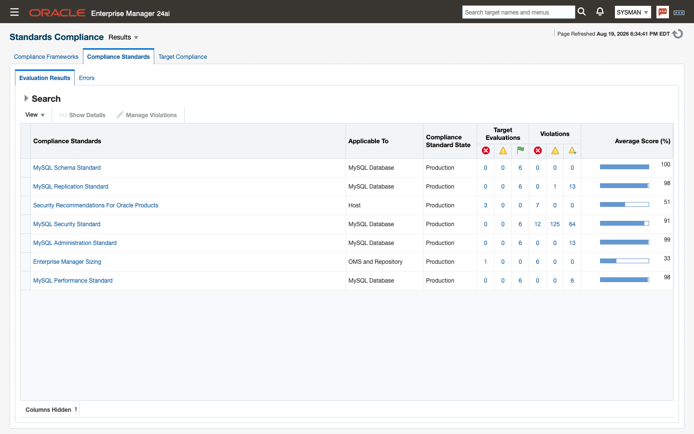

# Compliance standards

This chapter describes the compliance framework the plug-in ships, how to associate it, and every rule.
**Topics:** 9.1 The MySQL Framework · 9.2 Associating standards and reading results · 9.3 Rules by standard
## 9.1 The MySQL Framework
The plug-in ships finished compliance content for `ip_mysql_database_beta` targets: one framework, five standards and 65 rules, all authored by `INTEGRATION_PLUMBERS` at version 1. There is no rule to write and nothing to import — associate the content ([9.2](#associating-standards-and-reading-results)) and it evaluates.

The framework is **MySQL Framework (Integration Plumbers)**, and it collects all five standards:

| Standard | Internal name | Rules | Scope |
|---|---|---|---|
| MySQL Administration Standard | `xmys_administration_standard` | 14 | The server's logging, storage engine and diagnostic settings. |
| MySQL Performance Standard | `xmys_performance_standard` | 2 | The InnoDB I/O and durability settings that most directly affect throughput. |
| MySQL Replication Standard | `xmys_replication_standard` | 11 | Binary log integrity, replica read-only enforcement and replication throughput. |
| MySQL Schema Standard | `xmys_schema_standard` | 2 | Server-enforced data integrity settings. |
| MySQL Security Standard | `xmys_security_standard` | 36 | Audit logging, account and privilege posture, password policy, transport and at-rest encryption, and file-system exposure. |

Associate the framework to get all five, or a single standard when you want a narrower scope ([4.6](targets-and-properties.md#associate-compliance-standards)).

Every rule carries two attributes that shape how a violation is reported:

- **Severity** — **Minor Warning**, **Warning** or **Critical**. This is what a violation of that rule raises, and it is the rule's own judgment of the finding, independent of your environment. Of the 65 rules, 37 are Minor Warning, 23 are Warning and 5 are Critical.
- **Importance** — **Normal** on every rule in this release. Importance is how heavily a rule weighs in its standard's compliance score.

9.3 lists every rule under its standard, with the description of what the rule checks, its severity, and the advice for fixing a violation.

> **Note:** Rule descriptions and advice contain placeholders written as `%variable%` — `%binlog_checksum%` and `%version%`, for example. In the console, Enterprise Manager substitutes each placeholder with that target's own collected value, so the advice reads with the server's real setting in it. This guide prints the rules as they are authored, so the placeholders appear literally in [9.3](#rules-by-standard).

## 9.2 Associating standards and reading results

Compliance content evaluates only against targets it has been associated with, and adding a target creates no association: a new MySQL Database target has no compliance results until you make one.

Associate the framework, or individual standards, as described in [4.6](targets-and-properties.md#associate-compliance-standards) — from **Enterprise → Compliance → Library**, or with `emcli associate_cs_targets` one standard at a time.

Where the results appear:

- **Enterprise → Compliance → Results** is the full view. It lists every associated framework and standard with its compliance score and its violation counts by severity. Drill from a standard into a rule to see which targets violate it, and from a violation into that rule's description and advice.
- **The target's home page** carries a **Compliance Summary** region once the target has been evaluated, giving its score and its open violations. This is the quickest route from a server to its own findings.

**When evaluation happens.** These are configuration-based rules: they read the plug-in's configuration snapshots ([6.2](metrics-reference.md#how-to-read-a-metric-group)), which collect on a 24-hour schedule. Results therefore refresh about once a day, and a standard associated this morning produces its first score after the next configuration collection rather than immediately. To see the effect of a change sooner, refresh the target's configuration on demand — from the target-type menu, **Configuration → Last Collected**, then the page's refresh action — and let the evaluation follow that collection.

> **Note:** Do not read a score before there is one. Confirm the Compliance Summary region names an evaluation time for the target; a standard associated minutes ago has not been evaluated yet, and an absence of violations at that point means nothing has run.

## 9.3 Rules by standard
<!-- BEGIN GENERATED: compliance -->
#### MySQL Administration Standard (14 rules)

Groups the administration checks Integration Plumbers recommends for keeping a MySQL server's logging, storage engine, and diagnostic settings on a supportable footing.

##### Binary Log Debug Information Disabled

**Description:** MySQL's binary log records data and schema changes in binary format, underpinning point-in-time recovery and replication. When binlog_format is ROW or MIXED, the binlog_rows_query_log_event variable controls whether the server also writes the original SQL text as a Rows_query log event alongside each row-based change. With this off, tools that read the binary log (including mysqlbinlog) can show only the row deltas, making it harder to reconstruct the statement that produced them for auditing, debugging, or replication troubleshooting.

**Severity:** Minor Warning

**Advice:** Enable binlog_rows_query_log_event when binlog_format is ROW or MIXED so mysqlbinlog output and replication diagnostics include the originating SQL text. Set the value dynamically with SET PERSIST or SET GLOBAL, and add binlog_rows_query_log_event=ON to the [mysqld] section of the server's configuration file so the setting survives a restart. Weigh the modest increase in binary log size against the diagnostic value it provides.

##### Binary Logging Not Enabled

**Description:** The binary log is MySQL's durable record of data and schema changes, and it underpins point-in-time recovery as well as source/replica replication. Since MySQL 8.0, binary logging (log_bin) is enabled by default, so a server reporting it as disabled has had it explicitly turned off — typically via --skip-log-bin or log-bin=OFF in the configuration file. Running without a binary log removes the ability to recover to a specific point in time and prevents the instance from acting as a replication source.

**Severity:** Minor Warning

**Advice:** Confirm binary logging was disabled intentionally. If not, remove skip-log-bin (or set log-bin to a base name) in the [mysqld] section of the configuration file and restart the server. Also review binlog_expire_logs_seconds and disk capacity, since re-enabling binary logging introduces ongoing log growth that must be managed.

##### Binary Logging Not Synchronized To Disk At Each Write

**Description:** The sync_binlog variable controls how often the server flushes the binary log to disk relative to transaction commits. Since MySQL 5.7.7 the default is 1, meaning every commit group is synced to disk immediately for crash-safe recovery; any other value trades some durability for write throughput. A server with binary logging enabled but sync_binlog set away from 1 can lose the most recent commit groups from the binary log after an OS crash or power loss, which is especially costly on a replication source or when point-in-time recovery is required.

**Severity:** Minor Warning

**Advice:** Set sync_binlog=1 in the [mysqld] section of the configuration file to guarantee each commit group is durably written to the binary log, and restart the server or apply the change dynamically with SET PERSIST. Pair this with innodb_flush_log_at_trx_commit=1 for full crash safety; only relax either setting after a deliberate assessment of the acceptable data-loss window.

##### Binary Logs Automatically Removed Too Quickly

**Description:** binlog_expire_logs_seconds controls how long MySQL retains binary log files before automatically purging them; the legacy day-based expire_logs_days variable was removed in MySQL 8.0 and this is now the only automatic-expiration control. Binary logs are the basis for point-in-time recovery and for keeping replicas current, so purging them too aggressively can leave a gap between your last full backup and the oldest retained log, or strand a replica that falls behind.

**Severity:** Minor Warning

**Advice:** Review the current binlog_expire_logs_seconds setting relative to your backup cadence and replica lag tolerance. Increase it — the default is 30 days (2592000 seconds) — so retained binary logs reach at least as far back as your last full backup, and set it in the [mysqld] section of the configuration file so it persists across restarts. Balance retention against available disk space.

##### Database May Not Be Portable Due To Identifier Case Sensitivity

**Description:** lower_case_table_names determines whether MySQL treats database and table names as case-sensitive, and its effective value is tied to the case sensitivity of the underlying filesystem. Left at its case-sensitive default (0) on a case-sensitive filesystem such as most Linux deployments, identifiers created inconsistently in mixed case can behave unpredictably or fail to migrate cleanly to a case-insensitive platform. This setting can only be established at initialization; changing it on an existing MySQL 8.4 data directory requires reinitializing the instance.

**Severity:** Minor Warning

**Advice:** Set lower_case_table_names=1 in the [mysqld] section of the configuration file before the data directory is initialized, standardizing all identifiers to lowercase for cross-platform portability. Because this variable cannot be changed in place on an existing instance, plan any change as part of a rebuild or logical export/import, and lowercase existing object names beforehand to avoid ambiguous duplicates.

##### General Query Log Enabled

**Description:** The general query log records every statement received by the server, including connects and disconnects, in the order statements arrive rather than the order they execute. It is a useful short-term diagnostic for reproducing exactly what a client sent, but it adds per-statement overhead, grows quickly, and is not a substitute for the binary log when reconstructing execution order for recovery or auditing. Leaving it enabled continuously in production is a common source of unplanned disk growth and I/O overhead.

**Severity:** Minor Warning

**Advice:** Disable the general query log for normal production operation by setting general_log=OFF (dynamically with SET GLOBAL general_log=OFF, and persistently by removing or commenting out general_log in the [mysqld] section). Enable it only for short, targeted troubleshooting windows, and prefer the slow query log or Performance Schema statement instrumentation for ongoing visibility into query activity.

##### In-Memory Temporary Table Size Limited By Maximum Heap Table Size

**Description:** MySQL spills an internal temporary table to disk once it exceeds the smaller of tmp_table_size and max_heap_table_size. Since MySQL 8.0 the TempTable engine (governed by temptable_max_ram) is the default for most internal temporary tables, but max_heap_table_size still caps user-created MEMORY tables and any internal temporary table that falls back to the MEMORY engine. When max_heap_table_size is set lower than tmp_table_size, that ceiling is reached first, forcing avoidable disk-based temporary tables and hurting query performance.

**Severity:** Minor Warning

**Advice:** Set max_heap_table_size to be at least as large as tmp_table_size so the MEMORY-engine ceiling does not undercut the space MySQL is otherwise willing to allocate in memory. Review both alongside temptable_max_ram, since the TempTable engine now handles most internal temporary tables by default, and adjust all three in the [mysqld] section of the configuration file so they remain aligned after a restart.

##### InnoDB Strict Mode Is Off

**Description:** innodb_strict_mode governs how InnoDB reacts to invalid or contradictory table options, syntax problems, and row-format violations during DDL. With strict mode on, these conditions raise an immediate error, preventing a mistyped or unsupported option from silently creating a table with unintended defaults. With it off, InnoDB instead logs a warning and continues, which can leave tables or indexes built differently than intended and defer discovery of the problem until it causes a runtime failure.

**Severity:** Minor Warning

**Advice:** Enable innodb_strict_mode by setting innodb_strict_mode=ON in the [mysqld] section of the configuration file and restarting the server, or apply it dynamically per-session while testing DDL changes. Address any DDL statements that begin failing under strict mode — they were previously succeeding only because InnoDB silently downgraded an error to a warning.

##### InnoDB System Tablespace Cannot Automatically Expand

**Description:** innodb_data_file_path defines the files that make up InnoDB's system tablespace and can mark the final file with the autoextend attribute so it grows automatically as space is needed. Without autoextend, the system tablespace is fixed at its configured size; once full, InnoDB raises out-of-space errors and write activity against any object still stored there — including the data dictionary and, depending on configuration, undo logs — stops until space is added manually and the instance is restarted.

**Severity:** Minor Warning

**Advice:** Add the autoextend attribute to the final file in innodb_data_file_path within the [mysqld] section of the configuration file so the system tablespace can grow to meet demand, and restart the server to apply it. Set a generous autoextend increment to limit fragmentation from frequent small extensions, and continue monitoring free space even with autoextend enabled, since host-level disk exhaustion still applies.

##### InnoDB Transaction Logs Not Sized Correctly

**Description:** InnoDB's redo log capacity — historically sized via innodb_log_file_size multiplied by innodb_log_files_in_group, and exposed since MySQL 8.0.30 through the consolidated innodb_redo_log_capacity — should generally be 50-100% of the buffer pool size. An undersized redo log forces more frequent checkpointing and additional physical I/O as dirty pages are flushed sooner than necessary, which can noticeably slow write-heavy workloads. innodb_log_file_size and innodb_log_files_in_group remain readable and functional in MySQL 8.4 even though direct assignment to them is deprecated in favor of innodb_redo_log_capacity.

**Severity:** Minor Warning

**Advice:** Increase the effective redo log capacity — preferably by setting innodb_redo_log_capacity directly on MySQL 8.0.30 and later — so it reaches 50-100% of innodb_buffer_pool_size. Recognize the trade-off: a larger redo log can extend crash recovery time. Apply the change dynamically where supported, or update the [mysqld] section of the configuration file and restart, removing any legacy ib_logfile* files first if resizing the older log-file-based configuration.

##### Warnings Not Being Logged

**Description:** log_error_verbosity controls how much detail the server writes to the error log: 1 restricts output to errors only, while 2 (the default) also captures warnings such as aborted connections and network re-connections, and 3 adds informational notes. The legacy log_warnings variable that predecessor tooling checked was removed from MySQL in 8.0.3; log_error_verbosity is now the sole control. Running with log_error_verbosity=1 suppresses warning-level detail that is often the first sign of connectivity or replication trouble.

**Severity:** Minor Warning

**Advice:** Set log_error_verbosity to 2 or higher (2 is the MySQL default) in the [mysqld] section of the configuration file, or dynamically with SET PERSIST log_error_verbosity, so warning conditions are captured in the error log. Reserve verbosity 3 for active troubleshooting, since it adds informational notes that can be noisy in steady-state production operation.

##### Binary Logging Is Limited

**Description:** The binary log is MySQL's durable record of data and schema changes, underpinning point-in-time recovery and source/replica replication. The --binlog-do-db and --binlog-ignore-db options filter which schemas are written to the binary log on the source. When either filter is set, changes to the excluded schemas are permanently absent from the log: point-in-time recovery cannot restore them, downstream replicas never receive them, and change auditing has a blind spot. These source-side filters are reported only by SHOW BINARY LOG STATUS, so a limited binary log is easy to miss in day-to-day configuration review.

**Severity:** Minor Warning

**Advice:** Review the binlog_do_db and binlog_ignore_db values reported by SHOW BINARY LOG STATUS and confirm every schema that matters for recovery or replication is being logged. Prefer removing the filters entirely — filtering on the replica with replicate-do-db/replicate-ignore-db keeps the source's binary log complete while still limiting what a given replica applies. If a source-side filter is genuinely required, document the excluded schemas and ensure they are covered by an alternative backup strategy.

##### Event Scheduler Disabled

**Description:** The Event Scheduler runs stored routines on a schedule — the database-native equivalent of cron — and is the supported vehicle for recurring housekeeping such as pruning stale rows, refreshing summary tables, and rotating application-side logs. It has been enabled by default since MySQL 8.0, so a server reporting event_scheduler as OFF or DISABLED has had it explicitly switched off (or disabled at startup with --event-scheduler=DISABLED). Scheduled events silently stop executing in that state, which typically surfaces later as unbounded table growth or stale rollups rather than as an immediate error.

**Severity:** Minor Warning

**Advice:** Confirm the Event Scheduler was disabled intentionally. If not, re-enable it with SET PERSIST event_scheduler = ON, or set event_scheduler=ON in the [mysqld] section of the configuration file. Note that a server started with --event-scheduler=DISABLED cannot enable it at runtime and requires a restart after correcting the configuration.

##### MySQL Series Past End Of Life

**Description:** Oracle publishes a support lifetime for every MySQL release series, and the 8.0 series has reached the end of it. Premier support for MySQL 8.0 ended in April 2025 and extended support ended in April 2026, so servers on the 8.0 line no longer receive bug fixes or security patches through standard support channels. Every month a database runs past its end of life widens the gap between the vulnerabilities being discovered against it and the patches available to close them, and newer client libraries, connectors, and tooling progressively stop being tested against the retired series. This check is advisory only. Integration Plumbers monitoring of the server continues unchanged whatever version it runs.

**Severity:** Minor Warning

**Advice:** Plan an upgrade from the 8.0 series to a supported release, preferably the 8.4 LTS line or a later LTS such as 9.7, validating the upgrade path in a staging environment before touching production. This server currently reports version %version%. Until the upgrade lands, review security advisories published against the 8.0 line with extra care, since fixes for them are no longer delivered under standard support. No action is required for monitoring itself. The plugin never blocks on server version and continues to collect from unsupported and newer releases alike.

#### MySQL Performance Standard (2 rules)

Groups the performance checks Integration Plumbers recommends for InnoDB I/O and durability settings that most directly affect MySQL throughput.

##### InnoDB Flush Method May Not Be Optimal

**Description:** MySQL's innodb_flush_method setting controls how InnoDB flushes data and log files to disk, and the right choice varies significantly by operating system. The O_DIRECT method, which bypasses the OS filesystem cache, is a Linux-only option that reduces double buffering and can materially improve I/O throughput on local storage. It has no defined behavior on Windows, where InnoDB instead recognizes unbuffered and normal as valid flush methods. A Windows host configured with innodb_flush_method=O_DIRECT is running an unsupported combination that MySQL will not honor as intended, silently undermining the flushing behavior the DBA believes is in effect.

**Severity:** Minor Warning

**Advice:** Set innodb_flush_method to a value that is valid for the host operating system. On Windows, use unbuffered (the 8.4 default) or normal; do not set O_DIRECT, which applies only to Linux and Unix-like systems. On Linux, O_DIRECT is generally recommended for local storage as it avoids double buffering, but should be avoided on network-attached storage (SAN/NFS) where it can degrade performance. It is currently set to %flush_method% on %version_compile_os%. Apply the corrected value in the server configuration file and restart MySQL, or set it dynamically where the platform and startup method allow.

##### InnoDB Log Buffer Flushed To Disk After Each Transaction

**Description:** The innodb_flush_log_at_trx_commit setting determines how aggressively InnoDB flushes its redo log buffer to disk at transaction commit. The ACID-compliant default of 1 flushes and fsyncs the log at every commit, guaranteeing no committed transaction is lost in a crash. Relaxing this to 0 or 2 trades a small amount of durability for significantly higher commit throughput, since the flush is deferred or handled by the OS rather than performed synchronously per transaction. This trade-off is often acceptable on replicas, where a lost transaction can be re-pulled from the source, but is a durability risk on any system of record.

**Severity:** Minor Warning

**Advice:** Confirm innodb_flush_log_at_trx_commit is set intentionally for this host's role. Keep it at 1 wherever full ACID durability is required, such as a replication source or any standalone system of record. On a replica where a brief loss of the most recent transactions is recoverable from the source, 2 offers a reasonable balance of durability and performance, while 0 maximizes throughput at higher risk. Set the desired value in the server configuration file and restart MySQL, or apply it dynamically via SET PERSIST where supported.

#### MySQL Replication Standard (11 rules)

Groups the replication checks Integration Plumbers recommends for keeping binary log integrity, replica read-only enforcement, and replication throughput within supportable limits.

##### Binary Log Checksums Disabled

**Description:** MySQL 8.4 validates binary log events with CRC32 checksums by default, protecting the log stream — and any replica reading from it — from silent corruption introduced between the moment an event is written and the moment it is later read, whether by mysqlbinlog, a replica's I/O thread, or crash recovery. The binlog_checksum system variable controls this behavior. Setting it to NONE removes this extra integrity check, increasing the risk that a corrupted event goes undetected until it causes replication failure or data divergence on a replica. Because binlog_checksum has defaulted to CRC32 since MySQL 5.6.6, an instance reporting NONE has been explicitly reconfigured away from the safer default and should be reviewed.

**Severity:** Minor Warning

**Advice:** Binary log checksums are currently disabled (binlog_checksum = %binlog_checksum%). Re-enable them with SET GLOBAL binlog_checksum = CRC32, then add binlog_checksum = CRC32 under [mysqld] in your configuration file so the change survives a restart. This restores the MySQL 8.4 platform default and allows replicas and recovery tooling to detect corrupted binary log events before they propagate.

##### Binary Log Row Based Images Excessive

**Description:** Row-based replication supports row-image control: instead of logging every column for every changed row, MySQL can log only the columns needed to uniquely identify and apply the change. The binlog_row_image system variable governs this — minimal logs only the required columns, full logs every column, and noblob logs every column except unneeded BLOB/TEXT columns. Leaving binlog_row_image at full when row-based (or mixed) binary logging is active inflates binary log volume, network bandwidth to replicas, and relay log storage on every replica, with no correctness benefit over minimal for most workloads.

**Severity:** Minor Warning

**Advice:** This instance has binary logging enabled (log_bin) with binlog_row_image = %binlog_row_image%. Reduce logged row images to only the columns required to identify and apply each change with SET GLOBAL binlog_row_image = minimal, then add binlog_row_image = minimal under [mysqld] in your configuration file so the setting is retained across restarts. Validate against any tooling that depends on full row images (e.g., certain CDC consumers) before changing production settings.

##### Source Not Verifying Checksums When Reading From Binary Log

**Description:** Binary log events are validated with a length field and, when binlog_checksum is enabled, a CRC32 checksum. The source_verify_checksum system variable controls whether the source server itself re-validates that checksum when it reads binary log events back off disk (for example, to serve a replica's dump request). With source_verify_checksum disabled, a corrupted on-disk binary log event can be served to a replica without detection, propagating corruption instead of failing fast on the source. This check applies only when binary logging and binlog_checksum are both active, since verification has no effect otherwise.

**Severity:** Minor Warning

**Advice:** source_verify_checksum is set to %source_verify_checksum% while binlog_checksum = %binlog_checksum% is active. Enable source-side verification with SET GLOBAL source_verify_checksum = ON, then add source_verify_checksum = ON under [mysqld] in your configuration file to persist it across restarts. This adds a small amount of CPU overhead on the source, since each binary log event read from disk is re-validated; benchmark on a representative workload before rolling out to production.

##### Replica Detection Of Network Outages Too High

**Description:** A replica notices a network connectivity outage with its source only after receiving no data for replica_net_timeout seconds. The default is 60 seconds, but if this has been raised toward or past 3600 seconds (one hour), a real outage can go undetected — and unretried — for far longer than necessary, letting the replica fall further behind and delaying alerting on a broken replication link.

**Severity:** Minor Warning

**Advice:** replica_net_timeout is currently %net_timeout% seconds. Lower it to a value appropriate for your network — commonly 60 seconds — by setting replica_net_timeout=60 (or your chosen value) under [mysqld] in your configuration file, and apply it with SET GLOBAL replica_net_timeout = 60 to take effect immediately. Faster outage detection means faster connection retries and a smaller replication lag window during network incidents.

##### Replica Not Configured As Read Only

**Description:** Arbitrary or unintended writes to a replica can break replication or leave the replica inconsistent with its source. Setting read_only on a replica ensures it accepts updates only from the replication applier thread and not from ordinary clients, closing off a common source of accidental data divergence. This check evaluates read_only only on instances with live replica status (a populated source_host in the collected ReplicationReplica metric), so it does not fire on a source or standalone instance where read_only=OFF is the expected, correct state.

**Severity:** Minor Warning

**Advice:** read_only is currently disabled on this replica. Set read_only=1 under [mysqld] in your configuration file and restart MySQL so it only accepts writes from its source via replication, or apply it dynamically with SET GLOBAL read_only = ON after quiescing any direct writers.

##### Replica Not Verifying Checksums When Reading From Relay Log

**Description:** When binlog_checksum is active, binary log events carry a CRC32 checksum that a replica can use to detect corruption introduced in transit or while sitting in the relay log. The replica_sql_verify_checksum system variable controls whether the replica's SQL applier thread re-validates that checksum before applying each event. Disabling verification while checksums are otherwise enabled removes a safety net against silently applying a corrupted transaction, trading a small amount of CPU for a meaningfully higher risk of undetected data divergence.

**Severity:** Minor Warning

**Advice:** replica_sql_verify_checksum is set to %sql_verify_checksum% while binlog_checksum = %binlog_checksum% is active on this instance. Re-enable verification with SET GLOBAL replica_sql_verify_checksum = ON, then add replica_sql_verify_checksum = ON under [mysqld] in your configuration file to persist it across restarts.

##### Replica SQL Processing Not Multi-Threaded

**Description:** MySQL replicas can apply transactions in parallel using multiple worker threads, coordinated by the replica SQL thread, as controlled by replica_parallel_workers. Since MySQL 8.0.27 the default applier scheduling is LOGICAL_CLOCK, which lets worker threads apply transactions concurrently based on their commit ordering and dependency information rather than partitioning work by schema; MySQL 8.4 removed replica_parallel_type entirely, so no per-schema partitioning mode exists. Since MySQL 8.0.27 the shipped default for replica_parallel_workers is 4 (multi-threaded by default); a value of 0 disables parallel apply entirely and forces single-threaded, serial replication, which is a common source of replication lag under concurrent write load and represents an explicit downgrade from the current default.

**Severity:** Minor Warning

**Advice:** replica_parallel_workers is currently %parallel_workers%, which disables parallel replica apply. Enable it by restarting the replica SQL thread with the new value — STOP REPLICA SQL_THREAD; SET GLOBAL replica_parallel_workers = n; START REPLICA SQL_THREAD (n is sized to your workload; 4 is the MySQL 8.4 default) — since changes to replica_parallel_workers do not take effect until the replica SQL thread is restarted. Then add replica_parallel_workers = n under [mysqld] in your configuration file to persist it across a full server restart. Confirm replica_preserve_commit_order and checkpoint settings remain appropriate for your consistency requirements before rolling out.

##### Replica Lag Excessive

**Description:** Replication lag, measured as seconds_behind_source on a replica, quantifies how far the replica is behind its source in applying transactions from the binary log. When lag exceeds a few hundred seconds (the default threshold is 300), the replica is applying changes significantly more slowly than they are being committed on the source, which can result in clients reading stale data, delayed failover capability, or cascading lag on replicas of replicas. High lag is typically caused by replication thread saturation under concurrent write load, long-running queries on the source that wait in the relay log, or inadequate parallel replica worker configuration. Regulatory: SOX availability and integrity.

**Severity:** Warning

**Advice:** Replication lag is currently %seconds_behind% seconds behind the source, exceeding the 300-second threshold. Investigate the source's binary log position and the replica's relay log processing rate using SHOW REPLICA STATUS. If the lag is growing, enable parallel replica workers (replica_parallel_workers) to increase throughput, or increase replica_parallel_workers if it is already active. For long-running queries on the source, consider deferring them to a maintenance window or running them on a dedicated replica, not the active replication feed.

##### Relay Log Purge Disabled

**Description:** relay_log_purge controls whether a replica automatically deletes relay log files after they have been fully processed by the replica SQL thread. When relay_log_purge is OFF, relay log files accumulate indefinitely on the replica's disk, consuming storage space and potentially exhausting the filesystem. Unless the replica is specifically configured for delayed-replication scenarios (such as point-in-time recovery sandboxes where old relay logs must be preserved), relay_log_purge should remain enabled to prevent uncontrolled disk growth. This check evaluates relay_log_purge only on instances with live replica status (a populated source_host in the collected ReplicationReplica metric), so it does not fire on a source or standalone instance where relay_log_purge=OFF has no meaning. Regulatory: SOX availability and integrity.

**Severity:** Warning

**Advice:** relay_log_purge is currently disabled on this replica. Set relay_log_purge=1 under [mysqld] in your configuration file and restart MySQL, or apply it dynamically with SET GLOBAL relay_log_purge = ON, to enable automatic deletion of relay logs as they are consumed. This prevents unbounded growth of the relay log directory and frees disk space for other database operations.

##### Relay Log Recovery Disabled

**Description:** relay_log_recovery controls whether a replica automatically recovers its relay log position after an unexpected shutdown or restart. When enabled, MySQL scans the relay log for corrupted entries and positions the replica SQL thread at a safe point, allowing replication to resume automatically after a crash without manual intervention. When relay_log_recovery is OFF, a replica that crashes mid-transaction must be manually resynchronized with its source (via replication reset or re-cloning), imposing operational overhead and increasing downtime. Modern MySQL defaults relay_log_recovery to ON precisely because recovery is safer and less disruptive than the alternative. This check evaluates relay_log_recovery only on instances with live replica status (a populated source_host in the collected ReplicationReplica metric), so it does not fire on a source or standalone instance where relay_log_recovery=OFF has no meaning. Regulatory: SOX availability and integrity.

**Severity:** Warning

**Advice:** relay_log_recovery is currently disabled on this replica. Set relay_log_recovery=1 under [mysqld] in your configuration file and restart MySQL, or apply it dynamically with SET GLOBAL relay_log_recovery = ON, to enable automatic relay log recovery on the next restart. This ensures the replica can resume replication without manual intervention after an unexpected shutdown.

##### GTID Consistency Not Enforced

**Description:** GTID (Global Transaction ID) mode identifies every transaction with a globally unique identifier, enabling reliable source-to-replica replication and seamless failover and re-pointing. However, enabling GTID_MODE alone is insufficient; the enforce_gtid_consistency variable must also be ON to prevent non-transactional engines (MyISAM) and other unsafe operations (CREATE TABLE ... SELECT, CREATE TEMPORARY TABLE, and statements inside procedures containing transactions) from creating GTIDs that would differ between source and replica, silently creating data divergence. If gtid_mode is ON but enforce_gtid_consistency is OFF, the server accepts statements that violate GTID consistency guarantees, undermining the entire purpose of using GTIDs in the first place. Regulatory: SOX availability and integrity.

**Severity:** Minor Warning

**Advice:** GTID_MODE is ON but ENFORCE_GTID_CONSISTENCY is currently %enforce_gtid_consistency%. Enable it with SET GLOBAL enforce_gtid_consistency = ON, then add enforce_gtid_consistency = ON under [mysqld] in your configuration file to persist it across restarts. Verify that no currently-running statements would violate the consistency rules (especially DDL inside stored procedures and CREATE TABLE ... SELECT) before applying this change in production.

#### MySQL Schema Standard (2 rules)

Groups the schema checks Integration Plumbers recommends for keeping server-enforced data integrity settings strict and enabled.

##### Server-Enforced Data Integrity Checking Disabled

**Description:** MySQL's sql_mode setting governs both SQL syntax handling and the level of data validation the server performs on incoming writes. When sql_mode contains none of the strict modes, invalid or out-of-range values are silently coerced or truncated to fit the column instead of being rejected, allowing corrupt or unexpected data into the database without any error. MySQL 8.4 ships with STRICT_TRANS_TABLES enabled by default specifically to close this gap, but the setting is a session-level variable that can be lowered or cleared by any connecting client or an administrator, so the server-enforced default alone does not guarantee protection.

**Severity:** Minor Warning

**Advice:** Ensure the global sql_mode includes at least one of TRADITIONAL, STRICT_TRANS_TABLES, or STRICT_ALL_TABLES so the server rejects invalid data rather than silently converting it. MySQL 8.4's default already includes STRICT_TRANS_TABLES; if this host reports no sql_mode, an administrator or application has explicitly cleared it. Restore the strict setting in the server configuration file and restart MySQL, and audit any client or session-level overrides that may be resetting sql_mode after connection.

##### Server-Enforced Data Integrity Checking Not Strict

**Description:** MySQL's sql_mode setting can combine many options to control SQL syntax and data validation behavior. Several of these options are unrelated to data integrity, so a non-empty sql_mode does not by itself guarantee that invalid data will be rejected. Only TRADITIONAL, STRICT_TRANS_TABLES, or STRICT_ALL_TABLES enforce true server-side data integrity checking; without at least one of them present, out-of-range or malformed values are still silently adjusted to fit their target column rather than causing an error. As with any session variable, sql_mode can be changed by a connecting client at any time, so this should be checked periodically.

**Severity:** Minor Warning

**Advice:** Ensure the sql_mode variable includes at least one of TRADITIONAL, STRICT_TRANS_TABLES, or STRICT_ALL_TABLES to obtain the highest level of data integrity checking. It is currently set to '%sql_mode%'. MySQL 8.4's default sql_mode already includes STRICT_TRANS_TABLES, so a value missing all three typically indicates an intentional override; confirm it is appropriate for this environment, then set the desired value in the server configuration file and restart MySQL.

#### MySQL Security Standard (36 rules)

Groups the security checks Integration Plumbers recommends for MySQL audit logging, network firewall protection, and file-system exposure.

##### Audit Log Accounts Excluded

**Description:** MySQL Enterprise Audit's audit_log plugin can restrict which sessions are logged by user account, using the audit_log_include_accounts or audit_log_exclude_accounts system variables. When either is set, the audit trail excludes activity from unlisted or explicitly excluded accounts, creating a blind spot for forensic and compliance review. This check flags any instance where account-based filtering is active. Because the audit_log plugin is an Enterprise Edition component, this rule reports no violations on instances where it is not installed.

**Severity:** Warning

**Advice:** Review the values configured for audit_log_include_accounts and audit_log_exclude_accounts. Unless a documented business reason requires excluding specific accounts (for example, high-volume monitoring accounts whose activity is captured elsewhere), clear both variables so the audit log captures all account activity. Apply with SET PERSIST audit_log_include_accounts = NULL and SET PERSIST audit_log_exclude_accounts = NULL, or remove the equivalent entries from the configuration file and restart.

##### Audit Log Policy Not ALL

**Description:** The audit_log plugin's logging scope is controlled independently for connection and statement events via audit_log_connection_policy and audit_log_statement_policy. Setting either to a value other than ALL narrows what gets recorded — for example, logging only errors or only DML — leaving gaps in the audit trail. This check flags any instance where either policy is not set to ALL. As with other MySQL Enterprise Audit checks, instances without the plugin installed simply report no violation rows.

**Severity:** Warning

**Advice:** Set both audit_log_connection_policy and audit_log_statement_policy to ALL so the audit log captures every connection and statement event, unless a specific, documented exception applies (for example, a high-throughput system that intentionally logs only DDL and DCL events). Apply with SET PERSIST audit_log_connection_policy = ALL and SET PERSIST audit_log_statement_policy = ALL, or update the option file and restart the audit_log plugin.

##### Firewall Disabled

**Description:** MySQL Enterprise Firewall protects against SQL injection and unauthorized queries by matching incoming statements against a per-account allowlist. Once installed, the firewall is controlled by the mysql_firewall_mode system variable, which is either ON (enforcing) or OFF (installed but inactive). Leaving the firewall disabled means the protection layer exists but provides no defense. This check flags instances where the firewall component is present but mysql_firewall_mode is not ON. Instances without MySQL Enterprise Firewall installed report no violation rows.

**Severity:** Warning

**Advice:** Confirm the firewall component is fully configured — allowlist profiles built and reviewed for the accounts that need protection — before enabling it, then set mysql_firewall_mode = ON at the global level, either with SET PERSIST mysql_firewall_mode = ON or the mysql-firewall-mode startup option, so the firewall enforces its allowlists in production. Verify enforcement afterward by confirming the variable reports ON.

##### LOCAL Option Of LOAD DATA Statement Is Enabled

**Description:** The LOCAL modifier on LOAD DATA lets a client push a file from its own host into the server, with the mysqld process itself directing the transfer. A modified or malicious server could abuse this to request arbitrary files the connecting client can read, and a compromised client can be tricked into loading unintended data. The local_infile system variable controls whether the server permits LOCAL LOAD DATA at all; MySQL ships with it disabled by default, so an ON reading indicates the setting has been actively re-enabled. This check flags instances where local_infile is ON.

**Severity:** Warning

**Advice:** Leave local_infile at its secure default of OFF unless an application has a specific, reviewed need for client-side LOAD DATA LOCAL. If it must be re-enabled, restrict it to trusted networks and clients that also enable the equivalent driver-level flag (for example, allowLoadLocalInfile), rather than leaving it open globally. Apply with SET PERSIST local_infile = OFF, or add local-infile=0 to the configuration file and restart.

##### Symlinks Are Enabled

**Description:** MySQL can relocate table or database files onto symbolic links, which is useful for spreading storage across file systems but can be abused when the server runs with elevated privileges: any account with write access to the data directory could point a symlink at an arbitrary file and have the server modify or delete it. The have_symlink status variable reports YES when this capability is active and DISABLED when the server was started with symbolic links turned off. This check flags instances where have_symlink reports YES.

**Severity:** Warning

**Advice:** Disable symbolic-link support unless a specific storage-layout requirement depends on it. Start mysqld with the --skip-symbolic-links option, or add skip-symbolic-links to the configuration file, then restart the server. After restart, confirm have_symlink reports DISABLED.

##### Anonymous Accounts Exist

**Description:** MySQL ships the concept of an anonymous account: a user row with an empty user name that matches any client failing to supply one, silently authenticating as whoever the anonymous grant allows. An attacker who reaches the server on a permitted host can log in as this anonymous identity without knowing any credentials, inheriting whatever privileges that account was given. Anonymous accounts are a documented artifact of legacy installation scripts and test databases, not something any production server should retain. Regulatory: CIS 4; SOX access control; PCI 7-8.

**Severity:** Critical

**Advice:** Remove every anonymous account so unauthenticated connections are rejected outright: DROP USER ''@'<host>'; for each host value reported by this check. After removal, verify no application depends on anonymous access by testing client connections with explicit credentials. Re-run mysql_secure_installation or an equivalent hardening script on the affected host to catch any anonymous grants left over from an older install.

##### Root Permits Remote Login

**Description:** The root account is intended for local administrative use, but a root row with a non-localhost host value (including the wildcard % or any name that resolves off-box) lets root authenticate from across the network. Any credential leak, weak password, or brute-force attempt against that account is then reachable from anywhere the server accepts connections, not just from the host itself. This is one of the highest-impact accounts to expose remotely, since root privileges bypass nearly every other control this compliance set checks for. Regulatory: CIS 4; SOX access control; PCI 7-8.

**Severity:** Critical

**Advice:** Restrict root to local administration only. If immediate mitigation is needed, lock the exposed account with ALTER USER 'root'@'<host>' ACCOUNT LOCK; then drop it once confirmed unused: DROP USER 'root'@'<host>';. Create a separate, appropriately scoped administrative account bound to specific hosts for any remote administration that is genuinely required, and grant it only the privileges that task needs.

##### Over-Privileged Accounts

**Description:** An account holding ALL PRIVILEGES has unrestricted access to every schema and every administrative capability on the server, whether or not its actual job requires more than a handful of them. The larger an account's privilege footprint, the greater the damage from a compromised credential, a misused connection, or an application bug that executes unintended SQL. Least-privilege access is the baseline expectation for any account that is not a dedicated DBA login, and ALL PRIVILEGES is the opposite of that baseline. The built-in root@localhost administrative account is exempt from this check: it holds this privilege by definition, so flagging it is permanently-red noise with no applicable remediation. Known limitation: this rule evaluates directly granted privileges; privileges obtained through roles, or narrowed by partial revokes, are not yet modeled. Regulatory: CIS 4; SOX access control; PCI 7-8.

**Severity:** Critical

**Advice:** Revoke the blanket grant and replace it with the specific privileges the account's workload actually uses: REVOKE ALL PRIVILEGES, GRANT OPTION FROM '<user>'@'<host>'; followed by targeted GRANT statements scoped to the required schemas and privilege types. Audit the account's query history or application code first to determine the minimum privilege set before re-granting, rather than guessing.

##### Accounts With Wildcard Host

**Description:** An account defined with a wildcard host value (%) authenticates from any client that presents its username and password, with no network-level restriction on where the connection originates. Pairing a wildcard host with weak network segmentation or an internet-facing MySQL port turns password strength into the only line of defense for that account. Scoping the host value to specific hosts or subnets removes an entire class of remote-access risk without touching the account's privileges at all. Regulatory: CIS 4; SOX access control; PCI 7-8.

**Severity:** Warning

**Advice:** Narrow the account's host value to the specific host, subnet, or hostname pattern the client actually connects from, for example recreating it as '<user>'@'10.0.1.0/255.255.255.0' or '<user>'@'app-host.internal' in place of the wildcard. Where a range of application servers all need access, prefer an explicit list of hosts or a tightly scoped subnet mask over a bare %. Use DROP USER followed by CREATE USER (or RENAME USER where the target host is already known) to change the host portion, since it cannot be altered in place.

##### Accounts Without Password

**Description:** An account with an empty authentication string accepts any password, including no password at all, for the username it matches. This is functionally equivalent to leaving the front door unlocked: any client that reaches the server on an allowed host can authenticate as that account without knowing any secret. Passwordless accounts are sometimes left over from quick test setups or default installs and are one of the most straightforward footholds an attacker can use once they can reach the server on the network. Regulatory: CIS 4; SOX access control; PCI 7-8.

**Severity:** Critical

**Advice:** Set a strong password immediately: ALTER USER '<user>'@'<host>' IDENTIFIED BY '<strong-password>';. If the account is not actually in use, drop it instead with DROP USER '<user>'@'<host>';. Rotate any credentials that may have been shared or hardcoded elsewhere in the meantime, since a passwordless account may already have been used by more than the intended caller.

##### Deprecated Authentication Plugin

**Description:** mysql_native_password uses a SHA-1-based challenge-response scheme that MySQL has deprecated in favor of caching_sha2_password, the default authentication plugin since MySQL 8.0. Accounts still pinned to the older plugin miss the stronger hashing and the reduced exposure to offline password-guessing that the current default provides, and mysql_native_password is disabled by default in some 8.4+ configurations, which can break connectivity outright on upgrade. Standardizing on the modern plugin closes a known weaker-cryptography gap and avoids a forced, unplanned migration later. Regulatory: CIS 4; SOX access control; PCI 7-8.

**Severity:** Warning

**Advice:** Re-create the account's authentication under the current default plugin: ALTER USER '<user>'@'<host>' IDENTIFIED WITH caching_sha2_password BY '<password>';. Confirm the connecting client library and driver version support caching_sha2_password (or its SHA-256 predecessor) before rolling this out broadly, since older connectors may need an upgrade to negotiate it successfully.

##### Accounts With Grant Option

**Description:** The GRANT OPTION privilege lets an account pass along any privilege it holds to other accounts, effectively letting that account expand access on the server without going through whatever process governs privilege changes elsewhere. An account with broad privileges and GRANT OPTION can create a shadow chain of grants that is difficult to audit after the fact, undermining the intent of centralized access control. GRANT OPTION should be reserved for the small number of accounts that specifically administer other users' access, not attached to general-purpose application or reporting accounts. The built-in root@localhost administrative account is exempt from this check: it holds this privilege by definition, so flagging it is permanently-red noise with no applicable remediation. Known limitation: this rule evaluates directly granted privileges; privileges obtained through roles, or narrowed by partial revokes, are not yet modeled. Regulatory: CIS 4; SOX access control; PCI 7-8.

**Severity:** Warning

**Advice:** Remove the ability to re-delegate privileges from any account that does not specifically need it: REVOKE GRANT OPTION ON *.* FROM '<user>'@'<host>';. Keep GRANT OPTION limited to a documented set of administrative accounts, and review any grants that account has already issued to other users before revoking it.

##### Accounts With File Privilege

**Description:** The FILE privilege lets an account read from and write to arbitrary files on the server's filesystem using LOAD_FILE(), SELECT ... INTO OUTFILE, and LOAD DATA INFILE, subject only to the operating system's file permissions for the mysqld process. In practice this means a compromised or misused account with FILE can read sensitive files outside the database entirely, or write a file that gets executed by something else on the host. Very few accounts have a legitimate operational need for filesystem access from inside SQL. The built-in root@localhost administrative account is exempt from this check: it holds this privilege by definition, so flagging it is permanently-red noise with no applicable remediation. Known limitation: this rule evaluates directly granted privileges; privileges obtained through roles, or narrowed by partial revokes, are not yet modeled. Regulatory: CIS 4; SOX access control; PCI 7-8.

**Severity:** Warning

**Advice:** Revoke the privilege from any account that does not explicitly require bulk file import/export: REVOKE FILE ON *.* FROM '<user>'@'<host>';. Where LOAD DATA INFILE is genuinely needed, prefer a dedicated, narrowly scoped account used only for that purpose, and disable it when the import job is not actively running.

##### Accounts With Process Privilege

**Description:** The PROCESS privilege lets an account see the full text of statements currently running on the server via SHOW PROCESSLIST and the Performance Schema and Information Schema process views, including queries issued by other users. That visibility can leak sensitive data embedded in other sessions' SQL, such as literal values in WHERE clauses or parameters passed to stored procedures, to an account that has no other reason to see them. PROCESS is a lower-severity exposure than most privileges checked here, but it is still broader visibility than a typical application account should carry. The built-in root@localhost administrative account is exempt from this check: it holds this privilege by definition, so flagging it is permanently-red noise with no applicable remediation. Known limitation: this rule evaluates directly granted privileges; privileges obtained through roles, or narrowed by partial revokes, are not yet modeled. Regulatory: CIS 4; SOX access control; PCI 7-8.

**Severity:** Minor Warning

**Advice:** Revoke PROCESS from accounts that only need to run their own workload: REVOKE PROCESS ON *.* FROM '<user>'@'<host>';. Reserve it for monitoring and DBA accounts that specifically need visibility into server-wide activity, and prefer scoped Performance Schema instrumentation over PROCESS for application-level introspection.

##### Accounts With Shutdown Privilege

**Description:** The SHUTDOWN privilege allows an account to stop the MySQL server outright, an availability-impacting action with no data-access component at all. Any account that can shut down the server is a single credential away from a denial-of-service incident, whether through compromise, a scripting mistake, or a disgruntled user. Very few accounts, typically only dedicated operational or orchestration accounts, have a legitimate reason to hold this privilege. The built-in root@localhost administrative account is exempt from this check: it holds this privilege by definition, so flagging it is permanently-red noise with no applicable remediation. Known limitation: this rule evaluates directly granted privileges; privileges obtained through roles, or narrowed by partial revokes, are not yet modeled. Regulatory: CIS 4; SOX access control; PCI 7-8.

**Severity:** Minor Warning

**Advice:** Revoke SHUTDOWN from any account outside a small, documented set of operational accounts: REVOKE SHUTDOWN ON *.* FROM '<user>'@'<host>';. If an orchestration tool needs to restart the server, route that action through a controlled process (systemd, a container orchestrator, or a scoped automation account) rather than leaving SHUTDOWN attached to a general-purpose login.

##### Accounts With Super Privilege

**Description:** SUPER is a broad administrative privilege that governs system variable changes, replication control, killing other sessions' connections, and multiple other server-wide actions that bypass normal restrictions. An account with SUPER can, among other things, override read_only, change security-relevant configuration at runtime, or terminate another user's session, giving it reach well beyond typical application needs. Because SUPER's scope has grown to cover many individually-grantable dynamic privileges in modern MySQL, most accounts that were given SUPER out of convenience can be moved to a narrower, purpose-specific privilege instead. The built-in root@localhost administrative account is exempt from this check: it holds this privilege by definition, so flagging it is permanently-red noise with no applicable remediation. Known limitation: this rule evaluates directly granted privileges; privileges obtained through roles, or narrowed by partial revokes, are not yet modeled. Regulatory: CIS 4; SOX access control; PCI 7-8.

**Severity:** Warning

**Advice:** Revoke the blanket privilege and replace it with the specific dynamic privilege the account needs (such as SYSTEM_VARIABLES_ADMIN, CONNECTION_ADMIN, or REPLICATION_CLIENT): REVOKE SUPER ON *.* FROM '<user>'@'<host>';. Reserve SUPER itself for a small number of DBA accounts that genuinely need the full administrative surface it grants.

##### Accounts With MySQL Schema Write Access

**Description:** Write access to the mysql system schema (INSERT, UPDATE, or DELETE on its tables) lets an account modify the server's own account, privilege, and configuration metadata directly, rather than through GRANT, REVOKE, and other privilege-management statements that are logged and auditable in a predictable way. An account with this access can create or alter other users' credentials and privileges, or corrupt server metadata, without going through the normal grant pathway that audit tooling expects to see. This is a significant privilege-escalation surface that most accounts, including many DBA-adjacent ones, do not need directly. The built-in root@localhost administrative account is exempt from this check: it holds this privilege by definition, so flagging it is permanently-red noise with no applicable remediation. Known limitation: this rule evaluates directly granted privileges; privileges obtained through roles, or narrowed by partial revokes, are not yet modeled. Regulatory: CIS 4; SOX access control; PCI 7-8.

**Severity:** Warning

**Advice:** Revoke direct write access to the system schema: REVOKE INSERT, UPDATE, DELETE ON mysql.* FROM '<user>'@'<host>';. Manage accounts and privileges exclusively through CREATE USER, ALTER USER, GRANT, and REVOKE statements so that every privilege change goes through MySQL's normal, auditable grant pathway instead of a direct table edit.

##### Password Validation Component Not Installed

**Description:** MySQL ships an optional password-validation component that rejects weak passwords at CREATE USER and ALTER USER time, checking length, character-class mix, and optionally a dictionary of common passwords. When the component is not installed, MySQL accepts any password a client supplies, including a single-character or dictionary-word password, with no server-side floor at all. This check fires when the collected policy value comes back null — the configuration collector always emits a password-validation row, but leaves it empty when the component was never installed or has since been removed. Regulatory: PCI 8.3.

**Severity:** Critical

**Advice:** Install the component with INSTALL COMPONENT 'file://component_validate_password'; then confirm it is active with SHOW VARIABLES LIKE 'validate_password%';. Set validate_password.policy to at least MEDIUM (STRONG if a maintained dictionary file is available) so newly created and changed passwords meet a documented minimum strength before the account becomes usable.

##### Password Validation Policy Weak

**Description:** The password-validation component supports three policies: LOW checks length only, MEDIUM adds a character-class mix requirement, and STRONG adds a dictionary check against common passwords. A server running LOW enforces nothing beyond a minimum length, which a short, all-lowercase, all-numeric password satisfies easily. Regulatory: PCI 8.3.

**Severity:** Warning

**Advice:** Raise the policy to at least MEDIUM: SET PERSIST validate_password.policy = 'MEDIUM';, and to STRONG where a maintained dictionary file is available via validate_password.dictionary_file. Re-test any automation that creates accounts programmatically, since a stricter policy will reject passwords it previously accepted.

##### Password Lifetime Unlimited

**Description:** default_password_lifetime controls how many days a password remains valid before MySQL forces a change; a value of 0 disables expiration entirely, so a credential set once can remain valid indefinitely even after being exposed in a leak, a departed employee's notes, or an unencrypted backup. Regulatory: PCI 8.3.

**Severity:** Warning

**Advice:** Set a bounded rotation interval, for example SET PERSIST default_password_lifetime = 90;, and confirm application connection strings and service accounts have a documented rotation process that will not break unexpectedly when the password expires.

##### Password Reuse Not Restricted

**Description:** password_history and password_reuse_interval together stop an account from cycling back to a recently used password; with both set to 0, a user forced to change a compromised password can simply set it right back to the same value, defeating the purpose of the rotation. Regulatory: PCI 8.3.

**Severity:** Minor Warning

**Advice:** Set both controls, for example SET PERSIST password_history = 5; and SET PERSIST password_reuse_interval = 365;, so a password cannot be reused until it has aged out of both the count-based and time-based history.

##### Secure Transport Not Required

**Description:** require_secure_transport, when OFF, lets clients connect over plaintext TCP with no negotiated encryption at all, exposing credentials and query data to anyone positioned to observe the network path between client and server. Regulatory: PCI 4.

**Severity:** Warning

**Advice:** Enable the control with SET PERSIST require_secure_transport = 'ON';, and verify every client, replication channel, and monitoring agent connecting to this server has a working TLS certificate chain configured before enforcing it, since non-TLS clients are refused immediately once the change takes effect.

##### Weak TLS Versions Permitted

**Description:** The tls_version variable lists which protocol versions the server will negotiate; leaving TLSv1 or TLSv1.1 enabled keeps deprecated protocols available to any client that still offers them, even though both have documented cryptographic weaknesses and were formally deprecated industry-wide. Regulatory: PCI 4.

**Severity:** Warning

**Advice:** Restrict the list to modern protocols only, for example SET PERSIST tls_version = 'TLSv1.2,TLSv1.3';, and confirm every legitimate client and replication peer can still negotiate one of the remaining versions before rolling the change out broadly.

##### Secure File Privilege Unrestricted

**Description:** secure_file_priv restricts the directories LOAD DATA INFILE, SELECT ... INTO OUTFILE, and related file-handling operations can read from or write to. MySQL reports two very different states as the same collected NULL once the value passes through the OMS repository: an empty string ('', unrestricted — any account with the FILE privilege can read or write anywhere the mysqld process has filesystem access) and MySQL's own NULL (disabled entirely — no file import/export path is permitted at all, which is the hardened, compliant state). The snapshot alone cannot distinguish the two, so this check flags every occurrence and asks an operator to confirm which case applies on the server. Regulatory: CIS 4.

**Severity:** Warning

**Advice:** Check the live value with SHOW VARIABLES LIKE 'secure_file_priv'; on the target server. If it comes back empty, set it to a single dedicated directory the server can write to and nothing else needs, for example secure_file_priv=/var/lib/mysql-files in my.cnf, then restart mysqld, since this variable is not settable dynamically at runtime. If it comes back NULL, file import/export is already disabled entirely; this is compliant and the finding can be dismissed.

##### Partial Revokes Disabled

**Description:** partial_revokes lets an administrator grant a privilege at the global level and then REVOKE it on a specific schema, a pattern many multi-tenant and shared-database deployments rely on to carve out exceptions without maintaining a separate grant per schema; with the feature OFF, any such REVOKE is rejected, which typically pushes teams toward broader, less precise grants instead. Regulatory: CIS 4.

**Severity:** Minor Warning

**Advice:** Enable the feature with SET PERSIST partial_revokes = 'ON'; where schema-level exceptions to a global grant are needed, then use REVOKE ... ON <schema>.* FROM ...; to narrow existing over-broad grants down to what each account actually needs.

##### Automatic Stored Procedure Privileges Enabled

**Description:** automatic_sp_privileges, when ON, silently grants EXECUTE and ALTER ROUTINE to the creator of a stored procedure or function, which means privilege escalation can happen as a side effect of writing code rather than through an explicit, auditable GRANT statement. Regulatory: CIS 4.

**Severity:** Minor Warning

**Advice:** Disable the automatic grant with SET PERSIST automatic_sp_privileges = 'OFF';, and grant EXECUTE explicitly to the accounts that need to call each routine so every privilege on a routine traces back to a deliberate grant.

##### Audit Log Plugin Not Installed

**Description:** MySQL Enterprise's audit_log plugin records connection and statement activity to a dedicated audit trail independent of the general and slow query logs, giving investigators a record of who did what even when the standard logs are rotated or disabled. A licensed server whose audit-log configuration snapshot carries no file path has no such trail — the configuration collector always emits an audit-log row, but leaves the file column empty when the plugin has nothing to report. This check is Enterprise-only and stays silent on Community, which does not ship the plugin. Regulatory: SOX audit trail; PCI 10.

**Severity:** Warning

**Advice:** Install the plugin with INSTALL PLUGIN audit_log SONAME 'audit_log.so'; (or the equivalent audit_log_filter component on newer releases) and configure a retention and rotation policy appropriate for the organization's audit requirements.

##### Binary Log Encryption Disabled

**Description:** binlog_encryption controls whether the binary log, which carries every data-changing statement executed on the server and in row-based replication the literal row values, is encrypted at rest. With it OFF, anyone with filesystem access to the binlog directory, such as an unencrypted backup target or a compromised host, can read every change ever made to the data in cleartext. Regulatory: PCI 3; HIPAA.

**Severity:** Warning

**Advice:** Enable binlog encryption with SET PERSIST binlog_encryption = 'ON'; after the keyring is installed and initialized, then confirm existing binlog files are re-encrypted or rotated out per the documented binlog encryption rollover procedure.

##### Data At Rest Encryption Not Default

**Description:** default_table_encryption controls whether newly created tables in a schema are encrypted by default. With it OFF, any CREATE TABLE that does not explicitly specify ENCRYPTION='Y' lands unencrypted, which means new sensitive data can silently accumulate outside encryption-at-rest coverage unless every developer remembers the explicit clause every time. Regulatory: PCI 3; HIPAA.

**Severity:** Warning

**Advice:** Set the default with SET PERSIST default_table_encryption = 'ON'; so new tables are encrypted unless a table opts out explicitly, and audit existing unencrypted tables that hold regulated data for migration to an encrypted tablespace.

##### Redo And Undo Log Encryption Disabled

**Description:** innodb_redo_log_encrypt and innodb_undo_log_encrypt control encryption of InnoDB's redo and undo logs, which can carry recently changed row data, including values from rolled-back transactions, even when the table's own tablespace is encrypted. Leaving either OFF creates a gap where data believed to be encrypted at rest is briefly or persistently exposed in the transaction logs. Regulatory: PCI 3.

**Severity:** Minor Warning

**Advice:** Enable both with SET PERSIST innodb_redo_log_encrypt = 'ON'; and SET PERSIST innodb_undo_log_encrypt = 'ON'; once the keyring is installed, matching the encryption coverage of the table data itself.

##### Keyring Component Not Installed

**Description:** Every InnoDB, binary log, and redo/undo log encryption feature this server might use depends on an installed keyring component to store and serve the top-level encryption key. With no keyring component active, none of those encryption features can actually be turned on, regardless of how their individual ON/OFF variables are set. Regulatory: PCI 3 (prereq).

**Severity:** Minor Warning

**Advice:** Install and configure a keyring component appropriate for the environment, such as keyring_file for a single host or a cloud KMS-backed keyring for centralized key management, verify it initializes successfully on startup via performance_schema.keyring_component_status, and only then enable the dependent encryption variables.

##### Failed Login Throttling Not Configured

**Description:** Without the connection_control plugin installed and without any account carrying an explicit failed-login lockout, MySQL places no limit on repeated authentication attempts against any account, which makes online password-guessing and credential-stuffing attacks against exposed accounts cheap and undetected until they succeed. This check clears if either control is present, the server-wide plugin or a per-account lockout, since either is sufficient to slow an attacker down. Regulatory: PCI 8; CIS 4.

**Severity:** Warning

**Advice:** Install the connection_control plugin with INSTALL PLUGIN CONNECTION_CONTROL SONAME 'connection_control.so'; and tune its delay thresholds, or configure per-account FAILED_LOGIN_ATTEMPTS and PASSWORD_LOCK_TIME on accounts reachable from outside the trusted network.

##### Error Logging Insufficient

**Description:** log_error and log_error_verbosity determine whether server errors, warnings, and security-relevant events such as failed logins and privilege errors are captured anywhere durable. An unset or stderr-only log_error routes output to a stream that is rarely retained, and a verbosity of 0 or 1 omits warnings entirely, both of which leave investigators with little to work from after an incident. Regulatory: SOX audit trail; CIS 6.

**Severity:** Minor Warning

**Advice:** Point log_error at a durable file path, for example log_error=/var/log/mysql/error.log in my.cnf, and raise log_error_verbosity to at least 2 so warnings are captured alongside errors, then confirm log rotation is configured so the file does not grow unbounded.

##### Audit Log Unencrypted

**Description:** The audit log records exactly who did what and when, which makes it a target in its own right: an attacker who can tamper with an unencrypted audit trail can cover their tracks after the fact. This check is Enterprise-only, since the audit_log plugin is not present in Community, and confirms the configured encryption mode is AES rather than left at its unencrypted default. Regulatory: SOX audit integrity; PCI 10.

**Severity:** Minor Warning

**Advice:** Configure AES encryption for the audit log per the Enterprise audit_log_encryption documentation, and store the encryption key in the same keyring already protecting the server's other encrypted assets so key management stays centralized.

##### Audit Log Rotation Not Configured

**Description:** audit_log_rotate_on_size controls the file size at which the plugin rotates the current audit log to a new file. Left at 0, with no size-based rotation, a busy server's audit log grows without bound until disk pressure forces an operator to intervene manually, which is exactly the wrong time to be improvising a retention policy for a compliance-relevant log. This check is Enterprise-only. Regulatory: SOX retention; PCI 10.

**Severity:** Minor Warning

**Advice:** Set a size-based rotation threshold appropriate for the server's audit volume and retention window, for example SET GLOBAL audit_log_rotate_on_size = 1073741824; (1 GiB), and pair it with an archival process that moves rotated files to durable, access-controlled storage before they are deleted locally.

##### Log Timestamps Not UTC

**Description:** log_timestamps controls the time zone used for timestamps written into the error log and other server logs. When it is not UTC, typically SYSTEM, following the host's local zone, correlating this server's log entries with logs from other hosts, application traces, or a SIEM during incident investigation requires manually accounting for whatever local offset and daylight-saving rules were in effect at the time, which is exactly the kind of error-prone step forensic timelines cannot afford. Regulatory: PCI 10.6 (forensic consistency).

**Severity:** Minor Warning

**Advice:** Set the variable with SET PERSIST log_timestamps = 'UTC';, and confirm any existing log-parsing or alerting tooling that assumed local time is updated to expect UTC before the change lands.
<!-- END GENERATED: compliance -->
