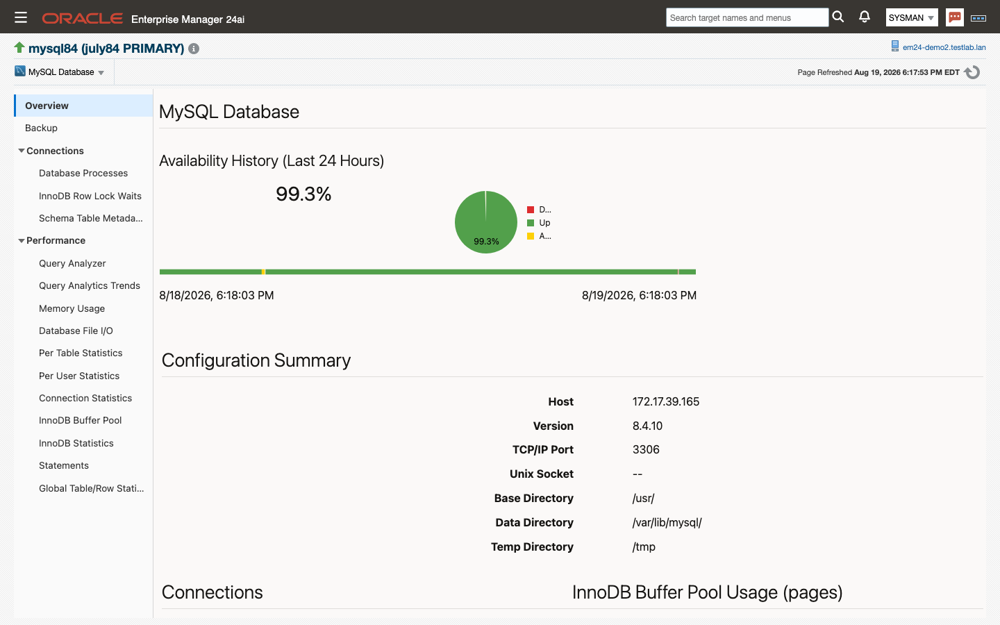
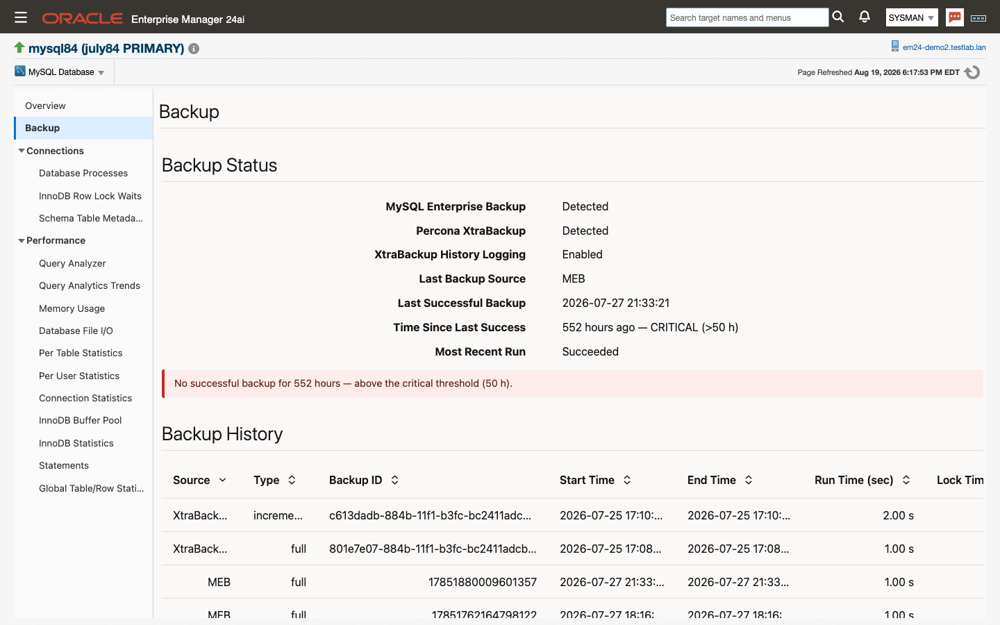
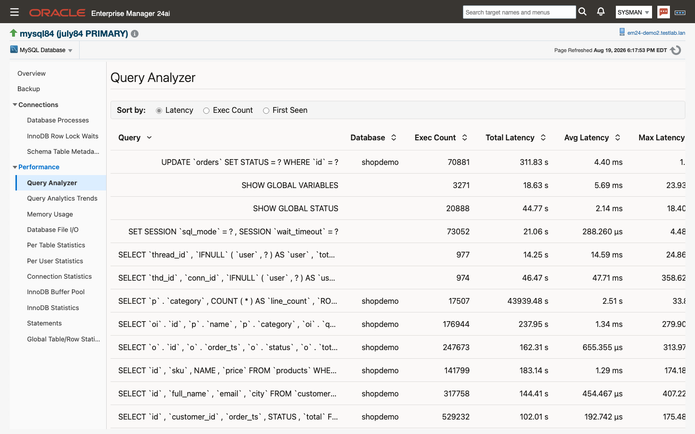
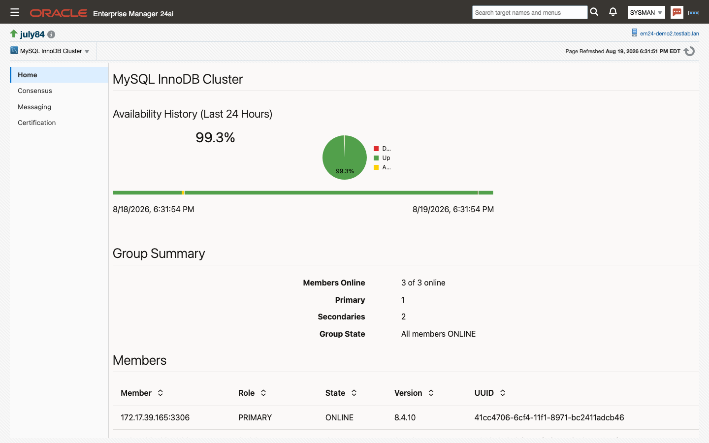
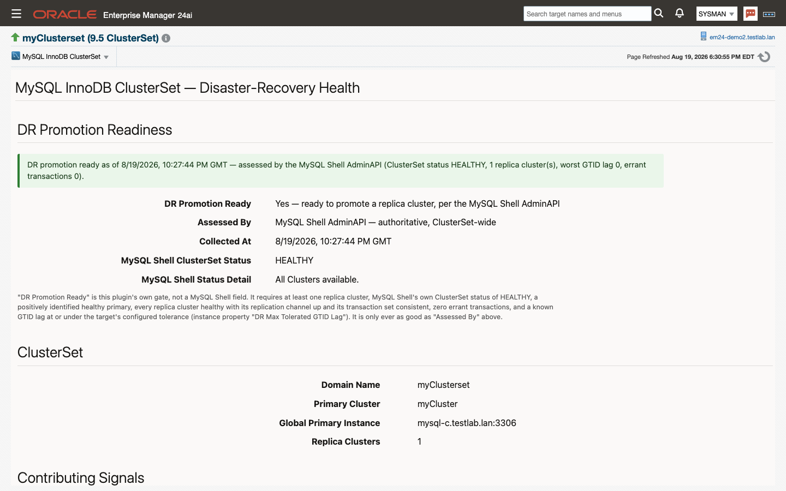

# Home page and pages tour

This chapter describes each page of the three target types.
**Topics:** 5.1 MySQL Database pages · 5.2 MySQL Cluster pages · 5.3 MySQL ClusterSet pages
## 5.1 MySQL Database pages
A MySQL Database target has sixteen pages. The home page is the default; every other page is one click away in the navigation tree down the left of each page, grouped as Overview, Backup, Connections and Performance, and the same pages are also listed on the **MySQL Database** target menu.

> **Note:** History-backed charts populate as collections accumulate — allow about an hour after the target is added before expecting trend data.

Most chart regions carry their own time-window selector — Real Time, 24 Hours, Week, Month — and a **Last Week** shortcut, so one region can be widened without disturbing the rest of the page. Grid columns can be sorted and the wide ones scroll horizontally; note the numeric-sort boundary in [10.1](whats-new.md#beta-2026-08-18).

Each page below lists its regions and the metric groups behind them. Chapter 6 and the generated metrics reference describe those groups column by column.

#### Home

The default page for a MySQL Database target, and the one to open first: it puts Enterprise Manager's availability and incident regions next to the server's identity, its live connection and buffer-pool charts, and the statements and wait events consuming the most time. Use it as the daily health check and as the way in to the deep-dive pages in the navigation tree.

| Name | Description |
|---|---|
| Availability | Enterprise Manager's own Up/Down record for the target over the last seven days. |
| Configuration Summary | Host, version, TCP/IP port, Unix socket, and the base, data and temp directories. |
| Connections | Threads connected, threads cached and max used connections over the selected window. |
| InnoDB Buffer Pool Usage (pages) | Buffer pool pages split into data, dirty, free and misc. |
| Top SQL by Response Time | The statement digests with the highest latency, with their schema, execution count, and average and maximum latency. |
| Top Waits | The busiest wait event, its class, the interval's total wait time and the number of active events, over a table of wait events by count, time and average wait. |
| Incidents | Open incidents for the target, from Enterprise Manager's incident manager. |
| Activity | Transaction, statement and row activity, drawn as per-interval deltas of the server's cumulative counters rather than as the counters themselves. |

Source: `InstanceInfo`, `ConnectionActivity`, `InnodbActivity`, `SysStatementByLatency` (`sys.x$statement_analysis`), `WaitProfile` and `WaitProfileSummary` (`performance_schema.events_waits_summary_global_by_event_name`), `TransactionStatementActivity`, `DmlStatementActivity`, `HandlerActivity`.

#### Backup

Answers whether this server's backups can be trusted right now, and shows the runs behind that answer. Use it when a backup alert fires ([7.1](alerts-and-thresholds.md#default-thresholds)), and as the evidence page when someone asks how recent the last good backup is.

| Name | Description |
|---|---|
| Backup Status | Whether each backup tool is detected, whether XtraBackup history logging is on, the last backup source, the last successful backup and how long ago it ran, and the outcome of the most recent run. A banner appears above the tiles when the backup age breaches its thresholds. |
| Backup History | Recent runs across both tools — source, type, backup ID, start and end time, run and lock time, exit state, success, end LSN, and the binary log position for point-in-time recovery. |

Source: `BackupStatus` and `BackupHistory`, read from `mysql.backup_history` (MySQL Enterprise Backup) and `PERCONA_SCHEMA.xtrabackup_history` (Percona XtraBackup). A tool with no history table on the server is reported as not detected and raises no alert ([2.7](prerequisites.md#backup-tool-visibility)).

#### Database Processes
Shows the sessions that are doing something right now, with the statement each one is running. Use it to find the session behind a load spike, a long transaction or a lock holder.

| Name | Description |
|---|---|
| Database Processes | Active, non-idle sessions: thread and connection ID, user, schema, command, state, time, the current statement with its latency and lock latency, transaction state, rows examined, sent and affected, and temporary table counts. |

Source: `SysProcesslist` (`sys.x$processlist`).

#### InnoDB Row Lock Waits
Shows every InnoDB row lock wait in progress, pairing the waiting session with the one blocking it. Use it while a wait is happening — the rows are current, not historical, so a wait that has cleared is gone from the page.

| Name | Description |
|---|---|
| InnoDB Row Lock Waits | One row per wait: the locked schema, table, index and lock type, and the lock mode, process ID and transaction ID of both the waiting and the blocking side. |

Source: `SysInnodbLockWaits` — the content of `sys.x$innodb_lock_waits`, read directly from `performance_schema` so it works under a least-privilege monitoring account.

#### Schema Table Metadata Lock Waits
Shows metadata lock contention: sessions waiting on a table's metadata lock and the sessions holding it. Use it when DDL, or a statement that should be instant, is stalled behind an open transaction.

| Name | Description |
|---|---|
| Schema Table Metadata Lock Waits | Pending versus granted metadata locks, the object each one covers, and the sessions on both sides. |

Source: `SysTableLockWaits` — the content of `sys.x$schema_table_lock_waits`, read directly from `performance_schema`.

#### Query Analyzer

Ranks the server's statement digests three ways and lets you take a plan for any of them without leaving the page. Use it to find the statements worth tuning, then to confirm what the optimizer does with one.

| Name | Description |
|---|---|
| Query Analyzer | The statement digests, with a **Sort by** selector that switches the grid between **Latency**, **Exec Count** and **First Seen**. Each row shows the normalized statement, schema, execution count, total, average, maximum and lock latency, rows examined and sent, whether a full scan was used, and when it was last seen. |
| Explain Plan | A schema field, a query field and the **Use Selected Query** and **Explain** buttons, above the returned plan: ID, select type, table, partitions, access type, possible keys, key, key length, ref, rows, filtered and extra. |

Select a statement row and click **Use Selected Query** to copy its text and schema into the Explain Plan region, substitute real values for the `?` placeholders a digest carries, then click **Explain** — the console submits the Run EXPLAIN job (chapter 8) for you and renders the plan it returns. Explaining a statement does not execute it.

Source: `SysStatementByLatency`, `SysStatementByExecCount` and `SysStatementByFirstSeen` — the top 25 digests by each ranking, from `sys.x$statement_analysis`. The plan comes from the `ip_mysql_run_explain` job ([8.1](jobs.md#run-explain)).

#### Query Analytics Trends
Turns the same statement-digest data into a trend: how latency and execution volume move collection by collection, and which statements dominate a chosen window. Use it to tell a genuine regression from a busy afternoon, and to see whether the Performance Schema digest table is overflowing.

| Name | Description |
|---|---|
| Latest Collection Summary | The most recent collection's total statement latency, total executions and `active_digest_count`, plus how full the digest table is, whether it is overflowing, and the collection time. |
| Statement Latency per Collection | Total statement latency per collection over the selected window. |
| Executions & Active Digests per Collection | Execution count and `active_digest_count` per collection over the selected window. |
| Top Statements Over Window | The window's heaviest statements, ranked by **Latency**, **Executions** or **No-Index Executions**, with executions, total, average and lock time, rows examined and sent, the examined-to-sent ratio, and no-index executions. |

The window aggregate is built from the top 25 statements of each 5-minute collection, so a statement outside every collection's top 25 contributes nothing to it. Read `active_digest_count` as the freshness signal: the digest tables retain their last rows when a collection window sees no activity, while the summary row is always current ([10.1](whats-new.md#beta-2026-08-18)).

Source: `StatementDigestProfileSummary` and `StatementDigestProfile`, from `performance_schema.events_statements_summary_by_digest`.

#### Memory Usage
Shows where the server's instrumented memory has gone, ranked by current allocation. Use it when resident memory is higher than expected, or to see which subsystem grew after a configuration change.

| Name | Description |
|---|---|
| Memory Usage — Top Consumers | One row per instrumented event: current allocation count, bytes and average size, and the same three at their high-water mark. |

Source: `SysMemoryByEvent` (`sys.x$memory_global_by_current_bytes`).

#### Database File I/O
Breaks file I/O down four ways — by host, by thread, by file and by wait event — on one page, so you can move from "which client" to "which file" without changing pages. Use it to attribute I/O latency to a caller, a session or a specific file.

| Name | Description |
|---|---|
| Database File I/O By Host | I/O count and latency per connecting host. |
| Database File I/O By Thread | I/O count, total, minimum, average and maximum latency per thread, with the thread's user and process-list ID. |
| Database File I/O By File | I/O count and latency per file, split into read, write and misc activity. |
| Database File I/O By Type | I/O count and latency per wait event, with read and write counts, bytes and averages. |

Source: `SysIoByHost` (`sys.x$host_summary_by_file_io`), `SysIoByThread` (`sys.x$io_by_thread_by_latency`), `SysIoByFile` (`sys.x$io_global_by_file_by_latency`) and `SysIoByWait` (`sys.x$io_global_by_wait_by_latency`).

#### Per Table Statistics
Shows the workload table by table: which tables are read, written and scanned, and what that costs in I/O. Use it to find the hot tables behind a load profile, and to see whether a table's access pattern changed.

| Name | Description |
|---|---|
| Per Table Statistics | One row per table: rows fetched, inserted, updated and deleted, and the I/O bytes and latency attributed to it. |

Source: `SysTableStatistics` — the content of `sys.x$schema_table_statistics`, read directly from `performance_schema`.

#### Per User Statistics
Shows the same workload split by account rather than by object. Use it to attribute load to an application account, and to spot an account whose statement or connection profile has changed.

| Name | Description |
|---|---|
| Per User Statistics | One row per user: statements, table scans, file I/O, connections and memory. |

Source: `SysUserSummary` (`sys.x$user_summary`).

#### Connection Statistics
Charts the connection layer — how many sessions there are, how many are being created and rejected, and what the thread cache is doing — with the server's connection and thread settings alongside. Use it to size `max_connections` and the thread cache, and to investigate aborted connects.

| Name | Description |
|---|---|
| Current Connections | Threads connected, cached and running, against the configured connection limit. |
| Total Connections | Connection creation over the selected window. |
| Connection Network Usage | Bytes received and sent. |
| Slowly Launched Threads | Threads that took longer than `slow_launch_time` to create. |
| Connections Aborted | Aborted clients and aborted connects. |
| Max Used Connections | The high-water mark of concurrent connections. |
| Connection Configuration | The server's connection-related variables, read live. |
| Thread Configuration | The server's thread-handling variables, read live. |

Source: `ConnectionActivity` and `ThreadsActivity` for the charts; `ConnectionLive` and `ThreadsLive` for the two configuration panels.

#### InnoDB Buffer Pool
The buffer pool's effectiveness and its contents on one page: hit behavior, page traffic, flushing, and how the pool is currently divided. Use it to judge whether the pool is large enough and whether flushing is keeping up.

| Name | Description |
|---|---|
| Buffer Usage (MB) | Pool size against the data, dirty and free portions of it. |
| Row Requests | Logical row reads served from the pool. |
| Page Activity | Pages read, created and written. |
| Waits for Free Pages | Times a request had to wait for a free page. |
| Pages Flushed | Flushing volume over the window. |
| Young Page Activity | Pages made young and not young, and the young hit rates. |
| Pending Operations | Reads, writes and flushes outstanding. |
| Page Read Ahead | Read-ahead pages and read-ahead evictions. |
| Compression Time (s) | Time spent compressing and uncompressing pages. |
| Current Usage (pages) | The pool's current split into data, dirty, free and misc pages. |
| InnoDB Buffer Configuration | The server's InnoDB variables, read live. |

Source: `InnodbActivity` and `InnodbBufferPool` for the charts; `InnodbConfigurationLive` for the configuration panel.

#### InnoDB Statistics
The storage engine's I/O behavior: data file traffic, redo log traffic, double-write, and what is queued. Use it to see whether the storage under InnoDB is keeping up, and to size the redo log.

| Name | Description |
|---|---|
| Data File I/O Activity (bytes) | Bytes read from and written to InnoDB data files. |
| Data File I/O Activity (ops) | Read, write and fsync operations. |
| Average Bytes Per Read | Mean read size, which distinguishes random from sequential access. |
| Double Write Activity | Double-write buffer writes and pages written. |
| Redo Log I/O Activity (bytes) | Bytes written to the redo log. |
| Redo Log I/O Activity (ops) | Redo log writes and fsyncs. |
| Redo Log Waits | Times a write had to wait on the redo log. |
| Pending I/O | Outstanding reads and writes. |
| Pending Flushes | Outstanding log and buffer pool flushes. |
| Open Files | Files InnoDB currently holds open. |
| InnoDB IO Configuration | The server's InnoDB variables, read live. |

Source: `InnodbActivity` and `InnodbIO` for the charts; `InnodbConfigurationLive` for the configuration panel.

#### Statements
Shows what kind of work the server is doing — the DML and transaction mix, the row operations behind it, and how much of it falls back to temporary tables and sorts — with the statement and optimizer settings alongside. Use it to characterize a workload and to spot a query mix that has shifted.

| Name | Description |
|---|---|
| DML Statements | SELECT, INSERT, UPDATE, DELETE and REPLACE counts per interval. |
| Transaction Statements | BEGIN, COMMIT and ROLLBACK counts per interval. |
| Row Activity | Storage engine handler calls — row reads, writes, updates and deletes. |
| Index Usage Ratio (%) | The share of row reads served through an index rather than by scanning. |
| Temporary Tables | Temporary tables created, and how many of them went to disk. |
| Sort Activity | Sorts performed, rows sorted and sort merge passes. |
| Statement Configuration | The server's statement-processing variables, read live. |
| Optimizer Configuration | The server's optimizer variables, read live. |

Source: `DmlStatementActivity`, `TransactionStatementActivity`, `HandlerActivity` and `TableActivity` for the charts; `StatementProcessingLive` and `OptimizerLive` for the two configuration panels.

#### Global Table/Row Statistics
The server-wide view of table and row handling: table opening and locking, temporary tables, scan ratio and sort volume. Use it to size `table_open_cache` and `tmp_table_size`, and to see how much of the workload scans rather than seeks.

| Name | Description |
|---|---|
| Opened Tables | Tables and table definitions opened per interval. |
| Currently Open Tables | Tables and table definitions currently open. |
| Temporary Tables | Temporary tables created, and how many went to disk. |
| Table Locks | Table locks acquired immediately versus after waiting. |
| Table Scan Ratio (%) | The share of row reads that came from a full scan. |
| Row Reads | Handler read calls by kind — first, key, next, previous, random and random next. |
| Row Writes | Handler write, update and delete calls. |
| Sorts | Sorts by range, by scan and requiring a sort of the result. |
| Rows Sorted | Rows passed through sorting. |
| Sort Merge Passes | Merge passes, which rise when `sort_buffer_size` is too small for the workload. |
| Table Configuration | The server's table-handling variables, read live. |

Source: `TableActivity` and `HandlerActivity` for the charts; `TableConfigurationLive` for the configuration panel.

## 5.2 MySQL Cluster pages
A MySQL Cluster target has four pages, listed in a flat navigation tree: the home page and three Group Replication deep dives. All four describe the group as a whole and identify members as `host:port` rather than as the bare UUIDs Group Replication reports.

The three deep-dive pages share a shape: a per-member table for the current collection window, and one headline chart over the last 24 hours. Their values are deltas over the collection interval, so the first window after deployment is a baseline and its cells read as an em dash — that is correct, not a fault. An em dash anywhere on these pages means the value was not measured; it does not mean zero.

#### Home (cluster)

The default page for a MySQL Cluster target: who is in the group, what role and state each member holds, and how the replication queues are behaving across all of them. Use it as the first stop for any question about group health or membership.

| Name | Description |
|---|---|
| Availability | Enterprise Manager's Up/Down record for the cluster target over the last seven days. |
| Group state banner | A one-line statement of the group's current state, shown above the summary when there is something to say about it. |
| Group Summary | Members online, the primary count, the secondary count, and a note on the group's state. |
| Members | One row per member: the composed `host:port` label, role, state, version and UUID. |
| Replication Activity (Last 24 Hours) | Three per-member charts — applier queue, certification queue and conflicts detected. |

Source: `GroupSummary` and `GroupMembers` (`performance_schema.replication_group_members`) for the summary and members table; `GroupMemberStats` (`performance_schema.replication_group_member_stats`) for the charts.

#### Consensus
Shows what the group's consensus protocol is costing: how many proposals each member makes, how long they take, and how often a round has to be extended. Use it when writes feel slow across the group rather than on one member, and when the consensus latency threshold ([7.1](alerts-and-thresholds.md#default-thresholds)) fires.

| Name | Description |
|---|---|
| Per-Member Consensus (Current Window) | One row per member: proposals, total and average consensus time, empty proposals and their share, extended rounds and their share, bytes sent and received, and the last consensus end. |
| Consensus Activity (Last 24 Hours) | Consensus proposals per member over the last 24 hours. |

Source: `GrConsensus` — the server's `Gr_*` status counters, collected as deltas over the interval.

#### Messaging
Shows the group's message traffic and round-trip times per member. Use it to separate a network problem between members from a database problem on one of them.

| Name | Description |
|---|---|
| Per-Member Messaging (Current Window) | One row per member: control and data messages sent, bytes transferred, and control and data round-trip times. |
| Messaging Activity (Last 24 Hours) | Message volume per member over the last 24 hours. |

Source: `GrMessaging` — the server's `Gr_*` status counters, collected as deltas over the interval.

#### Certification
Shows certification and consistency-wait activity: how much work the certifier is doing, and how long consistency guarantees are making transactions wait. Use it when the certification queue threshold ([7.1](alerts-and-thresholds.md#default-thresholds)) fires, or when a consistency level has been raised and you need its cost.

| Name | Description |
|---|---|
| Per-Member Certification (Current Window) | One row per member: certification garbage collection runs and timings, and the consistency-wait timings before begin, after sync and after termination. |
| Certification Activity (Last 24 Hours) | Certification activity per member over the last 24 hours. |

Source: `GrCertification` — the server's `Gr_*` status counters, collected as deltas over the interval.

## 5.3 MySQL ClusterSet pages
A MySQL ClusterSet target has one page.

#### ClusterSet DR Health

Answers one question — can this ClusterSet be failed over right now — and shows every signal that went into the answer, including which tool produced it. Use it before a planned switchover, during a disaster-recovery decision, and whenever the DR Promotion Ready alert fires ([7.1](alerts-and-thresholds.md#default-thresholds)).

| Name | Description |
|---|---|
| DR Promotion Readiness | A banner stating the verdict in a sentence, over tiles for DR Promotion Ready, Assessed By, Why Not MySQL Shell, Collected At, and MySQL Shell's own ClusterSet status and status detail. |
| ClusterSet | The ClusterSet's identity as MySQL Shell reports it: domain name, primary cluster, global primary instance and replica cluster count. |
| Contributing Signals | The inputs to the verdict — Assessed By repeated, primary healthy, replica clusters healthy, ClusterSet replication channel, worst replica GTID lag and worst replica errant transactions. |
| Clusters in this ClusterSet | One row per cluster: role, global status, ClusterSet replication status, transaction set consistency, missing and errant transaction counts, primary instance, and the missing and errant GTID sets. |

**DR Promotion Ready is the plug-in's own gate, not a MySQL Shell field.** It requires at least one replica cluster, a ClusterSet status of HEALTHY, a positively identified healthy primary, every replica cluster healthy with its replication channel up and its transaction set consistent, no errant transactions, and a known GTID lag at or under the target's **DR Max Tolerated GTID Lag** ([4.1](targets-and-properties.md#target-properties)). The verdict is never shown without **Assessed By** beside it, and a value that was not measured renders as an em dash or as a phrase saying why — never as `0`, `No` or `OK`.

**Under a network partition the status words alone look fine.** MySQL Shell can report the ClusterSet as HEALTHY, with the affected cluster's global status OK, while the ClusterSet replication channel sits in `CONNECTING` — the Shell suppresses the underlying connection error for as long as a channel is connecting, so nothing in those states says replication has stopped. A deliberately stopped channel is what reports `OK_NOT_REPLICATING`; a partition does not. The plug-in therefore gates DR readiness on replication heartbeat freshness rather than on the channel state, and reports the ClusterSet as not promotion-ready under a partition even while the Shell's own words read healthy. This behavior was measured on MySQL 9.5 commercial; see the boundary in [10.1](whats-new.md#beta-2026-08-18).

**Without MySQL Shell the page degrades deliberately.** If `mysqlsh` is not on the agent user's PATH, the plug-in falls back to a repository rollup: **Assessed By** names the rollup rather than the MySQL Shell AdminAPI, **Why Not MySQL Shell** reads `MYSQLSH_NOT_FOUND`, the Clusters table is empty because nothing could be read — not because every cluster is fine — and `dr_promotion_ready` reads 0, so the DR Promotion Ready alert raises CRITICAL until MySQL Shell is installed. Treat that combination as a missing prerequisite on the agent host, not as a disaster-recovery problem ([2.2](prerequisites.md#mysql-shell-for-clusterset-targets)).

Source: `ClusterSetHealth` and `ClusterSetClusters`, both produced by running MySQL Shell's `clusterSet.status()` AdminAPI call from the agent host, on a 5-minute collection.
