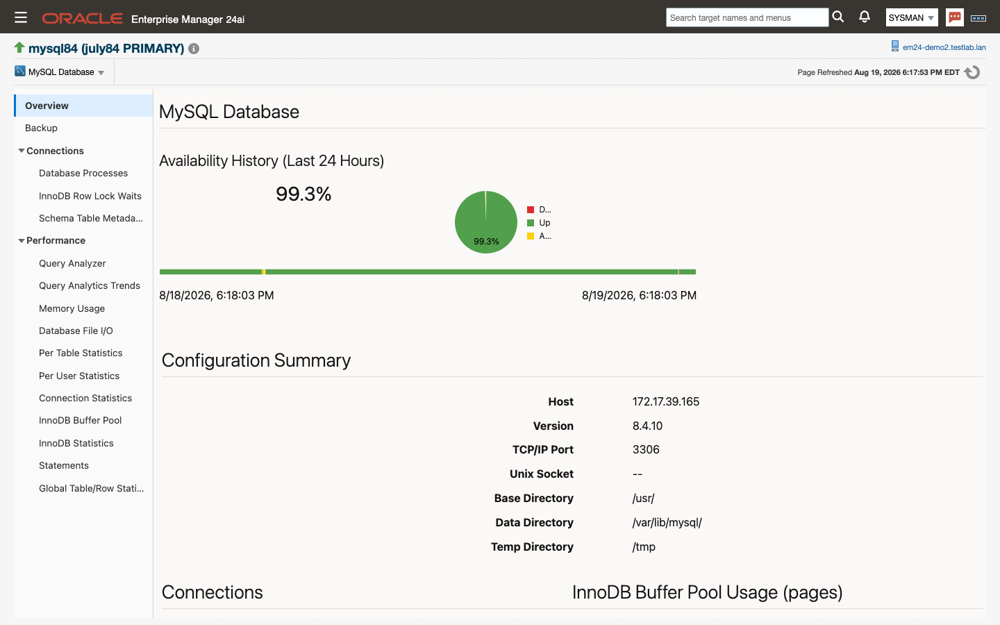
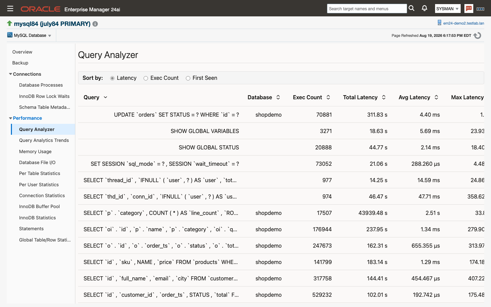
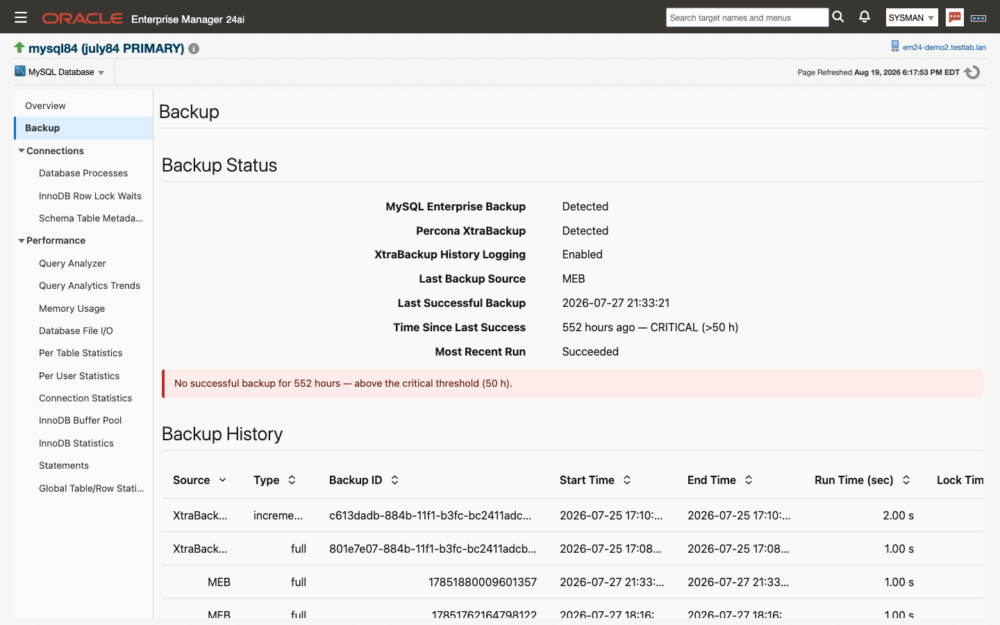
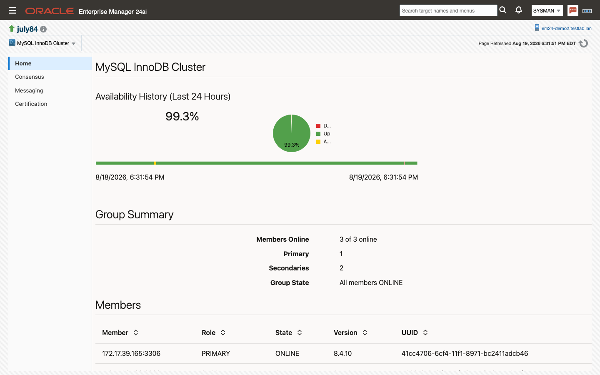
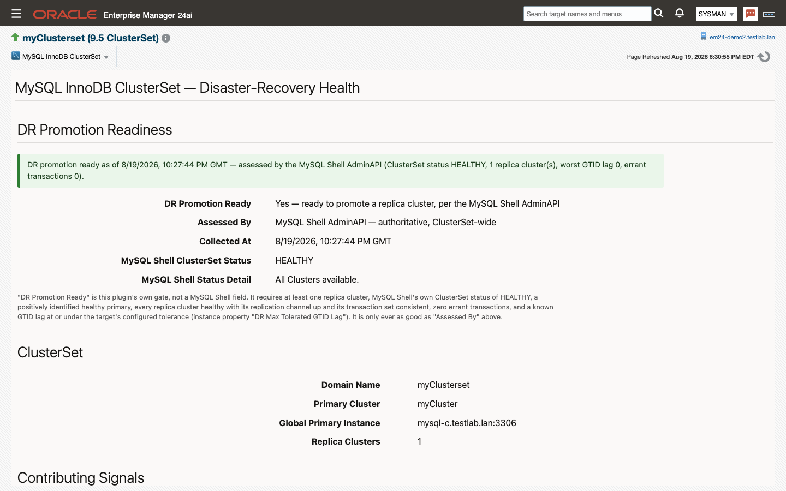

# Overview page and pages tour

This chapter describes each page of the three target types.
**Topics:** 5.1 MySQL Database pages · 5.2 MySQL Cluster pages · 5.3 MySQL ClusterSet pages
## 5.1 MySQL Database pages
A MySQL Database target has twenty-two pages. The Overview page is the default; every other page is one click away in the navigation tree down the left of each page. The tree has Overview, then the groups Performance, SQL, Sessions and Waits, and Storage (File I/O, Per Table Statistics, Tables and Indexes), then Backup, Configuration, Monitoring Readiness and License Info. The same pages are also listed on the **MySQL Database** target menu, which mirrors the tree. Enterprise Manager lists the Overview page itself as **Home**, so the plug-in does not repeat it. On a page with three or more regions, the navigation ends with an **On this page** list that jumps to each region.

> **Note:** History-backed charts populate as collections accumulate — allow about an hour after the target is added before expecting trend data.

The five chart pages (Connections, InnoDB Buffer Pool, InnoDB Statistics, Statements, and Table and Row Statistics) have one time-window control at the top right of the page: **Real time**, **Last day**, **Last week** and **Last month**. It applies to every chart on the page at once. The line beside it names the window and says whether the charts show raw collections (Last day) or hourly or daily averages, which make peaks look lower (Last week and Last month). Real time refreshes every 15 seconds. A page always opens on Last day; the choice is not carried to the next page. A chart with nothing to draw says why in words: no collections in the window yet, a rate that still needs a second collection, a window in which every value was 0, or a failed read. Query Analytics Trends and Waits have one control at the top right, with **Last day**, **Last week** and **Last month** and the same line beside it. They read stored history only, so Real time is not offered, and the control drives their charts, tables and window figures together. Where the console computes a rate from one of the server's cumulative counters, the chart plots it per second, so the same load reads the same on every window; charts whose axis says per collection plot what each collection measured, and the axis names the collection length (1 min for Waits, 5 min for Query Analytics Trends, about 5 min for the Group Replication charts). Grid columns can be sorted — numeric columns sort by value, not as text — and the wide ones scroll horizontally.

The grid pages (Sessions, InnoDB Row Lock Waits, Schema Table Metadata Lock Waits, Memory Usage, Per User Statistics, Per Table Statistics and File I/O) read the server live, not from stored history. A line above each grid says so: Real time, refreshed every 60 seconds. When a grid has no rows, the page says why in a sentence, and a grid that fits on one page has no page controls. If a read fails, the grid is replaced by a line saying that collection is unavailable. Where a grid shows SQL text, click the statement to read it in full, then choose **Copy to Clipboard**. If the browser does not allow copying, the text is selected and the dialog names the key to press. Query Analyzer keeps its own behaviour: a click there selects the row, ready for **Use Selected Query**. The Backup, Query Analyzer and ClusterSet pages read the same way for their grids and say Real time on the line above each one, with the refresh interval the page really uses (60 seconds, or 300 seconds for the ClusterSet clusters grid).

On the other pages in this chapter, a region built from the most recent collection says when it was collected, for example "Collected 05:13 (7h 52m ago)", with the time zone of your browser named once. If nothing has been collected yet, or the read failed, the same line says that instead. A table or chart that covers a period says which period. A table with no rows gives the reason in a sentence rather than the console's own "No data to display".

Each page below lists its regions and the metric groups behind them. [Chapter 6](metrics-reference.md#metrics-reference) and the generated metrics reference describe those groups column by column.

#### Overview

The default page for a MySQL Database target, and the one to open first. It answers one question: is this instance healthy, and is monitoring working? It is a strip of three cards, a row of key indicators, and then open incidents beside the most expensive statements. Everything deeper is one click away, because each card and each indicator links to the page that explains it. Use it as the daily health check.

| Name | Description |
|---|---|
| Availability card | Enterprise Manager's own Up/Down record for the target over the last 24 hours, which is what the console shows. A short note under the bar says that a yellow segment means no availability reading; hover over the note for the full explanation. Links to Connection Statistics. The Overview has no Availability tile of its own: this record is the authority. |
| Instance card | **Version**, **Host and port**, **Uptime**, **Backup** and **sys schema**. Backup is one phrase from the last backup status: no backup tool detected, the age of the last successful backup, last backup failed, or no successful backup. sys schema says whether the `sys` schema that the plug-in's statement views read is available. Links to Configuration. |
| Monitoring and License card | **Monitoring Readiness** first, then **License Status**, **Licensed Instances**, **Expiration** and **Days Remaining**, from the same license reading as the License Info page. A key that never expires shows No expiry. A key whose status is not Active or Expired shows `--` for the instances, expiration and days, because that key could not be verified. Monitoring Readiness reads "All ready" when every feature passed the last hourly check, "N features need attention" when any needs attention or is not functional, and "N features not checked" in grey when the only gaps are checks that could not be decided; with no usable result yet it says it was not collected. Choosing it opens the Monitoring Readiness page, which runs the checks live. Links to License Info. |
| Key Indicators | Six tiles, each naming the period it covers and linking to the page behind it: **Sessions** (connected sessions of the maximum, with the running count), **Statements per second** (the last five-minute collection's statement total divided by its length; the figure is approximate, because it assumes the collection ran for five minutes; hover over the tile for the note that it includes the plug-in's own statements), **Cache hit** (the InnoDB buffer pool hit rate), **Lock waits** (row lock waits at the last collection), **Aborted connections** and **Disk temporary tables** (the share of temporary tables created on disk), both for the last five-minute collection. A line under the tiles says when the values were collected, in your browser's time zone, using the oldest value shown. |
| Incidents | Open incidents for the target, from Enterprise Manager's incident manager. |
| Top SQL by Response Time | The five statement digests with the highest latency, with their average latency and execution count, and a link to Query Analyzer for the full list. The plug-in's own monitoring statements are hidden by default, as on Query Analyzer below. |

A tile with no value says why in words. **Pending** means the value is the difference between two collections and the second has not run yet. **Idle** means the server did no work in the last collection: no statements for Statements per second, no buffer pool reads for Cache hit. **Not collected yet** means the metric has no reading yet. **Unavailable** means the read failed. **No recent data** means the latest reading is more than three collections old, so it is not shown as current. Statements per second counts every statement the digest table saw, including the plug-in's own monitoring statements, so it is not a measure of application load. No tile applies an alert threshold of its own; a threshold breach appears under Incidents. There is no storage tile on the Overview; table and index sizes are on the Tables and Indexes pages.

The cards and the indicators are read from the stored collections when the page opens and again every five minutes. Nothing on them runs a collection on the monitored server. The Top SQL grid reads the server live, refreshed every 60 seconds.

The Overview used to carry a Configuration Summary, Connections and InnoDB Buffer Pool charts, a Top Waits region and Activity charts. They are on their own pages now: the Configuration Summary values are the **Instance** area of Configuration, connections are on Connection Statistics, buffer pool usage on InnoDB Buffer Pool, wait events on Waits, and the transaction, statement and row activity on Statements and Global Table/Row Statistics.

Source: `Response`, `ThreadsActivity`, `StatementDigestProfileSummary`, `InnodbBufferPool`, `InnodbActivity`, `ConnectionActivity`, `TableActivity`, `InstanceInfo`, `BackupStatus`, `SysSchemaStatus`, `License`, and `SysStatementByLatency` (`sys.x$statement_analysis`) for Top SQL.

#### Statements
Shows what kind of work the server is doing — the DML and transaction mix, the row operations behind it, and how much of it falls back to temporary tables and sorts — with the statement and optimizer settings alongside. Use it to characterize a workload and to spot a query mix that has shifted.

| Name | Description |
|---|---|
| DML Statements | SELECT, INSERT, UPDATE, DELETE and REPLACE statements per second. |
| Transaction Statements | BEGIN, COMMIT and ROLLBACK statements per second. |
| Row Activity | Storage engine handler calls — row reads, writes, updates and deletes. |
| Index Usage Ratio (%) | The share of row reads served through an index rather than by scanning. |
| Temporary Tables | Temporary tables created, and how many of them went to disk. |
| Sort Activity | Sorts performed, rows sorted and sort merge passes. |

Source: `DmlStatementActivity`, `TransactionStatementActivity`, `HandlerActivity` and `TableActivity` for the charts. The server's statement and optimizer settings are on the Configuration page.

#### InnoDB Buffer Pool
The buffer pool's effectiveness and its contents on one page: hit behavior, page traffic, flushing, and how the pool is currently divided. Use it to judge whether the pool is large enough and whether flushing is keeping up.

| Name | Description |
|---|---|
| Buffer Usage (MiB) | Pool size against the data, dirty and free portions of it. |
| Row Requests | Logical row reads served from the pool. |
| Page Activity | Pages read, created and written. |
| Waits for Free Pages | Times a request had to wait for a free page. |
| Pages Flushed | Flushing volume over the window. |
| Young Page Activity | Pages made young and not young, and the young hit rates. |
| Pending Operations | Reads, writes and flushes outstanding. |
| Page Read Ahead | Read-ahead pages and read-ahead evictions. |
| Compression Time (s) | Time spent compressing and uncompressing pages. |
| Current Usage (pages) | The pool's current split into data, dirty, free and misc pages. |

Source: `InnodbActivity` and `InnodbBufferPool` for the charts. The server's InnoDB settings are on the Configuration page.

#### InnoDB Statistics
The storage engine's I/O behavior: data file traffic, redo log traffic, double-write, and what is queued. Use it to see whether the storage under InnoDB is keeping up, and to size the redo log.

| Name | Description |
|---|---|
| Data File I/O Activity (bytes) | Bytes read from and written to InnoDB data files. |
| Data File I/O Activity (ops) | Read, write and fsync operations. |
| Average Bytes Per Read | Mean read size, which distinguishes random from sequential access. |
| Double Write Activity | Double-write buffer writes and pages written. |
| Redo Log I/O Activity (bytes) | Bytes written to the redo log. |
| Redo Log I/O Activity (ops) | Redo log writes and fsyncs. |
| Redo Log Waits | Times a write had to wait on the redo log. |
| Pending I/O | Outstanding reads and writes. |
| Pending Flushes | Outstanding log and buffer pool flushes. |
| Open Files | Files InnoDB currently holds open. |

Source: `InnodbActivity` and `InnodbIO` for the charts. The server's InnoDB settings are on the Configuration page.

#### Global Table/Row Statistics
The server-wide view of table and row handling: table opening and locking, temporary tables, scan ratio and sort volume. Use it to size `table_open_cache` and `tmp_table_size`, and to see how much of the workload scans rather than seeks.

| Name | Description |
|---|---|
| Opened Tables | Tables and table definitions opened per second. |
| Currently Open Tables | Tables and table definitions currently open. |
| Temporary Tables | Temporary tables created, and how many went to disk. |
| Table Locks | Table locks acquired immediately versus after waiting. |
| Table Scan Ratio (%) | The share of row reads that came from a full scan. |
| Row Reads | Handler read calls by kind — first, key, next, previous, random and random next. |
| Row Writes | Handler write, update and delete calls. |
| Sorts | Sorts by range, by scan and requiring a sort of the result. |
| Rows Sorted | Rows passed through sorting. |
| Sort Merge Passes | Merge passes, which rise when `sort_buffer_size` is too small for the workload. |

Source: `TableActivity` and `HandlerActivity` for the charts. The server's table settings are on the Configuration page.

#### Memory Usage
Shows where the server's instrumented memory has gone, ranked by current allocation. Use it when resident memory is higher than expected, or to see which subsystem grew after a configuration change.

| Name | Description |
|---|---|
| Memory Usage | One row per instrumented event: current allocation count, bytes and average size, and the same three at their high-water mark. |

Source: `SysMemoryByEvent` (`sys.x$memory_global_by_current_bytes`).

#### Per User Statistics
Shows the same workload split by account rather than by object. Use it to attribute load to an application account, and to spot an account whose statement or connection profile has changed.

| Name | Description |
|---|---|
| Per User Statistics | One row per user: statements, table scans, file I/O, connections and memory. |

Source: `SysUserSummary` (`sys.x$user_summary`).

#### Query Analyzer

Ranks the server's statement digests three ways and lets you take a plan for any of them without leaving the page. Use it to find the statements worth tuning, then to confirm what the optimizer does with one.

| Name | Description |
|---|---|
| Query Analyzer | The statement digests, with a **Sort by** selector that switches the grid between **Latency**, **Exec Count** and **First Seen**, and a **Show the plug-in's own monitoring statements** checkbox. Each row shows the normalized statement, schema, execution count, total, average, maximum and lock latency, rows examined and sent, and whether a full scan was used. A line above the grid says it is real time, refreshed every 60 seconds. |
| Explain Plan | A schema field, a query field and the **Use Selected Query** and **Explain** buttons, above the returned plan: ID, select type, table, partitions, access type, possible keys, key, key length, ref, rows, filtered and extra. Until a plan comes back the region says so. |

Select a statement row and click **Use Selected Query** to copy its text and schema into the Explain Plan region, substitute real values for the `?` placeholders a digest carries, then click **Explain** — the console submits the Run EXPLAIN job ([chapter 8](jobs.md#jobs)) for you and renders the plan it returns. Explaining a statement does not execute it. If the job ran but returned no plan rows, the region says "Explain returned no plan rows for this statement." If the job failed or reported an error, an alert says so and the plan of the previous statement is removed, so the region never shows an old plan beside a new failure. If you click **Explain** again while the first job is still running, only the newer click's answer is shown.

The Overview page's Top SQL region and this page hide the plug-in's own monitoring statements by default, and the note above the grid says so; tick **Show the plug-in's own monitoring statements** to see them. They are recognised by their default schema, `performance_schema`, which the plug-in's JDBC metric collections connect with: the digest table records no account, so the schema is the one tag available. If the monitoring account cannot use the `performance_schema` database (a grant that does not reach it) or the server has no such database, the collections connect with no default schema instead and the plug-in's statements stay visible; the agent's plug-in log says so once per target per process and again at each hourly re-probe (more often while collections overlap). Any other session that uses `performance_schema` as its default schema is hidden too, while the plug-in's MySQL Shell checks (ClusterSet health) and Run EXPLAIN jobs stay visible. Statements the plug-in ran before this version were recorded with no schema and stay visible until the digest table is reset (`TRUNCATE TABLE performance_schema.events_statements_summary_by_digest`) or MySQL restarts. The top 25 are ranked before hiding, so the grid can show fewer rows. Query Analytics Trends counts every statement, the plug-in's included. As optional hardening, a DBA can keep the monitoring account out of the digest tables altogether with a `performance_schema.setup_actors` row that sets `ENABLED` to `NO` for that account; it applies to the whole server, so the account's statements also leave Query Analytics Trends and every other Performance Schema reader, and the row is lost at restart unless the server's `init_file` adds it again (Amazon RDS has no `init_file`, so re-apply it after each restart there).

Source: `SysStatementByLatency`, `SysStatementByExecCount` and `SysStatementByFirstSeen` — the top 25 digests by each ranking, from `sys.x$statement_analysis`. The plan comes from the `ip_mysql_run_explain` job ([8.1](jobs.md#81-run-explain)).

#### Query Analytics Trends
Turns the same statement-digest data into a trend: how latency and execution volume move collection by collection, and which statements dominate a chosen window, set with the control at the top right of the page. The line beside the control names the window whose data is on screen: while a new window is loading it is hidden, and it returns with that window's rows, its "nothing collected" sentence or its "unavailable" sentence. If the console cannot reach the monitored target at all, the table says its collection is unavailable rather than staying blank. Use it to tell a genuine regression from a busy afternoon, and to see whether the Performance Schema digest table is overflowing.

| Name | Description |
|---|---|
| Latest Collection Summary | The most recent collection's total statement latency, total executions and `active_digest_count`, plus how full the digest table is, whether it is overflowing, and the collection time. This region does not follow the window control: its line says when the collection happened. |
| Statement Latency per Collection | Total statement latency per collection over the selected window, drawn in seconds, the unit of the Total Statement Latency tile. |
| Executions & Active Digests per Collection | Execution count and `active_digest_count` per collection over the selected window. |
| Top Statements Over Window | The window's heaviest statements, ranked by **Latency**, **Executions** or **No-Index Executions**, with executions, total, average and lock time, rows examined and sent, the examined-to-sent ratio, and no-index executions. A statement is identified by its digest, the hash the Performance Schema computes for the normalized statement: the first 12 characters show, and the whole digest is the cell's tooltip. The trend history keeps the digest and the figures, not the statement text; to read the statement, look the digest up in the `DIGEST` column of `performance_schema.events_statements_summary_by_digest` on the monitored server. A table wider than the page scrolls sideways inside its own region. |

Every statement is counted on this page, including the plug-in's own monitoring statements, which the Overview page and Query Analyzer hide by default. The window aggregate is built from the top 25 statements of each 5-minute collection, so a statement outside every collection's top 25 contributes nothing to it. The Last day window is exact. The Last week and Last month windows are served pre-rolled (hourly for the week, daily for the month), each sample an average per-collection value; the table's executions, latencies, lock time, row counts and no-index counts are scaled by the sample span in 5-minute collections (twelve per hourly sample, 288 per daily one, or the window's own cadence while the window holds only one rolled-up sample, typically a newly added target), so they are estimates and remain approximate — the same rule as the Waits page. Averages and ratios are unaffected. Two limits of the estimate are worth knowing: it assumes the shipped 5-minute schedule (if you change the `StatementDigestProfile` collection interval in Metric and Collection Settings, Week and Month totals scale by the wrong factor), and a rolled-up average per statement covers only the collections that statement was in the top 25 for, so a statement active in part of a bucket is over-counted in proportion — a one-off query can look heavier in the Month window than it was. Use the Last day window when the exact figure matters. Read `active_digest_count` as the freshness signal: the digest tables retain their last rows when a collection window sees no activity, while the summary row is always current ([10.1](whats-new.md#101-early-access-build-2026-08-18)).

Source: `StatementDigestProfileSummary` and `StatementDigestProfile`, from `performance_schema.events_statements_summary_by_digest`.

#### Sessions
Shows the sessions that are doing something right now, with the statement each one is running. Use it to find the session behind a load spike, a long transaction or a lock holder.

| Name | Description |
|---|---|
| Sessions | Active, non-idle sessions: thread and connection ID, user, schema, command, state, time, the current statement with its latency and lock latency, transaction state, rows examined, sent and affected, and temporary table counts. |

Source: `SysProcesslist` (`sys.x$processlist`).

#### Connection Statistics
Charts the connection layer — how many sessions there are, how many are being created and rejected, and what the thread cache is doing — with a link to the server's connection and thread settings on the Configuration page. Use it to size `max_connections` and the thread cache, and to investigate aborted connects.

| Name | Description |
|---|---|
| Current Connections | Threads connected, cached and running, against the configured connection limit. |
| Total Connections | Connection creation over the selected window. |
| Connection Network Usage | Bytes received and sent. |
| Slowly Launched Threads | Threads that took longer than `slow_launch_time` to create. |
| Connections Aborted | Aborted clients and aborted connects. |
| Max Used Connections | The high-water mark of concurrent connections. |

Source: `ConnectionActivity` and `ThreadsActivity` for the charts. The server's connection and thread settings are on the Configuration page.

#### InnoDB Row Lock Waits
Shows every InnoDB row lock wait in progress, pairing the waiting session with the one blocking it. Use it while a wait is happening — the rows are current, not historical, so a wait that has cleared is gone from the page.

| Name | Description |
|---|---|
| InnoDB Row Lock Waits | One row per wait: the locked schema, table, index and lock type, and the lock mode, process ID and transaction ID of both the waiting and the blocking side. |

Source: `SysInnodbLockWaits` — the content of `sys.x$innodb_lock_waits`, read directly from `performance_schema` so it works under a least-privilege monitoring account.

The age of each wait (`waiting_seconds`, shown as Lock Wait Age) is the real wait age, taken from `INNODB_TRX.trx_wait_started`, so it needs the `PROCESS` privilege, which is part of the grant set in [2.4](prerequisites.md#24-the-monitoring-user). Without `PROCESS` the age reads -1, meaning unknown, on every row; it is never shown as 0 seconds.

#### Schema Table Metadata Lock Waits
Shows metadata lock contention: sessions waiting on a table's metadata lock and the sessions holding it. Use it when DDL, or a statement that should be instant, is stalled behind an open transaction.

| Name | Description |
|---|---|
| Schema Table Metadata Lock Waits | Pending versus granted metadata locks, the object each one covers, and the sessions on both sides. |

Source: `SysTableLockWaits` — the content of `sys.x$schema_table_lock_waits`, read directly from `performance_schema`. Its wait time (`waiting_seconds`) is the time the waiting session has spent in the metadata-lock wait state (`PROCESSLIST_TIME`), and it also needs the `PROCESS` privilege; without it the value reads -1, meaning unknown.

#### Waits
Shows where the server spent its wait time over a chosen window, set with the control at the top right of the page, by wait class and by wait event. The line beside the window control follows the data: it is hidden while a new window loads and names the window once that window's tables are painted, or when they say they are unavailable (which is also what the page shows if the monitored target cannot be reached). Use it after an incident to tell file I/O from lock contention from internal synchronisation, and to see whether a class that dominates the last minute has been dominating all day. The Latest Collection tiles below show the current minute; the rest of the page shows the window.

| Name | Description |
|---|---|
| Latest Collection | The most recent minute's top wait event, its class, the minute's total wait time and active-event count, plus the window's socket wait time and the number of collections in the window. A line above the tiles says when that minute was collected. The two window figures follow the window control. When the server had no wait activity in that minute the tiles read "Idle — no wait activity in the latest collection" with a zero total and zero active events, and a reading older than ten minutes is not shown at all. |
| Wait Time by Class per Collection | Stacked wait time per class (io, lock, synch and the rest) per collection (averaged into buckets on long windows). |
| Wait Classes Over Window | One row per class: total wait time, share of the non-socket total, wait count and average wait over the window. |
| Top Wait Events Over Window | The window's 25 heaviest wait events ranked by **Wait Time**, **Wait Count** or **Avg Wait**, with class, total time, count and average. |

Socket waits (`wait/io/socket/*`, the server waiting on its clients) are excluded from the chart and the rankings so that contention inside the server is not flattened by network time; their window total is the Socket Wait Time tile. The Last day window is exact. The Last week and Last month windows are served pre-rolled (hourly for the week, daily for the month), each sample an average per-collection value; totals and the collection count are scaled by the sample span (or by the window's own cadence, an hour or a day, while the window holds only one rolled-up sample, typically a newly added target), so they are estimates and remain approximate. `—` means not measured in the window (for example, an average wait at zero waits). An idle server still counts: every minute after the first that had no wait activity is stored as an explicit idle reading (zero active events, the event and class `idle`), and the collection count is taken from those readings, so a quiet server shows the full number of collections rather than one. The wait tables and the chart carry no rows for idle minutes.

The wait class is the second element of the event name (`wait/io/...` is `io`, `wait/lock/...` is `lock`). InnoDB charges a row-lock wait to `wait/io/table/sql/handler`, so row-lock contention appears here as class `io`, not `lock`; `lock` is table locks and metadata locks. Row-lock detail is on the InnoDB Row Lock Waits page. The `wait/synch/*` instruments are disabled by default, so `synch` only appears once you enable them in the Performance Schema. See [7.1](alerts-and-thresholds.md#71-default-thresholds) for how the two shipped wait thresholds read these classes.

Source: `WaitProfileSummary` and `WaitProfile`, from `performance_schema.events_waits_summary_global_by_event_name` (idle excluded at collection).

#### File I/O
Breaks file I/O down four ways — by host, by thread, by file and by type (wait event) — on one page, in four regions, so you can move from "which client" to "which file" without changing pages. Use it to attribute I/O latency to a caller, a session or a specific file.

| Name | Description |
|---|---|
| By Host | I/O count and latency per connecting host. |
| By Thread | I/O count, total, minimum, average and maximum latency per thread, with the thread's user and process-list ID. |
| By File | I/O count and latency per file, split into read, write and misc activity. |
| By Type | I/O count and latency per wait event, with read and write counts, bytes and averages. |

Source: `SysIoByHost` (`sys.x$host_summary_by_file_io`), `SysIoByThread` (`sys.x$io_by_thread_by_latency`), `SysIoByFile` (`sys.x$io_global_by_file_by_latency`) and `SysIoByWait` (`sys.x$io_global_by_wait_by_latency`).

#### Per Table Statistics
Shows the workload table by table: which tables are read, written and scanned, and what that costs in I/O. Use it to find the hot tables behind a load profile, and to see whether a table's access pattern changed.

| Name | Description |
|---|---|
| Per Table Statistics | One row per table: rows fetched, inserted, updated and deleted, and the I/O bytes and latency attributed to it. |

Source: `SysTableStatistics` — the content of `sys.x$schema_table_statistics`, read directly from `performance_schema`.

#### Tables
Shows how the server's storage is shared between tables, and how big each table is. Use it to find the tables that account for most of the space, to see how much of that is data, indexes or free space inside the table files, and to spot a table that has grown out of line. The page shows the last hourly collection, not the live server: the line above each region says when it was collected, for example "Collected 05:13 (7m ago)", and **Refresh** reads the stored collection again, so it cannot show a size newer than the last collection. There is no size-history chart in this release.

| Name | Description |
|---|---|
| Storage Totals | Four tiles. **User tables** counts the user tables, including those past the cap described below, and says how many system tables are not counted. **Data size**, **Index size** and **Free space** add up every row on the page, system schemas included, and the line under each tile says what is included. A total that MySQL did not report shows a dash and says so; it is never shown as 0. |
| Table Size | A donut of table size. It shows the five largest user tables by total size (data plus index), then **Other** (every remaining user table together), then **System schemas** as a slice of its own. The centre shows the total. A slice under 3% is not labelled on the ring. |
| Share of Total | The same slices as a list with each size and share, including the slices too small to label. |
| Table Details | One row per table: schema, table, total, data, index and free size, estimated rows, engine, row format and last update. Click a column heading to sort by it, and click again to reverse; numeric columns sort by value, not as text. Fifteen rows are shown at a time, and the page controls are hidden when everything fits on one page. |

The collection keeps the 500 largest user tables, one row each. Two further rows keep the totals complete: **Other user tables (N)** adds together the N user tables that did not make the list, and **System schemas (N)** adds together the N tables in the `mysql`, `sys`, `information_schema` and `performance_schema` schemas. They always sit last in the table, whatever the sort. Sizes are in binary units (KiB, MiB, GiB). A size, row estimate or update time that MySQL does not report is shown as a dash with a tooltip, never as 0. Row counts are MySQL's estimates for InnoDB, and MySQL 8 caches table statistics (`information_schema_stats_expiry`, one day by default), so sizes and row counts can lag recent changes; run `ANALYZE TABLE` for fresh figures. **Last Update** is the time MySQL reports, in the server's own time, and InnoDB tables may report none. If the read fails, the page says that table collection is unavailable, and if it does not answer in 30 seconds it says so. A target that has not completed its first collection says that no tables are collected yet and that the first collection appears about an hour after deployment.

The Data size, Index size and Free space tiles add up only the tables that reported a value. When some did not, the tile says so (for example "9 of 11 tables did not report") and turns grey, because a table that reported nothing is not a table of 0 bytes.

Source: `TableStorage`, from `INFORMATION_SCHEMA.TABLES`, collected hourly.

#### Indexes
Shows what the indexes cost in space and whether they earn it. Use it to find large indexes, tables that are read without an index, indexes nothing reads, and indexes another index already covers. Like Tables, it shows the last hourly collection and carries no history chart.

| Name | Description |
|---|---|
| Index Findings | Five tiles. **Full-scan tables** is the number of tables read with no index since the server started. **Unused indexes** is the number of indexes nothing has read since the server started. Both say how long the server has been up, for example "since the server started (up 3 d 4 h)", and say only "since the server started" when the uptime could not be read. **Redundant indexes** is the number of indexes that another index already covers. **Secondary indexes** and **Secondary index size** count the indexes in user schemas other than primary keys. |
| Index Details | One row per index: schema, table, index name, size, cardinality, whether it is unique and whether it is the primary key, index type and the columns it covers. The columns sort and page as on Tables, and the largest index is first. |

MySQL has no missing-index or invalid-index concept, so the three findings are the ones the `sys` schema can answer: full scans, unused indexes and redundant indexes. A count of 0 is a measured 0 and is shown in green. A count above 0 is shown plainly, without a warning colour: it is a finding to look at, not a fault, and the plug-in sets no alert on it. A figure that could not be measured reads **Not checked** in grey and gives the reason, for example that the monitoring account may not read the `sys` view, that the `sys` schema is not installed, that `performance_schema` is off so no index use is observed, or that the statement timed out. The usage-based counts (full scans and unused indexes) are reported only while `performance_schema` table I/O instrumentation is on, and they cover the time since the server started, so a recently restarted server has seen little use.

As on Tables, the 500 largest user indexes are listed, with **Other user indexes (N)** and **System schema indexes (N)** added last. MySQL reports an index size only for InnoDB, from the page count in `mysql.innodb_index_stats`. For an index on another storage engine, on a partitioned table, or when the statistics are missing or the account cannot read them, the size is a dash with the tooltip "size not reported by MySQL for this index", never 0. An InnoDB primary key is the table itself, so its size includes the table's rows and is large. The two tile reads and the table read are independent: if one fails, the other still shows, and each says what failed.

A count of 0 for full scans or unused indexes is shown in green only once the server has been up for 24 hours; sooner it reads 0 in grey, because the counters have had little time to see use.

Source: `IndexSummary` (from the `sys` views `schema_tables_with_full_table_scans`, `schema_unused_indexes` and `schema_redundant_indexes`, and `INFORMATION_SCHEMA`) and `IndexStorage` (from `INFORMATION_SCHEMA.STATISTICS` and `mysql.innodb_index_stats`), collected hourly.

#### Backup

Answers whether this server's backups can be trusted right now, and shows the runs behind that answer. Use it when a backup alert fires ([7.1](alerts-and-thresholds.md#71-default-thresholds)), and as the evidence page when someone asks how recent the last good backup is.

| Name | Description |
|---|---|
| Backup Status | Whether each backup tool is detected, whether XtraBackup history logging is on, the last backup source, the last successful backup and how long ago it ran, and the outcome of the most recent run. A callout at the top of the region appears when the backup age breaches its thresholds, warning above 26 hours and critical above 50 hours. The line above the region, for example "Collected 05:13 (7h 52m ago)", keeps counting while the page stays open: its age is recalculated once a minute from the time of that collection, without a new read. |
| Backup History | Recent runs across both tools — source, type, backup ID, start and end time, run and lock time (each value carries its unit), exit state, success, end LSN, and the binary log position for point-in-time recovery. A table wider than the page scrolls sideways inside its own region. |

Source: `BackupStatus` and `BackupHistory`, read from `mysql.backup_history` (MySQL Enterprise Backup) and `PERCONA_SCHEMA.xtrabackup_history` (Percona XtraBackup). A tool with no history table on the server is reported as not detected and raises no alert ([2.7](prerequisites.md#27-backup-tool-visibility)).

#### Configuration
The server's settings in one table, so a value can be found by name instead of by page. Use it to check a setting while you read a chart, or to compare what the server is running with what you intended. Each chart page that used to show settings beside its charts now links here and opens the table already filtered to that area.

| Name | Description |
|---|---|
| Server Settings | One row per setting: **Parameter** (the MySQL variable name), **Setting** (its current value, with sizes and durations in readable units, and the raw number in brackets where the readable form is rounded) and **Area** (Connections, Threads, InnoDB Buffer Pool, InnoDB I/O, Statements, Optimizer, Tables or Instance). The **Type to filter** box narrows the table as you type, on any part of the name, the setting or the area, and **Clear** removes the filter. A line above the table counts the rows shown. |

The page reads the seven settings areas from the server when it opens, one area after another, so the table fills in as each area answers; an area still being read shows a line saying so, and an area that could not be read says "settings unavailable" without hiding the others. **Refresh** reads them again. There is no description column because MySQL does not report one.

The **Instance** area is the eighth. It lists the instance's own facts: **Host**, **Version**, **TCP/IP Port**, **Unix Socket**, **Base Directory**, **Data Directory** and **Temp Directory**. Version and the three directories come from the plug-in's last instance collection, which runs every 15 minutes, so they are read from the stored collection and not from the server. Host, port and socket are the target's own properties. A value that is empty, such as the socket of a target added by host and port, shows a dash.

Source: `ConnectionLive`, `ThreadsLive`, `InnodbConfigurationLive`, `StatementProcessingLive`, `OptimizerLive` and `TableConfigurationLive`, read live, and `InstanceInfo` for the Instance area.

#### Monitoring Readiness
Shows whether the target has what the plug-in's pages need, so that an empty or partly filled page can be traced to a missing grant, a switched-off server setting or a missing tool. Use it after adding a target, after changing the monitoring user or the server configuration, and whenever a page shows less than you expect. The page only reads: it never changes anything on the server. Where a fix is a SQL statement, the page shows the statement for you or your DBA to run; it runs nothing itself.

| Name | Description |
|---|---|
| Connection and privileges | The monitoring connection (the account, the server version and how it connects) and the three privileges the pages rely on: PROCESS, REPLICATION CLIENT and SELECT on `performance_schema`. |
| performance_schema | Whether `performance_schema` is on, whether the statement digest consumers are enabled, and whether the statement instruments are enabled and timed. The wait and memory instruments are checked too; they are optional, so a missing one needs attention but never makes the feature not functional. |
| sys schema | Whether the `sys` schema is installed at version 1.5.1 or later and readable. |
| Backup tool | Whether a MySQL Enterprise Backup or Percona XtraBackup history table is present and readable. Optional. |
| Plug-in license | Whether the target's license is Active. Every collection on the target stops while it is not. |

Each region is a panel with its worst status in the heading, then one line per check: its status, what the check is, the **current** value read from the server, what is **needed**, and a sentence on why it matters. A line marked **optional** can raise Attention but not Not functional. A panel shows the worst status of its lines, with one difference for optional lines: an optional check that fails counts as Attention.

| Status | Meaning |
|---|---|
| OK | The check ran and the requirement is met. |
| Attention | The feature works but something is missing or limited, or an optional check is not met. |
| Not functional | A required check ran and failed, so the pages that depend on it will be empty or wrong. |
| Unknown | The check did not run or could not decide. Unknown means not checked; it is never a pass, and it is shown in grey, not green. When the connection fails, every check that needs it is shown as Unknown with the reason, "not checked: connection failed". |

A line above the panels counts the regions by status. It says that all of them are ready only when every region is OK; a region the check did not report at all is shown as Unknown, not left out.

The page runs the checks live, under the target's monitoring credentials, when it opens and each time you choose **Refresh**. It does not refresh by itself. A line under the panels says when the checks ran, in your browser's time zone. While the checks run the page says so and **Refresh** is unavailable. If the checks cannot be read, do not answer within 30 seconds, or return nothing, the page shows Unknown with a sentence saying so, and nothing is reported as ready. Returning nothing is what happens when the MySQL Connector/J driver is not installed on the agent host ([2.9](prerequisites.md#29-mysql-connectorj-on-agent-hosts)). Choose **Refresh** to try again; after a timeout, the earlier check may still be finishing on the agent when you press it.

The license banner (License Info) appears on this page as on every MySQL Database page.

Source: `readiness_detail`, read live.

#### License Info
Shows the plug-in license this database target is running under, and whether it is still valid. Use it to check the customer, the license type, the expiry date and how many instances the key covers.

| Name | Description |
|---|---|
| Licenses | One row for the target: customer, type, status, expiration date, licensed instances and days remaining. A key that never expires shows No expiry in the Days Remaining column. Customer, Type, Expiration and Instances show `--` unless the key is Active or Expired, because for any other status the key could not be verified. |

The license key is set in the target's Monitoring Configuration, not on this page. The page reads the license status the plug-in collects every 15 minutes, so a new target shows Not checked yet until its first collection. Any status other than Active pauses metric collection for the target until the key is fixed.

A banner appears at the top of every MySQL Database page when the license needs attention: the status is not Active, or the key expires in 30 days or fewer. Only one banner shows at a time, and the more serious problem takes the slot. MySQL Cluster and MySQL ClusterSet targets have no license of their own, so they have no License Info page and no banner.

Source: `License`.

## 5.2 MySQL Cluster pages
A MySQL Cluster target has four pages, listed in a flat navigation tree: the Overview page and three Group Replication deep dives. All four describe the group as a whole and identify members as `host:port` rather than as the bare UUIDs Group Replication reports.

The three deep-dive pages share a shape: a per-member table for the current collection window, and one headline chart over the last 24 hours. A line above the table says when it was collected and a line above the chart says it covers the past day; a table with no rows gives the reason. Their values are deltas over the collection interval, so the first window after deployment is a baseline and its cells read as an em dash — that is correct, not a fault. An em dash anywhere on these pages means the value was not measured; it does not mean zero.

#### Overview (cluster)

The default page for a MySQL Cluster target: who is in the group, what role and state each member holds, and how the replication queues are behaving across all of them. Use it as the first stop for any question about group health or membership.

| Name | Description |
|---|---|
| Availability | Enterprise Manager's Up/Down record for the cluster target over the last 24 hours, which is what the console shows. |
| Group state callout | A one-line statement of the group's current state, at the top of Group Summary when there is something to say about it. It is absent while every member is ONLINE. |
| Group Summary | Members online, the primary count, the secondary count, and a note on the group's state. |
| Members | One row per member: the composed `host:port` label, role, state, version and UUID. |
| Replication Activity (Last 24 Hours) | Three per-member charts — applier queue, certification queue and conflicts detected. |

Source: `GroupSummary` and `GroupMembers` (`performance_schema.replication_group_members`) for the summary and members table; `GroupMemberStats` (`performance_schema.replication_group_member_stats`) for the charts.

#### Consensus
Shows what the group's consensus protocol is costing: how many proposals each member makes, how long they take, and how often a round has to be extended. Use it when writes feel slow across the group rather than on one member, and when the consensus latency threshold ([7.1](alerts-and-thresholds.md#71-default-thresholds)) fires. The figures on this page and on the messaging and certification pages are changes since the previous collection: normally about five minutes, but if a collection cycle is missed the next reading covers the gap (up to fifteen minutes), and a change of connected member starts a fresh window with no row.

| Name | Description |
|---|---|
| Per-Member Consensus (Current Window) | One row per member: proposals, total and average consensus time, empty proposals and their share, extended rounds and their share, bytes sent and received, and the last consensus end. |
| Consensus Activity (Last 24 Hours) | Consensus proposals per member over the last 24 hours. |

Source: `GrConsensus` — the server's `Gr_*` status counters, collected as deltas over the interval.

#### Messaging
Shows the group's message traffic and round-trip times per member. Use it to separate a network problem between members from a database problem on one of them.

| Name | Description |
|---|---|
| Per-Member Messaging (Current Window) | One row per member: control and data messages sent, bytes transferred, and control and data round-trip times. |
| Messaging Activity (Last 24 Hours) | Message volume per member over the last 24 hours. |

Source: `GrMessaging` — the server's `Gr_*` status counters, collected as deltas over the interval.

#### Certification
Shows certification and consistency-wait activity: how much work the certifier is doing, and how long consistency guarantees are making transactions wait. Use it when the certification queue threshold ([7.1](alerts-and-thresholds.md#71-default-thresholds)) fires, or when a consistency level has been raised and you need its cost.

| Name | Description |
|---|---|
| Per-Member Certification (Current Window) | One row per member: certification garbage collection runs and timings, and the consistency-wait timings before begin, after sync and after termination. |
| Certification Activity (Last 24 Hours) | Certification activity per member over the last 24 hours. |

Source: `GrCertification` — the server's `Gr_*` status counters, collected as deltas over the interval.

## 5.3 MySQL ClusterSet pages
A MySQL ClusterSet target has two pages: Overview and Monitoring Readiness. Its left navigation lists those two pages and no database page.

#### Overview (ClusterSet)

Answers one question — can this ClusterSet be failed over right now — and shows every signal that went into the answer, including which tool produced it. Use it before a planned switchover, during a disaster-recovery decision, and whenever the DR Promotion Ready alert fires ([7.1](alerts-and-thresholds.md#71-default-thresholds)).

| Name | Description |
|---|---|
| DR Promotion Readiness | A callout in this region stating the verdict in a sentence, above tiles for DR Promotion Ready, Assessed By, Why Not MySQL Shell, Collected At, and MySQL Shell's own ClusterSet status and status detail. |
| ClusterSet | The ClusterSet's identity as MySQL Shell reports it: domain name, primary cluster, global primary instance and replica cluster count. |
| Contributing Signals | The inputs to the verdict — Assessed By repeated, primary healthy, replica clusters healthy, ClusterSet replication channel, worst replica GTID lag and worst replica errant transactions. |
| Clusters in this ClusterSet | One row per cluster: role, global status, ClusterSet replication status, transaction set consistency, missing and errant transaction counts, primary instance, and the missing and errant GTID sets. |

**DR Promotion Ready is the plug-in's own gate, not a MySQL Shell field.** It requires at least one replica cluster, a ClusterSet status of HEALTHY, a positively identified healthy primary, every replica cluster healthy with its replication channel up and its transaction set consistent, no errant transactions, and a known GTID lag at or under the target's **DR Max Tolerated GTID Lag** ([4.1](targets-and-properties.md#41-target-properties)). The verdict is never shown without **Assessed By** beside it, and a value that was not measured renders as an em dash or as a phrase saying why — never as `0`, `No` or `OK`.

**Not assessed is a value of its own.** Every number on the ClusterSet Health metric is always set: 1 or 0 for a check that ran, a count, or -1 when nothing was assessed. `health_status` states the verdict in words: `READY` or `NOT_READY` when the MySQL Shell AdminAPI assessed the ClusterSet, and `UNKNOWN` when no readiness check ran. So `dr_promotion_ready` 0 always means a check ran and failed, and the DR Promotion Ready alert fires only on 0. A ClusterSet with no replica clusters reads `NOT_READY` with a replica cluster count of 0, and its replica health, channel, lag and errant-transaction values read -1, because there is nothing to assess them on.

**Under a network partition the status words alone look fine.** MySQL Shell can report the ClusterSet as HEALTHY, with the affected cluster's global status OK, while the ClusterSet replication channel sits in `CONNECTING` — the Shell suppresses the underlying connection error for as long as a channel is connecting, so nothing in those states says replication has stopped. A deliberately stopped channel is what reports `OK_NOT_REPLICATING`; a partition does not. The plug-in therefore gates DR readiness on replication heartbeat freshness rather than on the channel state, and reports the ClusterSet as not promotion-ready under a partition even while the Shell's own words read healthy. This behavior was measured on MySQL 9.5 commercial; see the boundary in [10.1](whats-new.md#101-early-access-build-2026-08-18).

**Without MySQL Shell the page degrades deliberately.** If `mysqlsh` is not on the agent user's PATH, the plug-in falls back to a repository rollup: **Assessed By** names the rollup rather than the MySQL Shell AdminAPI, **Why Not MySQL Shell** reads `MYSQLSH_NOT_FOUND`, the Clusters table is empty because nothing could be read — not because every cluster is fine — and the verdict reads UNKNOWN: `health_status` is `UNKNOWN` and `dr_promotion_ready` is -1. The rollup reports the local primary member's state and the local ClusterSet replication channel, but nothing about replica clusters. It never reports ready or not ready, so the DR Promotion Ready alert does not fire on it. A missing MySQL Shell is a prerequisite on the agent host, not a disaster-recovery problem ([2.2](prerequisites.md#22-mysql-shell-for-clusterset-targets)). When MySQL Shell is installed but fails — wrong credentials, a member or endpoint it cannot reach, a Kerberos ticket or configuration file problem, a truststore it needs, a timeout, or output it cannot read — the Fallback Reason alert raises WARNING and names the reason, so a broken DR check does not go unnoticed ([7.1](alerts-and-thresholds.md#71-default-thresholds)).

Source: `ClusterSetHealth` and `ClusterSetClusters`, both produced by running MySQL Shell's `clusterSet.status()` AdminAPI call from the agent host, on a 5-minute collection.

#### Monitoring Readiness (ClusterSet)
Shows whether the ClusterSet target can be monitored the way the Overview page needs. Use it when the Overview says MySQL Shell could not be used, or after changing the target's connection settings. It only reads; it changes nothing.

| Name | Description |
|---|---|
| Connection and privileges | The monitoring connection: the account, the server version and how it connects. |
| MySQL Shell | Whether `mysqlsh` is found on the agent host, and whether the target's connection settings can be used by it: a Unix-socket target, a TLS mode of verify_ca or verify_identity, or an unreadable Kerberos configuration file each make the plug-in fall back to the repository rollup. Both checks are optional, so a problem shows as Attention, not Not functional ([2.2](prerequisites.md#22-mysql-shell-for-clusterset-targets)). |

Statuses, the **Refresh** button, the line saying when the checks ran, and the Unknown states when the checks cannot be read are the same as on the MySQL Database page. A ClusterSet target has no license of its own, so the page has no license banner.

Source: `readiness_detail` on the ClusterSet target, read live.
