# PostgreSQL Plugin

## Integration Plumbers

### Oracle Enterprise Manager Plugin for PostgreSQL User Guide

*Version 13.5.9.0.0*
*October 2025*
 	   
Information in this document, including URL and other Internet Website references, is subject to change without notice. Unless otherwise noted, the companies, organizations, products, domain names, e-mail addresses, logos, people, places, and events depicted in examples herein are fictitious. No association with any real company, organization, product, domain name, e-mail address, logo, person, place, or event is intended or should be inferred.  

Complying with all applicable copyright laws is the responsibility of the user. Without limiting the rights under copyright, no part of this document may be reproduced, stored in or introduced into a retrieval system, or transmitted in any form or by any means (electronic, mechanical, photocopying, recording, or otherwise), or for any purpose, without the express written permission of CN Software LLC. 

CN Software LLC may have patents, patent applications, trademarks, copyrights, or other intellectual property rights covering the subject matter in this document. Except as expressly provided in any written license agreement from CN Software LLC, the furnishing of this document does not give you any license to these patents, trademarks, copyrights, or other intellectual property. 
   
© 2025 CN Software LLC. All rights reserved.
   
PostgreSQL and the "Slonik" logo are trademarks of the PostgreSQL Community Association of Canada and are used here with permission. 

## Versions and Platforms Supported
Oracle Enterprise Manager Cloud Control 13c (13.5.0.0.0+)

Supported PostgreSQL versions PostgreSQL versions 13-17

Supported Oracle Management Agent (OMA) Operating Systems: 

Microsoft Windows (64-bit) supported by the OMA 

Linux (64-bit) support by the OMA 
   
Supported Oracle Management Server (OMS) Operating Systems: All Oracle supported OMS platforms 

Supported PostgreSQL Database OS:  

All PostgreSQL supported (for remote monitoring) 

## Prerequisites

### Monitoring Connectivity
- Create a PostgreSQL user with permission to the databases to be monitored
- Enable remote access for the new user
- Update hba.conf file to allow Enterprise Manager IP to remotely connect as the new user (see
  [https://www.postgresql.org/docs/17/auth-pg-hba-conf.html)](https://www.postgresql.org/docs/17/auth-pg-hba-conf.html)

### PostgreSQL Statistics Setup
- Enable statistics monitoring on `pg_stat` views are available in the “primary” database (see [https://www.postgresql.org/docs/17/monitoring-stats.html)](https://www.postgresql.org/docs/17/monitoring-stats.html)
- Install PostgreSQL SQL Statements extension to verify `pg_stat_statements` extension installed (see [https://www.postgresql.org/docs/17/pgstatstatements.html)](https://www.postgresql.org/docs/17/pgstatstatements.html)
	- Verify `pg_stat_statements` view is available in the “primary” database

## Setting Up A Target
### Plugin Installation
Perform the following tasks to install your PostgreSQL plugin. 

- Import the OPAR using the `emcli` utility (see Oracle documentation for more details)
	- Log in to `emcli` utility and enter the password when prompted: 
	`emcli login -username=sysman`
	- Ensure `emcli` is synchronized: 
	`emcli sync`
	- Import the OPAR file with the import update command: `emcli import_update -file=<PATH_TO_FILE> -omslocal`

- Deploy plugin on OMS & Deploy plugin on OMA (PostgreSQL plugin supports remote or local monitoring).
	- From Oracle Enterprise Manager, navigate to Setup → Extensibility → Plugins. Expand the Databases folder, and click PostgreSQL.
	- Click the Actions menu, Deploy On → Management Servers. Follow the onscreen instructions to install.
	- From Oracle Enterprise Manager, navigate to Setup → Extensibility → Plugins. Expand the Databases folder, and click PostgreSQL.
	- Click the Actions menu, Deploy On → Management Agents. Follow the onscreen instructions to install. 

#### Add targets for each PostgreSQL instance
From Oracle Enterprise Manager, navigate to Setup → Add Target → Add Targets Manually.

Select the Host that whose OMA the Plug-in has been deployed to, and choose the PostgreSQL Database target type. Click Add.

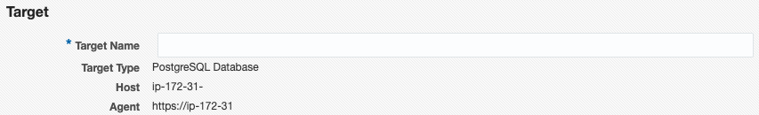

Enter Target Name

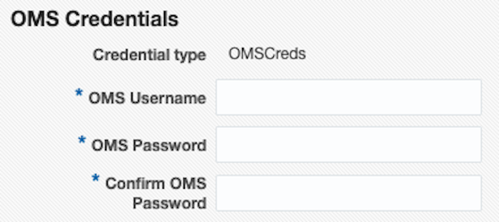

Enter Oracle Management Server Username and Password for Target Count Validation.

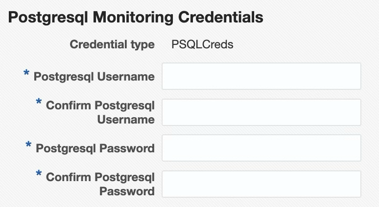

Enter Credentials for the PostgreSQL Target

#### Target Properties
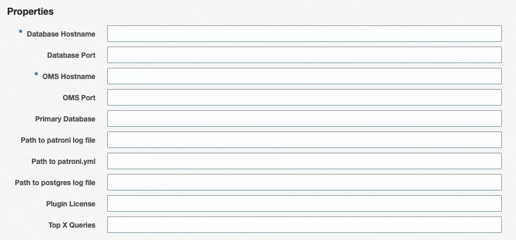

|    Target Property        |    Description                                                                                    |
| :------------------------ | :------------------------------------------------------------------------------------------------ |
| Database Hostname         | Host name of PostgreSQL server                                                                    |
| Database Port             | PostgreSQL port number (default is `5432`)                                                        |
| OMS Hostname              | Login name of Oracle Management Server (for agent service validation)                             |
| OMS Port                  | OMS HTTPS Console Port (default is `7803`, used for target count validation)                      |
| Primary Database          | The plugin requires a “primary” database to connect to (default is ‘postgres’)                    |
| Path to patroni log file  | Fully qualified path to patroni log file                                                          |
| Path to postgres log file | Fully qualified path to postgres log file                                                         |
| Path to patroni.yml       | Fully qualified path to patroni.yml file                                                          |
| Plugin License            | Enter Plugin License here                                                                         |
| Top X Queries             | Limits the number of rows returned for the SQL Statement metric groups, ordered by execution time |

**Note:** The “primary” database is the only location SQL statements statistics are collected from, since any location `pg_stat_statements` is queried from will return data about statements run in all databases. 

**Warning:** Ensure `pg_stat_statements` is viewable from the “primary” database, otherwise no query statistics will be collected. 

\*\* If no plugin license is entered, the plugin will have a PostgreSQL instance limit of 2 with no expiration date.  [To purchase plugin licenses](https://app.hubspot.com/payments/purchase/hscs_8AXvUKjLuB9sCE8vyB4UcOzfhPKMKHNZYGREjd5rpTnmAoGuSdl2K0Ic9s3nCI7C).  [To request a trial license](https://integrationplumbers.io/request-trial-for-oracle-em-plugin-for-postgresql-database)

#### Add targets for PostgreSQL cluster
After adding the individual targets that make up the cluster, from Oracle Enterprise Manager, navigate to Setup → Add Target → Add Targets Manually.

Select the Host that whose OMA the Plug-in has been deployed to, and choose the PostgreSQL Cluster target type. Click Add.

#### Target Properties
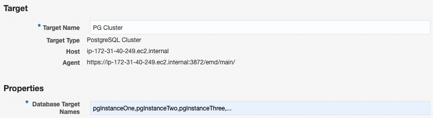

| Target Property  | Description |
| :---- | :---- |
| Database Target Names  | Comma-separated list, without spaces, of previously added PostgreSQL Database target names. |

## Monitoring Features
The Oracle Enterprise Manager Plugin for PostgreSQL provides monitoring of nearly 200 key metrics for a PostgreSQL instance. Thresholds and metric history are available for each PostgreSQL instance, as well as advanced custom views of the instance and individual databases. These views present large amounts of complex data in an easy-to-consume manner. Allowing the user to quickly identify database performance and configuration issues. 

### Overview
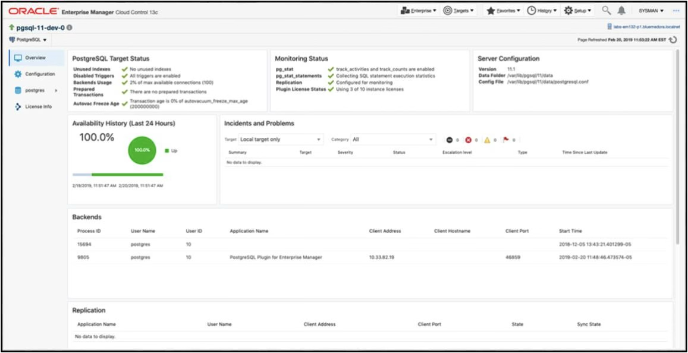

This page provides insight into the overall health of the databases on the server:
- Target Status
- Monitoring Status
- Incidents
- Backends
- Replication
- Background Writer

### Configuration
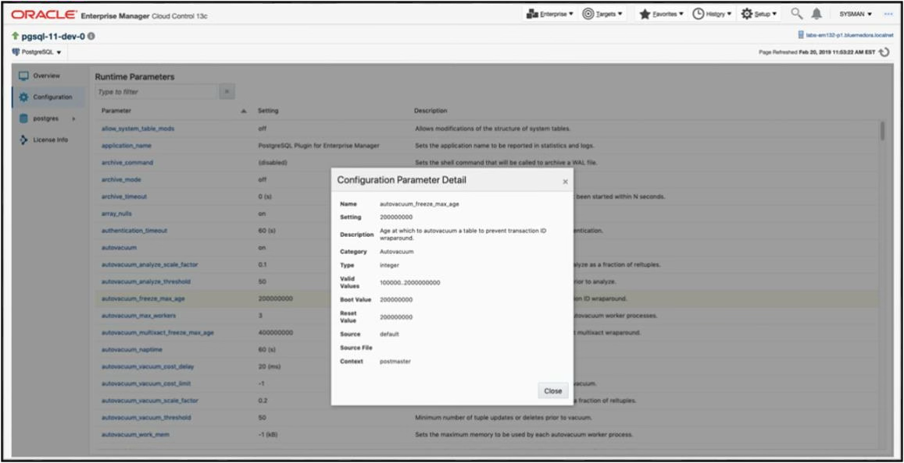
This page provides insight into the current configurations of the database, including current, next boot, and reset values. 

### Database
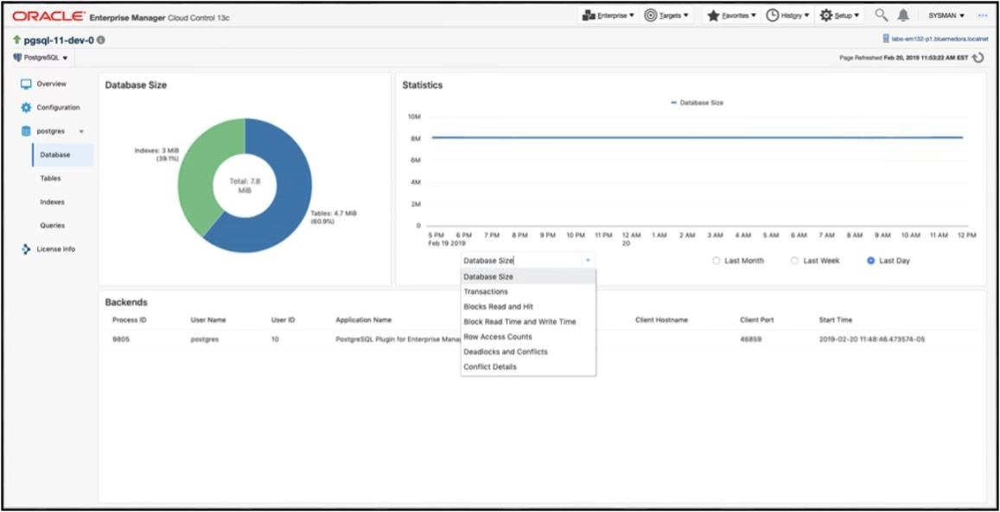
The Database page provides a per-database view of connected backends, database growth, deadlocks as well as other useful metrics. 

### Tables
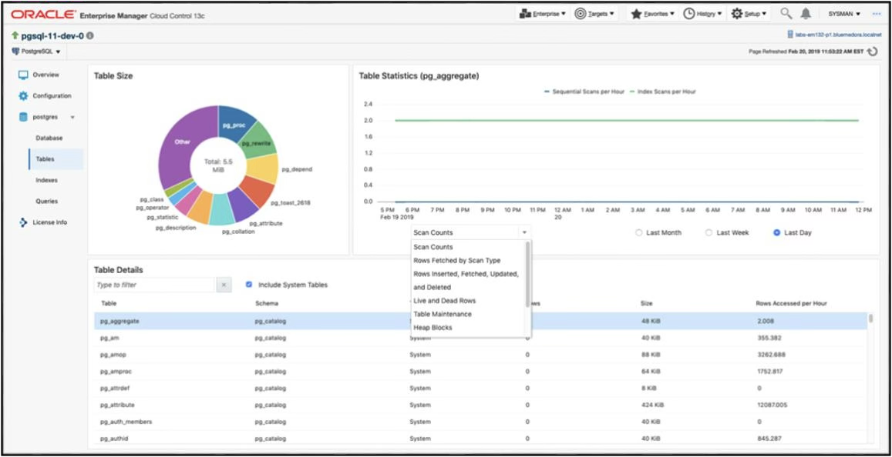
The Tables page provides details on tables within a specific database. A breakdown of table size is given as well as top table metrics and graphs specific to the tables you are interested in.

### Indexes
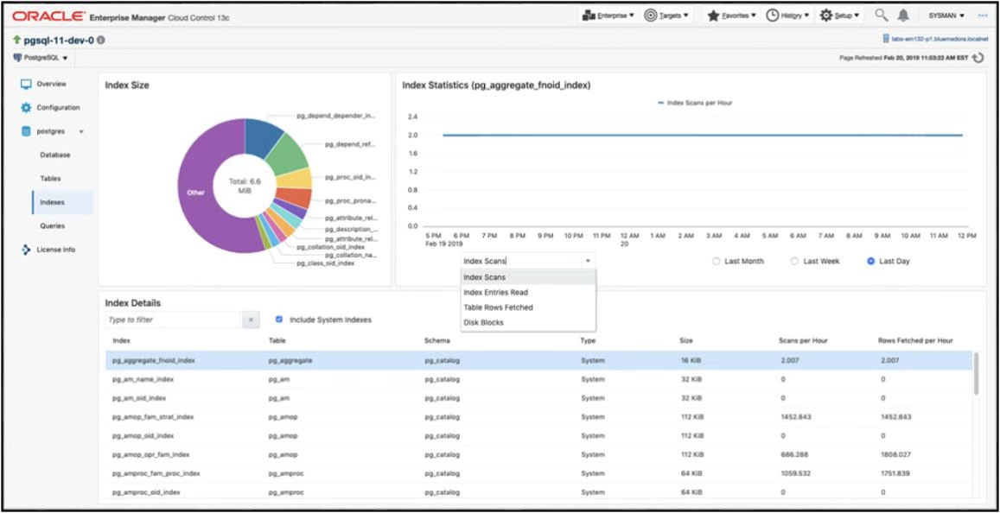
The Indexes page provides details about indexes within a specific database and their size. Quickly being able to find and observe metric history for an index is one of the main features of this page. 

### Queries
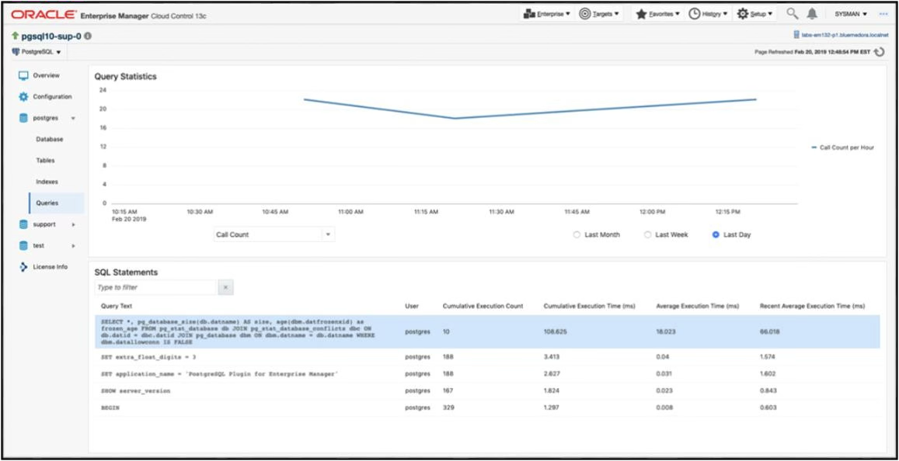
The Queries page provides insight into a query’s current and historical performance.

### Query Analyzer
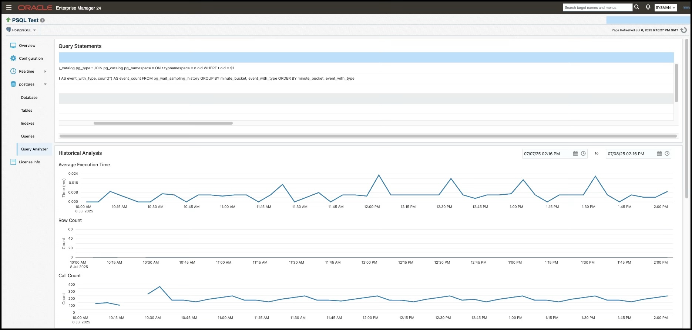

The Query Analyzer feature lets users input and analyze queries against their PostgreSQL database, providing execution plans and performance metrics. It visualizes details like wait events and explain-plans to help optimize and troubleshoot performance, and includes an interface to view historical query data.

To enable this feature, [**Preferred Credentials**](https://docs.oracle.com/en/enterprise-manager/cloud-control/enterprise-manager-cloud-control/24.1/emsec/configuring-and-using-target-credentials.html#GUID-227C95BE-8B27-43B3-A553-0F2582C43A3D:~:text=SUDO%3BRUNAS%3Aroot%22-,Preferred%20Credentials,-Preferred%20credentials%20are) must be set for the PostgreSQL target- these credentials are used to execute and analyze the queries. The "Wait Events" table in the database instance's "Query Analyzer" page relies on the `pg_wait_sampling` extension to function. The `pg_wait_sampling.profile_queries` enum attribute must be set to "all" or "top". This extension is not included in most PostgreSQL distributions and is not available for Windows platforms, but can be installed through most package managers.

When using the Explain Plan feature, you may notice that queries displayed in the query list often contain parameter placeholders (such as $1, $2, etc.). These placeholders represent bound parameters from the original query execution and need to be replaced with actual values before the query can be analyzed. For example, a query like `SELECT * FROM users WHERE id = $1` should be modified to `SELECT * FROM users WHERE id = 123` with an appropriate value for the parameter.

Important Note: The Explain Plan feature will actually execute your modified query against the database to generate accurate execution statistics. For example, running an Explain Plan for the query `SELECT * FROM some_table` will run `EXPLAIN(ANALYZE, FORMAT JSON) SELECT * FROM some_table`. Also note that running Explain Plans on Explain Plan-queries is not supported. While any data modifications (`INSERT`, `UPDATE`, `DELETE`) are automatically rolled back and won't persist, the query does temporarily acquire locks and consume database resources during execution. Therefore, it's recommended to use test data or values that represent typical query parameters, and avoid running explain plans on queries that could have significant performance impact or lock contention with other database operations.

## Real-time Metrics

### Blocking Sessions and Wait Locks
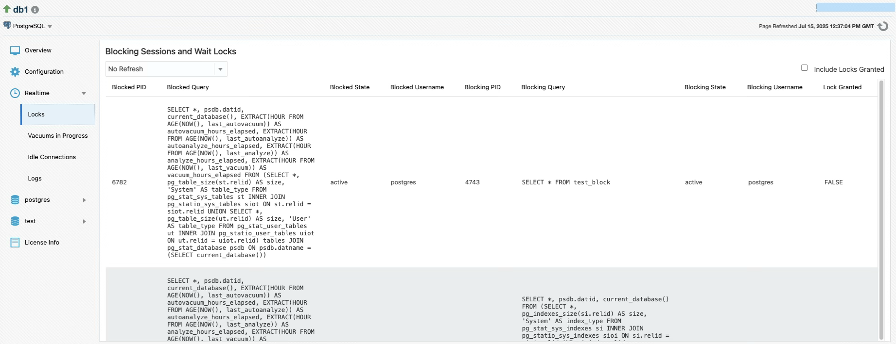
The PostgreSQL plugin's real-time blocking session metric feature provides live monitoring of database locks and blocked queries by collecting data on-demand when users visit the "Blocking Sessions and Wait Locks" page. Unlike scheduled metrics, this real-time feature uses configurable polling intervals (15 seconds to 1 minute) to continuously refresh the UI and display active blocking relationships between database sessions, showing both the blocked queries waiting for locks and the sessions holding those locks.

### Vacuums in Progress
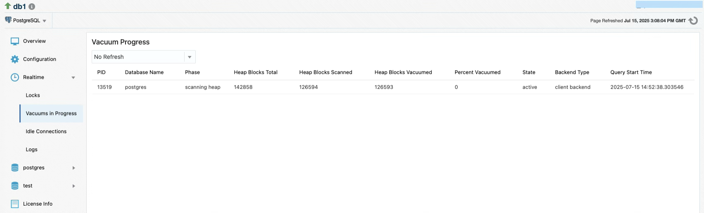
The real-time vacuum progress metric feature displays detailed progress information through columns including PID (process ID), Phase (current vacuum stage), Heap Blocks Total/Scanned/Vacuumed (block processing counts), Percent Vacuumed (completion percentage), State (process state), and Query Start Time (when the vacuum began), allowing administrators to monitor active VACUUM operations in real-time with configurable polling intervals.

### Logs
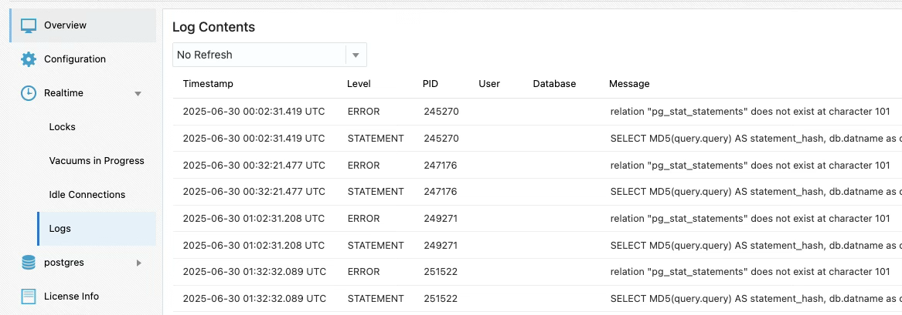
The PostgreSQL plugin now includes an optional log monitoring feature. It allows users to monitor PostgreSQL server log files for important events, configure alerts, and view recent log entries directly from the UI. This page allows the user to view the last 500 lines of the configured log file in real-time. There is also a corresponding Log Stats metric group that includes the following delta metrics: Error Count, Fatal Count, Panic Count, Warning Count, Line Count (total lines read).

This feature is supported only when the OEM agent is **local** (i.e., installed on the same host as the PostgreSQL server). It does not support remote log collection. 

### Setup Instructions
1. Enable logging in PostgreSQL
   PostgreSQL does not log to a file by default. The user must:    
    - Set `log_directory` and `log_filename` appropriately and set `logging_collector=on` in their `postgresql.conf` file
    - Reload or restart PostgreSQL
    - Verify the OMA user has permissions set to read the log file.

2. Configure log file path in the plugin
    - On the Target Configuration page, enter the full path to the PostgreSQL log file in the PostgreSQL Log File field.
    - This path must point to an accessible file on the same host as the agent.
    - Remote monitoring is not supported.

### Idle Connections
The PostgreSQL plugin includes support for identifying and managing idle database connections, which can be useful for performance tuning and resource control. This feature includes both a real-time metric and a job that allows idle connections to be terminated from the OEM interface.

The real-time metric displays currently idle PostgreSQL sessions:
- **PID**: Process ID of the connection
- **State**: Connection state (e.g., `idle`, `idle in transaction`)
- **Username**: PostgreSQL user owning the connection
- **Idle**: How long the connection has been idle, in seconds
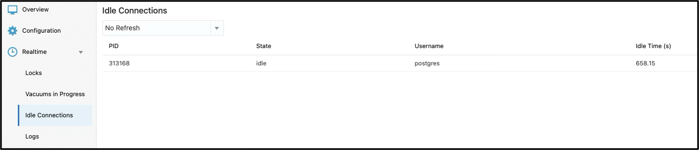

### Kill Idle Connections Job
This job allows users to terminate idle PostgreSQL connections directly from OEM. It is useful for clearing stale sessions that may block resources.

### Create Job
1. Choose Enterprise > Job > Activity > Create Job > Kill Idle PostgreSQL Connections.	
2. Link the target to run the job against and provide a meaningful job name.
3. Configure parameters
	- Database Name – The name of the PostgreSQL database
	- Host/IP Address – Hostname or IP of the PostgreSQL server.
	- Absolute path to [.pgpass file](https://www.postgresql.org/docs/current/libpq-pgpass.html) file containing the necessary connection credentials.
4. Configure Credentials
	- PostgreSQL Credentials – The role used must have permission to terminate connections (`pg_terminate_backend`), which requires superuser privileges.
	- Agent Host Credentials – Host credentials for the machine where the OEM agent is installed. The user must be able to execute the job and read the `.pgpass` file.

### Notes
- The job only terminates sessions that are in the `idle` or `idle in transaction` states.
- Connections belonging to the current user running the job or the PostgreSQL system process (`pg_backend_pid()`) will not be terminated.
- The job must be executed on a local agent where `psql` is installed and accessible in the system `PATH`.

## Creating a Custom Query With a Metric Extension

The plugin supports the Metric Extension feature in Oracle. This allows you to define your own metric collections from a custom defined query that will be executed against the target database. When creating the Metric Extension an Adapter of type **OS Command - Multiple Columns** must be selected and configured.

### Configuring the "OS Command - Multiple Columns" Adapter

#### Basic Properties:

**Command:** `%perlBin%/perl`

**Script:** `<AGENT_BASE>/agent_<AGENT_VERSION>/plugins/ip.em.xpgs.agent.plugin_<PLUGIN_VERSION>/scripts/run_custom_query.pl`

You must replace `<AGENT_BASE>`, `<AGENT_VERSION>`, and `<PLUGIN_VERSION>` with their actual values in the path.
This path structure can vary in different OEM environments. If your structure is different, search for the file `run_custom_query.pl` from your `$ORACLE_HOME` directory.

**Arguments:** `Leave this field blank`
**Delimiter:** `|`
**Starts With:** `em_result=`

#### Advanced Properties:

##### Input Properties:

**USERNAME:** `username`

> This should be the literal string "username" and not the actual username that connects to the database
> In some environments this field will already be present with the string value "username" and should not be altered.

**PASSWORD:** `password`

> This should be the literal string "password" and not the actual password that connects to the database
> In some environments this field will already be present with the string value "password" and should not be altered.

##### Environment Variables:

**TARGET_CONFIG:** `port=%port%,host=%host%,primarydb=%primarydb%,guid=%guid%,license=%license%,displayname=%DISPLAY_NAME%`

> Do not replace any of the vars which are enclosed in percent symbols with their hardcoded values

**QUERY:** Enter the custom query that you want to run against your target database. Please note that only single query execution is supported.

**COLUMNS:** Enter the columns to be retrieved as a comma delimited list without whitespace and without quotes. The order specified will become the order in which they are returned.

**PLUGIN\_SCRIPTS\_DIR:** `<AGENT_BASE>/agent_<AGENT_VERSION>/plugins/ip.em.xpgs.agent.plugin_<PLUGIN_VERSION>/scripts`

> You must replace `<AGENT_BASE>`, `<AGENT_VERSION>`, and `<PLUGIN_VERSION>` with their actual values in the path.
> This is the same path where you uploaded `run_custom_query.pl` from when configuring the "Basic Properties" section.

**LOG4J_CONFIGURATION_FILE:** This value should already be present and should not be altered

**Upload Custom Files:**

This table should automatically be populated after you selected the script when configuring the "Basic Properties". If it did not populate automatically then you must manually upload the script here.

The remaining steps of developing the Metric Extension will depend on the custom setup that you are implementing. Remember to confirm the output of your metric extension via test execution prior to saving it.

### Patroni Cluster Switchover
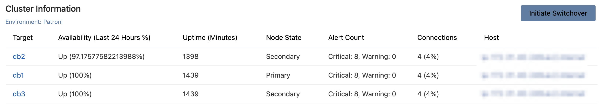
The PostgreSQL plugin now includes support for initiating Patroni cluster switchovers directly from the OEM interface. This feature allows database administrators to perform controlled failover operations on Patroni-managed PostgreSQL clusters without requiring direct access to the Patroni API or command-line tools. The switchover functionality is automatically detected and enabled only for clusters that are identified as Patroni-managed environments, ensuring that the feature is only available when appropriate.

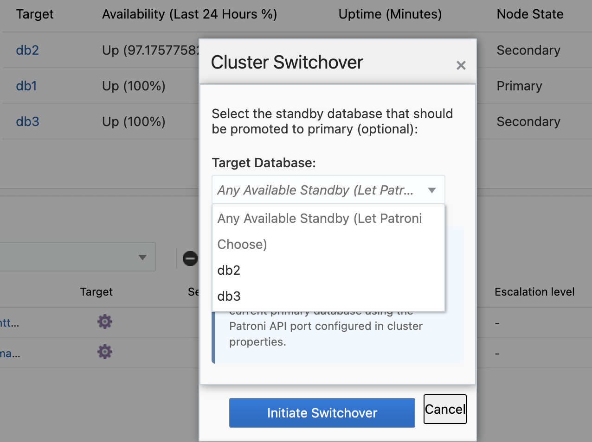
When a Patroni cluster is detected, administrators can select any non-leader target database from the available cluster members and initiate a switchover operation through an intuitive dialog interface. The system automatically handles the communication with the Patroni REST API, including leader identification, and attempts to use the user-selected target as the candidate for the switchover operation. For non-Patroni clusters, the switchover button is automatically disabled with a clear message indicating that the feature is only available for Patroni environments.

## Changelog

**13.5.9.0.0**
- Added historical visualization of wait events
- Added support for custom queries via Metric Extensions (BETA)
- Added job to kill idle connections
- Added UI button to trigger a switchover of a patroni cluster
- Bug fixes

**13.2.8.3.0**
- Added support for PG 17
- Added Realtime metric pages for Logs and Idle Connections
- Added Job to kill idle connections
- Added Query Analyzer UI page
- Added Log Stats metric group
- Bug fixes

**13.2.8.2.0**
- Fixed compatibility issues with newer versions of OEM

**13.2.8.1.0**
- Added OMS host + credentials to test connection
- updated PG JDBC driver

**13.2.8.0.0**
- Updated licensing

**13.2.7.7.0**
- Fixed heap memory issue from excessive query returns
- Fixed parsing issue in patroni collections

**13.2.7.6.0**
- Fixed multiple jruby dependencies   

**13.2.7.5.0**
- Fixed bug in collecting patroni metrics   

**13.2.7.4.0**
- Added metrics for patroni logs

**13.2.7.3.0**
- Stability added to new metrics   

**13.2.7.2.0**
- Bug fixes   

**13.2.7.1.0**
- Bug fixes   

**13.2.7.0.0**
- Cluster target / dashboard 
- Queries update   
- Backup & Restore jobs added   
- New Metrics   
- Autodiscovery   
- Replication Metrics added   

**13.2.6.0.0**
- Support added for PG 15   

**13.2.5.1.0**
- Compile with Java 8 

**13.2.5.0.0**
- Support added for PG 9 

**13.2.4.0.0**
- PG 13 & 14 Support added
- Compile with Java 7

**13.2.3.0.0**
- PostgreSQL 12 support   

**13.2.2.0.0**
- Fixed issues running Java on certain system configurations   
- Fixed unused indexes count displayed on Overview page

**13.2.1.0.0**
- Enterprise Manager 13.3 support 
- PostgreSQL 11 support   
- New HTML/JavaScript user interface   
- Threshold configurations for more metrics   
- Individual collection schedules for each metric group   
- Security updates