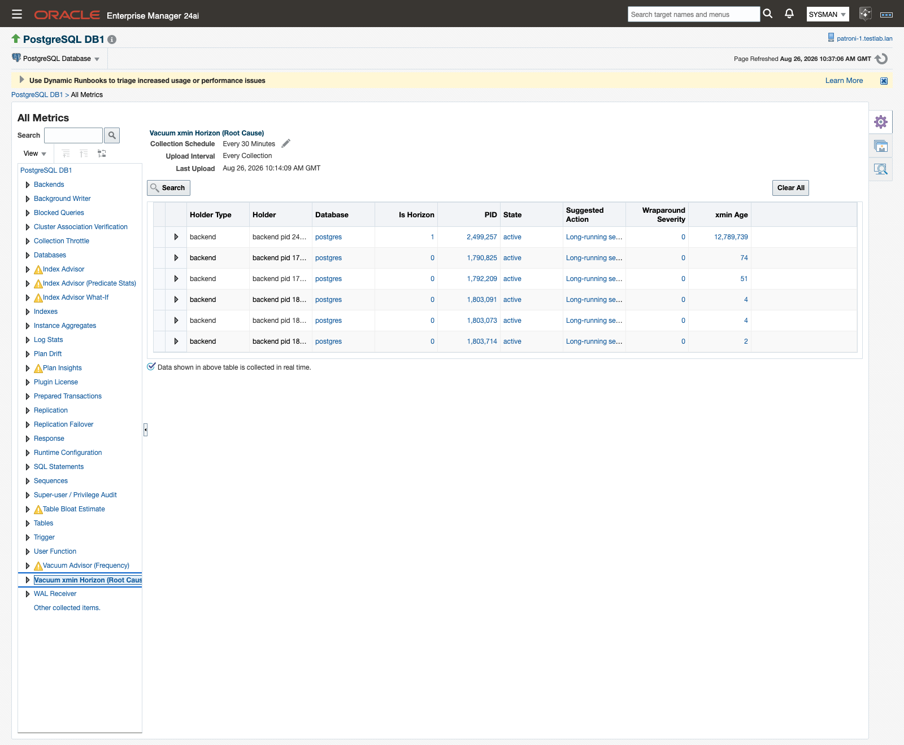
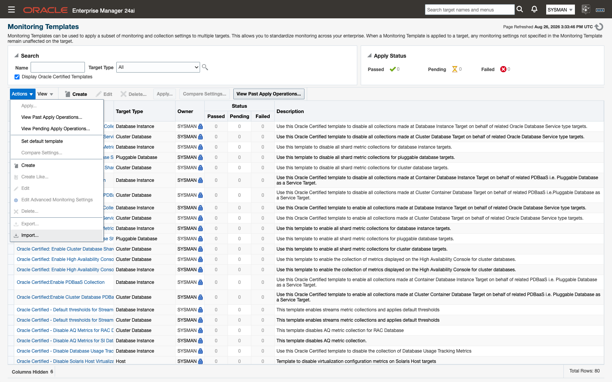
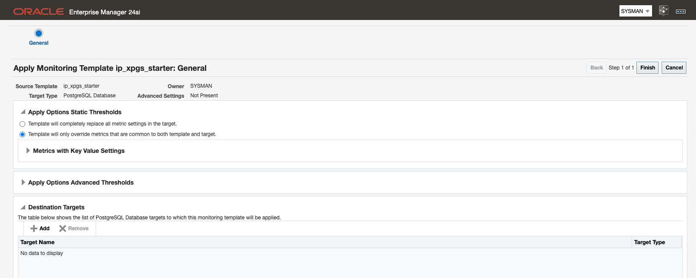

# Alerts and templates

If you would rather be told about a plan regression or a wraparound risk than go looking for one, you do not have to build anything. Every advisor finding in the PostgreSQL plug-in also publishes as a standard Oracle Enterprise Manager metric on the target, with editable schedules, tunable thresholds, alert history, and routing through whatever notification connector you already have bound. Thresholds ship pre-set where a safe default exists; three importable monitoring templates apply a curated set to one target or a whole group.

> **Prerequisites for this page**
> - A deployed plug-in and at least one PostgreSQL Database target — see [Add a PostgreSQL Database target](targets-and-properties.md#add-database-target).
> - Plan capture populating, for the `plan_drifts` and `plan_insights` metrics — see [Plan capture (auto_explain)](prerequisites.md#auto-explain).
> - The matching extension for each extension-gated metric — see [Optional extensions](prerequisites.md#optional-extensions).
> - An Enterprise Manager administrator with `emcli` or console access to Monitoring Templates — see [Enterprise Manager and agents](prerequisites.md#enterprise-manager).

**Where to find it:** metric values on the target under **Target menu → Monitoring → All Metrics**; thresholds and schedules under **Target menu → Monitoring → Metric and Collection Settings**; templates under **Enterprise → Monitoring → Monitoring Templates**.

**In this page:** How findings become alerts · Default thresholds for the new metrics · Tuning thresholds · Monitoring templates · Super-user / Privilege Audit

## How findings become alerts

The advisor pages are for investigating. The metrics are for being told. Both read the same collections, so nothing has to be enabled twice.

1. A collection runs on its schedule and emits one row per finding onto the target.
2. Enterprise Manager compares the alerting column in each row against that metric's Warning and Critical thresholds.
3. When a threshold is crossed for the required number of consecutive collections, Enterprise Manager opens an incident, exactly as it does for any other target type.
4. The incident routes through your existing notification framework and connectors, such as ServiceNow or email.
5. At the next collection after the finding resolves, the metric stops emitting the row and the alert clears itself. You never close these by hand.

The plug-in adds no alerting pipeline of its own, and no plug-in-specific setup stands between a finding and a ticket.

Alert messages carry the object and the fix. An **Index Advisor** alert names the detection category, the database, schema, table and index, and the detail; a **Vacuum Advisor** alert names the table, its dead-tuple count, its autovacuum trigger point and the recommended `ALTER TABLE` statement. Those recommendations are review-and-run SQL: you read them, decide, and run them in your own tooling. The plug-in never applies a recommendation.

Two clears are worth knowing about:

- A **Plan Drift Advisor** alert clears when the query returns to an accepted baseline plan. Accepting the new plan in Baseline Management is a valid resolution and clears the alert the same way.
- An **Index Advisor** alert clears when the index is created or dropped and the finding disappears from the next collection. The clear event is your verification that the fix worked.

## Default thresholds for the new metrics {#default-thresholds}

Most of the plug-in's thresholds ship undefined on purpose: the right number for a dead-tuple count or a super-user roster is site policy, not a product decision. Wraparound and the advisory severities are the exceptions, because a safe default exists for them.

| Metric | Internal name | Collected | Default Warning | Default Critical | Occurrences | Clears when |
|---|---|---|---|---|---|---|
| Index Advisor | `index_advisor` / `severity` | Every 30 minutes | Severity is `HIGH` | Not set | 1 | The finding drops out of the next collection. |
| Index Advisor What-If | `index_advisor_whatif` / `speedup` | Every 30 minutes | Estimated Speedup greater than 10 | Not set | 1 | Estimated speedup falls to 10 or below. |
| Index Advisor (Predicate Stats) | `index_advisor_qualstats` / `severity` | Every 30 minutes | Severity is `HIGH` | Not set | 1 | The predicate candidate drops out of the next collection. |
| Vacuum Advisor (Frequency) | `vacuum_advisor` / `severity` | Every 30 minutes | Severity is `HIGH` | Not set | 1 | Dead tuples fall back under the table's autovacuum trigger point. |
| Table Bloat Estimate | `table_bloat` / `severity` | Every 30 minutes | Severity is `HIGH` | Not set | 1 | Severity falls below `HIGH` on the next collection. |
| Vacuum xmin Horizon (Root Cause) | `xmin_horizon` / `severity` | Every 30 minutes | Wraparound Severity 1 or higher | Wraparound Severity 2 or higher | 2 | The holder is gone from the next collection. |
| Databases · Transaction Unfrozen Age | `databases` / `transaction_age` | Every 30 minutes | 1,000,000,000 or higher | 1,500,000,000 or higher | 2 | Age returns below the warning value. |
| Databases · Multixact Unfrozen Age | `databases` / `multixact_age` | Every 30 minutes | 1,000,000,000 or higher | 1,500,000,000 or higher | 2 | Age returns below the warning value. |
| Tables · Table Unfrozen XID Age | `tables` / `table_xid_age` | Every 30 minutes | 1,000,000,000 or higher | 1,500,000,000 or higher | 2 | Age returns below the warning value. |
| Tables · Table Unfrozen Multixact Age | `tables` / `table_multixact_age` | Every 30 minutes | 1,000,000,000 or higher | 1,500,000,000 or higher | 2 | Age returns below the warning value. |
| Plan Drift | `plan_drifts` / `drift_severity` | Every 15 minutes | Drift Severity matches `PLAN_CHANGED` | Not set | 1 | The query runs on an accepted baseline plan again. |
| Plan Insights | `plan_insights` / `severity` | Every 15 minutes | Severity is `HIGH` | Not set | 1 | The insight resolves and drops out of the feed. |
| Super-user / Privilege Audit | `superuser_audit` / `superuser_count` | Every 30 minutes | Not set — enter your sanctioned count | Not set | 1 | The count returns to your warning value or below. |
| Wait Events Sampled | `wait_events_sampled` | Every 15 minutes | None | None | — | No shipped alert. |
| Collection Throttle | `collection_throttle` | Every 5 minutes | None | None | — | No shipped alert. |
| Historical Collection Trim | `trim_historical_collections` | Every 24 hours | None | None | — | No shipped alert. |

Reading the table:

- **Not set** means the metric ships with an alert condition attached but no threshold value in it. The collection still runs and the rows still appear in All Metrics and on the advisor page; nothing alerts until you enter a value or apply a template that carries one.
- **None** means the metric ships with no alert condition at all. These three are collected for history and diagnostics, not for paging.
- Severity on the advisor metrics is a string: `HIGH`, `MEDIUM` or `LOW`. Wraparound Severity on `xmin_horizon` is a number, banded at 1 billion transaction IDs (severity 1) and 1.5 billion (severity 2).
- The two-occurrence rule on the wraparound and xmin-horizon metrics is deliberate debouncing. A single collection that catches a legitimate long batch job does not page anyone; a holder that is still there at the next collection, 30 minutes after the first breach, does.
- Cost Drift is advisory by default. The shipped Plan Drift condition matches `PLAN_CHANGED` only, so a query whose plan shape is unchanged but whose estimated cost moved does not raise an incident. To be alerted on it, add a Warning threshold on the **Plan Drift** metric's `drift_severity` column for the query keys you care about (see [Tuning thresholds](#tuning-thresholds)); Drift Configuration on **Plan Drift Advisor** changes how captures are classified, not whether they alert.
- Four metrics emit rows only where their extension is present: `index_advisor_whatif` needs hypopg, `index_advisor_qualstats` needs pg_qualstats, `table_bloat` needs pgstattuple, and `wait_events_sampled` needs pg_wait_sampling. Without the extension the metric returns zero rows, which is a healthy state, not an error, and nothing alerts. The **Monitoring Readiness** page tells you which extension is missing.
- Multixact wraparound is tracked and alerted separately from transaction-ID wraparound, at both database and table grain.

## Tuning thresholds {#tuning-thresholds}

Threshold edits made this way apply to one target. Use a monitoring template when you want the same numbers across a fleet.

1. From the target home page, choose **Target menu → Monitoring → Metric and Collection Settings**.
2. Set the **View** list to **All metrics** so the advisory metrics are included.
3. Find the metric and the column you want, for example **Vacuum xmin Horizon (Root Cause)** and its **Wraparound Severity** column.
4. Enter values in **Warning Threshold** and **Critical Threshold**. Leave a field empty to switch that level off.
5. Set **Number of Occurrences** to the number of consecutive collections that must breach before an incident opens.
6. To change how often the metric runs, click the metric's **Collection Schedule** link and set a new interval.
7. Click **OK** to save.



*Warning and Critical thresholds for the Vacuum xmin Horizon (Root Cause) metric, with Number of Occurrences set to 2.*

Two things to keep in mind. Collection schedules and thresholds are independent: lowering a threshold does not make the metric collect more often, and pausing alerting does not stop the history from accumulating in the agent-local store. And a metric whose threshold you clear keeps collecting, so the advisor page and the **Retention Policies** history stay populated either way.

## Monitoring templates {#templates}

Three pre-built Enterprise Manager monitoring templates cover the plug-in's metrics for the `ip_postgresql_db` target type. They ship in the standard OEM export format, the same shape `emcli export_template` produces, so they behave like any template you built yourself.

| Template name | File | Purpose |
|---|---|---|
| `ip_xpgs_tier01_critical` | `ip_xpgs_tier01_critical.template.xml` | Critical production. "Critical-production baseline: all safety-critical and advisory metrics on a 15-minute schedule with tight thresholds (wraparound, privilege drift, index/vacuum/bloat advisories)." |
| `ip_xpgs_tier23_standard` | `ip_xpgs_tier23_standard.template.xml` | Dev, test and staging. "Standard baseline for dev/test/staging PostgreSQL databases: core health on a 15-minute schedule with loosened wraparound/connection thresholds; advisory metrics collected store-only on a 1-hour schedule (no paging)." |
| `ip_xpgs_starter` | `ip_xpgs_starter.template.xml` | A starter to extend. "Minimal starter monitoring template for PostgreSQL databases: availability plus core database health, ready to clone and extend into your own site standard." |

After import, the console lists each template under its template name, and that same name is what you pass to `emcli apply_template`.
<!-- CONFIRM: verify in the console after import -->

Monitoring templates live in the Enterprise Manager repository rather than in agent or OMS plug-in metadata, so they are not part of the plug-in deployment itself: an administrator imports them into the OMS once, then applies them to targets.
<!-- CONFIRM: how template files are delivered to customers (download bundle / S3 link) -->

### Import and apply

```sh
# Import a template into the OMS repository
emcli import_template -files="ip_xpgs_tier01_critical.template.xml"

# Apply it to one or more database targets
emcli apply_template \
   -name="ip_xpgs_tier01_critical" \
   -targets="myprod_db:ip_postgresql_db" \
   -apply_mode=complete
```

In the console, go to **Enterprise → Monitoring → Monitoring Templates → Import**, then select the template and choose **Actions → Apply**.



*Importing a shipped template into the OMS repository.*



*Applying the imported template to a target, using apply mode Complete.*

Before you adopt `ip_xpgs_tier01_critical`, set the super-user count threshold. It ships with an empty warning threshold because the sanctioned super-user count is site policy, and an empty threshold never fires. Enter your approved roster size so the count-change alert reports privilege drift. See [Super-user / Privilege Audit](#superuser-audit) below.

### Build your own

The customer-built path is stock Enterprise Manager:

1. Tune thresholds on a reference target until they are right.
2. Choose **Create Monitoring Template → From a Target**, or clone `ip_xpgs_starter` and edit it.
3. Apply the result to a group rather than to individual targets, so new members inherit it.
4. Move templates between OMS instances with `emcli export_template` and `emcli import_template`.

Templates are versioned repository artifacts, so import them on the OMS version you actually run. After a template is applied, thresholds remain editable per target, and everything a template turns on routes through the same notification connectors as the shipped defaults.

## Super-user / Privilege Audit {#superuser-audit}

The `superuser_audit` metric tracks the target's super-user roster so that privilege drift becomes an alertable event rather than something you find during an audit. It is cluster-global, collects every 30 minutes, and carries the roster in its rows with the current total in the **Super-user Count** column.

The threshold on that column ships empty on purpose: only you know how many super-users your cluster is supposed to have. Until you set it, the metric collects the roster and alerts on nothing.

1. Decide the sanctioned super-user count for the target.
2. Set it as the Warning threshold on the **Super-user Count** column, either per target through **Metric and Collection Settings** or fleet-wide by editing `ip_xpgs_tier01_critical` before you apply it.
3. When the count rises above that number, Enterprise Manager raises a warning naming the count, the role, and the detail.
4. Review the role changes in your own tooling. The alert clears once the count is back at your threshold or below.

The condition compares greater-than, so a count equal to your sanctioned number does not alert.

## Related

- [Index Advisor](index-advisor.md) — the page behind the three index metrics, and where to copy the recommended SQL.
- [Vacuum Advisor](vacuum-advisor.md) — vacuum frequency, bloat, and the xmin-horizon holders behind the wraparound alerts.
- [Plan Drift Advisor](plan-drift-advisor.md) — how to respond to a Plan Drift alert, including accepting a new baseline.
- [Plan Analysis](plan-analysis.md) — how to respond to a Plan Insights alert.
- [Monitoring Readiness](monitoring-readiness.md) — which extensions are present, and therefore which metrics can emit rows.
- [History store and retention](history-store-and-retention.md) — the agent-local history that keeps accumulating whether or not a threshold is set.
