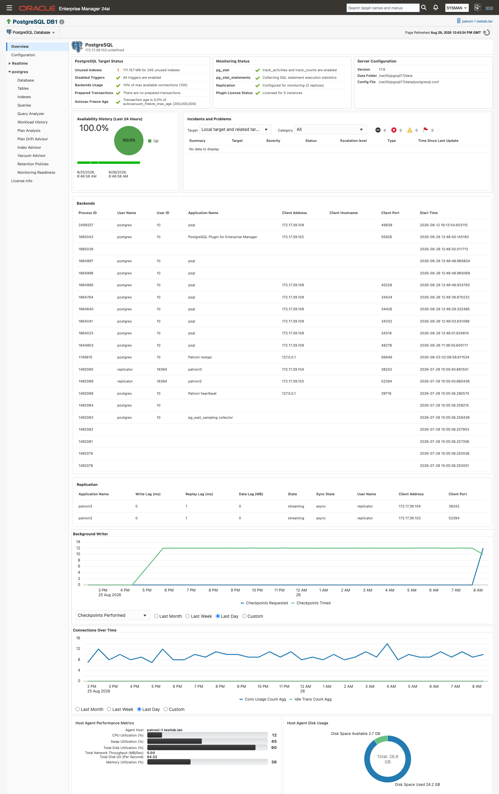

# Getting started

If you have not deployed the PostgreSQL plug-in before, this page is the whole path: six steps that take an empty Enterprise Manager to a console with real data in it. Steps 2 through 6 are console and `emcli` work. Step 1 is the one to plan around, because turning on `pg_stat_statements` needs a PostgreSQL restart. Each step says what to do and how you know it worked, then links to the page that carries the detail.

> **Prerequisites for this page**
> - OMS access that can import an OPAR and deploy plug-ins, for example `sysman` — see [Enterprise Manager and agents](prerequisites.md#enterprise-manager).
> - A superuser login on the PostgreSQL instance, for the monitoring role, the extensions, and [the one grant the plug-in never applies for you](prerequisites.md#log-read-grant).
> - A plug-in license key. To request a trial, visit the [trial page](https://integrationplumbers.io/postgresql-plugin/trial).

**Where to find it:** install and deployment under Setup ▸ Extensibility ▸ Plug-ins; the target under Setup ▸ Add Target ▸ Add Targets Manually; everything the plug-in shows you afterwards under the target's own navigation tree.

**In this page:** Before you start · Step 1: Prepare PostgreSQL · Step 2: Install the plug-in · Step 3: Add your first target · Step 4: Enter the license key · Step 5: Set Preferred Credentials · Step 6: Check Monitoring Readiness and configure auto_explain · What to expect · Next steps

## Before you start

This is the minimum for all existing monitoring. Work through the full list, including what the advisory features add, in [Prerequisites checklist](prerequisites.md#checklist).

- [ ] PostgreSQL 14-18, and Enterprise Manager 13.5.0.0.0+ or 24ai 24.1.0.0.0+. See [Supported versions and platforms](prerequisites.md#supported-versions).
- [ ] An agent host on Linux 64-bit or Windows 64-bit, with a network path to the database over JDBC, port 5432 by default. See [Network and connectivity](prerequisites.md#network).
- [ ] A decision on where that agent runs, local to the database or remote. See [Agent host](prerequisites.md#agent-host).
- [ ] A PostgreSQL monitoring role, with a matching `pg_hba.conf` entry for the agent host. See [The monitoring role](prerequisites.md#monitoring-role).
- [ ] `pg_stat_statements` preloaded and created in each monitored database. See [Statement statistics (pg_stat_statements)](prerequisites.md#pg-stat-statements).
- [ ] A valid license key.
- [ ] OEM Preferred Credentials set for the target. See [Preferred Credentials](prerequisites.md#preferred-credentials).
- [ ] Disk headroom on the agent host for the agent-local history store. See [Store size and disk reclaim](history-store-and-retention.md#store-size).

**Plan Analysis** and **Plan Drift Advisor** need more than this: the `auto_explain` module and one privilege grant. Step 6 covers both.

## Step 1: Prepare PostgreSQL

Create a PostgreSQL role for monitoring, grant it `pg_monitor`, and add a `pg_hba.conf` entry that lets it connect from the agent host. Then add `pg_stat_statements` to `shared_preload_libraries`, restart the server, and run `CREATE EXTENSION pg_stat_statements;` in every database you monitor. Extensions in PostgreSQL are per-database, so that create step repeats for each one. If you also want What-If index simulation, predicate-based index advice, wait-event sampling, or table bloat estimates, install `hypopg`, `pg_qualstats`, `pg_wait_sampling`, and `pgstattuple` in the same maintenance window. The plug-in detects extensions on every collection and never installs one.

**Done when** the monitoring role can connect to the database from the agent host, and `SELECT count(*) FROM pg_stat_statements;` returns a number in the database you intend to name as the primary.

Detail: [The monitoring role](prerequisites.md#monitoring-role) · [Statement statistics (pg_stat_statements)](prerequisites.md#pg-stat-statements) · [Optional extensions](prerequisites.md#optional-extensions).

## Step 2: Install the plug-in

Import the OPAR onto the OMS with `emcli import_update -file=<PATH_TO_FILE> -omslocal`, deploy it to the OMS, then deploy it to every agent that will monitor a PostgreSQL instance, in that order. Both deployments run from Setup ▸ Extensibility ▸ Plug-ins, Databases ▸ PostgreSQL, Actions ▸ Deploy On, or from the equivalent `emcli deploy_plugin_on_server` and `emcli deploy_plugin_on_agent` commands.

**Done when** `emcli get_plugin_deployment_status -plugin=ip.em.xpgs` reports the deployment complete for the OMS and for each agent, and the Plug-ins page lists PostgreSQL 13.5.15.0.0.

Detail: [Import the OPAR](install-and-upgrade.md#import) · [Deploy to the OMS](install-and-upgrade.md#deploy-oms) · [Deploy to agents](install-and-upgrade.md#deploy-agents).

## Step 3: Add your first target

Go to Setup ▸ Add Target ▸ Add Targets Manually, select the host running the agent you deployed to, choose the **PostgreSQL Database** target type, and click **Add**. You are then asked for the target name, the Oracle Management Server username and password used to validate the target count against your license, the PostgreSQL monitoring credentials, and the target properties. Set **Primary Database** to the database the plug-in connects to for statement statistics. `pg_stat_statements` reports statements from across the whole server whichever database you query it in, but it has to be viewable from the one you name here, or no query statistics are collected.

*Step 3 begins here, then works through the credential screens to the properties screen.*

**Done when** the target appears under All Targets and its status reads Up.

Detail: [Add a PostgreSQL Database target](targets-and-properties.md#add-database-target) · [Database target properties](targets-and-properties.md#database-properties).

## Step 4: Enter the license key

Your key goes in the `Plugin License` target property. Type it on the properties screen while you are adding the target, or set it afterwards under Target Setup ▸ Monitoring Configuration. Then open the target's **License Info** page, which shows the customer the license is issued to, its type, status, expiration date, the number of instances it covers, and the days remaining. With no key recognized, that table reads "No licenses configured". To request a trial key, visit the [trial page](https://integrationplumbers.io/postgresql-plugin/trial).

**Done when** **License Info** shows your license record with a current status and a positive Days Remaining.

Detail: [Database target properties](targets-and-properties.md#database-properties) · [Monitoring pages](monitoring-pages.md).

## Step 5: Set Preferred Credentials

Some pages read their data through Enterprise Manager jobs that run on the target's host rather than through the monitoring connection, and those jobs need OEM Preferred Credentials. Set them once per target under Setup, Security, Preferred Credentials. **Workload History**, **Plan Analysis**, **Plan Drift Advisor**, **Retention Policies**, the "Autovacuum runs · 24h" KPI on **Vacuum Advisor**, and the **Configure auto_explain** action on **Monitoring Readiness** all depend on them. Until they are set, each of those raises "Unable to run job. Verify Preferred Credentials are set for this target."

**Done when** opening **Workload History** on the target returns a page instead of that message. If you see it later on any other page, the fix is the same one.

Detail: [Preferred Credentials](prerequisites.md#preferred-credentials) · [Unable to run job](troubleshooting.md#unable-to-run-job).

## Step 6: Check Monitoring Readiness and configure auto_explain

Open **Monitoring Readiness** on the target. It probes the live server once at page load and reports seven panels, one per feature, each showing the value in effect next to the value the feature needs. Work down the panels and fix what is red. Where the **Plan Capture (auto_explain)** panel has an unmet item the plug-in can set itself, a **Configure auto_explain** button appears at the bottom of that panel: click it, read the preview of exactly what will be written, then click **Apply**. The preview writes back the capture threshold already in effect on the server, falling back to `1000` ms when `auto_explain.log_min_duration` is absent or set to `-1`.

Three things stay with you. Install the `auto_explain` contrib module on the database server, because the plug-in configures the module but never installs it. Run `GRANT pg_read_server_files TO "<monitoring role>";` as a superuser, which is the one privilege the plug-in deliberately never grants itself; the panel shows the statement with your role name already filled in. And set `logging_collector = on`, `log_destination = stderr`, and a `log_line_prefix` that begins with `%m`, which the harvester needs in order to parse the log at all.

*Monitoring Readiness reads live server values, so a database you configured yourself shows green exactly like one configured from this page.*

**Done when** the **Plan Capture (auto_explain)** panel carries an OK chip. The **Configure auto_explain** button disappears as soon as every item the plug-in can set is green, but the panel stays **Not functional** until `pg_read_server_files` is granted as well, because that item is not one the plug-in will set. Applied settings take effect for new sessions only, so a connection-pooled application starts producing captures when its pool recycles.

Detail: [Configure auto_explain](monitoring-readiness.md#configure-auto-explain) · [The server log read grant](prerequisites.md#log-read-grant).

## What to expect

Some pages have content the moment you open them. Others compute against history, and history accumulates only at the rate the collections run.

| When | What fills in |
|---|---|
| **Day 1** | **Overview** populates as its metric groups collect: target status within 5 minutes, the Replication region within 10, and the Backends and Background Writer regions within 30. **Index Advisor** and **Vacuum Advisor** each collect once when the page loads, so neither waits for history to accumulate. Captured plans start arriving once a statement runs longer than your `auto_explain.log_min_duration` threshold and the next capture cycle harvests it, roughly 15 minutes. Until then **Plan Analysis** reads "No captured plans yet. Enable auto_explain (log_min_duration >= 0, log_format = json, log_analyze = on) to populate this panel." |
| **Day 2** | The **Autovacuum runs · 24h** KPI on **Vacuum Advisor** turns from "—" into a number. It deltas two daily snapshots of PostgreSQL's lifetime `autovacuum_count`, so until the second one lands its tooltip reads "Accumulating: needs two daily snapshots to compute a delta". The XID Consumption panel on the same page snapshots daily too. |
| **Week 1** | **Workload History** compares your chosen window against the equal-length window immediately before it, so **Workload vs prior window** reads "Accumulating" until the prior equal-length window holds any snapshots. Plan-drift baselines build over the same period. Baseline mode ships as **Manual**, observed plan shapes accumulate as `candidate` rows on their own, and the accepted set grows only as you accept them in Baseline Management. |

*A populated console on day 1: target status, incidents, and the live Backends and Replication regions.*

An empty advisor section is usually the healthy answer rather than a fault. A clean catalog produces no index findings, and a section that depends on an extension you have not installed is simply empty. When a page stays empty and you expected data, **Monitoring Readiness** names the missing prerequisite.

## Next steps

- **Apply a monitoring template.** Three templates ship for the `ip_postgresql_db` target type: `ip_xpgs_tier01_critical` for critical production, `ip_xpgs_tier23_standard` for dev, test, and staging, and `ip_xpgs_starter` as a minimal base to clone and extend. An administrator imports them into the OMS once, then applies them to targets. See [Monitoring templates](alerts-and-templates.md#templates).
- **Set the super-user count threshold.** The `superuser_audit` metric ships with an empty warning threshold, because the sanctioned super-user count is site policy, and an empty threshold never fires. Enter your approved roster size before you adopt `ip_xpgs_tier01_critical`, so privilege drift becomes an alert instead of an audit finding. See [Super-user / Privilege Audit](alerts-and-templates.md#superuser-audit).
- **Review retention.** Twelve history types each have their own retention window, plus a protected minimum and a whole-store size ceiling that ships disabled. The defaults suit most targets; change them before the store grows rather than after. See [Retention Policies page](history-store-and-retention.md#retention-policies).
- **Add a cluster target** if the instance belongs to a Patroni-managed cluster, so replication and failover are visible in one place. See [Add a PostgreSQL Cluster target](targets-and-properties.md#add-cluster-target).

## Related

- [Trial setup](trial.md) — the shorter path when you are evaluating the plug-in on a trial key
- [Prerequisites](prerequisites.md#checklist) — the full checklist behind every step here
- [Install and upgrade](install-and-upgrade.md#import) — import and deploy, and the same sequence for an upgrade
- [Targets and properties](targets-and-properties.md#database-properties) — every target property, and adding targets with EM CLI
- [Monitoring Readiness](monitoring-readiness.md#configure-auto-explain) — the seven panels, the status model, and the Configure action
- [Alerts and templates](alerts-and-templates.md#default-thresholds) — what alerts by default and what you have to set
- [Troubleshooting](troubleshooting.md#unable-to-run-job) — the messages you are most likely to meet in your first week
