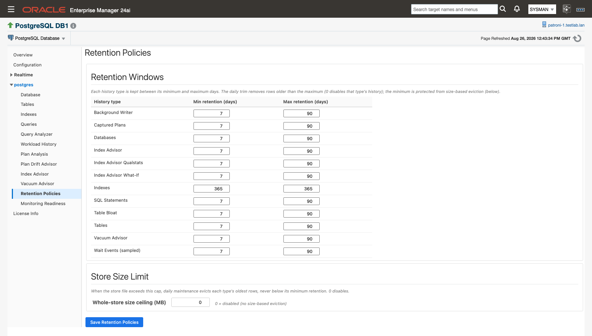
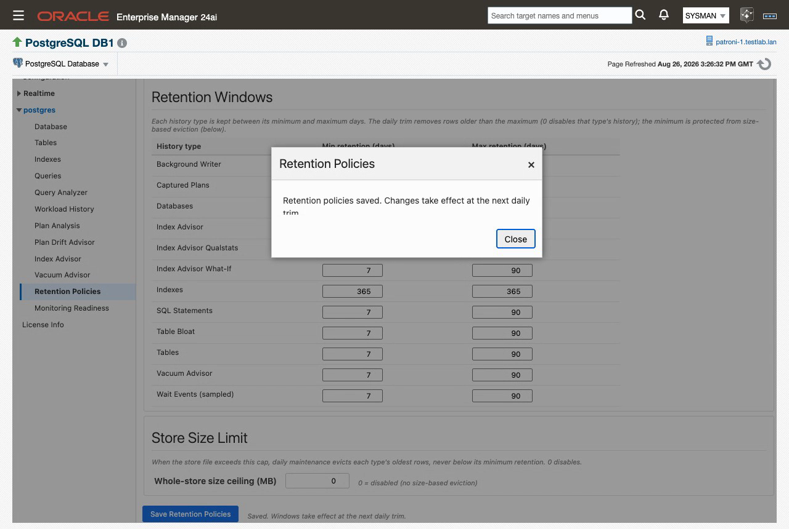
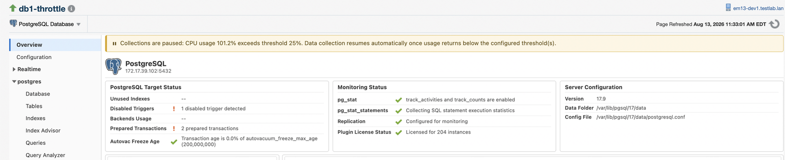

# History store and retention

If you want months of statement-level and object-level history without growing the Enterprise Manager repository, that history is already being kept — in a per-target SQLite database on the agent host. The store creates itself at the first collection, keeps each history type for a retention window you control, and prunes itself once a day. The **Retention Policies** page is where you set every window and the store's size ceiling.

> **Prerequisites for this page**
> - Nothing to install or configure for the store itself — see [Agent host](prerequisites.md#agent-host) for the disk it lives on.
> - Preferred Credentials on the target, so the Retention Policies page and the data-management jobs can run — see [Preferred Credentials](prerequisites.md#preferred-credentials).
> - The collection throttle additionally needs a local agent on a Linux host — see [Agent host](prerequisites.md#agent-host).

**Where to find it:** the target's tree navigation ▸ *&lt;database&gt;* ▸ **Retention Policies**, or the same entry on the target menu. **Workload History** links to it from the bottom of the page.

**In this page:** Where the store lives · What it holds · Retention Policies page · Store size and disk reclaim · Data-management jobs · Daily maintenance · Collection throttle

## Where the store lives

One SQLite database per PostgreSQL database target, on the agent host:

`%plugin_data%/<target name>_collections.sqlite3`

`%plugin_data%` resolves to `<agent state directory>/ip_plugin/xpgs/data`, a dedicated tree beside the agent's own `plugin_data` directory, so the collected history is not tied to the plug-in's `plugin_data` lifecycle. The directory is created on demand at the first connection.

- The file is created at the first collection that persists history, and its schema updates itself on later releases. There are no manual steps and no upgrade procedure.
- The plug-in creates it with restrictive permissions: owner read/write, group read (640) on the database file, and 750 on its parent directory. The WAL and SHM sidecar files inherit the database file's permissions. On a filesystem without POSIX permissions the permission change fails, the collection still proceeds, and a warning is logged.
- Nothing listens on a network port for it. The only reader is the plug-in running inside the agent, so access control is the file mode: protect the file as you would any other file the agent owns, and do not open it with other tools while the agent is running.
- It holds no Enterprise Manager credentials. It is local to the agent by design: the plug-in does not share, back up or replicate it.
- **Monitoring Readiness** carries a **Historical Store** check that reports the store's presence and size: "The agent-side SQLite store that holds long-window history."

Aggregates and alert-carrying metrics still flow to Enterprise Manager exactly as they always have. The store holds the granular detail underneath them.

## What it holds

Two kinds of history sit side by side in the store: the five staged infrastructure tiers, and the per-statement and advisor history (workload snapshots, captured execution plans and their query text, and advisor findings).

The five staged tiers write full-resolution rows on every scheduled collection, then get condensed once a day:

| Tier | What it stages | What the daily row adds |
|---|---|---|
| `tables` | Dead-tuple and autovacuum history | The intraday dead-tuple peak and the vacuum cycles observed that day |
| `databases` | Transaction-ID age and database-size history | Transaction-ID age and multixact age peaks |
| `background_writer` | Checkpoint and background-writer history | Reset-guarded daily deltas of the cumulative checkpoint counters |
| `indexes` | Long-term index history | The day-close row, kept even when an index recorded no scans — zero scan movement is exactly the unused-index signal |
| `wait_events_sampled` | Sampled wait history | The day's sample-count delta and estimated wait milliseconds |

The intraday dead-tuple peak matters because a day-close reading can be near zero after a vacuum has run; the peak is the bloat-pressure signal.

How the condense works:

- It runs once a day as part of the daily maintenance run, and processes each completed UTC calendar day.
- For each day and tier it writes one daily row per object and purges the staged rows it consumed. Each day-and-tier pass is atomic and idempotent, so a multi-day catch-up after an agent outage produces the same result as running day by day.
- Long-term growth is condensed rows only.
- `databases` keeps a rolling seven-day window of full-resolution staged rows even after condensation, so rate calculations still have sub-daily points.
- Reads that need the current day merge the open, uncondensed day's staged rows into the condensed history. Today is never blank.

All delta and aggregation work runs in the plug-in's agent-side code; the read jobs return plain values.

Staged writes carry a write-rate cap: a tier is not staged again until at least 15 minutes have passed since its last staging. The cap protects the store from repeated manual **All Metrics** fetches. It sits below the scheduled collection cadence, so a scheduled collection is never dropped, and it does not change any collection schedule. It is a separate mechanism from the [collection throttle](#collection-throttle).

## Retention Policies page {#retention-policies}

Every history type in the store has its own retention window in days, enforced by the daily trim, plus a protected minimum that size-based eviction may never cross. The Retention Policies page puts all twelve windows and the whole-store size ceiling on one screen.

*The twelve history types, each with a minimum and a maximum retention, above the whole-store size ceiling.*

### Defaults

| History type | Default max retention (days) | Default protected minimum (days) |
|---|---|---|
| Background Writer | 90 | 7 |
| Captured Plans | 90 | 7 |
| Databases | 90 | 7 |
| Index Advisor | 90 | 7 |
| Index Advisor Qualstats | 90 | 7 |
| Index Advisor What-If | 90 | 7 |
| Indexes | 365 | 365 |
| SQL Statements | 90 | 7 |
| Table Bloat | 90 | 7 |
| Tables | 90 | 7 |
| Vacuum Advisor | 90 | 7 |
| Wait Events (sampled) | 90 | 7 |

Rows appear in alphabetical order by display label, as they do on the page. Indexes is the long-term archive and ships at 365 days on both columns. The effective protected minimum clamps to at least 1 day. The whole-store size ceiling ships disabled (0).

### Set the windows

1. Open **Retention Policies** from the target's tree navigation or menu.
2. In **Retention Windows**, edit **Min retention (days)** (the protected floor) and **Max retention (days)** (the trim window) for any history type. The form is prefilled with the values currently in effect. On-page help: "Each history type is kept between its minimum and maximum days. The daily trim removes rows older than the maximum; the minimum is protected from size-based eviction (below)." That help text states the general rule; **Captured Plans** behaves differently — see [Behaviors](#behaviors) below.
3. In **Store Size Limit**, set **Whole-store size ceiling (MB)**. The hint reads "0 = disabled (no size-based eviction)", and the section help reads "When the store file exceeds this cap, daily maintenance evicts each type's oldest rows, never below its minimum retention. 0 disables."
4. Click **Save Retention Policies**. One Save persists both sections. Blank fields mean "leave unchanged" — only the fields you fill in are sent.
5. A dialog confirms "Retention policies saved. Changes take effect at the next daily trim." The form then re-prefills from the store, so it shows what was actually persisted.

*After the save the page reloads its values from the store and reports "Saved. Windows take effect at the next daily trim."*

<video class="walkthrough" src="images/13-5-15/retention-policies-save.mp4" poster="images/13-5-15/retention-policies-save-poster.png" autoplay loop muted playsinline controls aria-label="Editing a retention window and saving it"></video>
*Editing a window, saving, and the confirmation dialog.*

### Validation

The page validates before it submits anything:

- A value that is not a whole number is rejected.
- A minimum greater than its maximum is rejected: "*&lt;History type&gt;*: minimum (N) exceeds maximum (M)". The check is skipped when the maximum is 0, because a maximum of 0 is a special value.
- Errors render as "Not saved — …" and nothing is submitted.
- If every field is blank, the page reports "Nothing to save."
- A history type the store returns but the page does not yet know about renders read-only, with a hint to set it through the **PostgreSQL - Set Granular Retention Days** job. New history types never silently disappear from the list.

### Behaviors

- Setting a maximum to 0 disables that type's granular local history only: no new snapshots are kept, and existing rows are purged at the next nightly cleanup. Enterprise Manager collections and alerting are untouched.
- **Captured Plans** is the exception: a maximum of 0 means no age bound rather than "off". The size ceilings in [Store size and disk reclaim](#store-size) still apply to it.
- Changes take effect at the next daily trim, not immediately.
- Accepted-baseline representative captured plans are always kept, whatever the plan-archive eviction does.
- Asking a page for a time window wider than a type's retention simply renders the data that exists. It is not an error.
- These windows govern the agent-local store only. Repository-side metric retention follows standard Enterprise Manager behavior.

## Store size and disk reclaim {#store-size}

Two size ceilings bound the store. The retention windows are the primary control; the ceilings are protection you opt into.

| Ceiling | Default | What it does | Where to set it |
|---|---|---|---|
| Plan archive | 100 MB | Bounds the captured-plan archive, evicting oldest first. Pinned baseline plans are never evicted. | **PostgreSQL - Set Plan Archive Size Ceiling** job, parameter **Captured Plans Size Ceiling (MB)** |
| Whole store | 0 (disabled) | When the store file exceeds the ceiling, daily maintenance evicts each history type's oldest rows, never below that type's protected minimum. | Retention Policies page, or **Whole-Store Size Ceiling (MB)** on the same job |

- Eviction targets a logical used size of about 85% of the ceiling, so freed pages recycle into future writes and the file's high-water mark stays near the ceiling rather than sawtoothing.
- Floors are hard. When every history type is already at its protected minimum, eviction stops and reports rather than deleting protected history.
- Deleting rows does not shrink the SQLite file on its own. Daily maintenance compacts the file when the reclaimable free space is at least 32 MB **and** at least 25% of the file.
- For immediate reclaim, run the **PostgreSQL - Reclaim Collection Store Disk Space** job on demand from **Enterprise ▸ Job ▸ Activity**. It reports how much space was freed.

When history is shorter than you expected, read the **Status** column of the daily maintenance run — it carries the eviction and compaction notes.

## Data-management jobs {#jobs}

Every control on the configuration pages is backed by an Enterprise Manager job type. The pages are the normal path; the jobs are there for scripting and fleet automation with `emcli`. All seven are agent-bound and single-target, and run against a PostgreSQL Database target.

| Job (display name) | Job type | What it sets |
|---|---|---|
| **PostgreSQL - Set Granular Retention Days** | `xpgs_set_retention_days` | Per-type retention days (**Indexes (Days)**, **SQL Statements (Days)**, and so on) and protected minimums (**Protected Minimum - Indexes (Days)**, and so on) for all twelve history types. A parameter you leave out keeps its stored value. |
| **PostgreSQL - Set Plan Archive Size Ceiling** | `xpgs_set_size_ceiling` | **Captured Plans Size Ceiling (MB)** and **Whole-Store Size Ceiling (MB)**. 0 disables the whole-store ceiling; blank keeps the current value. |
| **PostgreSQL - Reclaim Collection Store Disk Space** | `xpgs_reclaim_store` | Compacts the store file on demand and reports the MB freed. No parameters. |
| **PostgreSQL - Set Wait History Retention Threshold** | `xpgs_set_wait_threshold` | **Minimum Daily Wait Time (ms)** — the estimated daily wait a query and wait-event combination must reach for its daily row to be kept. Default 0, which keeps every combination that waited at all. Raise it to thin high-cardinality wait history. |
| **PostgreSQL - Configure auto_explain** | `xpgs_configure_auto_explain` | Applies the plan-capture settings through `ALTER SYSTEM` — the same job the Monitoring Readiness **Configure** button submits. Parameter **Log Min Duration (ms)**, which defaults to 1000 when blank. A setting the connecting role cannot change is reported, not fatal. |
| **PostgreSQL - Set Plan Capture Window & Opt-in** | `xpgs_set_capture_window` | **auto_explain.log_analyze Opt-in**, **Off-Peak Window Start (HH:mm)**, **Off-Peak Window End (HH:mm)**, **Off-Peak Window Enabled**. |
| **PostgreSQL - Trim Historical Granular Collections** | `xpgs_trim_hx_collections` | Runs the daily maintenance on demand. No parameters. |

All of them need agent host credentials; **PostgreSQL - Configure auto_explain** also needs the PostgreSQL monitoring credentials, because it is the only one that connects to the database. If a job comes back with "Unable to run job", see [Unable to run job](troubleshooting.md#unable-to-run-job).

## Daily maintenance

One scheduled collection does all the housekeeping. It enforces every retention window, runs the calendar-day condense for the staged tiers, retires stale plan baselines, applies size-ceiling eviction, and performs the conditional compaction. Without it the granular history would never be pruned.

It ships as a 24-hour interval item in the default collection and needs no PostgreSQL connection — it touches only the local store. The interval is editable per target like any Enterprise Manager collection schedule, and **PostgreSQL - Trim Historical Granular Collections** gives you the on-demand form.

The run reports as the **Historical Collection Trim** metric (`trim_historical_collections`):

| Column | Internal name | What it reports |
|---|---|---|
| Rows Deleted | `rows_deleted` | Rows removed across all history types in this run |
| Baselines Retired | `baselines_retired` | Stale plan baselines retired in this run |
| Status | `status` | The run's outcome, including the eviction and compaction notes |

The metric carries no thresholds and should never alert. Its presence in the metric tree is the schedule handle, not a health signal.

Retention and ceiling changes saved on the Retention Policies page take effect at the next daily trim, not at save time.

## Collection throttle {#collection-throttle}

When the agent host is already under CPU or memory pressure, the last thing it needs is a monitoring plug-in adding work. The collection throttle is an optional self-protection gate: while the agent host's CPU and/or memory usage is at or above thresholds you set, the plug-in skips its heavier scheduled collections for that cycle. It is off by default, and it never changes any collection schedule — it only skips work while the pressure lasts. It is a different mechanism from the write-rate cap described in [What it holds](#what-it-holds).

### Prerequisites

- Local-agent deployments on Linux hosts. On a remote agent the CPU reading would be the management host's, not the database host's, so leave the properties empty on remote-agent targets.
- Non-Linux agent hosts never throttle: the gate fails open.

### The properties

Set one or both instance properties on the PostgreSQL database or cluster target:

| Property | Label | What it gates |
|---|---|---|
| `throttle_cpu_threshold` | Collection Throttle: CPU Threshold (%) | Pauses scheduled collections while agent-host CPU usage is at or above this value, where usage is the 1-minute load average divided by core count, as a percentage |
| `throttle_mem_threshold` | Collection Throttle: Memory Threshold (%) | Pauses scheduled collections while agent-host memory usage is at or above this value, where usage is (MemTotal − MemAvailable) / MemTotal as a percentage |

Each takes a percentage from 0 to 100. Empty or invalid disables that resource's gate; both empty means the feature is fully off, which is the default. See [Collection throttle properties](targets-and-properties.md#throttle-properties) for where they sit among the other target properties.

To turn the throttle on:

1. Open the target's instance properties (**target menu ▸ Target Setup ▸ Monitoring Configuration**) and set one or both thresholds.
2. Wait one 5-minute cycle — that is how long a change takes to reach the gate.
3. Watch for the banner, and check the `collection_throttle` metric on the target's **All Metrics** page.

### What you'll see

While the gate is active, an amber informational banner appears at the top of every plug-in page. It reflects the live gate state within about 60 seconds and clears itself when the gate lifts. It is not an alert and not an error. Where no specific reason is available the generic form reads: "Collections are paused because agent-host CPU or memory usage exceeds the configured thresholds. Data collection resumes automatically once usage returns below the thresholds."

*The banner tells you why a page has no fresh data, and disappears on its own once usage drops.*

The **Collection Throttle** metric (`collection_throttle`) is collected every 5 minutes and gives you the historical audit of every throttle window:

| Column | Internal name | What it reports |
|---|---|---|
| Collections Paused (0/1) | `is_gated` | 1 while the gate is active |
| Reason | `reason` | The message shown in the banner |
| Host CPU Usage (%) | `cpu_used_pct` | 1-minute load average per core, as a percentage |
| CPU Threshold (%) | `cpu_threshold_pct` | The value of `throttle_cpu_threshold` |
| Host Memory Usage (%) | `mem_used_pct` | (MemTotal − MemAvailable) / MemTotal, as a percentage |
| Memory Threshold (%) | `mem_threshold_pct` | The value of `throttle_mem_threshold` |

Because that history is retained like any metric, you can always answer "why does this chart have a gap".

### Behavior during and after a gate

- Indicator metrics upload zero rows. Charts show honest gaps rather than invented data.
- Configuration metrics replay the last successful snapshot, so configuration history stays clean. If a configuration metric has no cached snapshot yet, its collection proceeds despite the threshold, so a cache exists next time.
- After a gate lifts, rate-style columns show one zero datapoint on the first collection, then resume normal values.
- A plug-in upgrade resets the gate to off for at most 5 minutes, after which it self-heals from the target properties.

### Never gated

The gate only touches heavier scheduled collections. These always run:

- Target availability (Response) and connection tests
- Every real-time page load
- Every user-triggered job
- License collection
- The extension probe
- The daily retention housekeeping (Historical Collection Trim)
- The `collection_throttle` metric itself

### Caveats

- A skipped collection is not evaluated against its thresholds. Warning and critical severities raised before a gate window persist through it, because no data means no re-evaluation: nothing clears and nothing new fires while the gate holds.
- The **All Metrics** page does not indicate that a collection was skipped. The banner and the `collection_throttle` history are your visibility for that.

## Related

- [Targets and properties](targets-and-properties.md#throttle-properties) — where the two collection-throttle properties are set
- [Monitoring Readiness](monitoring-readiness.md) — the Historical Store check, and the auto_explain settings the plan-capture jobs apply
- [Workload History](workload-history.md) — the history the store feeds, including wait-event sampling
- [Plan Analysis](plan-analysis.md) — the captured plans bounded by the plan-archive ceiling
- [Jobs and metric extensions](jobs-and-metric-extensions.md) — the rest of the plug-in's jobs
- [Troubleshooting](troubleshooting.md#unable-to-run-job) — what to check when a job will not run
