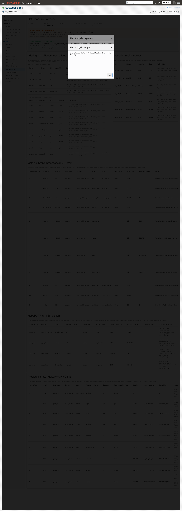
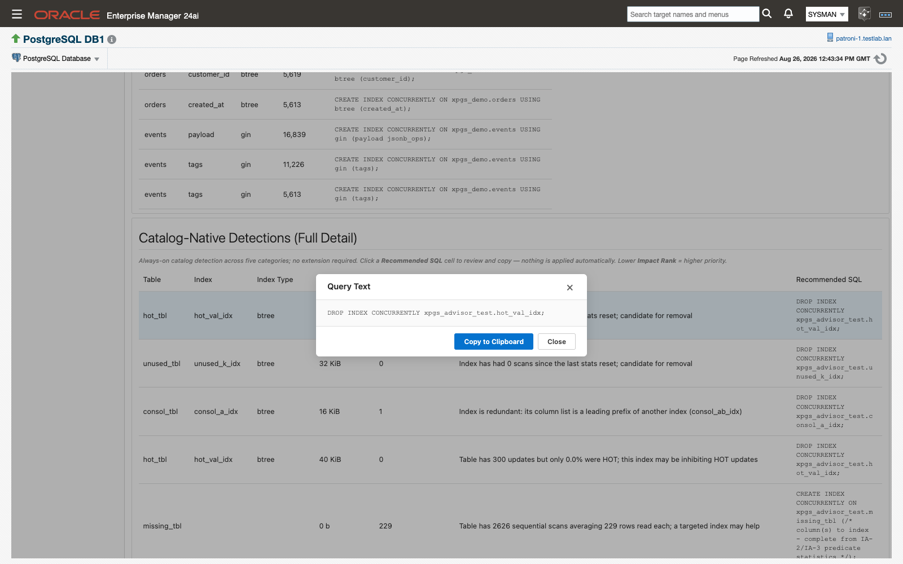
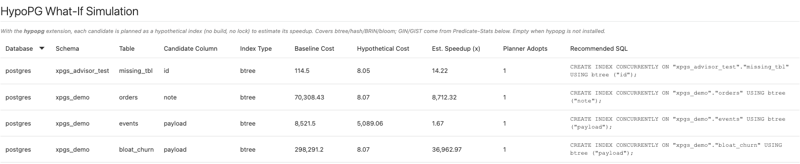
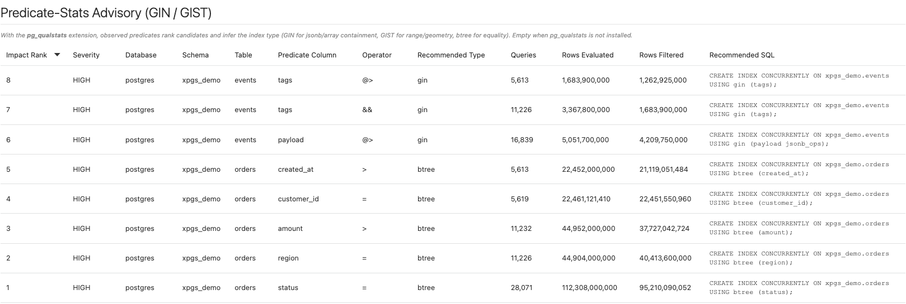

# Index Advisor

When a table is read end to end fifty times an hour, or an index has not been touched since the last statistics reset, someone has to notice before it shows up as a slow report or a full disk. The **Index Advisor** page notices for you: it analyzes how each database is actually used and lists the indexes worth creating, dropping, or rebuilding, each with SQL you review and run yourself. It works on any monitored target with no extension installed, but the configuration to aim for is `hypopg` and `pg_qualstats` installed in the databases you care about — that is what turns a heuristic ("this table is scanned a lot") into evidence ("this predicate filtered 2.4 million rows and a GIN index would serve it").

> **Prerequisites for this page**
> - The monitoring role on the target — see [Prerequisites](prerequisites.md#monitoring-role). Nothing else is required for catalog-native detection.
> - `hypopg`, for the What-If cost simulation. See [Optional extensions](prerequisites.md#optional-extensions).
> - `pg_qualstats`, for the predicate-stats recommendations. See [Optional extensions](prerequisites.md#optional-extensions).
>
> Both extensions are per-database in PostgreSQL: run `CREATE EXTENSION` in each database you want covered. The plug-in detects them automatically on every collection and never installs anything.

**Where to find it:** on a PostgreSQL Database target, open the target menu and choose **Index Advisor**, or select it in the left-hand tree under the database node. The **Plan Analysis** page also links here from its top recommendation card, with the button **Open Index Advisor →**, when the highest-impact plan finding is an index problem.

**In this page:** Reading the page · The five catalog-native categories · Review-and-run SQL · HypoPG What-If simulation · Predicate-Stats Advisory with pg_qualstats · Without extensions · Index Advisor alerts

## Reading the page

The page collects once when it loads. The detection queries are heavier than an ordinary metric read and findings change slowly, so there is no background polling here — reload the page to refresh it. If the collection throttle is engaged for the target, the usual informational banner appears at the top; see [Collection throttle](history-store-and-retention.md#collection-throttle).

*The page reads top to bottom: counts, then the two headline recommendations, then summaries, then the full evidence.*

Read it in four passes.

1. **Detections by Category** — a KPI tile per category: Missing, Unused, Invalid, HOT-inhibiting, Consolidation. The Unused tile also carries the summed on-disk size of every unused index (for example `3 / 2.4 GB`), which is the space you would reclaim by acting on all of them.
2. **The two recommendation banners** — the single highest-value action of each kind. **Top recommendation · Missing index** shows the top What-If candidate's `CREATE INDEX CONCURRENTLY` statement, annotated with the estimated speedup and, when the predicate-stats layer saw queries against the same table, a `pg_qualstats matches: N queries` note; its footer reads "Highest estimated speedup among the candidates below." **Top recommendation · Unused index** shows the largest never-scanned index, its size, "0 scans since the last stats reset", and the footer "Largest never-scanned index; dropping it reclaims the most disk space of the findings below." A banner is hidden when there is nothing to show.
3. **The two summary tables** — **Missing Index Recommendations** on the left, split into **Cost-simulated · HypoPG What-If** (Table, Column, Est. Speedup (x), Suggested) and **Predicate-observed · pg_qualstats** (Table, Column, Type, Queries, Suggested). **Unused & Invalid Indexes** on the right (Index, Status, Severity, Size, Action SQL) lists existing indexes flagged for removal with the disk each occupies.
4. **The three full-detail sections** — **Catalog-Native Detections (Full Detail)**, **HypoPG What-If Simulation**, and **Predicate-Stats Advisory (GIN / GIST)**. These are the audit trail: every row carries the evidence sentence behind the recommendation, and the summary tables above are views over the same three collections.

Empty sections are the healthy answer. A clean catalog produces no findings, and an extension-gated section is simply empty when the extension is not installed in that database.

## The five catalog-native categories

Catalog-native detection runs on every monitored target with no extension, once per database on each collection, over PostgreSQL's own catalog and statistics views. It is index-type-agnostic: the real access method travels with the finding, so a GIN or GIST index shows up under Unused, Invalid, or HOT-inhibiting exactly as a btree index does.

| Category | Detection rule | Severity | Recommended SQL |
|---|---|---|---|
| Missing | A table with at least 50 sequential scans, more sequential scans than index scans, at least 1,000 live rows, and an average of at least 100 rows read per scan. | MEDIUM | A `CREATE INDEX CONCURRENTLY` skeleton with an inline placeholder comment where the column list goes. |
| Unused | A valid, non-primary-key, non-unique index with zero scans since the last statistics reset. | LOW | `DROP INDEX CONCURRENTLY <schema>.<index>;` |
| Invalid | `pg_index.indisvalid = false`, typically a failed `CREATE INDEX CONCURRENTLY` build. The index is maintained on every write and serves no query. | HIGH | `DROP INDEX CONCURRENTLY <schema>.<index>;` — or `REINDEX`, if the index is one you want. |
| HOT-inhibiting | A valid non-primary-key index on a table with at least 50 updates whose HOT-update ratio is below 50 %. | MEDIUM | `DROP INDEX CONCURRENTLY <schema>.<index>;` — advisory; the index may still serve reads. |
| Consolidation | An index whose column list is a leading prefix of another index on the same table using the same access method. Primary-key and unique indexes are excluded. Deduplicated to one row per redundant index. | LOW | `DROP INDEX CONCURRENTLY <schema>.<index>;` |

Every row spells out its own evidence in the **Detail** column, in the category's own words. The numbers and object names below are examples:

- Unused — "Index has had 0 scans since the last stats reset; candidate for removal"
- Invalid — "Index is INVALID (indisvalid=false) - likely a failed concurrent index build; REINDEX or drop it"
- HOT-inhibiting — "Table has 4,120 updates but only 18.3% were HOT; this index may be inhibiting HOT updates"
- Consolidation — "Index is redundant: its column list is a leading prefix of another index (`orders_cust_date_idx`)"
- Missing — "Table has 812 sequential scans averaging 46,300 rows read each; a targeted index may help"

The **Triggering Value** column holds the number the rule fired on, and it means something different per category: rows read per sequential scan for Missing, the scan count for Unused, the HOT-update percentage for HOT-inhibiting, the number of indexed columns for Consolidation, and 0 for Invalid. **Impact Rank** orders every catalog finding deterministically: severity tier first (Invalid, then Missing and HOT-inhibiting, then Unused and Consolidation), then the triggering value. Rank 1 is the highest priority, as the section hint says: "Always-on catalog detection across five categories; no extension required. Click a **Recommended SQL** cell to review and copy — nothing is applied automatically. Lower **Impact Rank** = higher priority."

What to watch for:

- "Unused" means unused *since the last PostgreSQL statistics reset*. After a reset, healthy indexes look unused until real traffic accumulates again. Check when statistics were last reset before you drop anything.
- **Index Size** is the on-disk size of the offending index in bytes. It reads 0 for Missing findings, because no index exists yet, and 0 on a standby.
- `pg_catalog` and `information_schema` are excluded from Invalid and Consolidation detection.
- Findings from every database on the instance appear in one table. The **Database** column tells them apart.

## Review-and-run SQL

Every finding carries remediation SQL, always in the online, non-locking `CONCURRENTLY` form. Where the offending index is known (Unused, Invalid, HOT-inhibiting, Consolidation), it is an exact, schema-qualified `DROP INDEX CONCURRENTLY`. For missing-index candidates it is a `CREATE INDEX CONCURRENTLY` statement: complete and specific when it comes from the What-If or predicate-stats layers, and a clearly marked skeleton with a placeholder comment for the column list when only the catalog-native heuristic is available.

The plug-in never runs any of it. There is no apply action anywhere on this page.

1. Click any SQL cell — **Recommended SQL**, **Suggested**, or **Action SQL**. The statement opens in a dialog headed "Query Text".
2. Read the statement. Confirm the object, the schema, and the database it belongs to.
3. Click **Copy to Clipboard**. The button reads "Copied" for a second and a half, then returns to its normal label.
4. Click **Close**.
5. Take the statement through your own change-control process and run it in your own tooling.

*Every SQL cell opens the same dialog: read it, copy it, run it yourself.*

<video class="walkthrough" src="images/13-5-15/index-advisor-copy-sql.mp4" poster="images/13-5-15/index-advisor-copy-sql-poster.png" autoplay loop muted playsinline controls aria-label="Clicking a Recommended SQL cell, copying the statement, and closing the dialog"></video>
*Nothing is applied automatically — the DBA owns every execution decision.*

Two statements deserve a second look before they go anywhere near a change ticket. The HOT-inhibiting `DROP` is advisory: the index may still be serving reads, and only you know whether the write cost is worth paying. The catalog-native Missing skeleton is deliberately incomplete — finish the column list from the What-If or predicate-stats evidence, or from what you know about the query that scans the table.

## HypoPG What-If simulation

With `hypopg` installed in a database, every catalog-native Missing candidate in that database is tested by simulation instead of being left as a hunch. A hypothetical index is materialized in the planner only (never built on disk, no lock taken), a representative equality lookup is re-planned against it, and the estimated cost improvement is reported. Both measurements come from plain `EXPLAIN (FORMAT JSON)` — no `ANALYZE` — so the synthetic lookup is planned and costed but never executed.

*Cost simulation, not a wall-clock measurement: it tells you which candidate to look at first.*

How a row is produced:

1. The advisor picks the most selective indexable column on the candidate table that is not already the leading column of an existing index — highest distinct-value fraction, restricted to types with a default btree operator class. A table with no simulatable column is skipped.
2. `EXPLAIN (FORMAT JSON)` on an equality lookup against that column captures the current plan's total cost. This is the **Baseline Cost**.
3. A hypothetical btree index is created with `hypopg_create_index(...)`, the query is re-planned, and the new estimate becomes the **Hypothetical Cost**.
4. **Est. Speedup (x)** is baseline cost divided by hypothetical cost, and the row records whether the planner actually chose the hypothetical index.
5. `hypopg_reset()` runs after every candidate, so no hypothetical index leaks into the next simulation. A failure on one table is logged and skipped without affecting the others.

The **HypoPG What-If Simulation** table carries Database, Schema, Table, Candidate Column, Index Type, Baseline Cost, Hypothetical Cost, Est. Speedup (x), Planner Adopts, and Recommended SQL. **Planner Adopts** reads 1 when the re-planned query used the hypothetical index and 0 when the planner ignored it — a candidate with a high speedup that the planner does not adopt is worth a closer look before you build anything. **Index Type** reads `btree`: the simulation materializes a hypothetical btree index on the candidate column. The section hint states the family coverage: "With the **hypopg** extension, each candidate is planned as a hypothetical index (no build, no lock) to estimate its speedup. Covers btree/hash/BRIN/bloom; GIN/GIST come from Predicate-Stats below. Empty when hypopg is not installed."

That split is worth holding on to: recommendations cover every index type, but cost simulation covers four of them, and this release simulates the btree case, the general shape for `column = value` lookups. HypoPG does not model GIN or GIST costs (a constraint of the extension itself, not of the plug-in), so GIN and GIST recommendations arrive from the Predicate-Stats Advisory instead.

The **Recommended SQL** in this section is a real, complete `CREATE INDEX CONCURRENTLY … (column)`. It replaces the catalog-native placeholder skeleton for the same table.

Treat the estimated speedup as a prioritization signal, not a promise. It is a ratio between two planner cost estimates, and its job is to tell you which candidate deserves your attention first. An empty table means either that `hypopg` is not installed in that database or that nothing was worth simulating — both are fine.

## Predicate-Stats Advisory with pg_qualstats

This is the sharpest missing-index evidence the plug-in produces, and the reason `pg_qualstats` belongs in the recommended configuration. With the extension installed, the advisor reads the filter predicates your workload actually ran and that *were not served by an index*, ranks the candidates by how many rows each predicate threw away, and infers the right access method per operator — the one thing cost simulation cannot do.

*Evidence from the workload itself: which predicate, which operator, how many rows it discarded.*

How it works:

- Observed post-scan filter predicates are aggregated per table, column, and operator, with three evidence numbers: how many distinct plans the predicate appeared in, how many executions evaluated it, and how many rows it filtered away.
- The access method is inferred from the catalog operator families for that operator, in preference order btree, gin, gist, spgist, brin, hash. JSON and array containment operators resolve to GIN, range and geometry overlap to GIST, and scalar equality to btree. For non-btree recommendations the correct operator class (`jsonb_ops`, for example) is resolved and written into the SQL.
- The existing-index check is access-method-aware. A btree index already on a column does not suppress a needed GIN or GIST recommendation for a different operator on that same column.
- Severity comes from the filtered volume: 100,000 rows or more is HIGH, 1,000 or more is MEDIUM, anything less is LOW. Impact Rank orders by rows filtered, then by executions; rank 1 is the highest impact.
- The recommendation is a complete statement: `CREATE INDEX CONCURRENTLY ON <schema>.<table> USING <method> (<column> <opclass>);`

The **Predicate-Stats Advisory (GIN / GIST)** table carries Impact Rank, Severity, Database, Schema, Table, Predicate Column, Operator, Recommended Type, Queries, Rows Evaluated, Rows Filtered, and Recommended SQL. Each row's Detail states the case in full, for example: "Predicate `payload` @> seen in 6 plan(s); filtered 2,410,338 rows over 18,942 row evaluations - a gin index is recommended". The section hint reads: "With the **pg_qualstats** extension, observed predicates rank candidates and infer the index type (GIN for jsonb/array containment, GIST for range/geometry, btree for equality). Empty when pg_qualstats is not installed."

The two Missing-Index summary tables stay separate on purpose. One is planner cost simulation, the other is observed workload evidence, and they are independent. Where both point at the same table, that agreement is the strongest signal on the page, and it is what the Missing-index banner surfaces with its `pg_qualstats matches: N queries` annotation. The section hint above the pair says so directly: "Candidates from two sources: **HypoPG What-If** simulates planner cost; **pg_qualstats** ranks predicates observed in your workload. Click a SQL cell to copy; full detail in the sections below."

## Without extensions

With no extension installed, the page and its metrics still work on every supported target. All five catalog-native categories, the KPI band, both recommendation banners, the Unused & Invalid table, impact ranking, and the recommendation SQL are fully functional. The extension-gated sections come up empty — no error, no broken panel, no partial data.

Extension presence is probed per database at collection time, so a database with `hypopg` installed is simulated even when its neighbors are not. When an extension is absent the corresponding collection returns zero rows and the catalog-native layer carries on unchanged.

The **Monitoring Readiness** page tells you exactly where you stand: its "Index Advisor — Enhanced Recommendations" panel lists both extensions with their status and explains the trade: "Catalog-native index detection always works; these optional extensions add What-If cost simulation and predicate-based recommendations." See [Monitoring Readiness](monitoring-readiness.md).

The extensions add precision rather than function: with `pg_qualstats` and `hypopg` installed, a ranked list of suspicions becomes a ranked list of measurements.

## Index Advisor alerts

Every finding also publishes as a standard Enterprise Manager metric on the target, which means editable collection schedules, thresholds you can tune per target or through a monitoring template, alert history, and routing through the usual notification framework to whatever connector you have bound.

| Metric | Internal name | Collected | Default Warning | Default Critical | Occurrences | Clears when |
|---|---|---|---|---|---|---|
| Index Advisor | `index_advisor` | Every 30 minutes | Severity matches `HIGH` | Not defined | 1 | The finding no longer appears in a collection — the index is dropped or rebuilt, or the pattern stops. |
| Index Advisor What-If | `index_advisor_whatif` | Every 30 minutes | Estimated Speedup greater than `10` | Not defined | 1 | The estimated speedup falls to 10 or below, or the candidate is no longer reported. |
| Index Advisor (Predicate Stats) | `index_advisor_qualstats` | Every 30 minutes | Severity matches `HIGH` | Not defined | 1 | The predicate's severity is no longer HIGH, or the candidate is no longer reported. |

What each metric carries:

- `index_advisor` — one row per catalog-native finding, with Detection Category, Database Name, Schema Name, Table Name, Index Name, Index Type, Triggering Value, Detail, Recommended SQL, Impact Rank, Index Size (bytes), and Severity. The alert message names the category, the object, and the detail; a matching clear message fires when the finding resolves.
- `index_advisor_whatif` — one row per simulated candidate, with Candidate Column, Candidate Index Type, Baseline Plan Cost, Hypothetical Plan Cost, Estimated Speedup, Planner Adopts Index, and Recommended SQL. The Warning on speedup is deliberate: an estimated tenfold improvement is upside too large to leave unread. Rows exist only where `hypopg` is installed.
- `index_advisor_qualstats` — one row per observed predicate candidate, with Predicate Column, Predicate Operator, Recommended Index Type, Executions, Rows Filtered, Predicate Occurrences, Impact Rank, Recommended SQL, and Severity. Rows exist only where `pg_qualstats` is installed.

To resolve an alert, open the Index Advisor page, find the alerted object in the matching full-detail section, copy its Recommended SQL, then review and run it in your own tooling. Alerts clear at the next collection after the finding resolves, so the clear event is your verification that the change did what you wanted.

The shipped monitoring templates cover these metrics. `ip_xpgs_tier01_critical`, the critical-production baseline, enables all three collections on a 15-minute schedule and turns on the `index_advisor` and `index_advisor_whatif` thresholds. `ip_xpgs_tier23_standard`, the dev-test baseline, runs the catalog-native collection hourly with its threshold disabled, so findings are collected and alerting stays opt-in. See [Monitoring templates](alerts-and-templates.md#templates) and [Default thresholds for the new metrics](alerts-and-templates.md#default-thresholds).

Finding detail from all three metrics also persists to the agent-local historical store on each collection, with retention managed from the **Retention Policies** page. See [Retention Policies page](history-store-and-retention.md#retention-policies).

## Related

- [Prerequisites](prerequisites.md#optional-extensions) — installing `hypopg` and `pg_qualstats` per database
- [Monitoring Readiness](monitoring-readiness.md) — which extension is present, and what each one enables
- [Plan Analysis](plan-analysis.md) — the plan findings that link here when the fix is an index
- [Vacuum Advisor](vacuum-advisor.md) — the same review-and-run pattern for vacuum and bloat findings
- [Alerts and templates](alerts-and-templates.md#default-thresholds) — tuning the three thresholds and applying a template
- [History store and retention](history-store-and-retention.md#retention-policies) — how long finding detail is kept
- [Monitoring pages](monitoring-pages.md) — the Indexes page, for per-index statistics rather than findings
