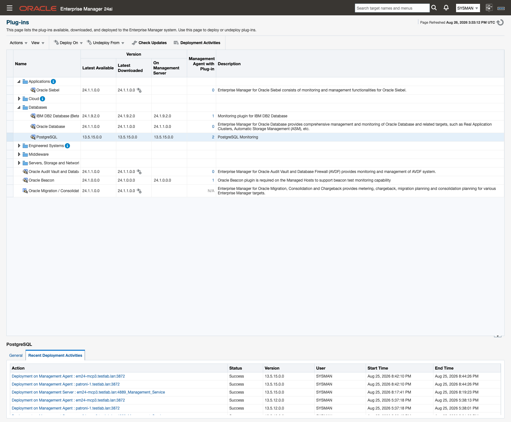

# Install and upgrade

Installing or upgrading the PostgreSQL plug-in follows Oracle Enterprise Manager's standard plug-in lifecycle: import the OPAR onto the OMS, deploy it to the OMS and to each monitoring agent, then license and add your targets. If you're moving an existing 13.5.x deployment forward, the same import-and-deploy sequence upgrades it in place, with no separate migration step.

> **Prerequisites for this page**
> - Your Enterprise Manager, agent, and PostgreSQL versions are supported — see [Supported versions and platforms](prerequisites.md#supported-versions).
> - You have OMS access to import the OPAR and an account (for example `sysman`) with plug-in deployment privileges for `emcli` — see [Enterprise Manager and agents](prerequisites.md#enterprise-manager).

**Where to find it:** Setup → Extensibility → Plug-ins → Databases → PostgreSQL → Actions → Deploy On, or the equivalent `emcli` plug-in commands shown below.

**In this page:** License key · Download · Import the OPAR · Deploy to the OMS · Deploy to agents · Upgrade from an earlier release · After an upgrade · Uninstall

## License key

A valid license key is required to monitor a target with the PostgreSQL plug-in. To purchase a license, contact [sales@integrationplumbers.io](mailto:sales@integrationplumbers.io). To request a trial license, visit the [trial page](https://integrationplumbers.io/postgresql-plugin/trial).

You enter the key per target, in the `Plugin License` target property (see [Database target properties](targets-and-properties.md#database-properties)). To confirm a target's key is recognized, open its **License Info** page.

## Download {#download}

Download details for the plug-in OPAR and the three monitoring template files (`.template.xml`), including their SHA-256 checksums, are provided during the order process or trial enrollment. If you need access to the download, email [helpdesk@integrationplumbers.io](mailto:helpdesk@integrationplumbers.io) or contact us through [integrationplumbers.io](https://integrationplumbers.io). Verify the checksum of each file before you import it.

## Import the OPAR {#import}

1. Log in to `emcli` and enter the password when prompted:

   ```
   emcli login -username=sysman
   ```

2. Make sure `emcli` is synchronized with the OMS:

   ```
   emcli sync
   ```

3. Import the OPAR file:

   ```
   emcli import_update -file=<PATH_TO_FILE> -omslocal
   ```

## Deploy to the OMS {#deploy-oms}

1. Navigate to Setup → Extensibility → Plug-ins.
2. Expand the Databases folder and click PostgreSQL.
3. From the Actions menu, click Deploy On → Management Servers and follow the on-screen instructions.


*The Plug-ins page after 13.5.15.0.0 is imported.*

The equivalent `emcli` command:

```
emcli deploy_plugin_on_server -plugin=ip.em.xpgs
```

To check deployment progress from either the console or `emcli`, run:

```
emcli get_plugin_deployment_status -plugin=ip.em.xpgs
```

## Deploy to agents {#deploy-agents}

1. From the same Plug-ins page, select PostgreSQL.
2. From the Actions menu, click Deploy On → Management Agents.
3. Follow the on-screen instructions to select the agent hosts.

The equivalent `emcli` command:

```
emcli deploy_plugin_on_agent -agent_names="<host>:<port>" -plugin=ip.em.xpgs
```

`get_plugin_deployment_status` (shown above) reports agent deployment progress just as it does for the OMS.

## Upgrade from an earlier release {#upgrade}

Upgrading from 13.5.12, or any other 13.5.x release, to 13.5.15.0.0 uses the same three steps as a first-time install: [import the new OPAR](#import), [deploy it to the OMS](#deploy-oms), then [deploy it to every agent](#deploy-agents). Enterprise Manager treats it as a standard plug-in update — your existing targets, thresholds, and credentials carry forward unchanged.

The agent-local history store used by the plan and workload advisory pages is created automatically the first time each target collects after the upgrade. There is no migration step and nothing to run by hand.

## After an upgrade {#after-upgrade}

For up to 24 hours after the upgrade, the OMS may show an "Error getting meta-data" error until its next metadata refresh completes. See [Error getting meta-data after an upgrade](troubleshooting.md#error-getting-meta-data) if you run into it.

Once the plug-in is deployed, open [**Monitoring Readiness**](monitoring-readiness.md) on each target. 13.5.15.0.0 adds new prerequisites for its advisory features, and this page shows exactly which ones a given target is still missing.

## Uninstall

1. Remove every PostgreSQL Database and PostgreSQL Cluster target monitored by the plug-in.
2. Undeploy the plug-in from each agent:

   ```
   emcli undeploy_plugin_from_agent -plugin=ip.em.xpgs -agent_names="<host>:<port>"
   ```

3. Undeploy the plug-in from the OMS:

   ```
   emcli undeploy_plugin_from_server -plugin=ip.em.xpgs
   ```

Uninstalling the plug-in does not delete its collected history. The store file, `%plugin_data%/<target name>_collections.sqlite3` (under `<agent state directory>/ip_plugin/xpgs/data`), remains on the agent host until an administrator deletes it.

## Related

- [Prerequisites](prerequisites.md) — confirm supported versions, network access, and the monitoring role before you deploy.
- [Targets and properties](targets-and-properties.md) — add a target and set its `Plugin License` property.
- [**Monitoring Readiness**](monitoring-readiness.md) — check what a target still needs after install or upgrade.
- [Troubleshooting](troubleshooting.md) — fixes for "Error getting meta-data" and other deployment issues.
