# Monitoring pages

If you came here from the Advisors pages, you already know where plan drift, index and vacuum health, and workload trends live. Everything else lives on the pages this page tours: current connections, table and index growth, currently running and blocked queries, the server log, license status, and the PostgreSQL Cluster target's switchover control.

> **Prerequisites for this page**
> - Query Analyzer's statement list and history read from `pg_stat_statements` — see [Statement statistics (pg_stat_statements)](prerequisites.md#pg-stat-statements).
> - Query Analyzer's Wait Events chart needs the optional `pg_wait_sampling` extension — see [Optional extensions](prerequisites.md#optional-extensions) and [Wait-event sampling](workload-history.md#wait-event-sampling).
> - The Logs page needs a **local** OEM agent (installed on the same host as the PostgreSQL server) and a configured log file path — see [Logs](#logs), below.
> - Cluster switchover and the Cluster Events (Patroni) metric need [Patroni REST API monitoring](targets-and-properties.md#patroni) enabled on the cluster target.

**Where to find it:** PostgreSQL Database target navigation tree (Overview, Configuration, and Realtime at the top level; Database, Tables, Indexes, Queries, and Query Analyzer under each database name; License Info at the bottom). PostgreSQL Cluster target: the cluster's target home page.

**In this page:** Database target pages · Realtime pages · Schema inventory metrics · Cluster target

## Database target pages

Overview, Configuration, and License Info apply to the whole target. Database, Tables, Indexes, Queries, and Query Analyzer are scoped to one database at a time — pick the database from the tree first.

### Overview

*Overview: target status, incidents, and the Backends, Replication, Background Writer, and Connections Over Time regions.*

**Overview** is the target's landing page. Open it first to see whether a target is healthy at a glance, before drilling into a specific database. It opens on three status panels: **PostgreSQL Target Status** (unused indexes, disabled triggers, backends usage, prepared transactions, autovacuum freeze age), **Monitoring Status** (`pg_stat`, `pg_stat_statements`, replication, and plug-in license status), and **Server Configuration** (PostgreSQL version, data directory, config file path). Below those, availability and open incidents, then a **Backends** table (process ID, user, application, client address/hostname/port, start time) and a **Replication** table (application name, write/replay lag, data lag, state, sync state, client info) for any streaming replicas. **Background Writer** and **Connections Over Time** are trend charts you can switch between Last Day, Last Week, Last Month, or a custom range.

### Configuration

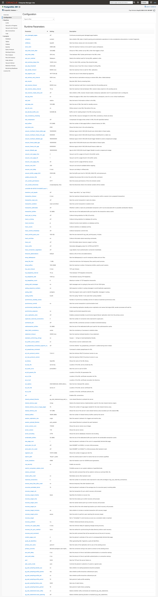

*Configuration: every `postgresql.conf` parameter with its live and boot-time state.*

**Configuration** lists every runtime parameter PostgreSQL reports, one row per parameter:

| Column | Shows |
|---|---|
| Parameter | The setting name |
| Setting | The current value |
| Description | PostgreSQL's short description |
| Unit / Value Type / Category | The unit, data type, and configuration category PostgreSQL reports |
| Source / Context | Where the value came from, and when a change takes effect |
| Boot Value | The value that applies at the next server restart |
| Reset Value | The value `pg_settings.reset_val` reports |

### Database

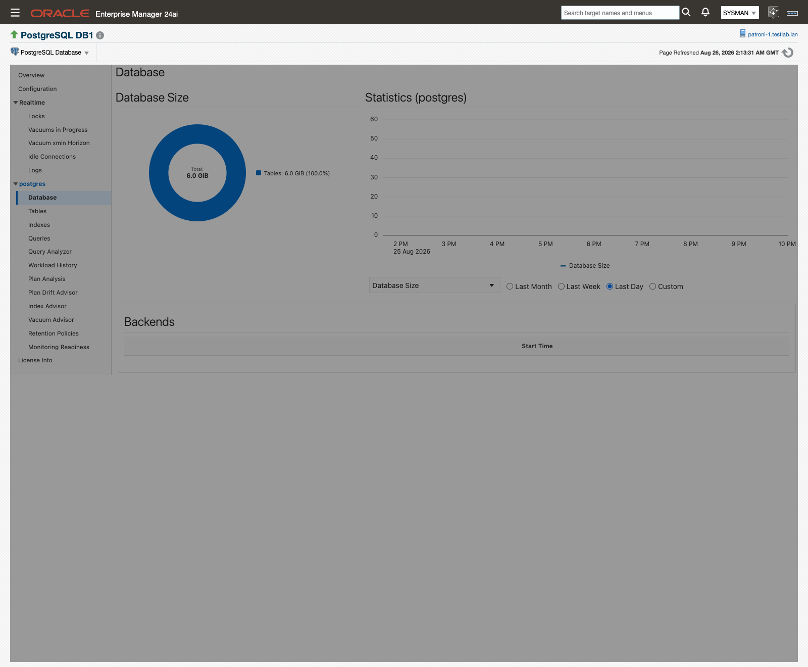

*Database: size and statistics charts for the selected database, plus its live backends.*

**Database** shows the selected database's size and a **Statistics** chart you can plot against Database Size, Transactions, Blocks Read and Hit, Block Read Time and Write Time, Row Access Counts, Deadlocks and Conflicts, or Conflict Details. A **Backends** table below lists the connections currently open to that database.

### Tables

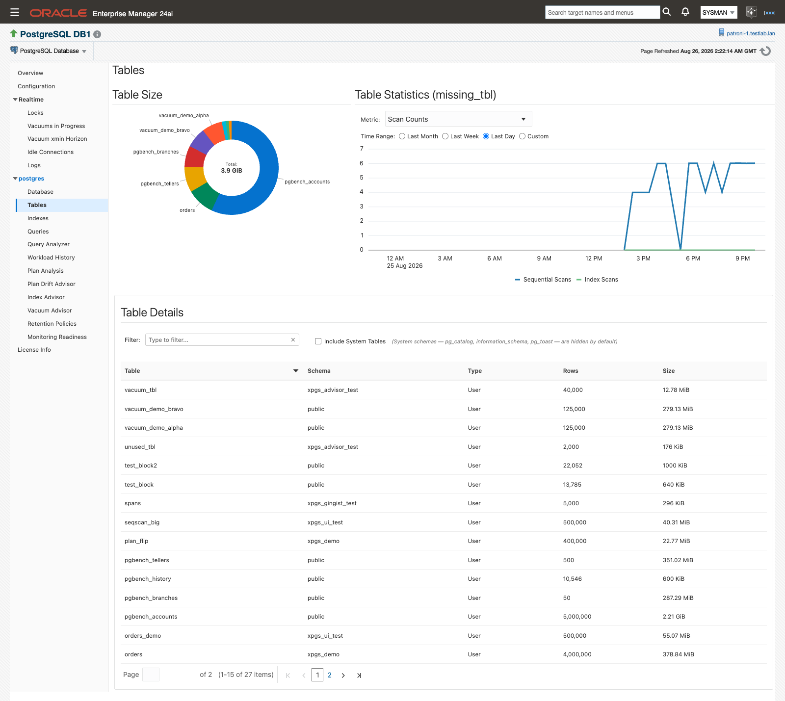

*Tables: size and statistics for every table in the selected database.*

**Tables** breaks table size down per table, with a **Table Statistics** chart selectable across Scan Counts, Rows Fetched by Scan Type, Rows Inserted/Fetched/Updated/Deleted, Live/Dead Rows, Table Maintenance, Heap Blocks, Index Blocks, Toast Blocks, and Toast Index Blocks. The **Table Details** list below shows Table, Schema, Type, Rows, and Size for every table, so you can find and drill into one quickly.

### Indexes

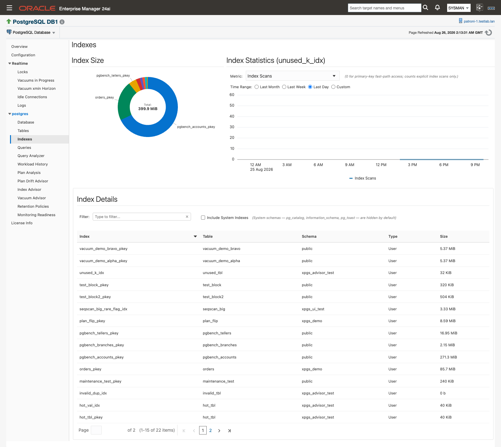

*Indexes: size and statistics for every index in the selected database.*

**Indexes** is the same idea applied to indexes: an **Index Statistics** chart (Index Scans, Index Entries Read, Table Rows Fetched, Disk Blocks) and an **Index Details** list of Index, Table, Schema, Type, and Size. Open it when you're chasing index bloat or confirming whether an index is actually being scanned before deciding to drop it.

### Queries

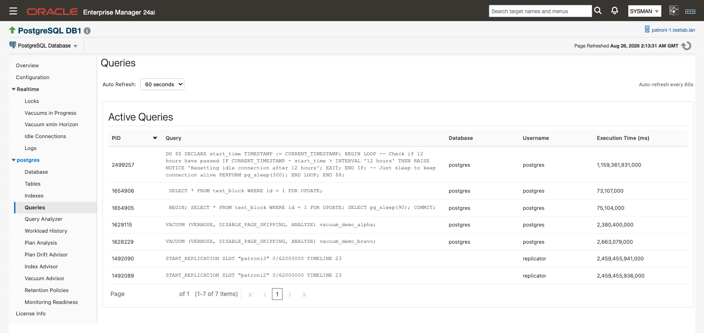

*Queries: what's executing right now, refreshed live.*

**Queries** is a live view of currently executing statements from `pg_stat_activity`, not a history — it works the same way as the Realtime pages, with an **Auto Refresh** selector (No Refresh, 15, 30, or 60 seconds). Each row shows PID, Query, Database, Username, and Execution Time (ms). For statement-level history and aggregated statistics, use Query Analyzer below.

### Query Analyzer

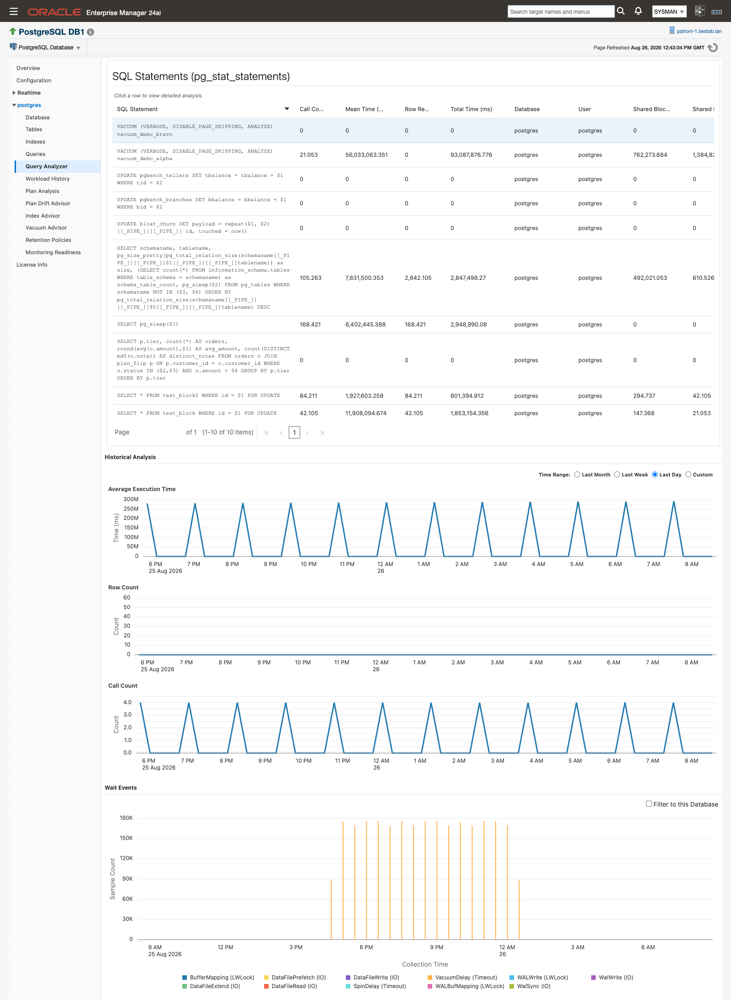

*Query Analyzer: the `pg_stat_statements` view of a database's statements, with per-statement history.*

**Query Analyzer** lists the database's statements from `pg_stat_statements`; selecting one opens its per-statement detail and historical charts, plus the **Wait Events** chart of wait-event counts sampled for that statement over time. See [Wait-event sampling](workload-history.md#wait-event-sampling) for what the extension needs and how the chart reads it.

When a selected statement has plan-drift captures, a "View this query in Plan Drift Advisor →" link appears above the detail panels and takes you straight to that query, preselected, on [Plan Drift Advisor](plan-drift-advisor.md). Testing a proposed query rewrite is no longer done on this page — it happens in the Fix Workbench on **Plan Drift Advisor**, the only place in the plug-in that runs a query on your behalf, and only on your explicit click.

### License Info

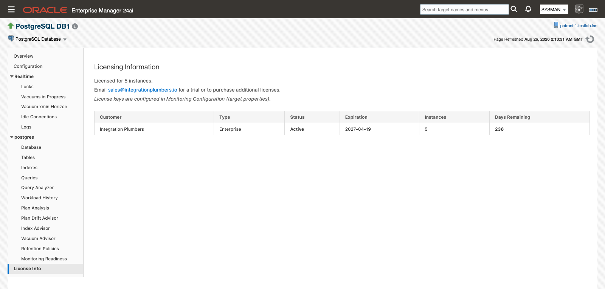

*License Info: the license record recognized for this target.*

**License Info** shows the license the plug-in recognizes for the target:

| Column | Shows |
|---|---|
| Customer | The name the license is issued to |
| Type | The license type |
| Status | Current license status |
| Expiration | Expiration date |
| Instances | Number of instances the license covers |
| Days Remaining | Days left before expiration |

With no license recognized, the table reads "No licenses configured". License keys are entered per target in the `Plugin License` target property, in Monitoring Configuration. See [Database target properties](targets-and-properties.md#database-properties). Email [sales@integrationplumbers.io](mailto:sales@integrationplumbers.io) for a trial or to purchase additional licenses.

## Realtime pages

The pages under **Realtime** query the target live, on demand, each with an **Auto Refresh** selector (No Refresh, 15, 30, or 60 seconds) that controls how often it re-queries while you have the page open. A couple of the metrics behind these pages also collect on their own fixed schedule and carry alert thresholds: Vacuum xmin Horizon collects every 30 minutes with Warning and Critical bands (see [Vacuum Advisor](vacuum-advisor.md#xmin-horizon-root-cause)), and Log Stats, behind the Logs page below, collects every 5 minutes.

### Locks

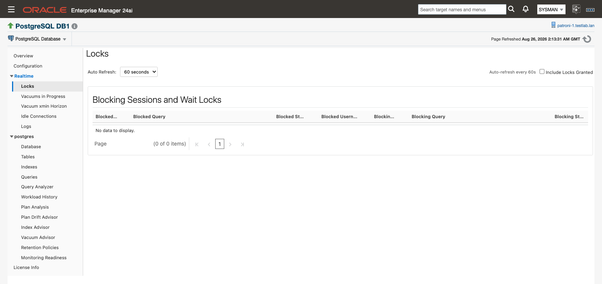

*Locks: blocking sessions and the lock waits behind them.*

**Locks** shows blocking sessions and lock waits: for each blocked query, the session and query holding the lock it's waiting on. The table has one row per blocked/blocking pair — Blocked PID, Blocked Query, Blocked State, Blocked Username, Blocking PID, Blocking Query, Blocking State, Blocking Username, and Lock Granted. By default it shows only queries that are actually blocked; check **Include Locks Granted** to also show granted locks in the same view.

### Vacuums in Progress and Vacuum xmin Horizon

**Vacuums in Progress** and **Vacuum xmin Horizon** are documented with the rest of vacuum monitoring on [Vacuum Advisor](vacuum-advisor.md), which owns both pages: [Vacuums in Progress](vacuum-advisor.md#vacuums-in-progress) shows running `VACUUM` operations phase by phase, and [Vacuum xmin Horizon](vacuum-advisor.md#xmin-horizon-root-cause) shows what's currently holding back cleanup and the command to release it.

### Idle Connections

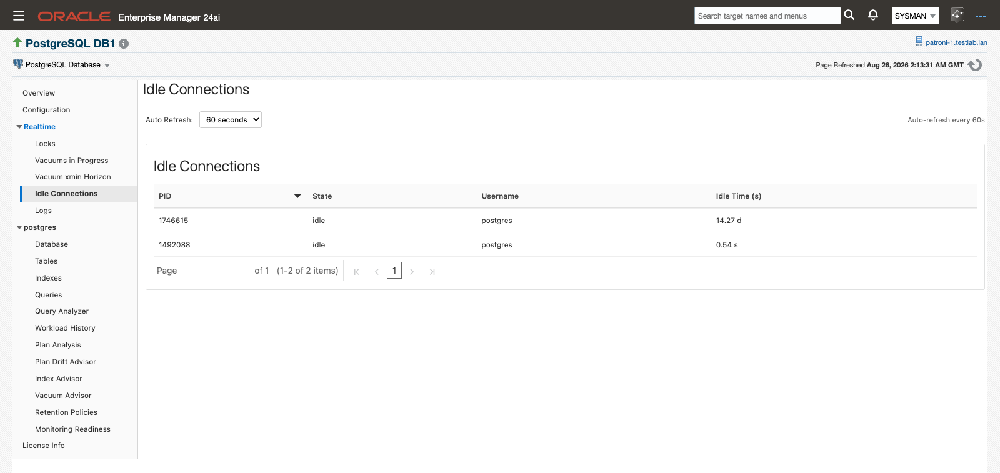

*Idle Connections: sessions sitting idle right now.*

**Idle Connections** lists currently idle PostgreSQL sessions: PID, State (for example `idle` or `idle in transaction`), Username, and Idle Time (s). To terminate idle connections directly rather than just observe them, use the [**Kill Idle PostgreSQL Connections**](jobs-and-metric-extensions.md#kill-idle-postgresql-connections) job.

### Logs

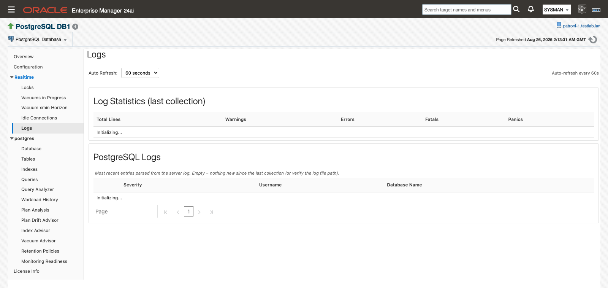

*Logs: recent log-statistic counts and the most recent parsed log entries.*

**Logs** shows the PostgreSQL server log. A **Log Statistics (last collection)** panel reports Total Lines, Warnings, Errors, Fatals, and Panics; it refreshes every 5 minutes regardless of the Auto Refresh setting, which controls only the entries table below it. The **PostgreSQL Logs** table shows the last 500 lines of the configured log file, parsed into Timestamp, Severity, PID, Username, Database Name, and Message. An empty table means nothing new has been parsed since the last collection, or the log file path needs a second look.

This feature works only when the OEM agent is **local** — installed on the same host as the PostgreSQL server. It does not support remote log collection.

#### Setup

1. **Enable logging in PostgreSQL.** PostgreSQL doesn't log to a file by default:
   - Set `log_directory` and `log_filename`, and set `logging_collector = on` in `postgresql.conf`.
   - Reload or restart PostgreSQL.
   - Confirm the OMA (agent) user can read the log file.
2. **Configure the log file path in the plug-in.** On the target's Monitoring Configuration page (target menu ▸ Target Setup ▸ Monitoring Configuration), enter the full path in **Path to postgres log file**. See [Database target properties](targets-and-properties.md#database-properties). The path must point to a file readable by the agent on the same host; remote paths aren't supported.

*Setting the "Path to postgres log file" target property.*

## Schema inventory metrics

The plug-in collects four schema-inventory metrics every 30 minutes: **Trigger**, **Prepared Transactions**, **Sequences**, and **User Function**. They're descriptive inventory, not a page in the tree — find them under the target's **All Metrics** tab (target home page → All Metrics → *metric name*).

| Metric | Internal name | Shows |
|---|---|---|
| Trigger | `triggers` | Database Name, Table ID, Trigger Name, Function ID, Enabled State, and Is Internal (whether the trigger is system-generated). Table and function are identified by ID, not name |
| Prepared Transactions | `prepared_transactions` | Transaction ID, global transaction ID, prepared time, owner, and database — useful for finding stuck two-phase-commit transactions |
| Sequences | `sequences` | Database, schema, sequence name, sequence type, and blocks read/hit |
| User Function | `user_functions` | Schema, function name, call count, total time, and self time. Requires `track_functions = 'all'` in `postgresql.conf` |

OEM's repository persists only numeric metric columns for historical trending. Because these metrics are mostly text (names, states, identifiers), there is little for it to chart. Use the live view under **All Metrics** to inspect current state.

## Cluster target

### Cluster home

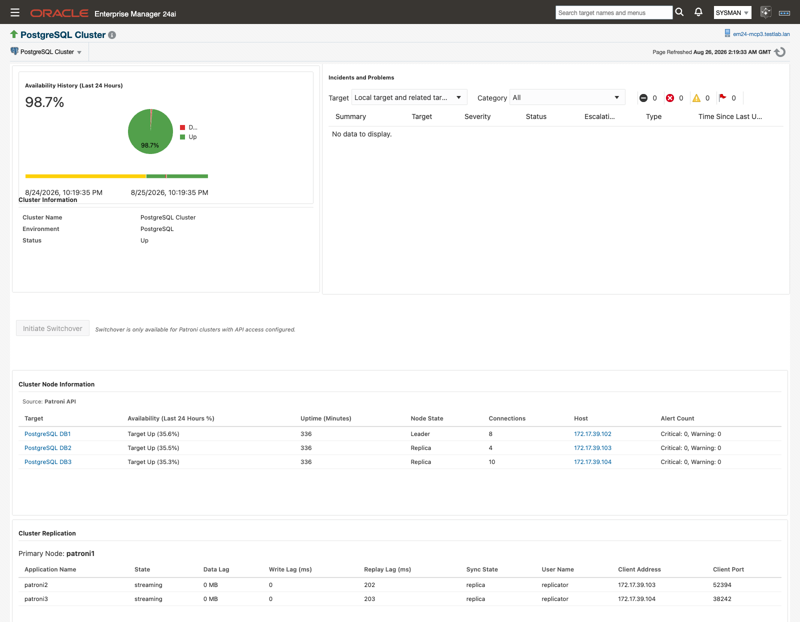

*Cluster home: cluster identity, availability and incidents, node information, and replication.*

The PostgreSQL Cluster target's home page opens on **Cluster Information** (cluster name, environment, status) next to availability and open incidents, then **Cluster Node Information**, listing each member's Target, Availability (Last 24 Hours %), Uptime (Minutes), Node State, Connections, Host, and Alert Count, and **Cluster Replication**, which names the current primary and lists each replica's application name, state, data lag, write/replay lag, sync state, and client info. Open it to check cluster-wide health or run a switchover, rather than drilling into one member's database target.

If the page shows "No Patroni cluster data available," allow up to 24 hours after a Patroni configuration change for the first collection to register; if it persists, verify `patroni_hosts` and `patroni_port` are reachable from the agent host.

### Patroni switchover

For clusters monitored with the Patroni API mode enabled, the cluster home page carries an **Initiate Switchover** button. For any other cluster, the button is disabled with the message "Switchover is only available for Patroni clusters with API access configured."

1. Click **Initiate Switchover**.
2. In the confirmation dialog, optionally pick a **Target Node** — leave it at "Let Patroni Choose (Recommended)" to let Patroni select the best available standby, or name one explicitly.
3. Click **Confirm Switchover**.

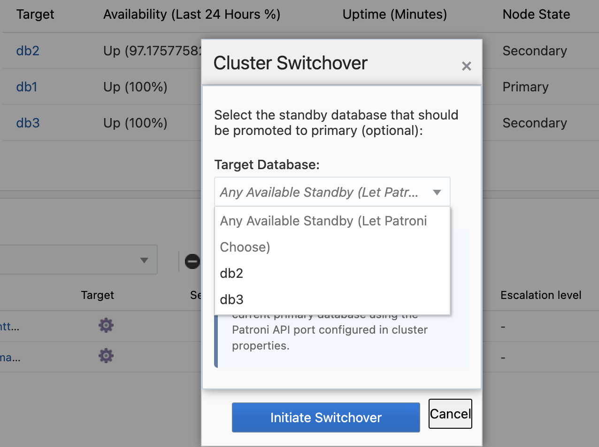

*Confirming a switchover: promotes the selected standby, demotes the current primary.*

Confirming submits an OEM job that calls the Patroni REST API to promote the selected (or Patroni-chosen) standby and demote the current primary; the cluster is briefly unavailable during the operation. Track the job like any other from Enterprise Manager's Job Activity.

### Cluster Events (Patroni) metric

For Patroni-managed clusters with the Patroni API mode enabled, the plug-in also collects the cluster's timeline-switch history as a standard metric, so "when did the cluster last change leaders?" is answerable from Enterprise Manager without a separate tool.

*Cluster Events (Patroni) under All Metrics: one row per historical leader change.*

1. On the cluster target, open **All Metrics** and select **Cluster Events (Patroni)**.
2. Each row is one timeline switch, with columns Timeline, Event Timestamp, New Leader, Reason, LSN, and Event Type.
3. Collection runs hourly; standard OEM metric-history views show the accumulated record.

The metric exists only on targets with [Patroni REST API monitoring](targets-and-properties.md#patroni) enabled; with it off there's nothing to configure and no errors. If the Patroni REST API is unreachable, collection simply returns no rows for that cycle. How far back the history reaches depends on Patroni's own retained history (`max_timelines_history`; Patroni's default keeps everything). Event Type is currently always `timeline_switch` — Patroni's history doesn't reliably distinguish a planned switchover from an unplanned failover, so the plug-in doesn't guess. This metric carries no alert thresholds; it's a retrospective record, and leader-change alerting is handled by the cluster's replication/failover monitoring.

## Related

- [Plan Drift Advisor](plan-drift-advisor.md) — Query Analyzer's drift link lands here, and the Fix Workbench is where a rewrite gets tested.
- [Vacuum Advisor](vacuum-advisor.md) — owns Vacuums in Progress and Vacuum xmin Horizon.
- [Workload History](workload-history.md) — wait-event sampling setup and the Wait Events chart, in depth.
- [Targets and properties](targets-and-properties.md) — the `Plugin License` property, Patroni REST API monitoring, and the rest of the target properties referenced on this page.
- [Jobs and metric extensions](jobs-and-metric-extensions.md) — the Kill Idle PostgreSQL Connections job and Switchover PostgreSQL Cluster job.
