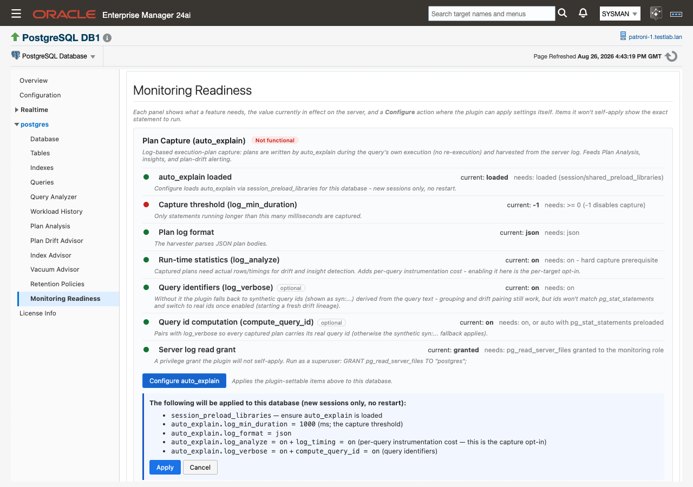
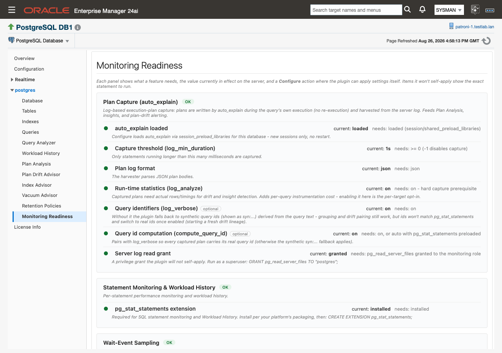

# Monitoring Readiness

When an advisor page sits empty or a feature produces nothing, the cause is usually a missing prerequisite on the database rather than a fault in the plug-in. **Monitoring Readiness** checks each feature against the settings live on the target, shows the value currently in effect next to the value the feature needs, and applies the `auto_explain` settings for you where the plug-in can set them itself. Everything it does here is logging and parameter configuration: it never runs or EXPLAINs a query as part of configuration or collection.

> **Prerequisites for this page**
> - Viewing the page needs only the target's monitoring connection. Readiness is probed by a real-time metric that runs under [the monitoring role](prerequisites.md#monitoring-role), so configuration you set up yourself is detected exactly like configuration the plug-in applied.
> - The **Configure auto_explain** action runs as OEM jobs, so [Preferred Credentials](prerequisites.md#preferred-credentials) must be set for the target.
> - [The server log read grant](prerequisites.md#log-read-grant) must be run by a superuser. The plug-in never applies it for you.
> - [Optional extensions](prerequisites.md#optional-extensions) are installed by you through your own platform packaging. The plug-in detects them automatically and never installs them.

**Where to find it:** on a PostgreSQL Database target, **target navigation tree ▸ _database name_ ▸ Monitoring Readiness**. The same entry appears in the target menu.

**In this page:** The seven panels · Status model · Configure auto_explain · The grant the plug-in never applies · Query identifiers and the syn: fallback · Behaviors · Related

## The seven panels

The page probes once at load and renders seven panels, one per feature, in this order. Each panel carries a status chip; each item inside it carries a status dot, the value in effect on the server ("current: …"), the value the feature needs ("needs: …"), and a sentence explaining the consequence.


*Seven panels, top to bottom: one per feature, each with its own status chip.*

| Panel | What it checks | Required or optional |
|---|---|---|
| **Database Connection** | The monitoring connection every probe below depends on. | Required |
| **Plan Capture (auto_explain)** | The `auto_explain` settings and the log read grant behind log-based plan capture. | Required for **Plan Analysis** and **Plan Drift Advisor** |
| **Statement Monitoring & Workload History** | The `pg_stat_statements` extension. | Required for SQL statement monitoring and **Workload History** |
| **Wait-Event Sampling** | The `pg_wait_sampling` extension. | Optional. Without it, basic monitoring continues |
| **Index Advisor — Enhanced Recommendations** | The `hypopg` and `pg_qualstats` extensions. | Optional. Catalog-native index detection always works without them |
| **Table Bloat Estimates** | The `pgstattuple` extension. | Optional. Adds bloat estimates to the **Vacuum Advisor** |
| **Historical Store** | The agent-side store that holds long-window history. | No action needed |

If **Database Connection** fails, the page reports that live readiness cannot be probed and asks you to verify the target is up and the monitoring credentials are valid. Nothing below it can be trusted until that panel is green.

Plans reach **Plan Analysis** by being written to the server log by `auto_explain` during the query's own execution and harvested from there. No statement is re-executed to capture a plan.

**Historical Store** reports `present (N MB)`, `not created yet`, or `no store path configured`. The store creates itself at the first collection that persists history, so "not created yet" on a new target is expected. See [History store and retention](history-store-and-retention.md#store-size).

### Inside the Plan Capture (auto_explain) panel

This is the panel with the most items, and the only one the plug-in can configure for you.

| Item | needs: | Why it matters |
|---|---|---|
| **auto_explain loaded** | `loaded (session/shared_preload_libraries)` | Configure loads `auto_explain` via `session_preload_libraries` for this database — new sessions only, no restart. |
| **Capture threshold (log_min_duration)** | `>= 0 (-1 disables capture)` | Only statements running longer than this many milliseconds are captured. |
| **Plan log format** | `json` | The harvester parses JSON plan bodies. |
| **Run-time statistics (log_analyze)** | `on - hard capture prerequisite` | Captured plans need actual rows and timings for drift and insight detection. It adds per-query instrumentation cost, so enabling it is the per-target opt-in. |
| **Query identifiers (log_verbose)** — optional | `on` | Without it, plans fall back to synthetic query ids. See [Query identifiers and the syn: fallback](#query-identifiers-and-the-syn-fallback). |
| **Query id computation (compute_query_id)** — optional | `on, or auto with pg_stat_statements preloaded` | Pairs with `log_verbose` so every captured plan carries its real query id. |
| **Server log read grant** | `pg_read_server_files granted to the monitoring role` | The harvester reads the server log file. See [The grant the plug-in never applies](#the-grant-the-plug-in-never-applies). |

## Status model

Every item shows a status dot and every panel a status chip, using three values.

| Status | Meaning |
|---|---|
| **OK** | The current value satisfies what the feature needs. |
| **Attention** | Something is unset, undetermined, or optional-and-absent. The feature still works, with reduced output. |
| **Not functional** | A mandatory item is unmet. The feature will not produce data until you fix it. |

A panel's chip is the worst status among its items, with one deliberate exception: an item tagged "optional" never pushes a panel to **Not functional**. A missing optional extension shows **Attention** on its own row and caps its panel at **Attention**, so a red chip always means a genuine blocker.

## Configure auto_explain {#configure-auto-explain}


*Configure auto_explain: preview, Apply, automatic re-probe.*

When the **Plan Capture (auto_explain)** panel has at least one unmet item the plug-in can set itself, a **Configure auto_explain** button appears at the bottom of that panel, with the hint "Applies the plugin-settable items above to this database." The button is hidden while everything settable is already green, because there is then nothing for it to do.

1. Confirm that Preferred Credentials are set for the target. The apply runs as OEM jobs; without them it fails with "Unable to run job. Verify Preferred Credentials are set for this target."
2. Click **Configure auto_explain**. An inline confirmation opens and previews exactly what will be written, under the heading "The following will be applied to this database (new sessions only, no restart):"
   - `session_preload_libraries` — ensure `auto_explain` is loaded
   - `auto_explain.log_min_duration = <N>` (ms; the capture threshold)
   - `auto_explain.log_format = json`
   - `auto_explain.log_analyze = on` + `log_timing = on` (per-query instrumentation cost — this is the capture opt-in)
   - `auto_explain.log_verbose = on` + `compute_query_id = on` (query identifiers)
3. Check the threshold in the second line. It is prefilled from the value currently in effect on the server, or `1000` ms when the server has none.
4. Click **Apply**, or **Cancel** to close the confirmation without writing anything.
5. Wait for the status line to read "Applied. Re-checking live settings… (new sessions pick the settings up)". The page re-probes once on its own, the panel redraws with the new live values, and the button disappears when everything settable is green.



*The confirmation previews every setting before anything is written.*

Clicking **Configure auto_explain** is the per-target opt-in to `log_analyze`, which is why the preview names its instrumentation cost. Apply records that opt-in first, then applies the settings through the configuration job.



*After the re-probe: every plugin-settable item OK, and the Configure button gone.*

For items the plug-in will not set itself — the log read grant and the extension installs — copy the statement from the item's detail text, run it in your own tooling, and reload the page to see the verdict change.

## The grant the plug-in never applies

One item is deliberately never self-applied: the `pg_read_server_files` privilege. The plug-in reads the server log to harvest plans, and granting itself the privilege to read server files is not a change it will make on your behalf.

The **Server log read grant** item shows the exact statement to run, with your actual monitoring role name already filled in:

```sql
GRANT pg_read_server_files TO "<monitoring role>";
```

Run it as a superuser, then reload the page. Until it is granted, the item reads `not granted` and the **Plan Capture (auto_explain)** panel is **Not functional** — plans are written to the log but nothing can read them back. If the probe cannot determine the grant, the item reads `undetermined` and shows **Attention**.

Extension items behave the same way. Each shows an install hint of the form `CREATE EXTENSION <name>;`, and you install the underlying package through your own platform packaging first.

## Query identifiers and the syn: fallback

Two items in the **Plan Capture (auto_explain)** panel are advisory rather than blocking: **Query identifiers (log_verbose)** and **Query id computation (compute_query_id)**. Both show **Attention** when off, never **Not functional**.

When a captured plan arrives without a real query id, the plug-in computes a synthetic id of the form `syn:<hex-hash>` from the literal-normalized query text. Grouping, plan history, drift detection, and baselines all keep working on synthetic ids, and the `syn:` prefix makes them visible at a glance wherever query ids appear. What you lose is the join to `pg_stat_statements`: synthetic ids will not match the ids reported there.

The readiness row states the consequence directly: without `log_verbose`, "the plugin falls back to synthetic query ids (shown as syn:...) derived from the query text - grouping and drift pairing still work, but ids won't match pg_stat_statements".

Enabling the two settings later is safe but not free of side effects. Affected statements switch from `syn:` ids to real ids and start a fresh drift lineage, so their drift history restarts from that point. If you intend to enable them, enable them before you spend time accepting baselines. Both are included in the **Configure auto_explain** preview, so a single Apply covers them alongside the mandatory items.

## Behaviors

**No polling.** The probe runs once at page load, plus one automatic re-probe after a Configure apply. Nothing refreshes in the background. If you change settings outside the console, reload the page to see the new verdict.

**Units are read and converted.** `log_min_duration` is reported by the server with its unit, for example `2s` or `500ms`. The page shows the value as the server reports it and converts it correctly when prefilling the Configure preview, so a server set to `2s` prefills as `2000` ms.

**New sessions only.** Applied settings take effect for new sessions and need no restart. Long-lived application sessions keep their old settings until they reconnect, so capture from a connection-pooled application may not begin until the pool recycles.

**Pre-existing configuration counts.** Because readiness is probed under the monitoring connection rather than reconstructed from what the plug-in has written, a database you configured yourself shows green exactly like one configured from this page.

## Related

- [Prerequisites](prerequisites.md) — the full setup list behind every panel here, including [the monitoring role](prerequisites.md#monitoring-role) and [optional extensions](prerequisites.md#optional-extensions)
- [Plan Analysis](plan-analysis.md) — what plan capture feeds once this page is green
- [History store and retention](history-store-and-retention.md#store-size) — the store behind the **Historical Store** panel
- [Troubleshooting](troubleshooting.md#unable-to-run-job) — what to do about "Unable to run job. Verify Preferred Credentials are set for this target."
