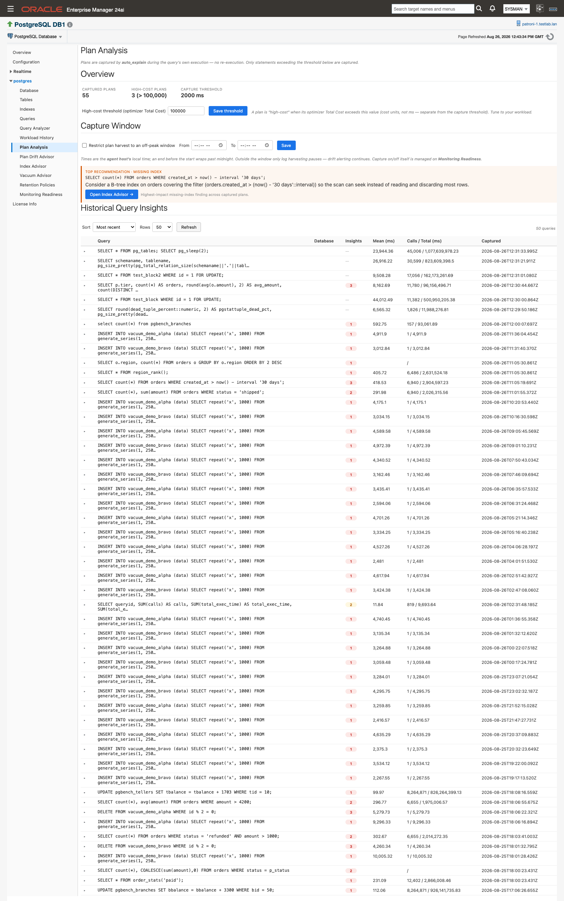
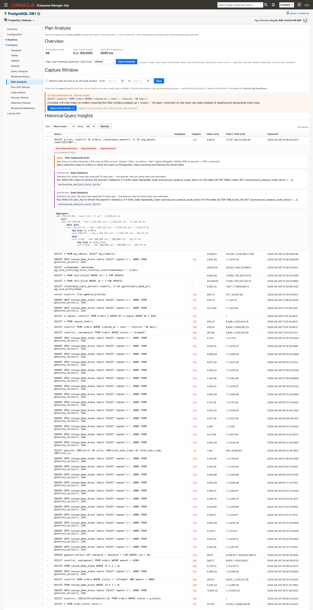
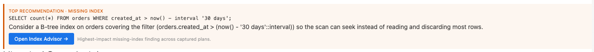

# Plan Analysis

When a query gets slower, the useful evidence is the plan it actually ran, and that plan is usually gone by the time anyone looks. **Plan Analysis** keeps it: the PostgreSQL plug-in harvests execution plans that `auto_explain` already wrote to the server log, stores them on the agent, and runs five detection rules over each one, so a plan that has something wrong with it arrives with the finding and the change to make already attached.

> **Prerequisites for this page**
> - `auto_explain` installed on the target and configured for capture — see [Plan capture (auto_explain)](prerequisites.md#auto-explain). The plug-in configures the module but never installs it.
> - `auto_explain.log_min_duration` set to 0 or higher, `auto_explain.log_format = json`, and `auto_explain.log_analyze = on`. Apply all three from [Configure auto_explain](monitoring-readiness.md#configure-auto-explain) on **Monitoring Readiness**.
> - The `pg_read_server_files` grant on the monitoring role, so the plug-in can read the server log — see [The server log read grant](prerequisites.md#log-read-grant).
> - Every panel on this page is job-backed, so [Preferred Credentials](prerequisites.md#preferred-credentials) must be set for the target's host. If a job aborts, the page raises "Unable to run job. Verify Preferred Credentials are set for this target." See [Unable to run job](troubleshooting.md#unable-to-run-job).
> - A timestamp-first (`%m`-led) `log_line_prefix` and the `stderr` log destination. The harvester does not parse `csvlog` or `jsonlog`.
> - Recommended, not required: `auto_explain.log_verbose = on` and `compute_query_id = on`, so captured plans carry real query ids — see [Statement statistics (pg_stat_statements)](prerequisites.md#pg-stat-statements).

**Where to find it:** on a PostgreSQL Database target, left navigation tree ▸ *database name* ▸ **Plan Analysis**. The target's **PostgreSQL** drop-down menu carries the same entry under the database name.

**In this page:** How plans are captured · The Plan Analysis page · The five insights · Top recommendation banner and Index Advisor link · Plan Insights alerts · Behaviors and caveats

## How plans are captured

Capture is passive. `auto_explain` writes each qualifying statement's plan to the PostgreSQL server log during that query's own execution, and the plug-in reads those plan bodies back out of the log. The plug-in never re-executes a statement and never issues an EXPLAIN of its own as part of capture or configuration. The only EXPLAIN the product ever runs is the **Fix Workbench: Test a Rewrite** panel on [Plan Drift Advisor](plan-drift-advisor.md), and only when you click **Run Explain**.

The harvester finds the current log file with `pg_current_logfile()` and reads it with `pg_read_file()` over the same JDBC connection the plug-in already uses. There is no OS-level file access, so capture behaves identically whether the agent runs on the database host or somewhere else. If the log cannot be read, the plug-in logs a warning and skips the harvest; the collection itself does not fail.

Each capture is stored in the agent-local history store with:

| Stored with every capture | Notes |
|---|---|
| Plan JSON tree | The full node tree as `auto_explain` recorded it, including actual rows and timings |
| Query text | Used for the list, the banner, and the synthetic query id |
| Query id | The real queryid, or a synthetic `syn:` id (below) |
| Capture time | When the plan was harvested |
| Trigger threshold | The `auto_explain.log_min_duration` value that let this statement through |
| Mean and total execution time | Drives the list's Mean (ms) and Calls / Total (ms) columns |

Plan bodies stay on the agent. Nothing plan-body-sized is uploaded to the management repository.

### Query identifiers and the `syn:` fallback

Captured plans are keyed by query id. When a plan arrives without one (usually because `auto_explain.log_verbose` or `compute_query_id` is off, or `pg_stat_statements` is not set up), the plug-in computes a synthetic id of the form `syn:<hash>` from the literal-normalized query text. Grouping, plan history, drift detection, and baselines all keep working on synthetic ids, and the `syn:` prefix makes them visible at a glance.

There is nothing to do about this. If you later enable the query-id settings, the affected statements move from `syn:` ids to real ids and start a fresh lineage, so expect their history to restart from that point.

### How long captures are kept

Captured plans default to a 90-day retention window, set on the [Retention Policies page](history-store-and-retention.md#retention-policies). The archive is additionally bounded by a plan-archive size ceiling of 100 MB with oldest-first eviction, which is not on that page: it is set through the **PostgreSQL - Set Plan Archive Size Ceiling** job, parameter **Captured Plans Size Ceiling (MB)** — see [Store size and disk reclaim](history-store-and-retention.md#store-size). Only flagged poor-performing queries are archived, and any capture that represents an accepted baseline is exempt from eviction.

## The Plan Analysis page

The page header states the capture model directly: "Plans are captured by auto_explain during the query's own execution — no re-execution. Only statements exceeding the threshold below are captured."

1. Open **Plan Analysis** on the PostgreSQL Database target.
2. Read the **Overview** KPI tiles (below).
3. Set the high-cost line: type a value into **High-cost threshold (optimizer Total Cost)** and click **Save threshold**. The confirmation reads "High-cost threshold saved." and the KPI tiles reload straight away.
4. Optionally restrict harvesting to an off-peak window in **Capture Window**.
5. Work the **Historical Query Insights** list: choose a **Sort**, choose how many **Rows** to show, and click **Refresh**.
6. Expand a row to see the captured plan tree and one recommendation card per detected insight.

*The whole page: KPI band, capture-window editor, and the captured-query list.*

### Overview KPIs

| Tile | What it shows |
|---|---|
| Captured plans | How many plans are in the archive for this target |
| High-cost plans | How many of them have an optimizer Total Cost above the high-cost threshold |
| Capture threshold | The `auto_explain.log_min_duration` value in effect on the database. Shows `off` when the setting is `-1`, and "Configured (value unavailable)" when the value cannot be read |

The Capture threshold tile is read from the database rather than from anything you set here, so the page always tells you what is actually being captured. Its tooltip: "auto_explain.log_min_duration in effect at the most recent capture. This setting decides which statements are captured."

### Two thresholds, two different units

These are separate settings and they are not measured in the same thing. Getting them confused is the most common way to misread the page.

| Setting | Unit | Where you set it | What it decides |
|---|---|---|---|
| `auto_explain.log_min_duration` | Milliseconds of execution time | **Monitoring Readiness**, or `postgresql.conf` | Which statements get captured at all. A statement running longer than this many milliseconds has its plan written to the log; `-1` disables capture |
| High-cost threshold | Optimizer cost units | This page, under **Overview** | Which captured plans are labelled high-cost. A plan is high-cost when its optimizer Total Cost exceeds this value |

The high-cost threshold changes nothing about what is captured. It only moves the line the **High-cost plans** KPI counts against. The on-page hint says it plainly: "A plan is 'high-cost' when its optimizer Total Cost exceeds this value (cost units, not ms — separate from the capture threshold). Tune to your workload." Cost units are instance-relative, which is why the default of `100000` is a starting point rather than an answer.

### Capture Window {#capture-window}

Log harvesting can be confined to an off-peak window. Tick **Restrict plan harvest to an off-peak window**, set **From** and **To**, and click **Save**.

- Times are in the **agent host's** local time zone, not the database server's and not yours.
- An end time earlier than the start time wraps past midnight.
- Outside the window only log harvesting pauses. Drift alerting continues.
- Leaving a time field blank leaves that value unchanged. Enabling the window without both times is refused: "Not saved — an enabled window needs both a start and an end time."
- A successful save reports "Saved. Takes effect at the next capture cycle (~15 min)."

The window is a preference. Turning capture on or off is done on **Monitoring Readiness**, not here.

### Historical Query Insights

| Column | What it shows |
|---|---|
| Query | The captured statement text, truncated |
| Database | The database the capture came from |
| Insights | A count of the pathologies detected on this capture, colored by the highest severity present. A clean plan shows a dash |
| Mean (ms) | Mean execution time for the statement |
| Calls / Total (ms) | Call count and total execution time |
| Captured | When the plan was harvested |

Sort by **Most recent** (the default), **Total exec time**, **Mean exec time**, or **Calls**. **Rows** offers 25, 50 (default), 100, and 200.

A dash is not a gap in the data. It means the detection rules found nothing wrong with that plan. The named per-pathology badges appear when you expand the row; a clean capture reads "No insights detected for this capture."

### Expanding a row

Click a row to expand it. The plug-in loads that capture's plan body and renders the plan tree, showing each node's type, cost, estimated versus actual rows, and actual time, nested the way it executed. Beneath the tree, under a **Recommendations** heading, sits one card per detected insight that carries concrete advice. Each card names the pathology, states the evidence behind it, and gives the change to make. Where the advice names a parameter value or a SQL statement, the card carries a **Copy** button for the copy-ready text.

*Expanding a row loads the stored plan body and renders it as a tree.*

*Per node: node type, cost, estimated versus actual rows, and actual time. Recommendation cards sit below.*

Recommendations are review-and-run: you copy them and run them in your own tooling, at a time of your choosing. The plug-in never applies one.

## The five insights

Five detections are surfaced against each newly captured plan. Each carries a severity, which in practice is Medium or High: none of the five rules fires below Medium.

| Insight | What it detects | Typical recommendation |
|---|---|---|
| **Insufficient Index** | A sequential scan that reads a large number of rows and throws most of them away through its filter, returning only a few | A B-tree index covering the filter columns, so the scan can seek instead of reading and discarding |
| **Misestimate** | A plan node whose estimated row count is far away from the rows it actually produced, in either direction | Run ANALYZE on the affected table. If the gap persists, raise the statistics target on the filter or join columns, or `default_statistics_target` |
| **Stale Statistics** | A scanned table that was analyzed a long time ago, or never, so the planner is working from stale row estimates | Run ANALYZE on the table. If it keeps going stale, lower `autovacuum_analyze_scale_factor` for that table |
| **Slow Sequential Scan** | A sequential scan discarding a large absolute number of rows by filter across its loops | Add a selective index on the table, or refine the query so PostgreSQL stops scanning and filtering the whole table |
| **Lossy Bitmap** | A Bitmap Heap Scan whose tuple bitmap outgrew `work_mem` and went lossy, rechecking whole heap pages instead of individual tuples | Raise `work_mem` so the bitmap fits in memory. A more selective index also shrinks the bitmap |

A single plan node can trip more than one rule. A sequential scan that is both unselective and large will raise Insufficient Index and Slow Sequential Scan together, because they are different arguments for the same fix.

## Top recommendation banner and Index Advisor link

When an Insufficient Index finding is the highest-impact insight across every capture on the target, a banner appears above the list. It carries the query text, a plain-language summary of the finding, an estimated improvement factor where one could be computed, and an **Open Index Advisor →** button. The footnote reads "Highest-impact missing-index finding across captured plans."

*The banner promotes the single highest-impact missing-index finding, ranked by severity and then estimated improvement.*

The button navigates to [Index Advisor](index-advisor.md), where the same problem is stated as ranked, ready-to-review index recommendations. A missing index and a bad plan are the same story told from two sides. The banner is hidden when no Insufficient Index finding exists.

## Plan Insights alerts

The page is for investigating. The `plan_insights` metric is for being told. It publishes one row per detected pathology on each query's newest captured plan, keyed on query id, database, and insight code, and it raises a standard Enterprise Manager alert when a High-severity insight appears.

| Metric | Internal name | Collected | Default Warning | Default Critical | Occurrences | Clears when |
|---|---|---|---|---|---|---|
| Plan Insights | `plan_insights` | Every 15 minutes | Severity matches `HIGH` | Not defined | 1 | The insight resolves and drops out of the feed at the next collection |

The collection ships enabled, so once plans are being captured no per-feature setup is needed. Alert text:

- Warning: "PostgreSQL query %query_id% has a HIGH-severity performance insight (%insight_code%) on database %db_name%: %detail%"
- Clear: "PostgreSQL query %query_id% insight %insight_code% on database %db_name% has cleared."

Thresholds are retunable per insight code through the standard Enterprise Manager threshold UI, and the alert routes through whatever notification connector you already have bound. See [Default thresholds for the new metrics](alerts-and-templates.md#default-thresholds) for the shipped values across all metrics.

**Responding to a `plan_insights` alert.** The alert carries the query id and the insight code. Open **Plan Analysis** on the named target, find that query in **Historical Query Insights**, expand it, read the recommendation card for that insight code, and apply the fix in your own tooling.

The related `plan_drifts` metric alerts on a query running on a plan shape outside its accepted baseline set. It is covered on [Plan Drift Advisor](plan-drift-advisor.md).

## Behaviors and caveats

- **Before anything is captured**, the list shows an instruction, not an error: "No captured plans yet. Enable auto_explain (log_min_duration >= 0, log_format = json, log_analyze = on) to populate this panel."
- **`auto_explain.log_analyze` is off by default** and is a hard capture prerequisite, because insights and drift detection both need actual rows and timings. It adds per-query instrumentation cost, which is why enabling it is an explicit per-target opt-in on **Monitoring Readiness**.
- **A DBA editing `postgresql.conf` by hand is detected.** Readiness reads the live values on its next probe, so manual changes show up without any action in the plug-in.
- **A plan body that cannot be rendered says so.** Expanding such a row shows "Could not load the plan.", "No plan body stored for this capture.", or "Could not parse the plan JSON." rather than an empty panel.
- **The high-cost threshold is global for the target**, not per query, and saving it does not re-harvest anything. It reclassifies the plans already stored.
- **Capture-window changes are not retroactive** and take effect at the next capture cycle, roughly 15 minutes.
- **Extensions are detected, never installed.** The plug-in configures `auto_explain` through `session_preload_libraries`, which applies to new sessions only and needs no server restart, but the module itself is installed by you.
- **The `pg_read_server_files` grant is never self-applied.** Monitoring Readiness shows the exact GRANT statement for you to run.

## Related

- [Monitoring Readiness](monitoring-readiness.md) — check and apply the `auto_explain` settings this page depends on
- [Prerequisites](prerequisites.md#auto-explain) — the full capture prerequisites, including the server log read grant
- [Plan Drift Advisor](plan-drift-advisor.md) — baselines, side-by-side plan comparison, and the drift alert, all built on these same captures
- [Index Advisor](index-advisor.md) — where the missing-index banner lands
- [History store and retention](history-store-and-retention.md#retention-policies) — the plan-archive retention window
- [Store size and disk reclaim](history-store-and-retention.md#store-size) — where the plan-archive size ceiling is set
- [Alerts and templates](alerts-and-templates.md#default-thresholds) — every shipped threshold in one table
