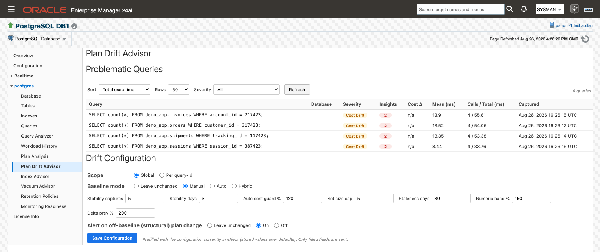
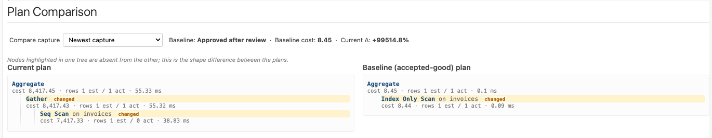
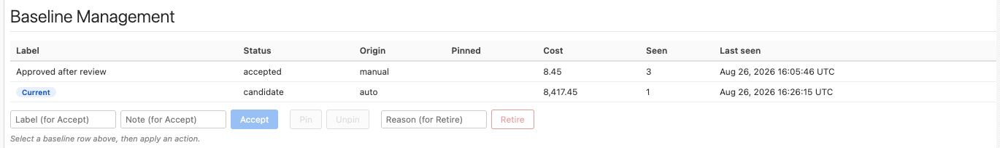
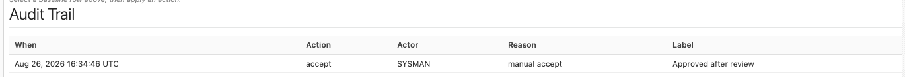
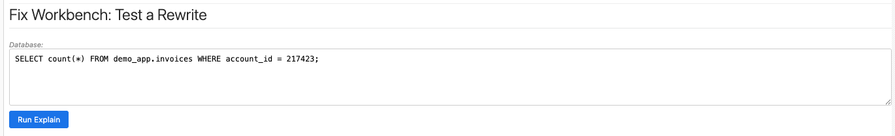
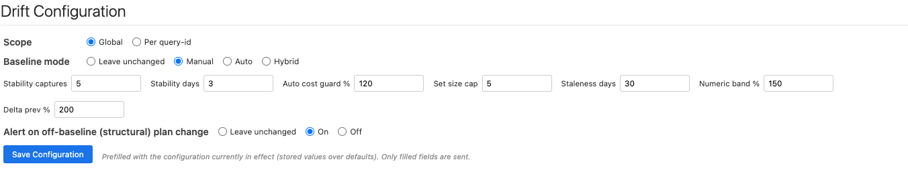

# Plan Drift Advisor

When a query that was fine last week is suddenly slow, the question is rarely what the statement does — it is which plan the statement is running. The Plan Drift Advisor keeps a set of accepted-good ("baseline") plans for each query, compares every newly captured plan against that set, and tells you when a query has left it, both on the page and through a standard Enterprise Manager alert. It reads the same captured-plan archive as **Plan Analysis** (plans written to the server log by `auto_explain` while the query ran, never re-executed to obtain them), so it needs no extensions of its own.

> **Prerequisites for this page**
> - Plan capture is populating the archive: `auto_explain` loaded with `log_min_duration` ≥ 0, `log_format = json`, and `log_analyze = on` ([Plan capture (auto_explain)](prerequisites.md#auto-explain), applied for you from [Configure auto_explain](monitoring-readiness.md#configure-auto-explain)).
> - The monitoring role holds the [server log read grant](prerequisites.md#log-read-grant), so the plug-in can harvest plan bodies from the server log.
> - [Preferred Credentials](prerequisites.md#preferred-credentials) are set for the target. Every panel on this page is read through an Enterprise Manager job; without credentials the panels report "Unable to run job. Verify Preferred Credentials are set for this target." ([Unable to run job](troubleshooting.md#unable-to-run-job)).
> - Optional: `auto_explain.log_verbose = on` and `compute_query_id = on` (or `auto` with [pg_stat_statements](prerequisites.md#pg-stat-statements) preloaded) so captured plans carry real query ids. Without them the plug-in groups statements under a synthetic id shown as `syn:…`, and every feature on this page still works.

**Where to find it:** on a PostgreSQL Database target, the navigation tree under the database name ▸ **Plan Drift Advisor**. The target's PostgreSQL menu carries the same entry.

**In this page:** Problematic Queries · Investigating a query · Severity model · Baseline governance · Fix Workbench: Test a Rewrite · Drift Configuration · Plan Drift alerts · Cross-links with Query Analyzer

## Problematic Queries

This list is the entry point. It holds one row per query and database pair, showing that query's most recent capture, and it only lists queries whose most recent capture scored worse than OK. An empty list means nothing is currently flagged, which reads differently depending on what you have certified so far: until a query has an accepted baseline, only the acute capture-over-capture check can flag it. On a target where you have accepted nothing yet, an empty list says no query has regressed against its own recent history, not that every plan is certified. Once baselines exist, an empty list is the healthy state: nothing is running on an uncertified or degraded plan.

1. Open **Plan Drift Advisor**. The list loads on its own.
2. Set **Sort** to the ordering that matches your question: Total exec time (the default, impact first), Cost Δ vs baseline, Mean exec time, Severity, Calls, or Most recent.
3. Set **Rows** to 25, 50 (the default), 100, or 200.
4. Narrow with the **Severity** filter: All, "Cost drift + plan changed", or "Plan changed only". Use "Plan changed only" when you are working an alert.
5. Click **Refresh** after a collection cycle to pick up newer captures.

*Problematic Queries lists one row per query and database, ordered by total execution time by default.*

| Column | What it shows |
|---|---|
| Query | The statement text. Statements captured without a real query id are grouped under a synthetic id and shown with a `syn:` prefix. |
| Database | The database the statement ran in. Query id plus database is the key for everything on this page. |
| Severity | The drift badge for the newest capture: OK, Cost Drift, or Plan Changed. |
| Insights | How many plan pathologies were detected on the newest captured plan, colored by the highest severity present. A dash means none were found. |
| Cost Δ | How far the newest capture's optimizer total cost sits from the cheapest accepted baseline, as a percentage. Reads `n/a` until the query has an accepted baseline. |
| Mean (ms) | Mean execution time for the capture. |
| Calls / Total (ms) | Call count and total execution time. |
| Captured | When the plan was captured. |

When nothing is drifting the list shows "No problematic queries found." When drift exists but your filter hides it, the list shows "No queries match the current severity filter." — widen the Severity filter rather than reading it as an error.

## Investigating a query

Click a row. The detail panels below the list expand and populate for that query and database, in the order an investigation usually runs: what the numbers are now, when they changed, what is wrong with the plan, how the plan differs from a certified one, and what you want to do about it.

### Selected Query

Five KPIs summarize the newest capture: **Severity**, **Mean exec**, **Calls**, **Cost Δ vs baseline**, and **Captured**. The panel also carries the link "View full statement statistics in Query Analyzer →" for the full `pg_stat_statements` view of the same statement.

### Drift History

This panel answers when the plan went wrong. Set the window with the **From** and **To** fields; they default to the last 24 hours and re-anchor to the 24 hours before the selected query's newest capture, so a query last seen days ago still opens on data. Times are in your browser's local time zone.

The chart plots two series per capture: "Cost Δ vs baseline (%)" against the left axis and "Mean exec (ms)" against the right, so a cost change that did not move real execution time is visible as such. Below it, the **Captures** table lists Captured, Severity, Cost Δ, and Mean (ms) for every capture in the window. Click any capture row to drive the Plan Comparison below from that capture.

An empty chart reads "No captures for this query in the selected time range. Widen the History date range to see more."; the table reads "No captures in the selected time range."

### Insights & Recommendations

The insight rules run against this query's newest captured plan and render as cards, highest severity first. Five detections surface: **Insufficient Index**, **Misestimate**, **Stale Statistics**, **Slow Sequential Scan**, and **Lossy Bitmap**.

Each card carries the detection name with a Low, Medium, or High severity, the plan node it is anchored at, the evidence from the plan, and, where the rule has one, a recommendation with a type chip (Parameter, Index, Statistics, or Review) and the concrete setting to try. Insight severity is a separate scale from the drift severity badge — a High insight on an OK plan means the plan is certified but still doing something expensive.

Recommendations are review-and-run: you run them in your own tooling. The plug-in never applies a recommendation. When there is nothing to report the panel reads "No insights detected for this query's latest capture."

### Plan Comparison

The current plan and the accepted baseline plan are rendered side by side as full plan trees, under the headings "Current plan" and "Baseline (accepted-good) plan". The header line shows the baseline's label, its cost, and the current plan's delta against it. The panel states its own reading rule: "Nodes highlighted in one tree are absent from the other; this is the shape difference between the plans."

Use the **Compare capture** selector to swap the left tree for any historical capture instead of the newest one; the default is "Newest capture". Selecting an older capture changes only the comparison — it does not change which plan shape the query is actually running.

Before you have certified anything, the right-hand tree reads "No accepted baseline for this query yet. Accept one in Baseline Management below." A plan body that cannot be read renders "Could not parse plan JSON." rather than an empty panel.

*Plan Comparison highlights the nodes that exist in one tree and not the other.*

### Baseline Management

Every plan shape the plug-in has observed for this query is a row here, ordered pinned first, then by status, then cheapest.

| Column | What it shows |
|---|---|
| Label | The name you gave the baseline when you accepted it. A baseline accepted without one reads "(unlabeled)", both here and in the selection line under the actions. |
| Status | `candidate` (observed, not certified), `accepted` (in the active baseline set), or `retired` (decertified). |
| Origin | `manual` when a person accepted it, `auto` when the plug-in promoted it. |
| Pinned | Reads "Pinned" when the baseline is exempt from automatic eviction, and is blank otherwise. |
| Cost | The optimizer total cost of the representative capture. |
| Seen | How many captures have matched this shape. |
| Last seen | When the shape was last observed. |

The shape the query is currently running on carries a **Current** badge, with the tooltip "The plan shape this query is currently running on (newest capture)". Choosing an older capture in Plan Comparison does not move the badge.

Select a row first — the actions stay disabled until you do, and the line beneath them reads "Select a baseline row above, then apply an action." Then:

- **Accept** — fill in **Label** and **Note**, then click Accept. The shape joins the accepted set and the query stops being off-baseline.
- **Pin** / **Unpin** — a pinned baseline is never evicted by the set size cap or aged out by staleness. Pin is disabled on an already-pinned row, Unpin on one that is not pinned.
- **Retire** — fill in **Reason**, click Retire, and confirm "Retire this baseline? It will be removed from the active accepted set."

*Baseline Management: every observed shape, its status, and the Accept, Pin, and Retire actions.*

*Selecting the current plan shape, labeling it, and accepting it as a baseline.*

Accepting the current shape is a legitimate answer to a Plan Drift alert: if the new plan is fine, certify it and the alert clears at the next collection.

### Audit Trail

Every baseline action is recorded: **When**, **Action**, **Actor**, **Reason**, and **Label**. The actor is the Enterprise Manager user who clicked, so you can answer who certified a plan, when, and why. Actions the plug-in takes on its own are recorded with the actor `auto` and a reason that says what triggered them, such as promotion after stability or aging out after a period unseen. With no history yet the table reads "No audit events."

*The Audit Trail records who accepted, pinned, or retired each baseline, and why.*

## Severity model

| Badge | Value | What it means |
|---|---|---|
| OK | 0 | The plan the query is running is an accepted shape and its cost is inside tolerance — or the query has no accepted baseline yet and its cost has not jumped against its own previous capture. |
| Cost Drift | 1 | The same plan shape, but cost outside the Numeric band % tolerance, or a capture-over-capture spike past Delta prev %. |
| Plan Changed | 2 | The running plan's shape is not in the accepted baseline set. This is the alertable condition. |

Severity is the worse of two independent checks:

- **The acute check** compares each capture with the previous capture of the same query. It needs no baseline at all, so it catches a sudden regression on a query you have never certified: a cost jump past **Delta prev %**, or a shape change that also costs more than that. On its own this check tops out at Cost Drift.
- **The baseline check** applies once the query has an accepted baseline. If the running shape is in the accepted set, its cost is measured against the cheapest accepted plan and reported as Cost Drift when it exceeds **Numeric band %**. If the shape is not in the accepted set, it is Plan Changed while "Alert on off-baseline (structural) plan change" is on. Turn that switch off and an off-baseline shape is judged on cost alone, which can reach Cost Drift but never Plan Changed.

Improvements are not drift. Both cost comparisons only fire upward, so a plan that gets cheaper produces a negative delta that is displayed but never raises Cost Drift, and a shape change that costs less does not trip the acute check.

Retired baselines behave the way the name implies. A current plan that matches a `retired` row reports Plan Changed, because status describes your certified registry, not what the database is doing. Running a decertified plan is exactly the condition worth telling you about. Resolve it by accepting the plan or by fixing the database.

## Baseline governance

**Baseline mode defaults to Manual.** No plan becomes accepted-good without a named operator action, and that action, its actor, and its rationale land in the Audit Trail. Observed shapes still accumulate as `candidate` rows in the meantime, so when you do decide to certify one, the history is already there.

Automatic promotion is opt-in through the **Auto** baseline mode. Under it, a candidate is promoted once it has been seen at least **Stability captures** times across at least **Stability days**, and only if its cost is at most **Auto cost guard %** of the cheapest accepted plan's cost. That guard is what stops a stable-but-worse plan from quietly certifying itself.

Read Auto cost guard % as a ratio rather than a deviation: 100 means a candidate may be no worse than the accepted best, and a higher value is the multiple you are willing to tolerate. Numeric band % and Delta prev % work the other way round, as deviation percentages measuring how far above a reference a cost has moved. A candidate with no accepted plan to compare against, or with no usable cost, passes the guard.

Two mechanisms bound the accepted set so it does not grow without limit:

- **Set size cap** — when the accepted set exceeds the cap, the least recently seen unpinned accepted baselines are retired.
- **Staleness days** — an accepted, unpinned baseline whose last sighting is older than this is retired automatically, with the reason recorded in the Audit Trail.

**Pin** exempts a baseline from both. Pin the plan you want the query to run in production and it survives the cap and the staleness sweep.

Baselines also protect their evidence: the captured plan behind an accepted or pinned baseline is never removed by the plan archive's age or size eviction, so a comparison you rely on does not disappear when the archive trims. See [Store size and disk reclaim](history-store-and-retention.md#store-size).

## Fix Workbench: Test a Rewrite

This is where you prove a rewrite before it goes anywhere near application code. It is the only EXPLAIN that executes a statement and the only place the plug-in's console runs SQL you supply (custom-query Metric Extensions you define run your own SQL on their schedule — see [Jobs and metric extensions](jobs-and-metric-extensions.md#custom-queries-with-a-metric-extension)), and nothing happens until you click **Run Explain**. The plug-in issues one other EXPLAIN, in the [Index Advisor](index-advisor.md#hypopg-what-if-simulation) HypoPG simulation, but that one is a plan-only `EXPLAIN (FORMAT JSON)` over a synthetic lookup and executes nothing.

1. Select a query in Problematic Queries and scroll to **Fix Workbench: Test a Rewrite**. The panel shows the target database and the query text, prefilled and editable.
2. Replace any parameter placeholders with real values. Captured statements often carry bound-parameter placeholders such as `$1` and `$2`; `SELECT * FROM users WHERE id = $1` has to become `SELECT * FROM users WHERE id = 123` before it can run. Choose values that represent a typical execution — an unrepresentative value produces a plan you cannot learn from.
3. Edit the SQL into the rewrite you want to test. Enter the statement itself: the workbench puts `EXPLAIN (ANALYZE, FORMAT JSON)` in front of what you type, so do not add an EXPLAIN of your own.
4. Click **Run Explain**. The panel shows "Running EXPLAIN…" while the job runs, then renders the resulting plan tree.
5. Compare that tree against the Current and Baseline trees in Plan Comparison above.

*Fix Workbench runs one EXPLAIN (ANALYZE) on demand and renders the plan it produces.*

`EXPLAIN (ANALYZE, ...)` genuinely runs the statement, once, on the database you selected. Treat the button as a deliberate act:

- The statement runs inside a transaction that is rolled back, so `INSERT`, `UPDATE`, and `DELETE` changes do not persist. The execution still takes locks and consumes CPU and I/O while it runs.
- The run is capped at 30 seconds. A rewrite that takes longer is canceled and the panel reports a failure state instead of a plan.
- Use test data or off-peak timing for anything that could contend with production work.
- Nothing schedules this job. There is no background use of the workbench, and the plug-in never executes a statement to obtain a plan, or any proposed rewrite, anywhere else.

Failure states are explicit rather than blank: "Explain failed.", "No plan returned.", or "Could not parse plan JSON."

## Drift Configuration

The **Drift Configuration** panel sits at the bottom of the page and is always visible, whether or not a query is selected. It is prefilled with the configuration currently in effect, and the panel says so: "Prefilled with the configuration currently in effect (stored values over defaults). Only filled fields are sent."

1. Choose the **Scope**: **Global** for the whole target, or **Per query-id** and enter the query id to give one hot query tighter rules than the rest.
2. Choose the **Baseline mode**: **Leave unchanged**, **Manual**, or **Auto**. Leave unchanged means exactly that, and stays selectable so you can back out of a choice before saving.
3. Set the knobs you want to change. Fields you leave blank are not sent, so blanking a field does not reset it.
4. Set **Alert on off-baseline (structural) plan change** to **Leave unchanged**, **On**, or **Off**.
5. Click **Save Configuration**.

*Drift Configuration applies globally or to a single query id.*

| Setting | What it controls |
|---|---|
| Scope | Whether this configuration applies to the whole target (Global) or to one query id. Per-query-id values win over the global ones. |
| Baseline mode | How plans become accepted-good: Manual (an operator accepts each one), or Auto (candidates can be promoted automatically). |
| Stability captures | How many times a candidate shape must be seen before automatic promotion may consider it. |
| Stability days | How long a candidate shape must have been observed before automatic promotion may consider it. |
| Auto cost guard % | The most a candidate may cost, as a percentage **of** the cheapest accepted plan's cost, and still be promoted automatically. A ratio, not a deviation: 100 allows no worse than the accepted best. |
| Set size cap | The maximum number of accepted baselines kept per query. Beyond it, the least recently seen unpinned baselines are retired. Pinned baselines are exempt. |
| Staleness days | How long an accepted, unpinned baseline may go unseen before it is retired automatically. |
| Numeric band % | How far the current plan's cost may deviate from the cheapest accepted baseline before it counts as Cost Drift. |
| Delta prev % | How far a capture's cost may jump from the previous capture of the same query before it counts as Cost Drift. This is the check that works before any baseline exists. |
| Alert on off-baseline (structural) plan change | Whether a running shape that is not in the accepted set reports Plan Changed. With it off, that shape is judged on cost alone. |

Each numeric field arrives prefilled with the value in effect, so read the current setting off the form before you change it.

## Plan Drift alerts

The `plan_drifts` collection raises a standard Enterprise Manager alert when a query starts running on a plan shape outside its accepted baseline set, and inherits the full alerting machinery — editable schedule, retunable thresholds, alert history, and whatever notification connector your Enterprise Manager already routes through.

| Metric | Internal name | Collected | Default Warning | Default Critical | Occurrences | Clears when |
|---|---|---|---|---|---|---|
| Plan Drift | `plan_drifts` | Every 15 minutes | `drift_severity` matches `PLAN_CHANGED` | Not defined | 1 | The query's next collection shows it back on an accepted baseline plan. |

The alert text is:

> PostgreSQL query %query_id% is now running on a plan shape that is not in its accepted baseline set, indicating a possible plan regression.

and the clear text is:

> PostgreSQL query %query_id% has returned to an accepted baseline plan and its plan drift has cleared.

`%query_id%` is replaced with the query id the alert fired on, so the alert names the query to open on this page.

Cost Drift (severity 1) carries no default threshold. Ordinary optimizer-estimate variance would make it noisy across a fleet, so it is advisory by default and you opt into it per query through the standard threshold UI when a particular statement earns the attention. See [Default thresholds for the new metrics](alerts-and-templates.md#default-thresholds).

Accepting the new plan is a valid way to clear a drift alert. The metric reports the state of the query at each collection, so once the running shape is in the accepted set (because you accepted it, or because the database went back to the old plan), the alert clears on its own.

**Responding to an alert.** Open Plan Drift Advisor and select the query the alert names. Read Drift History to find when it changed, Plan Comparison to see what changed, and the Insights cards for the likely cause. Use Fix Workbench to prove a rewrite. Then either accept the new plan in Baseline Management, or fix the underlying cause in your own tooling and let the alert clear when the query returns to a certified plan.

## Cross-links with Query Analyzer

An investigation that starts on one query page carries the query you selected across to the other.

- **Query Analyzer → Plan Drift Advisor.** When a selected statement's query id and database have drift captures, a bar appears with the badge "Plan drift data available" and the link "View this query in Plan Drift Advisor →". Clicking it opens this page with that query preselected: the Problematic Queries row is already selected and the detail panels are populated. The link only appears when there is drift data to land on.
- **Plan Drift Advisor → Query Analyzer.** The Selected Query panel carries "View full statement statistics in Query Analyzer →" for the full `pg_stat_statements` view of the same statement.

The preselection is carried for one navigation and consumed on arrival. Opening Plan Drift Advisor directly from the tree or the target menu gives you the normal unselected list.

## Related
- [Plan Analysis](plan-analysis.md) — the captured-plan archive this page reads, the capture window, and the insight alerts
- [Monitoring Readiness](monitoring-readiness.md#configure-auto-explain) — check and apply the `auto_explain` settings plan capture needs
- [Monitoring pages](monitoring-pages.md) — the Query Analyzer page this one cross-links with
- [Index Advisor](index-advisor.md) — where an Insufficient Index insight turns into a ranked index recommendation
- [History store and retention](history-store-and-retention.md#store-size) — how long captured plans are kept and which ones are protected
- [Alerts and templates](alerts-and-templates.md#default-thresholds) — the shipped thresholds for `plan_drifts` and how to retune them fleet-wide
