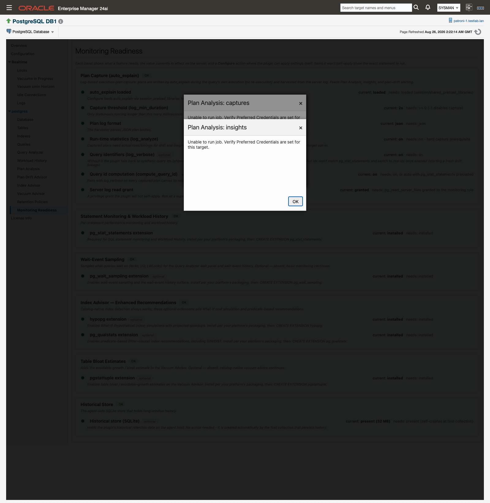

# Prerequisites

If you already monitor PostgreSQL with the plug-in, most of this list is in place today. What the plug-in needs falls into three groups. A monitoring role that can read PostgreSQL's statistics catalogs covers all existing monitoring, and `auto_explain` plus one privilege grant is what plan capture and the advisors built on it require. The third group is a short list of optional extensions that add What-If index simulation, predicate-based index advice, wait-event sampling, and table bloat estimates. Nothing here is applied by the plug-in on your behalf except the `auto_explain` settings, and only when you click **Configure auto_explain**.

**Where to find it:** every item below is checked live, per target, on the database target's **Monitoring Readiness** page.

**In this page:** Supported versions and platforms · Enterprise Manager and agents · Network and connectivity · The monitoring role · Statement statistics (pg_stat_statements) · Plan capture (auto_explain) · The server log read grant · Optional extensions · Preferred Credentials · Agent host · Prerequisites checklist

## Supported versions and platforms {#supported-versions}

| Component | Supported Versions / Platforms |
| :--- | :--- |
| Oracle Enterprise Manager | Cloud Control 13c (13.5.0.0.0+), 24ai (24.1.0.0.0+) |
| PostgreSQL | Versions 14-18 |
| OMA Operating Systems | Microsoft Windows (64-bit), Linux (64-bit) |
| OMS Operating Systems | All Oracle supported OMS platforms |
| PostgreSQL Database OS | All PostgreSQL supported (for remote monitoring) |

## Enterprise Manager and agents {#enterprise-manager}

The same 13.5.15.0.0 build runs on Enterprise Manager 13.5 and on 24ai. The version number tracks the plug-in, not a platform.

Before you add any target, import the plug-in OPAR, deploy it to the OMS, then deploy it to each agent that will monitor a PostgreSQL instance. See [Install and upgrade](install-and-upgrade.md#import).

A valid license key is required before you install; see [License key](install-and-upgrade.md).

## Network and connectivity {#network}

The agent connects to PostgreSQL over JDBC on the database port, 5432 by default. Open that path from the agent host to every instance you monitor, including any replicas you plan to add as targets.

1. Create a PostgreSQL role for monitoring, with access to each database you want monitored.
2. Allow that role to connect from the agent host: add a matching entry to `pg_hba.conf`, and make sure `listen_addresses` accepts connections from that address. See [pg_hba.conf](https://www.postgresql.org/docs/current/auth-pg-hba-conf.html) in the PostgreSQL documentation.
3. Reload the server so the new authentication rule takes effect.

Every read against the monitored PostgreSQL instance travels over this one connection, including reading the server log for captured plans. The plug-in needs no OS-level access to the database host, so a remote agent collects exactly what a local agent collects.

Cluster targets using the Patroni REST API also need a path to the Patroni API port. See [Patroni REST API monitoring](targets-and-properties.md#patroni).

## The monitoring role {#monitoring-role}

The monitoring role reads catalogs and statistics views. It never writes to your data, and the plug-in never grants privileges to itself or to anyone else.

These are the objects the plug-in reads: `pg_stat_*` (including `pg_stat_activity`, `pg_stat_progress_vacuum`, and `pg_stat_statements`), `pg_class`, `pg_index`, `pg_settings`, `pg_replication_slots`, and `pg_prepared_xacts`.

Grant the monitoring role membership in `pg_monitor` (or equivalent read access to the statistics catalogs):

```sql
GRANT pg_monitor TO "<monitoring role>";
```

`pg_monitor` already carries `pg_stat_scan_tables`, which is what pgstattuple's approximate function needs for the table bloat estimates on **Vacuum Advisor**. That function reads a table only when the monitoring role owns it or holds `pg_stat_scan_tables`, so only tables outside that reach are skipped. A skipped table is logged; the collection does not fail.

One capability needs more than `pg_monitor`: plan capture needs the `pg_read_server_files` grant so the plug-in can read the server log. See [The server log read grant](#log-read-grant).

## Statement statistics (pg_stat_statements) {#pg-stat-statements}

`pg_stat_statements` is required for SQL statement monitoring and for **Workload History**. Without it, statement-level pages stay empty.

1. Add `pg_stat_statements` to `shared_preload_libraries` in `postgresql.conf` and restart the server.
2. Run `CREATE EXTENSION pg_stat_statements;` in each database you monitor. Extensions in PostgreSQL are per-database.
3. Confirm the `pg_stat_statements` view is available in the primary database you monitor.

See [pg_stat_statements](https://www.postgresql.org/docs/current/pgstatstatements.html) in the PostgreSQL documentation. Preloading the extension also lets `compute_query_id = auto` produce real query ids, which matters for plan capture.

`track_activities` and `track_counts` must be on. Both are on by default in PostgreSQL.

The **Monitoring Readiness** page reports this extension under its "Statement Monitoring & Workload History" panel.

## Plan capture (auto_explain) {#auto-explain}

Execution plans are captured passively: `auto_explain` writes each qualifying statement's plan into the server log while the query runs, and the plug-in harvests those plan bodies over its existing JDBC connection. There is no re-execution and no plug-in-initiated EXPLAIN.

`auto_explain` ships with PostgreSQL's contrib modules. Install that package on the database server; the plug-in configures the module but does not install it.

| Setting | Required value | Why | Who sets it |
| :--- | :--- | :--- | :--- |
| `session_preload_libraries` | includes `auto_explain` | Loads the module for new sessions. No server restart. | Plug-in (Configure auto_explain) |
| `auto_explain.log_min_duration` | `0` or higher, in milliseconds | The capture threshold: only statements running longer than this are captured. `-1` disables capture. The Configure preview prefills the current server value, or 1000 ms when it is unset. | Plug-in (Configure auto_explain) |
| `auto_explain.log_format` | `json` | The harvester parses JSON plan bodies. | Plug-in (Configure auto_explain) |
| `auto_explain.log_analyze` | `on` | A hard capture prerequisite: captured plans need actual rows and timings for drift and insight detection. It adds per-query instrumentation cost, so enabling it is the per-target opt-in. Applied together with `auto_explain.log_timing = on`. | Plug-in (Configure auto_explain) |
| `auto_explain.log_verbose` | `on`, recommended | Carries the real query id into the captured plan. Without it the plug-in falls back to synthetic ids shown as `syn:…`, derived from the query text. Grouping and drift pairing still work, but the ids will not match `pg_stat_statements`. | Plug-in (Configure auto_explain) |
| `compute_query_id` | `on`, or `auto` with `pg_stat_statements` preloaded. Recommended | Pairs with `log_verbose` so every captured plan carries its real query id. | Plug-in (Configure auto_explain) |
| `logging_collector` | `on` | A current server logfile has to exist for the plug-in to read. | DBA |
| `log_destination` | `stderr` | The harvester parses stderr-format logs. `csvlog` and `jsonlog` are not parsed. | DBA |
| `log_line_prefix` | begins with `%m` | Plan lines are matched by their leading timestamp. | DBA |

Apply the plug-in-settable rows from the **Plan Capture (auto_explain)** panel on **Monitoring Readiness**: click **Configure auto_explain**, review the preview, then click **Apply**. See [Configure auto_explain](monitoring-readiness.md#configure-auto-explain).

[](monitoring-readiness.md)
*Monitoring Readiness reports every prerequisite on this page against the values in effect on the server.*

Applied settings take effect for new sessions only, so long-lived application sessions keep their old settings until they reconnect. If your DBA edits `postgresql.conf` by hand instead, readiness picks up the change on its next probe because it reads live values.

Enabling `log_verbose` and `compute_query_id` after captures already exist starts a fresh drift lineage for the affected statements, because their ids change from `syn:…` to real query ids.

## The server log read grant {#log-read-grant}

The plug-in locates the current log with `pg_current_logfile()` and reads it with `pg_read_file()` over JDBC. That needs one privilege the plug-in deliberately never applies for you. Run it as a superuser, substituting your monitoring role:

```sql
GRANT pg_read_server_files TO "<monitoring role>";
```

The **Plan Capture (auto_explain)** panel on **Monitoring Readiness** shows this statement with your actual role name already filled in, ready to copy.

Without the grant, all other monitoring works normally and no plans are captured, so **Plan Analysis** and **Plan Drift Advisor** stay empty. If the log is unreadable, the plug-in logs a warning and skips the harvest; collection never fails.

## Optional extensions {#optional-extensions}

Extensions are per-database. Run `CREATE EXTENSION <name>;` in each database you want covered. The plug-in detects extension presence on every collection and never installs anything. When an extension is absent, the feature it powers returns zero rows and its page section is simply empty, which is a healthy state, not an error.

| Extension | What it enables | Install |
| :--- | :--- | :--- |
| `hypopg` | What-If hypothetical-index simulations with projected speedups on **Index Advisor**. | PGDG package `postgresql-<ver>-hypopg`, then `CREATE EXTENSION hypopg;` |
| `pg_qualstats` | Predicate-based, filter-clause index recommendations on **Index Advisor**, including GIN and GIST. | PGDG package `postgresql-<ver>-pg-qualstats`, then `CREATE EXTENSION pg_qualstats;`. Needs the library in `shared_preload_libraries`, which means a restart |
| `pg_wait_sampling` | Wait-event sampling and the Wait Events chart on **Query Analyzer**. | PGDG package `postgresql-<ver>-pg-wait-sampling`, then `CREATE EXTENSION pg_wait_sampling;`. Needs the library in `shared_preload_libraries`, which means a restart |
| `pgstattuple` | Table bloat and avoidable-growth estimates on **Vacuum Advisor**. | Ships in the PostgreSQL contrib package, then `CREATE EXTENSION pgstattuple;` |

Install `hypopg` and `pg_qualstats` together. Catalog-native index detection works on every target with no extension at all, but the two extensions together are the intended everyday **Index Advisor** experience: simulated cost validation from `hypopg`, observed-predicate recommendations from `pg_qualstats`.

For `pg_wait_sampling`, set `pg_wait_sampling.profile_queries` to `all` or `top`, otherwise the profile carries no per-query rows. The extension is not included in most PostgreSQL distributions and is not available on Windows, but most package managers carry it.

For `pgstattuple`, a monitoring role with `pg_monitor` already holds the `pg_stat_scan_tables` the estimate needs. See [The monitoring role](#monitoring-role).

## Preferred Credentials {#preferred-credentials}

Some plug-in pages read their data through Enterprise Manager jobs that run on the target's host, and those jobs need OEM Preferred Credentials set for the target. Set them once per target under Setup, Security, Preferred Credentials. See [Configuring and Using Target Credentials](https://docs.oracle.com/en/enterprise-manager/cloud-control/enterprise-manager-cloud-control/24.1/emsec/configuring-and-using-target-credentials.html) in the Oracle documentation.

Preferred Credentials are needed by:

- **Workload History**
- **Plan Analysis**
- **Plan Drift Advisor**
- **Retention Policies**
- The "Autovacuum runs · 24h" KPI on **Vacuum Advisor**
- The **Configure auto_explain** action on **Monitoring Readiness**

When they are missing, the page raises "Unable to run job. Verify Preferred Credentials are set for this target."

**Monitoring Readiness** itself reads through the monitoring connection, not a job, so the page loads and reports status without Preferred Credentials. Only its Configure action needs them.

## Agent host {#agent-host}

Decide where the agent runs before you add targets. Both models are supported and collect the same data:

- **Local agent**, on the database host.
- **Remote agent**, connecting out to the database. Plan capture works here too, because the log is read over JDBC rather than from the filesystem.

Two things depend on that choice.

**The collection throttle** applies to local agents on Linux hosts. It skips heavier scheduled collections while agent-host CPU or memory sits above thresholds you set. On a remote agent the CPU reading would be the management host's rather than the database host's, so leave the throttle properties empty on remote-agent targets. Non-Linux agent hosts never throttle. The feature is off until you set a threshold. See [Collection throttle properties](targets-and-properties.md#throttle-properties) and [Collection throttle](history-store-and-retention.md#collection-throttle).

**Disk headroom** on the agent host for the agent-local history store, a SQLite file per target under `%plugin_data%`. The store is created automatically by the first collection that persists history; there are no manual steps. How large it gets is governed by three things you control: the capture threshold, the retention windows, and the store size ceilings. See [Store size and disk reclaim](history-store-and-retention.md#store-size).

## Prerequisites checklist {#checklist}

Copy the list that matches what you want from the release.

**Minimum (all existing monitoring)**

- [ ] PostgreSQL 14-18
- [ ] Enterprise Manager 13.5.0.0.0+ or 24ai 24.1.0.0.0+
- [ ] A valid license key
- [ ] Plug-in OPAR imported, deployed to the OMS, deployed to the monitoring agent(s)
- [ ] Agent host on Linux 64-bit or Windows 64-bit, with a network path to the database (JDBC, port 5432 by default)
- [ ] Monitoring role created, with a matching `pg_hba.conf` entry for the agent host
- [ ] `GRANT pg_monitor TO "<monitoring role>";` (or equivalent read access to the statistics catalogs)
- [ ] `track_activities` and `track_counts` on (PostgreSQL defaults)
- [ ] `pg_stat_statements` in `shared_preload_libraries`, and `CREATE EXTENSION pg_stat_statements;` in each monitored database
- [ ] OEM Preferred Credentials set for the target
- [ ] Disk headroom on the agent host for the agent-local history store

**Full advisory capability (adds to the minimum)**

- [ ] `auto_explain` module installed on the database server (contrib package)
- [ ] `logging_collector = on`
- [ ] `log_destination = stderr` (not `csvlog`, not `jsonlog`)
- [ ] `log_line_prefix` begins with `%m`
- [ ] `session_preload_libraries` includes `auto_explain`
- [ ] `auto_explain.log_min_duration` set to your capture threshold in milliseconds, `0` or higher
- [ ] `auto_explain.log_format = json`
- [ ] `auto_explain.log_analyze = on`, applied together with `auto_explain.log_timing = on`
- [ ] `auto_explain.log_verbose = on`
- [ ] `compute_query_id = on`, or `auto` with `pg_stat_statements` preloaded
- [ ] `GRANT pg_read_server_files TO "<monitoring role>";` run by a superuser
- [ ] Optional: `hypopg` and `pg_qualstats` for the full **Index Advisor** output
- [ ] Optional: `pg_wait_sampling`, with `pg_wait_sampling.profile_queries` set to `all` or `top`
- [ ] Optional: `pgstattuple` (the `pg_stat_scan_tables` it needs comes with `pg_monitor`; tables the role neither owns nor can scan are skipped)

The six `auto_explain` and `compute_query_id` rows above are applied for you by **Configure auto_explain** on **Monitoring Readiness**. The rest are yours to set.

## Related

- [Install and upgrade](install-and-upgrade.md#import) — import the OPAR and deploy it to the OMS and agents
- [Targets and properties](targets-and-properties.md#throttle-properties) — add targets and set the throttle properties
- [Monitoring Readiness](monitoring-readiness.md#configure-auto-explain) — check every prerequisite live, and apply the `auto_explain` settings
- [History store and retention](history-store-and-retention.md#store-size) — what the agent-local store holds and how to bound its size
