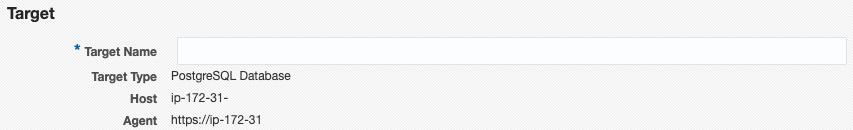
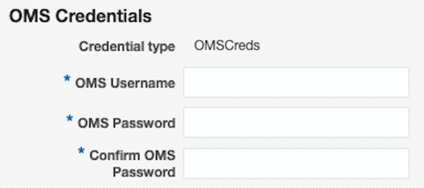
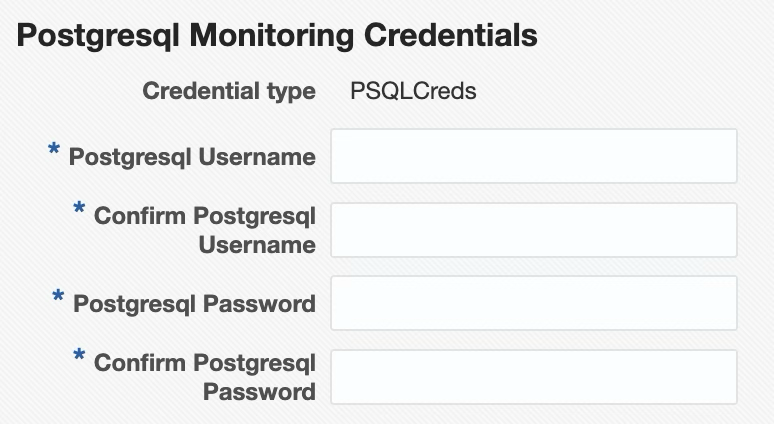
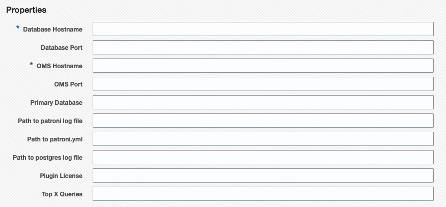
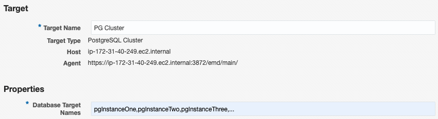
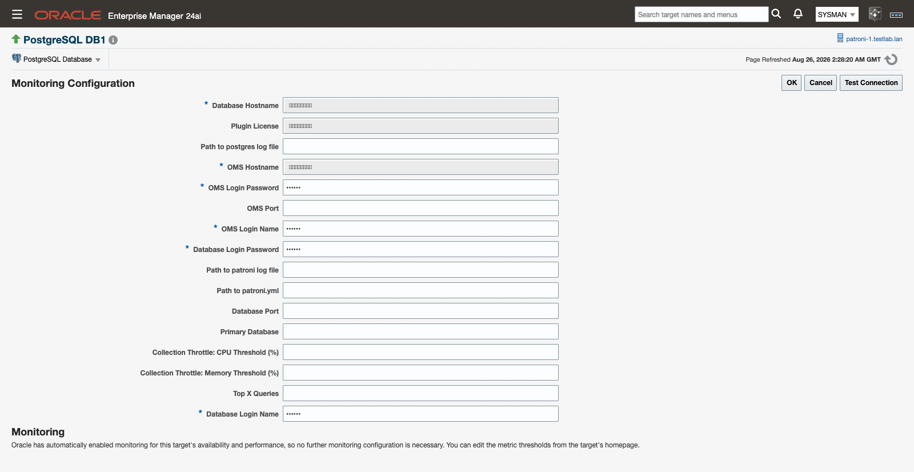

# Targets and properties

Before the PostgreSQL plug-in can monitor anything, you add each PostgreSQL instance as a target in Enterprise Manager. Most deployments also add one PostgreSQL Cluster target that groups the instances belonging to the same Patroni-managed cluster, so replication and failover can be viewed in one place. This page covers both target types, every target property, and how to add targets from the command line with EM CLI.

> **Prerequisites for this page**
> - The plug-in deployed to the OMS and to the agent host that will monitor the target — see [Deploy to the OMS](install-and-upgrade.md#deploy-oms) and [Deploy to agents](install-and-upgrade.md#deploy-agents).
> - A PostgreSQL login for [the monitoring role](prerequisites.md#monitoring-role), and for local monitoring, an [agent host](prerequisites.md#agent-host) on the database server.

**Where to find it:** Setup ▸ Add Target ▸ Add Targets Manually. To change properties on a target you already added, open the target and go to Target Setup ▸ Monitoring Configuration.

**In this page:** Add a PostgreSQL Database target · Database target properties · Add a PostgreSQL Cluster target · Cluster target properties · Patroni REST API monitoring · Collection throttle properties · Add targets with EM CLI

## Add a PostgreSQL Database target {#add-database-target}

1. From Oracle Enterprise Manager, go to **Setup → Add Target → Add Targets Manually**.
2. Select the host running the agent the plug-in is deployed to, choose the **PostgreSQL Database** target type, and click **Add**.
3. Enter the target name.

   
   *Enter the target name.*

4. Enter the Oracle Management Server username and password, used to validate the target count against your license.

   
   *Enter the OMS username and password for target-count validation.*

5. Enter the credentials for the PostgreSQL target.

   
   *Enter the credentials for the PostgreSQL target.*

6. Enter the target properties (see [Database target properties](#database-properties) below), then click **Next** and **Save**.

   
   *The Database target properties screen.*

> The "primary" database is the only place the plug-in collects SQL statement statistics from — any database `pg_stat_statements` is queried against returns statistics for statements run across every database on the server. Make sure `pg_stat_statements` is viewable from the primary database, or no query statistics are collected.

## Database target properties {#database-properties}

| Target Property | Description |
| :--- | :--- |
| Database Hostname | Host name of the PostgreSQL server. |
| Database Login Name | Entered on the credential screen; stored as a monitoring credential, not a target property. |
| Database Login Password | Entered on the credential screen; stored as a monitoring credential, not a target property. |
| Database Port | PostgreSQL port number (default is `5432`). |
| OMS Hostname | Hostname of the Oracle Management Server (used for agent service validation). |
| OMS Login Name | Entered on the credential screen; stored as a monitoring credential, not a target property. |
| OMS Login Password | Entered on the credential screen; stored as a monitoring credential, not a target property. |
| OMS Port | OMS HTTPS console port (default is `7803`, used for target count validation). |
| Primary Database | The database the plug-in connects to for statement statistics (default is `postgres`). |
| Path to patroni log file | Absolute path, including file name, to the Patroni log file. |
| Path to postgres log file | Absolute path, including file name, to the PostgreSQL log file. |
| Path to patroni.yml | Absolute path, including file name, to `patroni.yml`. |
| Plugin License | Your plug-in license key. |
| Top X Queries | Limits the number of rows returned for the SQL Statement metric groups, ordered by execution time. Default: 10. |
| Collection Throttle: CPU Threshold (%) | Agent-host CPU usage percentage at or above which the plug-in pauses its heavier scheduled collections. See [Collection throttle properties](#throttle-properties). |
| Collection Throttle: Memory Threshold (%) | Agent-host memory usage percentage at or above which the plug-in pauses its heavier scheduled collections. See [Collection throttle properties](#throttle-properties). |

The Database Login Name/Password and OMS Login Name/Password are entered on the credential screens above, not on the properties screen — they are stored as monitoring credentials rather than plain target properties.

## Add a PostgreSQL Cluster target {#add-cluster-target}

1. Add a [PostgreSQL Database target](#add-database-target) for every instance in the cluster first.
2. From Oracle Enterprise Manager, go to **Setup → Add Target → Add Targets Manually**.
3. Select the host running the agent the plug-in is deployed to, choose the **PostgreSQL Cluster** target type, and click **Add**.
4. Enter the target properties (see [Cluster target properties](#cluster-properties) below), then click **Next** and **Save**.

## Cluster target properties {#cluster-properties}


*The Cluster target properties screen.*

| Target Property | Description |
| :--- | :--- |
| Database Target Names | Comma-separated list, without spaces, of previously added PostgreSQL Database target names. |
| Patroni REST Hostnames (comma-separated) | (Optional) Comma-separated hostnames of the Patroni REST API endpoints, one per cluster node. When set, the plug-in uses the Patroni REST API as the source of cluster topology and replication state. Leave blank to fall back to per-database collection. |
| Patroni API Port | (Optional) TCP port of the Patroni REST API (Patroni default is `8008`). |
| Patroni REST SSL Mode (disable \| require \| verify-full; default: disable) | (Optional) `disable` (default — plain HTTP), `require` (HTTPS without certificate validation; suitable for self-signed certificates on a trusted internal network), or `verify-full` (HTTPS with full certificate-chain and hostname verification). |
| Patroni REST CA Certificate Path (PEM file on agent host; used when sslmode=verify-full) | (Optional) Absolute path to a PEM-format CA certificate file on the agent host. Used when Patroni REST SSL Mode is `verify-full` to validate the REST API's server certificate. |
| Patroni REST Username (leave blank if REST API has no authentication) | (Optional) Username for HTTP Basic authentication against the Patroni REST API. Leave blank if the REST API has no authentication configured. |
| Patroni REST Password (leave blank if REST API has no authentication) | (Optional) Password for HTTP Basic authentication against the Patroni REST API. |
| Collection Throttle: CPU Threshold (%) | Agent-host CPU usage percentage at or above which the plug-in pauses its heavier scheduled collections. See [Collection throttle properties](#throttle-properties). |
| Collection Throttle: Memory Threshold (%) | Agent-host memory usage percentage at or above which the plug-in pauses its heavier scheduled collections. See [Collection throttle properties](#throttle-properties). |

## Patroni REST API monitoring {#patroni}

For PostgreSQL clusters managed by [Patroni](https://patroni.readthedocs.io/), the plug-in can collect cluster topology and replication state directly from the Patroni REST API instead of inferring it from per-database metrics. To enable this, populate the **Patroni REST Hostnames** target property with one hostname per cluster node, and adjust **Patroni API Port** if Patroni is not running on `8008`.

When **Patroni REST Hostnames** is blank, the plug-in falls back to its existing per-database collection model.

The plug-in supports three TLS modes for the Patroni REST API, set with the **Patroni REST SSL Mode** property:

- `disable` (default) — plain HTTP.
- `require` — HTTPS, but the server certificate is not validated. Use only on a trusted internal network where the Patroni REST endpoints present self-signed certificates.
- `verify-full` — HTTPS with full certificate-chain and hostname verification. When using a private CA, set **Patroni REST CA Certificate Path** to the absolute path of a PEM-format CA bundle on the agent host.

If your Patroni REST API requires HTTP Basic authentication, set both **Patroni REST Username** and **Patroni REST Password**. Otherwise leave both blank.

With Patroni REST API mode enabled, the cluster target also collects the **Cluster Events (Patroni)** metric, a durable record of timeline switches (leader changes from failovers and switchovers). See [Monitoring pages](monitoring-pages.md) for its columns.

> **Just upgraded?** The Cluster Home page may show an "Error getting meta-data" popup for a short time after an upgrade, until the OMS refreshes its metadata. See [Error getting meta-data after an upgrade](troubleshooting.md#error-getting-meta-data) if you run into this.

## Collection throttle properties {#throttle-properties}

Set **Collection Throttle: CPU Threshold (%)** and **Collection Throttle: Memory Threshold (%)** on a Database or Cluster target to make the plug-in skip its heavier scheduled collections while the agent host is under pressure, instead of adding load to it.


*The collection throttle properties on the Monitoring Configuration page.*

- Each property is a percentage from 0 to 100. Leave a property empty to disable that resource's gate (an invalid value has the same effect).
- Leave both properties empty to keep the feature off. This is the default.
- The properties apply to local-agent deployments on Linux hosts only. On a remote agent, the CPU and memory readings would belong to the management host rather than the database host, so leave both properties empty on remote-agent targets.
- A change to either property takes effect within one 5-minute collection cycle.

For what happens while the gate is active (the banner, the `collection_throttle` metric, and which collections are never gated), see [Collection throttle](history-store-and-retention.md#collection-throttle).

## Add targets with EM CLI {#emcli}

You can also add targets from the command line with `emcli add_target`, using the same property names shown in the tables above. This is useful for scripting a fleet rollout.

### Database target

The Database Login Name/Password and OMS Login Name/Password are `CREDENTIAL="TRUE"` monitoring credentials rather than plain properties, so pass them with `-credentials` on the same `add_target` call, alongside `-properties`:

```sh
emcli add_target \
  -name="pg-orders-01" \
  -type="ip_postgresql_db" \
  -host="agenthost.example.com" \
  -properties="host:pg01.example.com;port:5432;primarydb:postgres;license:<YOUR_LICENSE_KEY>;omshost:oms.example.com;omsport:7803;topxqueries:10;logfile:/var/log/postgresql/postgresql.log;throttle_cpu_threshold:80;throttle_mem_threshold:80" \
  -subseparator="properties=:" \
  -credentials="username:<username>;password:<password>;omsusername:<oms_username>;omspassword:<oms_password>"
```

### Cluster target

```sh
emcli add_target \
  -name="pg-orders-cluster" \
  -type="ip_postgresql_cluster" \
  -host="agenthost.example.com" \
  -properties="dbtargets:pg-orders-01,pg-orders-02,pg-orders-03;patroni_port:8008;patroni_hosts:pg01.example.com,pg02.example.com,pg03.example.com;patroni_sslmode:verify-full;patroni_ca_cert_path:/etc/patroni/ca.pem" \
  -subseparator="properties=:"
```

If the Patroni REST API requires HTTP Basic authentication, set the Patroni REST username and password afterward as a monitoring credential:

```sh
emcli set_monitoring_credential \
  -target_name="pg-orders-cluster" -target_type="ip_postgresql_cluster" \
  -set_name="PatroniRESTCredsMonitoring" -cred_type="PatroniRESTCreds" \
  -attributes="Patroni_Username:<username>;Patroni_Password:<password>"
```

You do not set `use_patroni_api_for_metrics` yourself; the agent derives it from **Patroni REST Hostnames** — non-empty means Patroni API mode is on.

## Related

- [Prerequisites](prerequisites.md) — supported versions, the monitoring role, and agent-host requirements before you add a target.
- [Install and upgrade](install-and-upgrade.md) — deploy the plug-in to the OMS and to agents before adding targets.
- [History store and retention](history-store-and-retention.md#collection-throttle) — what the collection throttle banner and metric show while the gate is active.
- [Monitoring pages](monitoring-pages.md) — the Cluster Home page and the Cluster Events (Patroni) metric.
- [Troubleshooting](troubleshooting.md#error-getting-meta-data) — "Error getting meta-data" after an upgrade.
