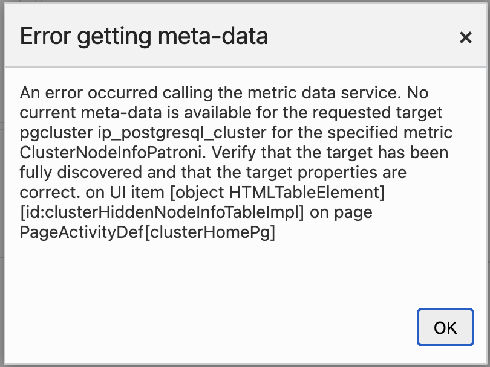

# Troubleshooting

When an advisor page sits empty, a KPI shows a placeholder, or an action fails outright, the cause is almost always a missing prerequisite or a job still waiting on Preferred Credentials, not a fault in the plug-in. Find the exact message or symptom you're seeing below and work the fix.

**In this page:** Unable to run job · Error getting meta-data after an upgrade · Monitoring Readiness shows "Not functional" · Plan Analysis shows "No captured plans yet" · Query ids show as `syn:` · Workload History is empty or shows "Accumulating" · Autovacuum runs KPI shows "—" · An amber banner says collections are paused · Index Advisor sections are empty · Support

## Unable to run job {#unable-to-run-job}

**Symptoms:** "Unable to run job. Verify Preferred Credentials are set for this target."

**Cause:** This message appears wherever a page or action reads its data through an Enterprise Manager job instead of the live monitoring connection, and the PostgreSQL target has no **Agent Host Credentials** set under Preferred Credentials. It can show up on **Workload History**, **Plan Analysis**, **Plan Drift Advisor**, **Retention Policies**, the "Autovacuum runs · 24h" KPI on **Vacuum Advisor**, and the **Configure auto_explain** action on **Monitoring Readiness**.

**Fix:**
1. Go to Setup, Security, Preferred Credentials, and open the **PostgreSQL Database** target type.
2. Under **Target Preferred Credentials**, select the target's **Agent Host Credentials** row, click **Set**, choose a named host credential for the agent host, and click **Test and Save**. Normal Host Credentials set on the host target are a different set; the jobs do not read them.
3. Reload the page, or retry the action.

**Related:** [Preferred Credentials](prerequisites.md#preferred-credentials)

## Error getting meta-data after an upgrade {#error-getting-meta-data}

**Symptoms:** An "Error getting meta-data" popup like the one below, opening the Cluster Home Page.



*The popup as it can appear right after an upgrade, before the OMS completes its metadata refresh.*

**Cause:** After you upgrade the plug-in, the OMS does not immediately register the new metric metadata that ships with the release. Until the OMS completes its next metadata refresh, opening the Cluster Home Page can produce this popup, because the page requests a metric (for example, `ClusterNodeInfoPatroni`) that the OMS does not yet recognize. This is expected after an upgrade and clears without intervention. The OMS metadata refresh runs on its own schedule and can take up to 24 hours.

**Fix:**
1. Wait for the next automatic OMS metadata refresh. No action is required; the error clears once the refresh finishes.
2. To force the refresh sooner, restart the OMS. Run the following on the OMS host:

   ```
   emctl stop oms -all
   emctl start oms
   ```

   `emctl stop oms -all` stops the OMS together with the WebLogic Admin Server and Node Manager so the metadata is reloaded on the next start. Once the OMS is back up, reload the Cluster Home Page and the error will be gone.

**Related:** [After an upgrade](install-and-upgrade.md#after-upgrade)

## Monitoring Readiness shows "Not functional" {#monitoring-readiness-not-functional}

**Symptoms:** A panel's status chip reads **Not functional** on **Monitoring Readiness**.

**Cause:** A panel's chip is the worst status among its mandatory items. **Not functional** means a required item is unmet and the feature will not produce data until you fix it — most often `auto_explain` not loaded or not fully configured, or the `pg_read_server_files` grant missing so the harvester cannot read back the plans `auto_explain` already wrote to the log.

**Fix:**
1. Open the panel and read its items top to bottom: each shows the value currently in effect on the server ("current: …") next to what it needs ("needs: …"), with a sentence explaining the consequence.
2. For anything the plug-in can set itself, click **Configure auto_explain** and apply it.
3. For the server log read grant, copy the `GRANT pg_read_server_files TO "<monitoring role>";` statement shown on that item and run it as a superuser.
4. Reload the page. Readiness is probed at page load only — there is no background polling.

**Related:** [Monitoring Readiness](monitoring-readiness.md)

## Plan Analysis shows "No captured plans yet" {#plan-analysis-no-captured-plans}

**Symptoms:** "No captured plans yet. Enable auto_explain (log_min_duration >= 0, log_format = json, log_analyze = on) to populate this panel."

**Cause:** This is an instruction, not an error. Nothing has been harvested from the server log yet, usually because `auto_explain` is not loaded or not fully configured for capture on the target.

**Fix:**
1. Open [Monitoring Readiness](monitoring-readiness.md) on the same target and check the **Plan Capture (auto_explain)** panel.
2. Click **Configure auto_explain** to apply the items the plug-in can set for you, or set them yourself — see [Plan capture (auto_explain)](prerequisites.md#auto-explain).
3. Wait for a statement to run longer than the capture threshold (`log_min_duration`). Only statements that run longer than this are captured.
4. Reload **Plan Analysis**.

**Related:** [Plan Analysis](plan-analysis.md)

## Query ids show as `syn:` {#query-ids-show-as-syn}

**Symptoms:** Query ids display as `syn:<hex-hash>` instead of matching the ids reported by `pg_stat_statements`.

**Cause:** A captured plan arrived without a real query id — typically because `auto_explain.log_verbose` or `compute_query_id` is off, or `pg_stat_statements` is not set up. The plug-in computes a synthetic id from the literal-normalized query text so grouping, plan history, drift detection, and baselines keep working; only the join to `pg_stat_statements` is lost.

**Fix:**
1. No fix is required for this by itself — synthetic ids keep every advisor working, and the `syn:` prefix just makes them visible at a glance.
2. To get real ids instead, enable `auto_explain.log_verbose = on` and `compute_query_id = on` (or `auto` with `pg_stat_statements` preloaded). Both are included in the **Configure auto_explain** preview on **Monitoring Readiness**.
3. Enable them before you spend time accepting baselines: affected statements switch from `syn:` ids to real ids and start a fresh drift lineage, so their drift history restarts from that point.

**Related:** [Monitoring Readiness](monitoring-readiness.md#query-identifiers-and-the-syn-fallback)

## Workload History is empty or shows "Accumulating" {#workload-history-empty-or-accumulating}

**Symptoms:** "No workload history yet for this window." in the Workload Detail list, or "Accumulating" on the Workload vs prior window KPI.

**Cause:** Two different gaps look similar:
- The list is empty because `pg_stat_statements` is not installed or enabled on the target, or because history has not accumulated yet — a fresh install starts at "0 days" of history depth.
- The KPI shows "Accumulating" because there is no comparable prior-window data yet to compute the vs-prior-window percentage against.

**Fix:**
1. Confirm `pg_stat_statements` is installed and enabled — see [Statement statistics (pg_stat_statements)](prerequisites.md#pg-stat-statements).
2. Give the target time to collect. History accumulates automatically from the moment it is monitored.
3. Widen or clear the **From** / **To** window — leaving both blank scopes to the entire retained history.
4. If the page instead shows "Unable to run job…", see [Unable to run job](#unable-to-run-job) above — Workload History is job-backed and needs Preferred Credentials.

**Related:** [Workload History](workload-history.md)

## Autovacuum runs KPI shows "—" {#autovacuum-runs-kpi}

**Symptoms:** The **Autovacuum runs · 24h** KPI on **Vacuum Advisor** shows "—", with the tooltip "Accumulating: needs two daily snapshots to compute a delta".

**Cause:** The KPI is a delta between two daily snapshots of PostgreSQL's lifetime `autovacuum_count` counter. Until the local history store holds at least two daily snapshots for the target, there is nothing to delta.

**Fix:**
1. Wait for a second daily snapshot to be collected. The KPI populates once two exist.
2. If it stays at "—" past that point, check [Preferred Credentials](prerequisites.md#preferred-credentials) for the target — the KPI is read through an agent-bound job.

**Related:** [Vacuum Advisor](vacuum-advisor.md)

## An amber banner says collections are paused {#amber-banner-collections-paused}

**Symptoms:** "Collections are paused because agent-host CPU or memory usage exceeds …" at the top of a plug-in page.

**Cause:** The collection throttle (an optional, off-by-default self-protection governor) is gating the target's heavier scheduled collections because the agent host's CPU and/or memory usage is at or above the thresholds you set. Availability checks, real-time pages, and user-triggered jobs are never gated; only scheduled heavier collections are skipped for that cycle.

**Fix:**
1. No action is required. The banner is informational, not an alert or an error, and clears on its own once the gate lifts.
2. To see the detail behind it (gate reason, CPU/memory used vs. threshold), check the `collection_throttle` metric on the target's All Metrics page.
3. If the gate fires more often than you want, adjust or clear the `throttle_cpu_threshold` and `throttle_mem_threshold` instance properties on the target. Leaving both empty turns the feature off.

**Related:** [History store and retention](history-store-and-retention.md#collection-throttle)

## Index Advisor sections are empty {#index-advisor-sections-empty}

**Symptoms:** The **HypoPG What-If Simulation** and/or **Predicate-Stats Advisory (GIN / GIST)** sections show no rows, while the catalog-native sections above them do.

**Cause:** These two sections are extension-gated. An empty table means the corresponding extension (`hypopg` for What-If simulation, `pg_qualstats` for predicate-stats advice) is not installed in that database, or there are no worthwhile candidates. Both are healthy states; the catalog-native detection above them always works with no extension.

**Fix:**
1. Check the **Index Advisor — Enhanced Recommendations** panel on [Monitoring Readiness](monitoring-readiness.md) to see which extension is missing.
2. Install the extension in the specific database (extensions are per-database in PostgreSQL): `CREATE EXTENSION hypopg;` or `CREATE EXTENSION pg_qualstats;`. The plug-in detects extensions automatically and never installs them for you.
3. Reload **Index Advisor**. Data is collected on demand when the page loads.

**Related:** [Index Advisor](index-advisor.md)

## Support

If you need assistance with the PostgreSQL plug-in for Oracle Enterprise Manager:

- **Email:** [helpdesk@integrationplumbers.io](mailto:helpdesk@integrationplumbers.io)
- **Self-Service Portal:** [https://integrationplumbers.zohodesk.com/portal/en/signin](https://integrationplumbers.zohodesk.com/portal/en/signin)

Include the following in your ticket, so we can reproduce what you're seeing:

- The plug-in version. Run `emcli list_plugins_on_server` and find `ip.em.xpgs` in the output.
- Your Enterprise Manager version.
- Your PostgreSQL version.
- The page or metric involved.
- A screenshot of what you're seeing.

## Related

- [Prerequisites](prerequisites.md) — the settings, grants, and extensions each feature needs before it can produce data
- [Monitoring Readiness](monitoring-readiness.md) — checks those prerequisites live against the target and names the missing one
- [Install and upgrade](install-and-upgrade.md) — import, deploy, and upgrade steps, including what to expect straight after an upgrade
- [PostgreSQL Plug-in](index.md) — the documentation hub for every page in this guide
