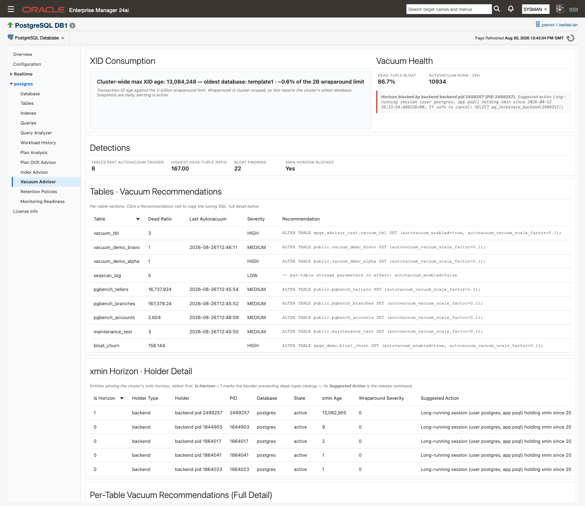
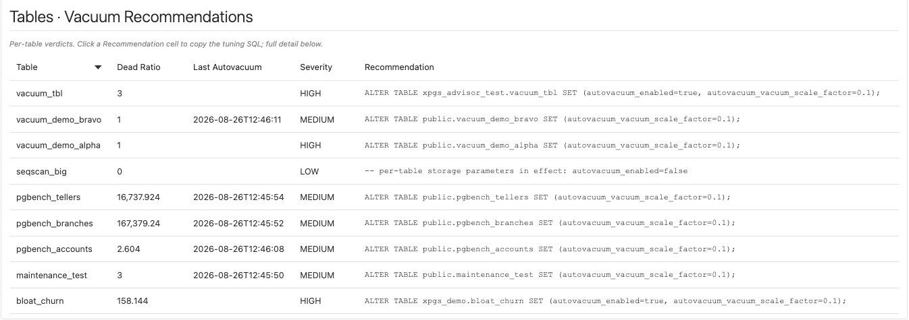
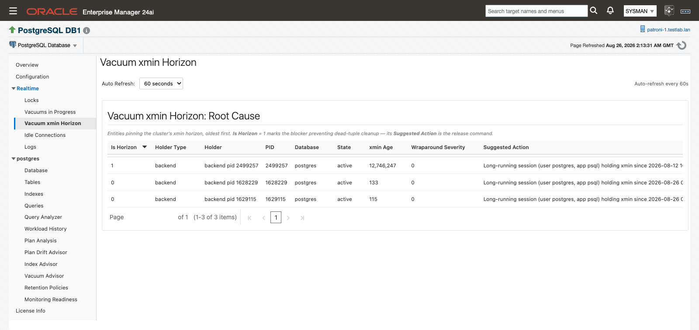
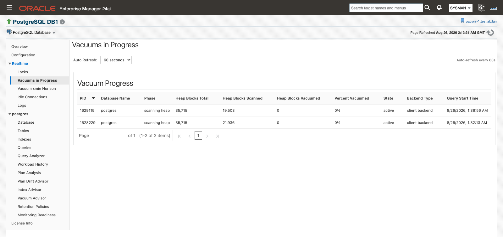

# Vacuum Advisor

If a table keeps growing while autovacuum is nominally running, the answer is usually one of three things: the table's own storage parameters moved its trigger point, cleanup is running but not often enough for the churn, or something is pinning the transaction horizon so no vacuum anywhere can remove the dead rows. **Vacuum Advisor** answers all three from PostgreSQL's own statistics catalogs, names the table or the holder, and hands you the exact statement to run. It needs no extension for anything except the bloat estimate, and it never runs any of the SQL it recommends.

That last point is worth stating plainly before anything else. Every command on this page is advisory. The `ALTER TABLE` tuning statements, `SELECT pg_terminate_backend(…)`, `SELECT pg_drop_replication_slot(…)` and `ROLLBACK PREPARED` all appear as text you copy and run yourself, in your own tooling, after you have decided they are safe. The plug-in executes none of them.

> **Prerequisites for this page**
> - The core page is catalog-native. It reads `pg_stat_user_tables`, `pg_class`, `pg_settings`, `pg_stat_activity`, `pg_replication_slots` and `pg_prepared_xacts` under [the monitoring role](prerequisites.md#monitoring-role), with no extension required.
> - The **Avoidable-Growth / Bloat Estimate** section needs the `pgstattuple` extension installed on the monitored database. See [Optional extensions](prerequisites.md#optional-extensions). Without it that one section is empty and nothing else on the page changes.
> - `pgstattuple`'s approximate function also needs the monitoring role to own the table or hold `pg_stat_scan_tables`. Tables it cannot read are skipped.
> - The **Autovacuum runs · 24h** KPI is read through an OEM job, so [Preferred Credentials](prerequisites.md#preferred-credentials) must be set for the target. It also needs two daily snapshots in the agent-local store before it can compute a delta.

**Where to find it:** on a PostgreSQL Database target, **target navigation tree ▸ _database name_ ▸ Vacuum Advisor**. The same entry appears in the target menu. Two live watch pages sit under **Realtime ▸ Vacuum xmin Horizon** and **Realtime ▸ Vacuums in Progress**. The same findings alert through the target's **All Metrics**.

**In this page:** The Vacuum Advisor page · Acting on a recommendation · Autovacuum frequency detection · Table bloat estimate · xmin horizon root cause · Wraparound monitoring · Vacuums in Progress

## The Vacuum Advisor page

The page collects once when it loads and does not auto-refresh. The detections move slowly and re-polling would only re-run the heavier catalog queries. Reload the page when you want fresh numbers.



*Top band: cluster XID position on the left, health KPIs and the xmin root-cause card on the right.*

Read it top to bottom. The bands narrow from cluster-wide risk to the individual table.

### XID Consumption

One live line, built from the `databases` metric:

> Cluster-wide max XID age: 148,332,190 — oldest database: template0 · ~6.9% of the 2B wraparound limit

Wraparound is cluster-scoped, so this deliberately reports the cluster's **oldest** database rather than the one you are looking at. That is very often a template database, and it is normal. The panel notes underneath that snapshots are daily and alerting is active.

### Vacuum Health

Two KPIs and a card.

| KPI | What it reports |
|---|---|
| **Dead-tuple bloat** | Dead tuples as a share of all rows, across the tables that have vacuum findings. Catalog-native. |
| **Autovacuum runs · 24h** | How many autovacuum runs happened across the database in the last day, computed by deltaing snapshots of PostgreSQL's lifetime `autovacuum_count`. |

The **xmin-horizon root-cause card** sits below them and has two states. When cleanup is pinned its left edge turns red and it reads `Horizon blocked by <holder type> <holder> (PID <n>). Suggested action: <command>`. When nothing is holding the horizon its left edge turns green and it reads "No session, replication slot or prepared transaction is currently holding the xmin horizon back."

**Autovacuum runs · 24h** shows "—" until it has the history it needs, with the tooltip "Accumulating: needs two daily snapshots to compute a delta". Once it has them, the tooltip names the two snapshots the delta was computed over and how many tables were autovacuumed. A busy database reporting zero runs is itself a finding.

### Detections

Four counters summarizing what the tables below contain.

| KPI | What it counts |
|---|---|
| **Tables past autovacuum trigger** | Tables whose real dead-tuple count is past their own recomputed trigger point. |
| **Highest dead-tuple ratio** | The worst dead-to-live ratio in the set. |
| **Bloat findings** | Rows in the bloat estimate table. Zero when `pgstattuple` is absent. |
| **xmin horizon blocked** | Yes or No. |

### The tables

| Section | What it carries | Columns |
|---|---|---|
| **Tables · Vacuum Recommendations** | The slim per-table verdict list. Start here. | Table, Dead Ratio, Last Autovacuum, Severity, Recommendation |
| **xmin Horizon · Holder Detail** | Every entity pinning the horizon, oldest first. | Is Horizon, Holder Type, Holder, PID, Database, State, xmin Age, Wraparound Severity, Suggested Action |
| **Per-Table Vacuum Recommendations (Full Detail)** | The evidence behind each verdict. | Severity, Database, Schema, Table, Dead Tuples, Est. Live Rows, Trigger Point, Dead Ratio, Last Autovacuum, Autovacuum Count, Eff. Scale Factor, Reloptions, Recommendation |
| **Avoidable-Growth / Bloat Estimate** | Free space and dead-tuple bloat per table, from `pgstattuple`. | Severity, Database, Schema, Table, Table Size, Free %, Free Space, Dead Tuples, Dead Tuple %, Live Tuples |

Two behaviors explain most "why isn't my table here?" questions:

- A table appears in the recommendation set only when it has dead tuples or carries per-table storage parameters. A clean, unconfigured table is not listed. A healthy table with notable `reloptions` is listed for visibility, with a comment-only recommendation.
- An empty **xmin Horizon · Holder Detail** table is the healthy state, not a collection failure.

An amber informational banner appears at the top of the page, as on every plug-in page, when the collection throttle is active on the agent host. See [Collection throttle](history-store-and-retention.md#collection-throttle).

## Acting on a recommendation



*Clicking a Recommendation cell opens the statement in a copy dialog. Nothing is applied.*

1. Find the table in **Tables · Vacuum Recommendations**, sorted worst first.
2. Read the matching row in **Per-Table Vacuum Recommendations (Full Detail)** for the evidence: dead tuples against the trigger point, when autovacuum last ran, and any `reloptions` in effect.
3. Click the **Recommendation** cell. The tuning SQL opens in a copy dialog.
4. Copy it, review it, and run it in your own tooling.
5. The finding clears on its own at the next collection once dead tuples fall back under the trigger point. There is nothing to close manually.

The same dialog is used in both recommendation tables, so it does not matter which one you click from.

## Autovacuum frequency detection

This is the detection behind the **Vacuum Advisor (Frequency)** metric. For every user table it recomputes the exact dead-tuple count at which autovacuum should fire:

```
autovacuum_vacuum_threshold + autovacuum_vacuum_scale_factor × reltuples
```

using the table's **effective** settings, so a per-table `reloptions` override beats the cluster-wide GUC. That distinction is the usual answer to "why isn't autovacuum touching this table?", and the **Reloptions** and **Eff. Scale Factor** columns exist to make it visible.

### Severity bands

| Severity | Condition |
|---|---|
| **HIGH** | Dead tuples past the trigger point **and** the last autovacuum is missing or more than a day old. Cleanup is demonstrably not keeping up. |
| **MEDIUM** | Dead tuples past the trigger point. |
| **LOW** | Every other listed table, including those above half their trigger point. |

Each row also carries a plain-language evidence sentence, for example: "Table has 412908 dead tuples, past its autovacuum trigger point of 105220 (last autovacuum: 2026-08-19 03:14); autovacuum frequency appears insufficient for this table's churn". When autovacuum has been switched off on the table, the sentence ends with " - NOTE: autovacuum is DISABLED on this table via reloptions".

### The recommendation it produces

A table past its trigger point gets a statement of this shape:

```sql
ALTER TABLE public.orders SET (autovacuum_vacuum_scale_factor=0.02);
```

The proposed factor is the lower of two candidates: a value that would have fired at half the dead tuples the table has now, and half the table's current effective factor. It therefore always tightens the trigger and never loosens it, with a floor of 0.01. When autovacuum has been disabled on the table through `reloptions` (the most common reason a past-trigger table was never vacuumed), the same statement also sets `autovacuum_enabled=true`:

```sql
ALTER TABLE public.orders SET (autovacuum_enabled=true, autovacuum_vacuum_scale_factor=0.02);
```

Tables that are not past their trigger get a comment instead of a statement: `-- autovacuum is keeping up (no tuning needed)`, or `-- per-table storage parameters in effect: <reloptions>` when the table carries overrides worth seeing.

### Metric defaults

| Metric | Internal name | Collected | Default Warning | Default Critical | Occurrences | Clears when |
|---|---|---|---|---|---|---|
| Vacuum Advisor (Frequency) | `vacuum_advisor` | Every 30 minutes | Severity = `HIGH` | Not set | 1 | Dead tuples fall back under the trigger point at the next collection |

Wraparound carries its own Critical-bearing metrics, which is why this one ships with Warning only. The alert message names the table, its dead-tuple count, its trigger point and the recommendation SQL, so the ticket already contains the fix. Retune the threshold per target from the metric's own threshold settings, or fleet-wide with the shipped [monitoring templates](alerts-and-templates.md#templates). The collection schedule is editable per target in the same place.

Finding detail persists to the agent-local store on every collection, under the **Vacuum Advisor** row on the [Retention Policies page](history-store-and-retention.md#retention-policies). Alert state lives in the OEM repository as usual.

## Table bloat estimate

The frequency detection and the bloat estimate are cause and consequence. The frequency detection tells you cleanup is falling behind, which is something to act on early. The bloat estimate tells you a table has already grown avoidably, which is something to plan a reclaim for.

This section and the **Table Bloat Estimate** metric need the `pgstattuple` extension on the monitored database. Extensions in PostgreSQL are per-database, so install it in each database you want estimated. The plug-in detects it automatically through the catalog and never installs it. Without it the metric emits zero rows and the page section is simply empty. That is a healthy, expected state, not an error.

The plug-in uses the fast approximate function, which is visibility-map based and only scans pages not already marked all-visible. It never runs a full heap scan. It restricts itself to ordinary permanent tables in user schemas of at least 256 KB. A table outside those bounds is skipped and logged; a table the role cannot read can leave that database's estimate empty for the collection.
<!-- CONFIRM: Ben — FEATURE_USAGE §5.3 says per-table skip; code degrades per-database -->

| Severity | Condition |
|---|---|
| **HIGH** | Free space ≥ 40%, or dead tuples ≥ 20%. |
| **MEDIUM** | Free space ≥ 20%, or dead tuples ≥ 10%. |
| **LOW** | Everything else in the set. |

Each row carries its own evidence sentence, for example: "Table is ~46.2% free space (912 MB) with 2204118 dead tuples (~21.7%); a VACUUM (FULL) or pg_repack would reclaim the avoidable growth".

Work a flagged table in that order: check the vacuum recommendation tables first so the bloat stops growing, then reclaim the space manually with a `VACUUM`, or a rewrite or repack approach for severe cases, in your own tooling.

| Metric | Internal name | Collected | Default Warning | Default Critical | Occurrences | Clears when |
|---|---|---|---|---|---|---|
| Table Bloat Estimate | `table_bloat` | Every 30 minutes | Severity = `HIGH` | Not set | 1 | The estimate drops back under the line at the next collection |

Detail history persists to the agent-local store under the **Table Bloat** row on the [Retention Policies page](history-store-and-retention.md#retention-policies).

## xmin horizon root cause {#xmin-horizon-root-cause}

Autovacuum cannot remove a dead row that might still be visible to some open snapshot. The oldest such snapshot is the cluster's xmin horizon, and while something holds it back, no amount of vacuum tuning helps: cleanup runs and reclaims nothing. This is the case where **Tables past autovacuum trigger** climbs while autovacuum is plainly running.

The plug-in identifies exactly what is holding the horizon and gives you the release command for it. It never runs that command. Three kinds of holder are detected; replication slots are reported differently depending on whether the slot is active, so the table has four rows:

| Holder Type | Read from | Holder looks like | Suggested Action |
|---|---|---|---|
| `backend` | `pg_stat_activity.backend_xmin` | `backend pid 41207` | Names the user and application, and the timestamp it has been holding xmin since, then `SELECT pg_terminate_backend(41207);` |
| `replication_slot` (active) | `pg_replication_slots` | `slot standby_2` | Names the slot and its active PID and tells you to check the standby or subscriber, then `SELECT pg_drop_replication_slot('standby_2');` if it is obsolete |
| `replication_slot` (inactive) | `pg_replication_slots` | `slot standby_2` | Says the inactive slot is pinning the horizon, then `SELECT pg_drop_replication_slot('standby_2');` if it is obsolete |
| `prepared_transaction` | `pg_prepared_xacts` | `prepared txn_9f31` | Names the owner, then `ROLLBACK PREPARED 'txn_9f31';` if the transaction is abandoned |

The collector excludes its own session, so it never reports itself as the blocker.

### Watching it live



*Realtime ▸ Vacuum xmin Horizon. The row with Is Horizon = 1 is the blocker; the rest are queued behind it.*

1. Open **Realtime ▸ Vacuum xmin Horizon** and set **Auto Refresh** to No Refresh, 15, 30 or 60 seconds. The page re-queries current state on each tick.
2. Find the row where **Is Horizon** is 1. Only that row is the problem. Many rows on a busy system is normal.
3. Copy its **Suggested Action**, review it, and run it in your own session if it is safe to do so. The page has no action buttons by design.
4. Watch the row disappear on the next refresh, then look at what becomes the new **Is Horizon = 1**. Blockers are often layered.


*The holder list after a release, with the next blocker taking its place.*

**xmin Age** growing between refreshes means the situation is getting worse in real time. A holder sitting at xmin age 0 blocks nothing, is not counted as blocked by the KPI or the root-cause card, and is typically a transient in-flight collection. The detail table still lists it.

### Metric defaults

| Metric | Internal name | Collected | Default Warning | Default Critical | Occurrences | Clears when |
|---|---|---|---|---|---|---|
| Vacuum xmin Horizon (Root Cause) | `xmin_horizon` | Every 30 minutes | Wraparound Severity ≥ 1 | Wraparound Severity ≥ 2 | 2 | The holder is gone at the next collection |

**Wraparound Severity** is a band off the holder's XID age: 1 at 1 billion XIDs, 2 at 1.5 billion. The two-occurrence rule is deliberate debouncing. A legitimate long batch job that pins the horizon for a single collection does not page anyone, while a holder that is still there on the next collection alerts within the hour. The alert message names the holder and its release command.

This metric is current-state only. The history of XID age lives on the `databases` and `tables` data described next.

## Wraparound monitoring

Transaction-ID age and multixact age are tracked continuously against the wraparound limit, at both database and table grain. Multixact wraparound is tracked and alerted separately from XID wraparound at both levels, because a database can be perfectly healthy on one and in trouble on the other.

Normally you do nothing here: these thresholds ship enabled. The **XID Consumption** panel gives you the live cluster position, and when an age alert arrives, the rest of the Vacuum Advisor page tells you which tables are holding cleanup back and whether the horizon is pinned.

| Metric | Internal name | Collected | Default Warning | Default Critical | Occurrences | Clears when |
|---|---|---|---|---|---|---|
| Databases · Transaction Unfrozen Age | `databases` / `transaction_age` | Every 30 minutes | 1,000,000,000 | 1,500,000,000 | 2 | Age returns under the warning line |
| Databases · Multixact Unfrozen Age | `databases` / `multixact_age` | Every 30 minutes | 1,000,000,000 | 1,500,000,000 | 2 | Age returns under the warning line |
| Tables · Table Unfrozen XID Age | `tables` / `table_xid_age` | Every 30 minutes | 1,000,000,000 | 1,500,000,000 | 2 | Age returns under the warning line |
| Tables · Table Unfrozen Multixact Age | `tables` / `table_multixact_age` | Every 30 minutes | 1,000,000,000 | 1,500,000,000 | 2 | Age returns under the warning line |

The table-level rows are the safety net. Their alert messages say directly that the table is holding back the database's `datfrozenxid` or `datminmxid` and to check autovacuum, so a table past its trigger with stale cleanup raises an alert even while autovacuum is nominally running.

Tuning is not the response to one of these alerts. The `ALTER TABLE … autovacuum_vacuum_scale_factor` recommendation tightens when autovacuum fires next time; it does nothing to the age already accumulated, because only a freeze advances a table's `relfrozenxid`.

Check the xmin horizon first. If a session, replication slot or prepared transaction is pinning the horizon, a freeze cannot advance past it and reclaims nothing, so release the holder before you go any further. Once the horizon is clear, run a freeze against the named table in your own tooling:

```sql
VACUUM (FREEZE) public.orders;
```

As everywhere else on this page, the plug-in never runs the freeze for you.

Age history accumulates in the agent-local store from day one with no configuration. Every collection stages full-resolution rows, and the daily condense keeps each day's maximum XID and multixact ages, so trend depth builds on its own without touching the [Retention Policies page](history-store-and-retention.md#retention-policies).

All four thresholds are retunable per target or through the shipped [monitoring templates](alerts-and-templates.md#templates), and alerts route through the standard OEM notification framework to whatever connector you have bound.

## Vacuums in Progress

A live view of what `pg_stat_progress_vacuum` currently reports, joined to session state. It needs no extension and no setup.



*Realtime ▸ Vacuums in Progress, with the Auto Refresh control above the table.*

Open **Realtime ▸ Vacuums in Progress**, set **Auto Refresh** to No Refresh, 15, 30 or 60 seconds, and watch running vacuums advance phase by phase. It is the page to use while confirming a manual `VACUUM` you kicked off, or checking whether autovacuum is actively working a table the advisor flagged.

| Column | What it shows |
|---|---|
| **PID** | The process running the vacuum. |
| **Database Name** | The database the vacuum is running in. |
| **Phase** | The current vacuum phase as PostgreSQL reports it. |
| **Heap Blocks Total** | Blocks in the heap being vacuumed. |
| **Heap Blocks Scanned** | Blocks scanned so far. |
| **Heap Blocks Vacuumed** | Blocks vacuumed so far. |
| **Percent Vacuumed** | Completion against the total. |
| **State** | The backend's session state. |
| **Backend Type** | Distinguishes an autovacuum worker from a client backend running a manual `VACUUM`. |
| **Query Start Time** | When the vacuum began. |

An empty table means no vacuum is running right now.

## Related

- [Prerequisites](prerequisites.md#optional-extensions) — installing `pgstattuple`, and [Preferred Credentials](prerequisites.md#preferred-credentials) for the Autovacuum runs KPI
- [Monitoring Readiness](monitoring-readiness.md) — the **Table Bloat Estimates** panel reports whether `pgstattuple` is detected
- [Alerts and templates](alerts-and-templates.md#default-thresholds) — every shipped threshold in one table, and how the templates retune them fleet-wide
- [History store and retention](history-store-and-retention.md#retention-policies) — the **Vacuum Advisor** and **Table Bloat** retention rows, and the XID-age history behind the trends
- [Monitoring pages](monitoring-pages.md) — the **Tables** page, where per-table vacuum and analyze timings live
- [Troubleshooting](troubleshooting.md#unable-to-run-job) — what to do when the Autovacuum runs KPI stays at "—"
