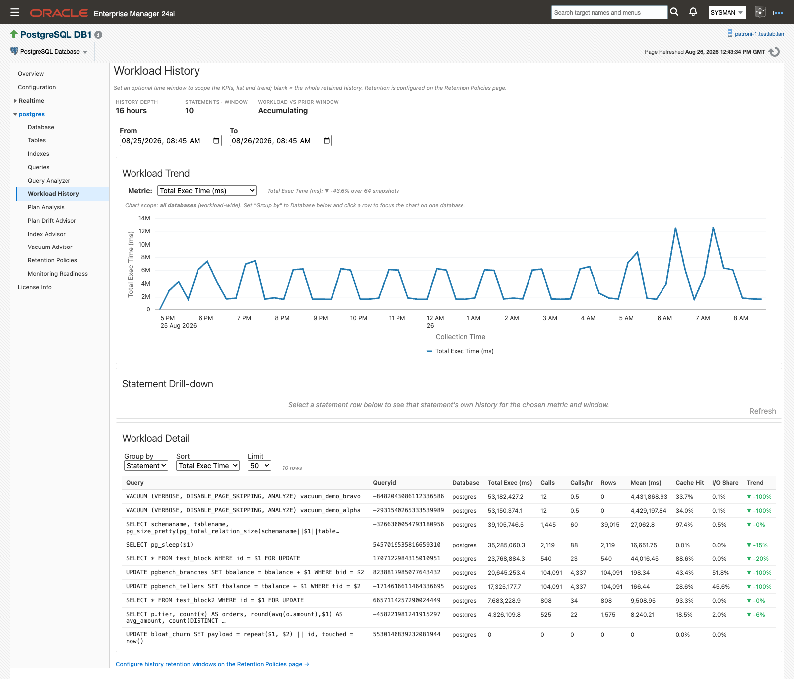

# What's new in 13.5.15

If you monitor PostgreSQL with 13.5.12 today, 13.5.15.0.0 keeps what you already have. The same targets, the same console, and the same alert routing carry forward, and on top of them the plug-in becomes advisory. It names the index worth creating and the table autovacuum is falling behind on, each with SQL for you to review and run, and it tells you when a query has left its accepted plan, with both plans side by side so you can test a rewrite or accept the new plan.

Everything in this release is additive. Your targets, thresholds, schedules, and credentials carry forward unchanged; a few surfaces moved, and those are listed under [What changed or moved](#what-changed-or-moved). The upgrade itself is the ordinary import-and-deploy sequence. There is one new decision to make, and it is on the database side: plan capture needs `auto_explain` configured and the `pg_read_server_files` grant on your monitoring role. Among the settings the plug-in could apply itself, that grant is the one it deliberately never does. It is needed only for the two plan pages, and everything else in this release works without it.

**Where to find it:** the new pages appear in the PostgreSQL Database target's navigation tree under each database name, and in the same target menu you use today. The new metrics appear under **Target menu → Monitoring → All Metrics**.

**In this page:** The new pages at a glance · Monitoring Readiness · Plan Analysis · Plan Drift Advisor · Workload History and wait events · Index Advisor · Vacuum Advisor and xmin horizon · Retention Policies and the history store · Alerts and monitoring templates · Collection throttle · What changed or moved · New prerequisites · Upgrading from 13.5.12 · If you installed the 13.5.14 pre-release · Full changelog

## The new pages at a glance

| Page | What it answers | Needs |
|---|---|---|
| **Monitoring Readiness** | Is this target configured for each feature, and what exactly is missing? | [The monitoring role](prerequisites.md#monitoring-role) to view; [Preferred Credentials](prerequisites.md#preferred-credentials) to apply settings |
| **Plan Analysis** | What plan did this query actually run, and what is wrong with it? | [Plan capture (auto_explain)](prerequisites.md#auto-explain) and [the server log read grant](prerequisites.md#log-read-grant) |
| **Plan Drift Advisor** | Is this query still on a plan I certified, and when did it leave? | [Plan capture (auto_explain)](prerequisites.md#auto-explain) and [the server log read grant](prerequisites.md#log-read-grant) |
| **Workload History** | Which statements grew over the last weeks, and by how much? | [Statement statistics (pg_stat_statements)](prerequisites.md#pg-stat-statements) |
| **Index Advisor** | Which indexes should I create, drop, or rebuild? | Nothing. [`hypopg` and `pg_qualstats`](prerequisites.md#optional-extensions) add cost simulation and predicate evidence |
| **Vacuum Advisor** | Why is autovacuum not keeping this table clean? | Nothing. [`pgstattuple`](prerequisites.md#optional-extensions) adds the bloat estimate |
| **Retention Policies** | How long is each kind of history kept, and how large can the store get? | [Preferred Credentials](prerequisites.md#preferred-credentials) |
| **Realtime ▸ Vacuum xmin Horizon** | What is holding the transaction horizon back right now? | [The monitoring role](prerequisites.md#monitoring-role) |

## Monitoring Readiness

**Monitoring Readiness** is where to go first after the upgrade. It probes the target once when the page loads and reports, feature by feature, what that feature needs, the value live on the server now, and what happens while the two differ. Seven panels cover the monitoring connection, plan capture, `pg_stat_statements`, wait-event sampling, the two Index Advisor extensions, `pgstattuple`, and the agent-local history store, each with an **OK**, **Attention**, or **Not functional** chip. Where the plug-in can set something itself, a **Configure auto_explain** button appears and previews exactly what it will apply before you confirm; the settings take effect for new sessions with no restart. Extensions and the `pg_read_server_files` grant are never applied for you, so those rows show the statement to run in your own tooling instead.

*Monitoring Readiness: one panel per feature, each showing the live value beside the value the feature needs.*

Read more: [Monitoring Readiness](monitoring-readiness.md)

## Plan Analysis

**Plan Analysis** keeps the execution plan a slow query actually ran, which is usually gone by the time anyone goes looking. `auto_explain` writes the plan to the server log during the query's own execution, and the plug-in harvests it over its existing JDBC connection: there is no re-execution, and no EXPLAIN triggered by the plug-in. Each capture renders as a plan tree with estimated versus actual rows per node, and five detection rules run over it (Insufficient Index, Misestimate, Stale Statistics, Slow Sequential Scan, Lossy Bitmap), each producing a recommendation card that names the pathology and the setting to change. When the highest-impact finding across all captures is a missing index, a banner above the list carries an **Open Index Advisor →** button.

*Plan Analysis: the plan archive, the live capture threshold, and one row per captured statement with its insight count.*

Read more: [Plan Analysis](plan-analysis.md)

## Plan Drift Advisor

**Plan Drift Advisor** answers the other half of the question: not what the plan does, but whether the query is still running a plan you certified. It keeps a set of accepted baseline plans per query, compares every new capture against that set, and lists only the queries that have drifted, so once you have accepted baselines, an empty **Problematic Queries** list ("No problematic queries found.") is the healthy state. Select a row and you get the drift history over a window you choose, a side-by-side plan-tree comparison against the baseline, insight cards for the current plan, an audit trail of who accepted, pinned, or retired which baseline and why, and the **Fix Workbench: Test a Rewrite**. Baseline mode ships as Manual, so no plan becomes accepted-good without a named operator action, and the workbench runs the only EXPLAIN the plug-in ever performs: it is the one place the plug-in executes SQL you supply, and only when you click **Run Explain**.

*Problematic Queries is the entry point: severity, cost delta against the baseline, and how recently each query was captured.*

Read more: [Plan Drift Advisor](plan-drift-advisor.md)

## Workload History and wait events

**Workload History** replays the `pg_stat_statements` snapshots kept in the agent-local store across a window you pick, so a database that got slower over two weeks shows the shape of it rather than a spike you missed. The KPI band gives history depth, the statements active in the window, and this window measured against the equal-length window before it; the detail list ranks statements or databases by total execution time, calls, mean, rows returned, or I/O share, and clicking a statement plots that one statement's own history. Wait-event sampling arrives with it: install `pg_wait_sampling` and the **Wait Events Sampled** metric enables itself on that target, feeding the **Wait Events** chart on **Query Analyzer** for a selected statement over the last day, week, or month.

*Workload History: the trend for the selected metric, and the statements behind it ranked for the same window.*

Read more: [Workload History](workload-history.md)

## Index Advisor

**Index Advisor** lists the indexes worth creating, dropping, or rebuilding across every database on the instance. Catalog-native detection needs no extension and covers five categories (Missing, Unused, Invalid, HOT-inhibiting, Consolidation), with an impact rank, an evidence sentence, and a `CONCURRENTLY` statement on every row. The configuration to aim for is `hypopg` and `pg_qualstats` installed in the databases you care about: `hypopg` prices each missing-index candidate by planning it as a hypothetical index, with no build and no lock taken, and reports the estimated speedup; `pg_qualstats` ranks candidates by the predicates your workload actually filtered on and infers the right access method, including GIN and GIST. Nothing is applied for you at any point. You click a SQL cell, copy the statement, and run it in your own tooling.

*Index Advisor: detections by category, the two headline recommendations, and the full-detail tables behind them.*

Read more: [Index Advisor](index-advisor.md)

## Vacuum Advisor and xmin horizon

**Vacuum Advisor** answers why a table keeps growing while autovacuum is nominally running. It recomputes each table's real trigger point from its effective settings, so a per-table `reloptions` override that moved the trigger becomes visible instead of mysterious, and it hands you the `ALTER TABLE` statement that tightens it. The same page reports XID consumption against the wraparound limit, dead-tuple bloat, autovacuum runs in the last 24 hours, and the xmin-horizon root cause: the session, replication slot, or prepared transaction pinning cleanup, named, with the release command ready to copy. **Realtime ▸ Vacuum xmin Horizon** watches the same holders live at a refresh interval you choose, and with `pgstattuple` installed an avoidable-growth estimate per table joins the page. Every command here is text for you to run; the plug-in executes none of it.

*Vacuum Advisor: wraparound position, the xmin-horizon root-cause card, and the per-table verdicts underneath.*

Read more: [Vacuum Advisor](vacuum-advisor.md)

## Retention Policies and the history store

The granular history behind these pages lives in a per-target SQLite database on the agent host rather than in the Enterprise Manager repository, so months of statement-level and object-level detail cost the repository nothing. The store creates itself at the first collection that persists history, condenses each completed day once a day, and prunes itself on the same schedule. **Retention Policies** is the single control surface: a retention window and a protected minimum for each of the twelve history types, plus the whole-store size ceiling. Most types ship at 90 days and the index archive at 365. The whole-store ceiling ships disabled, so the retention windows are the bound until you set one; the captured-plan archive has its own ceiling, which ships enabled at 100 MB and evicts oldest first. Saved changes take effect at the next daily trim.

*Retention Policies: every history type's window and protected minimum, above the whole-store size ceiling.*

Read more: [History store and retention](history-store-and-retention.md)

## Alerts and monitoring templates

Every new advisor finding also publishes as a standard Enterprise Manager metric, so you can be told rather than go looking. Plan drift, plan insights, the three Index Advisor metrics, autovacuum frequency, table bloat, and the xmin horizon all carry editable collection schedules, tunable thresholds, alert history, and routing through whatever notification connector you already have bound. Thresholds ship pre-set where a safe default exists, and undefined where the right value is site policy: the xmin horizon metric warns at Wraparound Severity 1 (an XID age of 1 billion) and goes critical at severity 2 (1.5 billion) after two consecutive collections, while the super-user count threshold ships empty because only you know your sanctioned roster size. Three importable [monitoring templates](alerts-and-templates.md#templates) apply a curated set in one step: `ip_xpgs_tier01_critical` for critical production, `ip_xpgs_tier23_standard` for dev, test, and staging, and `ip_xpgs_starter` as a seed to clone.

*New advisor findings arrive as ordinary metrics, with the thresholds and schedules you already know how to edit.*

Read more: [Alerts and templates](alerts-and-templates.md)

## Collection throttle

On a local agent running on Linux, you can now set **Collection Throttle: CPU Threshold (%)** and **Collection Throttle: Memory Threshold (%)** on the target. While the agent host sits at or above either threshold, the plug-in skips its heavier scheduled collections for that cycle instead of adding to the load, and an amber informational banner reports it at the top of every plug-in page. Availability checks, real-time pages, and anything you trigger yourself are never gated, and no collection schedule is changed by any of this. Both properties are empty by default, which leaves the feature off. The `collection_throttle` metric records every gate window and its reason, so gaps in a chart always have an explanation.

Read more: [Collection throttle](history-store-and-retention.md#collection-throttle)

## What changed or moved {#what-changed-or-moved}

- **The explain workbench moved off Query Analyzer.** Testing a rewrite now happens in **Fix Workbench: Test a Rewrite** on [Plan Drift Advisor](plan-drift-advisor.md), beside the plan comparison you need in order to judge the result. It still runs `EXPLAIN (ANALYZE, FORMAT JSON)` on the statement in the box, and still only when you click **Run Explain**.
- **The retention editor moved off Workload History.** All retention windows now live on the [Retention Policies](history-store-and-retention.md#retention-policies) page, together with the store size ceiling. Workload History links to it from the bottom of the page. Older screenshots and guides show the editor in its previous position.
- **The `waits_sampled` metric is retired.** Wait-event data now comes from **Wait Events Sampled**, which enables itself only on targets where `pg_wait_sampling` is detected. See [Wait-event sampling](workload-history.md#wait-event-sampling).
- **The realtime page previously called "Blocking Sessions and Wait Locks" is now Locks.** The content is the same: one row per blocked and blocking pair, with **Include Locks Granted** to widen the view. See [Monitoring pages](monitoring-pages.md).
  <!-- CONFIRM: Locks page rename (was "Blocking Sessions and Wait Locks") -->
- **Two target properties were added.** **Collection Throttle: CPU Threshold (%)** and **Collection Throttle: Memory Threshold (%)** appear on Database and Cluster targets, both empty by default. See [Collection throttle properties](targets-and-properties.md#throttle-properties).

## New prerequisites

Nothing here is required to keep monitoring what you monitor today. Each item unlocks one part of the release, and **Monitoring Readiness** checks the first three live, per target.

- [ ] `auto_explain` installed on the database server and configured for capture, with `log_min_duration` set to 0 or higher, `log_format = json`, and `log_analyze = on`, plus the server-side logging settings capture reads from (`logging_collector = on`, the `stderr` log destination, and a `%m`-led `log_line_prefix`), which are yours to set — see [Plan capture (auto_explain)](prerequisites.md#auto-explain). Required for **Plan Analysis** and **Plan Drift Advisor**. The plug-in applies the `auto_explain` settings for you from **Configure auto_explain**.
- [ ] `GRANT pg_read_server_files TO "<monitoring role>";` run by a superuser, so the plug-in can read the server log — see [The server log read grant](prerequisites.md#log-read-grant). Of the plan-capture settings the plug-in could apply itself, this is the one it deliberately never does.
- [ ] Optional extensions, installed by you through your own packaging and detected automatically — see [Optional extensions](prerequisites.md#optional-extensions). `hypopg` and `pg_qualstats` for the full **Index Advisor** output, `pg_wait_sampling` for wait events, `pgstattuple` for bloat estimates.
- [ ] Preferred Credentials set for the target, because the advisor pages read their data through Enterprise Manager jobs — see [Preferred Credentials](prerequisites.md#preferred-credentials).

## Upgrading from 13.5.12

1. Import the new OPAR and deploy it to the OMS and to every monitoring agent, the same three steps as any plug-in update. See [Upgrade from an earlier release](install-and-upgrade.md#upgrade). Targets, thresholds, schedules, and credentials carry forward unchanged, and the agent-local history store is created automatically at the first collection after the upgrade.
2. Allow up to 24 hours for the OMS metadata refresh. An "Error getting meta-data" message during that period clears itself. See [After an upgrade](install-and-upgrade.md#after-upgrade).
3. Open **Monitoring Readiness** on each target and read the panels top to bottom. The panels tell you which of the new prerequisites that particular target is still missing.
4. On the targets where you want plan capture, run the `pg_read_server_files` grant, then click **Configure auto_explain** and **Apply**. Reload the page to confirm the panel turned green.

## If you installed the 13.5.14 pre-release

Install 13.5.15.0.0 over it as a normal plug-in update, following the same steps as any other upgrade. History collected by the pre-release build is not guaranteed to carry forward.
<!-- CONFIRM: Ben — pre-release → GA upgrade guidance (normal update vs clean redeploy; history reset) -->

## Full changelog

The [Changelog](changelog.md) lists every new page, metric, job, template, and fix in 13.5.15.0.0, and the releases before it.

## Related

- [Prerequisites](prerequisites.md#checklist) — the full checklist, split into what existing monitoring needs and what the advisory features add
- [Install and upgrade](install-and-upgrade.md#upgrade) — the import-and-deploy sequence for the upgrade
- [Monitoring Readiness](monitoring-readiness.md) — the per-target view of which prerequisites are in place
- [Changelog](changelog.md) — every new page, metric, job, and fix in this release
