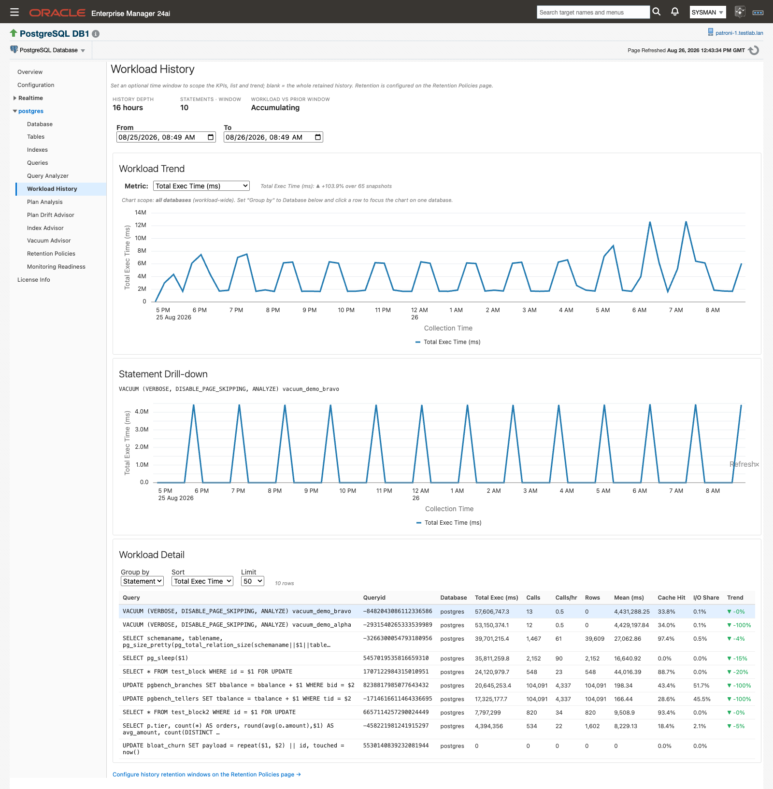
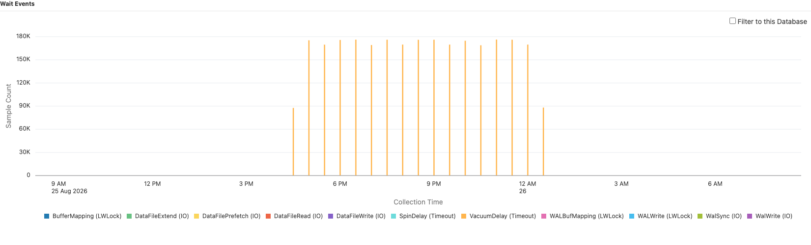

# Workload History

When a database gets slower over two weeks rather than in a spike, the live charts rarely show it. **Workload History** replays the `pg_stat_statements` snapshots the plug-in keeps in its agent-local history store across a time window you choose, so you can see which statements grew, by how much, and against which period. It needs `pg_stat_statements` on the target and Preferred Credentials on the target's host, and it reads only the local store, never the monitored database.

> **Prerequisites for this page**
> - [Statement statistics (pg_stat_statements)](prerequisites.md#pg-stat-statements) must be installed and enabled on the target. Without it no per-statement workload accumulates and the list stays on its empty state.
> - The page is job-backed, so [Preferred Credentials](prerequisites.md#preferred-credentials) must be set for the target's host. If the job aborts, the page raises "Unable to run job. Verify Preferred Credentials are set for this target." See [Unable to run job](troubleshooting.md#unable-to-run-job).
> - History accumulates on its own from the moment the target is monitored. A fresh install starts at "0 days" of history depth and grows toward the configured retention, so give a new target a day before you judge the trend.
> - The **Wait-event sampling** section below additionally needs the `pg_wait_sampling` extension. See [Optional extensions](prerequisites.md#optional-extensions).

**Where to find it:** on a PostgreSQL Database target, **target navigation tree ▸ _database name_ ▸ Workload History**. The same entry appears in the target menu.

**In this page:** Reading the page · Investigating a spike · Filtering to one database · Time handling and honest indicators · Wait-event sampling · Autovacuum runs KPI · Retention

## Reading the page

The page opens with the window already set to the last 24 hours in your browser's local time, and reads in three bands: a KPI band, the **Workload Trend** chart, and the **Workload Detail** list. The hint under the heading states the rule for the window: "Set an optional time window to scope the KPIs, list and trend; blank = the whole retained history. Retention is configured on the Retention Policies page."

*The three bands of the page, with the From/To window applied to all of them.*

The KPI band carries three figures.

| KPI | What it reports |
|---|---|
| **History depth** | How far back the oldest retained workload snapshot goes. Shown in hours below one day, otherwise in days. A target with no snapshots yet reads "0 days". |
| **Statements · window** | Distinct statements with activity in the selected window. |
| **Workload vs prior window** | Total execution time in this window against the equal-length window immediately before it, as ▲/▼/▬ with a percentage. |

**Workload Trend** plots one metric per collection snapshot against an x-axis of collection time. Choose it from the **Metric:** dropdown: Total Exec Time (ms), Mean Exec Time (ms), Calls, or Cache Hit Ratio. Additive metrics (Total Exec Time, Calls) are summed across statements per snapshot; rate and ratio metrics (Mean Exec Time, Cache Hit Ratio) are averaged. Beside the dropdown, a note reports the first-versus-last movement, for example "Total Exec Time (ms): ▲ +12.3% over 40 snapshots".

**Workload Detail** lists the window's statements or databases. Set **Group by** to Statement or Database, **Sort** to Total Exec Time, Calls, Mean Exec Time, Rows Returned, or I/O Share (all descending), and **Limit** to 25, 50, 100, or 250. The default limit is 50. A row count sits beside the controls, reading "N rows". With no data in the window the list reads "No workload history yet for this window."

With **Group by** set to Statement, the list carries these columns.

| Column | What it shows |
|---|---|
| Query | The statement text. Hover a row to read the full text. |
| Queryid | The statement's query id, matching `pg_stat_statements`. |
| Database | The database the statement ran in. |
| Total Exec (ms) | Execution time summed across the window. |
| Calls | Calls in the window. |
| Calls/hr | Calls divided by the window length, so windows of different lengths compare fairly. |
| Rows | Rows returned in the window. |
| Mean (ms) | Mean execution time in the window. |
| Cache Hit | Share of block reads served from shared buffers. |
| I/O Share | Share of the window's shared-buffer block accesses. |
| Trend | Total-exec-time movement across the window (first versus last snapshot), as a colored ▲/▼/▬ with a percentage. |

With **Group by** set to Database, the list drops to Database, Total Exec (ms), Calls, Rows, Mean (ms), Cache Hit, and I/O Share.

An informational banner appears above the page while the collection throttle is pausing heavy collections on the agent host. It clears itself when host usage drops back below the thresholds. See [Collection throttle](history-store-and-retention.md#collection-throttle).

## Investigating a spike

Work from the shape in the chart down to the one statement that made it.

1. Set **From** and **To** around the period you care about. Both pickers are browser-local wall-clock time, and changing either one immediately re-scopes the KPIs, the chart, and the list. Leave both blank to scope to the whole retained history. Click **Refresh** to re-run the reads without changing the window.
2. Pick the metric that shows the problem from the **Metric:** dropdown. Total Exec Time (ms) is the usual starting point, because it moves with both call volume and per-call cost.
3. Read the movement note next to the dropdown. It tells you whether the window as a whole rose or fell, and over how many snapshots.
4. In **Workload Detail**, sort by the same metric and look at the **Trend** column for the statements whose movement matches the shape of the chart.
5. Click that statement's row. The **Statement Drill-down** panel opens above the list and plots that one statement's own history for the metric and window you already chose. Until you click a row it reads "Select a statement row below to see that statement's own history for the chosen metric and window."
6. Widen or narrow the window and watch the drill-down redraw. A statement whose spike survives a wider window is a real regression; one that flattens out was a single slow run.
7. Close the panel with the × button when you are done with that statement.

*Clicking a row in Workload Detail opens the drill-down for that statement alone.*

<video class="walkthrough" src="images/13-5-15/workload-history-window.mp4" poster="images/13-5-15/workload-history-window-poster.png" autoplay loop muted playsinline controls aria-label="Changing the From and To window and watching the KPIs, chart and list re-scope"></video>

*Changing either picker re-scopes all three bands immediately.*

If the drill-down has nothing to plot for the statement in the current window, it reads "No per-snapshot history for this statement in the current window." That usually means the statement ran outside the window rather than that its history is missing.

## Filtering to one database

On a target with several busy databases the workload-wide chart can hide a single database's behavior. Pin the chart to one of them.

1. Set **Group by** to Database.
2. Click the row for the database you want. The chart re-scopes to that database alone and the scope line above it reads "Chart scope: database _name_ only", followed by a **Show all databases** link.
3. Clear the filter either with that link or by clicking the same row a second time.

With no filter active, the scope line reads "Chart scope: all databases (workload-wide)" and tells you how to set one.

The filter applies to the chart and its movement note. The KPI band stays workload-wide, so **Workload vs prior window** continues to answer for the whole target while the chart answers for one database.

## Time handling and honest indicators

The **From** and **To** pickers are wall-clock time in your browser's zone. The plug-in converts them to UTC for the store query, because store timestamps are held in UTC. A window wider than the tier's retention is not an error; it simply shows the data that exists.

The page is deliberate about not showing a number it cannot support.

| What you see | What it means |
|---|---|
| "No trend data for this window." | The window contains no snapshots. |
| "Only one snapshot in this window." | One snapshot, so there is no movement to compute. |
| A plain "n/a" in the movement note, with no arrow | A percentage cannot be computed. The arrow is suppressed rather than guessed. |
| "n/a" in **Workload vs prior window** | No explicit window is set, so there is no prior period to compare against. Set both pickers. |
| "Accumulating" in **Workload vs prior window** | The prior equal-length window holds no snapshots yet. |
| "—" in **Workload vs prior window** | The prior window has snapshots but no recorded execution time to compare against. |

Two behaviors of the underlying deltas are worth knowing before you read the **Trend** column too literally. The first snapshot inside a window contributes a delta of roughly zero, because it has no predecessor inside the window, so movement is baselined on the first non-zero value instead. And a statement that runs infrequently can show −100% in **Trend** simply because the last snapshot in the window recorded no delta for it. Open the drill-down to see the true shape before acting on either.

Zero-activity statements can appear in the list, because they exist in the store. Sorting by the metric under discussion pushes them out of the way.

Every delta, mean, and cache-hit ratio on this page is computed by the plug-in's agent-side reader from the local history store. The page never queries the monitored database.

## Wait-event sampling {#wait-event-sampling}

Workload History tells you which statements got slower. Wait-event sampling tells you what they were waiting on. The plug-in samples wait events per statement from the `pg_wait_sampling` extension's cumulative profile and charts them in the **Wait Events** panel on the **Query Analyzer** page.

### What it needs

- The `pg_wait_sampling` extension must be installed on the target. You install it through your own platform packaging; the plug-in detects it and never installs anything. The library also has to be in `shared_preload_libraries`, which means a restart, so plan the install into a maintenance window. See [Optional extensions](prerequisites.md#optional-extensions). The extension is not included in most PostgreSQL distributions and is not available on Windows, but most package managers carry it.
- `pg_wait_sampling.profile_queries` must be set to `all` or `top`. With it off, the profile carries no query id and nothing can be attributed to a statement.
- Nothing else. A discovery probe sets the target's wait-sampling property, and the **Wait Events Sampled** metric (`wait_events_sampled`) enables itself only on targets where the extension is present. There is no toggle to find. The collection ships enabled on a 15-minute interval and carries no default thresholds; it feeds the chart and the history store. If the extension disappears while the collection is enabled, collection degrades to an empty state instead of failing.

The **Wait-Event Sampling** panel on [Monitoring Readiness](monitoring-readiness.md) reports whether the extension is in place.

### Reading the chart

1. Open **Query Analyzer** on the database target.
2. Select a statement row. The chart is keyed by that statement's query id and stays empty until a row is selected.
3. Choose a range with the **Time Range:** radios: Last Month, Last Week, Last Day (the default), or Custom with From/To inputs in your browser's local zone.
4. Read the **Wait Events** section. It draws a stacked bar chart of wait-event counts over time for that statement, grouped by event.
5. Tick **Filter to this Database** to restrict the rows to the database currently selected.

*Wait events for the selected statement, stacked by event across the chosen range.*

Bars are bucketed across the range, around 48 buckets and never finer than the 15-minute collection interval. Quiet periods render as explicit zeros rather than gaps, so a flat stretch reads as "nothing waited" and not as "nothing collected". Events that never waited during the range are left out of the legend.

Two empty states are worth telling apart. "No data yet — waits_sampled metric populates within one collection interval after enable" (the message names the older `waits_sampled`; the live metric is `wait_events_sampled`) means nothing has been collected for that statement in that range yet. "No data matches the current filter" means the database filter excluded everything that was collected. The whole panel is hidden on targets where wait sampling is not enabled.

Query Analyzer has no EXPLAIN workbench. The only EXPLAIN that executes a statement is the Fix Workbench on [Plan Drift Advisor](plan-drift-advisor.md), and only when you click it.

### Granularity and the database filter

Range length decides which tier the chart reads, and that in turn decides whether the database filter is available.

| Range | Tier read | **Filter to this Database** |
|---|---|---|
| 7 days or less | Raw, at the 15-minute collection grain | Available |
| More than 7 days, up to 31 days | Hourly rollup | Disabled, tooltip "Available for time ranges of 7 days or less" |
| More than 31 days | Daily rollup | Disabled, tooltip "Available for time ranges of 7 days or less" |

The rollups do not carry the per-database detail, which is why the checkbox grays out rather than silently returning wrong rows.

### How the numbers are derived

PostgreSQL exposes wait sampling only as cumulative counters, so the plug-in derives everything else from them.

- The metric's **Event Count** column is a per-collection delta computed from the extension's cumulative counter, guarded against counter resets.
- Every collection stages full-resolution rows into the agent-local history store. Once a day the condense keeps, per completed day, only the (query id, event) combinations that actually waited that day and that meet your minimum daily wait threshold, adding the day's sample-count increase and an estimated wait time.
- Estimated wait time is the sample count multiplied by the sampling period. It is an estimate derived from sample counts, not a measured duration.
- The sampling period used is the live `pg_wait_sampling.profile_period` read from the server at each collection and stored per target, so a DBA changing it on the server is picked up on the next collection. Where it has never been captured, the extension's own 10 ms default applies.

This is a high-volume tier. If you want to keep less of it, run the **PostgreSQL - Set Wait History Retention Threshold** job against the target and set **Minimum Daily Wait Time (ms)**: a query and event combination must reach that estimated wait time in a day for its daily row to be kept. The default is `0`, which keeps every combination that waited at all that day.

The chart itself reads the collected `wait_events_sampled` metric data held in the Enterprise Manager repository.

## Autovacuum runs KPI

**Vacuum Advisor** carries an "Autovacuum runs · 24h" KPI in its health band, and it is computed from the same agent-local history the Workload History page reads. PostgreSQL's `autovacuum_count` is a lifetime counter, so the plug-in deltas table-statistics snapshots to get the figure for the last day. Nothing beyond normal monitoring is needed for it, though the read is job-sourced so Preferred Credentials must be set for the target.

Hover the KPI for the snapshot window the delta was computed over. The same read also carries manual vacuum runs and the number of tables autovacuumed.

Until enough history exists the KPI shows "—" with the tooltip "Accumulating: needs two daily snapshots to compute a delta". The read is staging-aware, so it can price the current day from that day's staged rows rather than waiting for the nightly condense.

Read a zero here in context. On a busy database, zero autovacuum runs in 24 hours is itself the finding. See [Vacuum Advisor](vacuum-advisor.md).

## Retention

Retention for every tier of the agent-local store, including the workload tier this page reads and the wait-event tier behind the chart, is set on the **Retention Policies** page. The link at the bottom of Workload History, "Configure history retention windows on the Retention Policies page →", takes you straight there.

The wait-event tier appears there as the row **Wait Events (sampled)**. Its shipped default is 90 days. On a high-volume target a shorter window is a reasonable operating point, and you can set one there without touching any other tier. Pair it with the minimum daily wait threshold above: the threshold controls how much of each day is kept, the retention window controls how many days.

See [Retention Policies page](history-store-and-retention.md#retention-policies) for the full list of tiers and [Store size and disk reclaim](history-store-and-retention.md#store-size) for what a change does to the store on disk.

## Related

- [Prerequisites](prerequisites.md#pg-stat-statements) — installing `pg_stat_statements`, and the optional extensions this page and its wait-event chart depend on
- [Monitoring Readiness](monitoring-readiness.md) — confirms whether `pg_stat_statements` and `pg_wait_sampling` are in place before you go looking for missing data
- [History store and retention](history-store-and-retention.md#retention-policies) — where retention for the workload and wait-event tiers is set
- [Plan Drift Advisor](plan-drift-advisor.md) — when a statement's cost moved because its plan changed, and the only place the plug-in executes a statement to obtain a plan
- [Vacuum Advisor](vacuum-advisor.md) — the Autovacuum runs KPI in its health band
- [Monitoring pages](monitoring-pages.md) — the Query Analyzer page that hosts the Wait Events panel
- [Troubleshooting](troubleshooting.md#unable-to-run-job) — what to do when the page raises a job error
